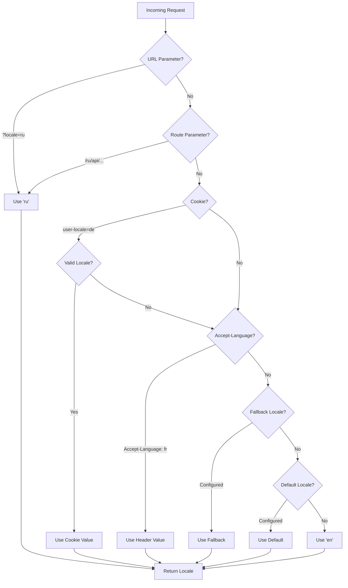

# 🌍 Серверні переклади та інформація про локаль у Nuxt I18n Micro

## 📖 Огляд

Nuxt I18n Micro підтримує серверні переклади та інформацію про локаль, дозволяючи перекладати контент і отримувати деталі локалі на сервері. Це особливо корисно для API або SSR-застосунків, де локалізація потрібна ще до потрапляння на клієнт.

Переклади використовують повідомлення локалей, визначені у конфігурації Nuxt I18n, і динамічно розвʼязуються на основі виявленої локалі.

За замовчуванням (`translationPayloads.mode: 'premerged'`) root-файли запікаються у кожен пейлоад сторінки на етапі збірки як `\{page\}/\{locale\}/data.json`. Сервер завантажує ті самі наперед побудовані файли, які клієнт отримує під `/\{apiBaseUrl\}/...`, тож усі ключі (як спільні, так і посторінкові) доступні у серверних хендлерах.

З `translationPayloads.mode: 'source'` компактні вихідні файли зливаються у рантаймі при виклику `loadTranslationsFromServer()` (або маршруту `/_locales`) — на **Edge** через Nitro `serverAssets`, на **Node** — з опційної публічної копії. Деталі див. у [Посібнику з продуктивності — Serverless-вивід пейлоаду](/guides/performance#serverless-payload-output) та [Архітектурі кешу та сховища](/api/cache).

Консолідований список рантайм- та серверних API — у [Довіднику API](/api/overview).

## 🛠️ Налаштування серверного middleware

Щоб увімкнути серверні переклади та інформацію про локаль, використовуйте надані middleware-функції:

- `useTranslationServerMiddleware` — для перекладу контенту
- `useLocaleServerMiddleware` — для доступу до інформації про локаль

Обидві middleware-функції автоматично доступні у всіх серверних маршрутах.

Логіка визначення локалі спільна між обома middleware-функціями через утиліту `detectCurrentLocale`, щоб забезпечити узгодженість у модулі.

## ✨ Використання перекладів у серверних хендлерах

Ви можете безшовно перекладати контент у будь-якому `eventHandler`, використовуючи middleware перекладу.

### Приклад: базове використання перекладу

```typescript
import { defineEventHandler } from 'h3'

export default defineEventHandler(async (event) => {
  const t = await useTranslationServerMiddleware(event)
  return {
    message: t('greeting'), // Returns the translated value for the key "greeting"
  }
})
```

У цьому прикладі:

- Локаль користувача автоматично визначається з query-параметрів, cookie або заголовків.
- Функція `t` отримує відповідний переклад для виявленої локалі.

## 🌍 Використання інформації про локаль у серверних хендлерах

### Базове використання інформації про локаль

```typescript
import { defineEventHandler } from 'h3'

export default defineEventHandler((event) => {
  const localeInfo = useLocaleServerMiddleware(event)

  return {
    success: true,
    data: localeInfo,
    timestamp: new Date().toISOString(),
  }
})
```

### Задання кастомних параметрів локалі

```typescript
import { defineEventHandler } from 'h3'

export default defineEventHandler((event) => {
  // Force specific locale with custom default
  const localeInfo = useLocaleServerMiddleware(event, 'en', 'ru')

  return {
    success: true,
    data: localeInfo,
    timestamp: new Date().toISOString(),
  }
})
```

### Структура відповіді

Middleware локалі повертає обʼєкт `LocaleInfo` з такими властивостями:

```typescript
interface LocaleInfo {
  current: string // Current detected locale code
  default: string // Default locale code
  fallback: string // Fallback locale code
  available: string[] // Array of all available locale codes
  locale: Locale | null // Full locale configuration object
  isDefault: boolean // Whether current locale is the default
  isFallback: boolean // Whether current locale is the fallback
}
```

### Приклад відповіді

```json
{
  "success": true,
  "data": {
    "current": "ru",
    "default": "en",
    "fallback": "en",
    "available": ["en", "ru", "de"],
    "locale": {
      "code": "ru",
      "iso": "ru-RU",
      "dir": "ltr",
      "displayName": "Русский"
    },
    "isDefault": false,
    "isFallback": false
  },
  "timestamp": "2024-01-15T10:30:00.000Z"
}
```

## 🌐 Надання кастомної локалі

Якщо вам потрібно задати локаль вручну (наприклад, для тестування чи певних запитів), можете передати її у middleware перекладу:

### Приклад: кастомна локаль

```typescript
import { defineEventHandler } from 'h3'

function detectLocale(event): string | null {
  const urlSearchParams = new URLSearchParams(event.node.req.url?.split('?')[1])
  const localeFromQuery = urlSearchParams.get('locale')
  if (localeFromQuery) return localeFromQuery

  return 'en'
}

export default defineEventHandler(async (event) => {
  const t = await useTranslationServerMiddleware(event, 'en', detectLocale(event)) // Force French local, en - default locale
  return {
    message: t('welcome'), // Returns the French translation for "welcome"
  }
})
```

## 📋 Логіка визначення локалі

Обидві middleware-функції автоматично визначають локаль користувача, використовуючи наступний пріоритет:



1. **URL-параметри**: `?locale=ru`
2. **Параметри маршруту**: `/ru/api/endpoint`
3. **Cookie**: cookie `user-locale`
4. **HTTP-заголовки**: заголовок `Accept-Language`
5. **Fallback-локаль**: як налаштовано в опціях модуля
6. **Локаль за замовчуванням**: як налаштовано в опціях модуля
7. **Хардкод-fallback**: `'en'`

> **Нотатка**: логіка визначення локалі спільна між `useLocaleServerMiddleware` та `useTranslationServerMiddleware`, щоб забезпечити узгодженість у модулі.

## 📋 Приклади розширеного використання

### Умовна відповідь на основі локалі

```typescript
import { defineEventHandler } from 'h3'

export default defineEventHandler((event) => {
  const { current, isDefault, locale } = useLocaleServerMiddleware(event)

  // Return different content based on locale
  if (current === 'ru') {
    return {
      message: 'Привет, мир!',
      locale: current,
      isDefault,
    }
  }

  if (current === 'de') {
    return {
      message: 'Hallo, Welt!',
      locale: current,
      isDefault,
    }
  }

  // Default English response
  return {
    message: 'Hello, World!',
    locale: current,
    isDefault,
  }
})
```

### Кастомне визначення локалі

```typescript
import { defineEventHandler } from 'h3'

export default defineEventHandler((event) => {
  // Force German locale with English as fallback
  const { current, isDefault, locale } = useLocaleServerMiddleware(event, 'en', 'de')

  return {
    message: 'Hallo, Welt!',
    locale: current,
    isDefault: false, // Will be false since we forced German
  }
})
```

### Locale-aware API з валідацією

```typescript
import { defineEventHandler, createError } from 'h3'

export default defineEventHandler((event) => {
  const { current, available, locale } = useLocaleServerMiddleware(event)

  // Validate if the detected locale is supported
  if (!available.includes(current)) {
    throw createError({
      statusCode: 400,
      statusMessage: `Unsupported locale: ${current}. Available locales: ${available.join(', ')}`,
    })
  }

  // Return locale-specific configuration
  return {
    locale: current,
    direction: locale?.dir || 'ltr',
    displayName: locale?.displayName || current,
    availableLocales: available,
  }
})
```

### Інтеграція з middleware перекладу

Ви можете обʼєднати інформацію про локаль з middleware перекладу для повноцінної інтернаціоналізації:

```typescript
import { defineEventHandler } from 'h3'

export default defineEventHandler(async (event) => {
  const localeInfo = useLocaleServerMiddleware(event)
  const t = await useTranslationServerMiddleware(event)

  return {
    locale: localeInfo.current,
    message: t('welcome_message'),
    availableLocales: localeInfo.available,
    isDefault: localeInfo.isDefault,
  }
})
```

## 📝 Кращі практики

1. **Завжди валідуйте локалі**: перевіряйте, чи виявлена локаль є у вашому списку доступних локалей
2. **Використовуйте fallback-логіку**: надавайте розумні значення за замовчуванням, коли визначення локалі не спрацьовує
3. **Кешуйте інформацію про локаль**: для критичних до продуктивності застосунків розгляньте кешування результатів визначення локалі
4. **Обробляйте граничні випадки**: враховуйте непідтримувані локалі та надавайте відповідні відповіді про помилку
5. **Комбінуйте з перекладами**: використовуйте інформацію про локаль поруч з middleware перекладу для повної підтримки i18n

## 🚀 Міркування щодо продуктивності

- Обидві middleware-функції легковагі та розроблені для швидкого виконання
- Визначення локалі використовує ефективні fallback-ланцюги
- Під час визначення локалі не виконуються зовнішні API-виклики
- Результати обчислюються синхронно для оптимальної продуктивності
