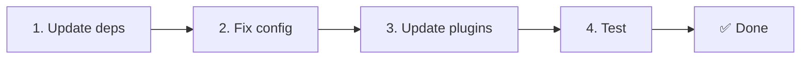

# 📦 Оновлення з v2.x до v3.x

<Tip>
Див. [Міграцію з nuxt-i18n](/migration/from-nuxtjs-i18n) — той посібник охоплює перехід з екосистеми vue-i18n, а не з nuxt-i18n-micro v2.
</Tip>

v3.0.0 приносить фундаментальні архітектурні зміни: пакети стратегій, нову систему кешування, централізоване керування локалями через `useI18nLocale()` та перепроєктований конвеєр редиректів. Цей розділ охоплює всі ламкі зміни та як оновити ваш код.

## Кроки міграції



## Підсумок ламких змін

- **Стан локалі** — ручні `useState` / `useCookie` → композабл `useI18nLocale()`
- **Доступ до конфігурації** — `useRuntimeConfig().public.i18nConfig` → `getI18nConfig()` з `#build/i18n.strategy.mjs`
- **Компонент редиректу** — опція `fallbackRedirectComponentPath` → серверний плагін редиректу + клієнтське route middleware (автоматично)
- **`includeDefaultLocaleRoute`** — підтримувалося (deprecated) → видалено, використовуйте опцію `strategy`
- **`experimental.hmr`** — під `experimental` → опція кореневого рівня
- **`previousPageFallback`** — повністю видалено (кумулятивна стратегія злиття обробляє це автоматично)
- **Кешування** — `useStorage('cache')` → singleton `TranslationStorage` (`Symbol.for` на `globalThis`)
- **SSR-трансфер** — Runtime-конфіг → Nuxt payload (v3 використовував `useState`; чанки тепер живуть у `payload.data`, див. [Продуктивність](/guides/performance#server-side-payload-transfer))
- **Класи стратегій** — Внутрішні → окремі пакети (`@i18n-micro/route-strategy`, `@i18n-micro/path-strategy`)

## Видалено: `fallbackRedirectComponentPath`

Опція `fallbackRedirectComponentPath` та резервний компонент `locale-redirect.vue` видалені. Логіку редиректу тепер опрацьовують:

1. **Серверне middleware** (`i18n.global.ts`) — встановлює `event.context.i18n.locale`
2. **Серверний плагін редиректу** (`06.redirect.ts`, лише сервер) — 302 редиректи до рендерингу
3. **Клієнтське route middleware** (`i18n-redirect.global.ts`) — SPA-редиректи після гідратації

```diff
 i18n: {
   strategy: 'prefix_except_default',
-  fallbackRedirectComponentPath: '~/components/MyRedirect.vue',
 }
```

Якщо у вас була кастомна логіка редиректу у fallback-компоненті, реалізуйте її натомість у серверному плагіні:

```ts
// plugins/i18n-loader.server.ts
export default defineNuxtPlugin({
  name: 'i18n-custom-redirect',
  enforce: 'pre',
  order: -10,
  setup() {
    const { setLocale } = useI18nLocale()
    // Your custom detection logic
    setLocale(detectedLocale)
  },
})
```

## Видалено: `includeDefaultLocaleRoute`

Замість цього використовуйте опцію `strategy`:

- `includeDefaultLocaleRoute: true` → `strategy: 'prefix'`
- `includeDefaultLocaleRoute: false` → `strategy: 'prefix_except_default'` (за замовчуванням)

```diff
 i18n: {
-  includeDefaultLocaleRoute: true,
+  strategy: 'prefix',
 }
```

## Доступ до конфігу: `getI18nConfig()` замінює `useRuntimeConfig`

```diff
- const config = useRuntimeConfig()
- const cookieName = config.public.i18nConfig?.localeCookie || 'user-locale'
+ import { getI18nConfig } from '#build/i18n.strategy.mjs'
+ const { localeCookie: configCookie } = getI18nConfig()
+ const cookieName = configCookie ?? 'user-locale'
```

## Керування локалями: `useI18nLocale()` замінює ручний стан

У v2 ви могли використовувати `useState('i18n-locale')` або `useCookie('user-locale')` напряму. У v3 використовуйте централізований композабл `useI18nLocale()`:

```diff
- const locale = useState('i18n-locale')
- const cookie = useCookie('user-locale')
- locale.value = 'fr'
- cookie.value = 'fr'
+ const { setLocale } = useI18nLocale()
+ setLocale('fr') // Updates both state and cookie atomically
```

Детальні приклади див. у [Кастомному визначенні мови](/guides/custom-language-detection).

## Експериментальні опції переміщено / видалено

`hmr` переїхав з `experimental` на кореневий рівень. `previousPageFallback` повністю видалено — модуль тепер використовує стратегію кумулятивного глибокого злиття (2 рівні глибини), що автоматично зберігає переклади з попередньої сторінки під час анімацій переходу, навіть коли сторінки мають ключі, що перетинаються. Після завершення анімації переходу хук `page:transition:finish` очищає ключі старої сторінки з памʼяті.

```diff
 i18n: {
-  experimental: {
-    hmr: true,
-    previousPageFallback: true
-  }
+  hmr: true,
+  // previousPageFallback removed — handled automatically
 }
```

## Архітектура редиректів (v3)

Редиректи тепер обробляються автоматично двома компонентами:

1. **На боці сервера** (`06.redirect.ts`, лише сервер): виконується під час SSR, видає 302-редиректи до будь-якого рендерингу — без «мерехтіння помилки»
2. **На боці клієнта** (`i18n-redirect.global.ts`): глобальне route middleware на SPA-навігації; зберігає query-рядок та hash

Пріоритет локалі для редиректів:

1. `useState('i18n-locale')` — задано через `useI18nLocale().setLocale()`
2. Cookie — якщо налаштовано `localeCookie`
3. Заголовок `Accept-Language` — якщо `autoDetectLanguage: true`
4. `defaultLocale` — fallback

Для стандартних налаштувань змін у коді не потрібно.

<Warning>
Для стратегій `prefix` та `prefix_except_default` з `redirects: true` встановлюйте `localeCookie: 'user-locale'`, щоб увімкнути збереження локалі між перезавантаженнями сторінки. Без нього редиректи використовують лише `Accept-Language` або `defaultLocale`.
</Warning>

## TypeScript: внутрішні типи модуля (опційно)

Якщо ви зіштовхнетеся з помилками типів, повʼязаними з внутрішніми імпортами на кшталт `#i18n-internal/plural`, `#i18n-internal/strategy` або `#i18n-internal/config`, додайте секцію `imports` до `package.json` вашого проєкту:

```json
{
  "imports": {
    "#i18n-internal/plural": "nuxt-i18n-micro/internals",
    "#i18n-internal/strategy": "nuxt-i18n-micro/internals",
    "#i18n-internal/config": "nuxt-i18n-micro/internals"
  }
}
```
