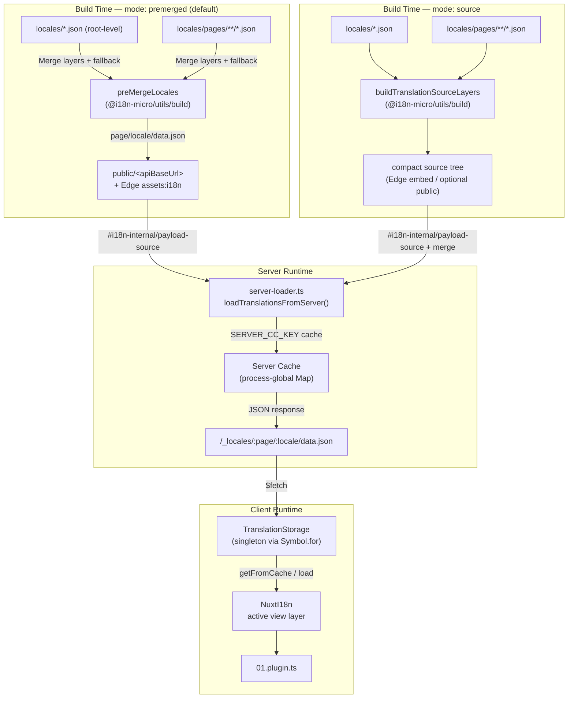

# 🗄️ Tarjima keshi va saqlash arxitekturasi

## 📖 Umumiy koʻrinish

Nuxt I18n Micro v3 tarjimalar uchun koʻp qatlamli keshlash arxitekturasidan foydalanadi. Yukni yuklash `translationPayloads.mode` ga bogʻliq:

- **`premerged`** (standart) — root, page, fallback va layer fayllar build vaqtida `@i18n-micro/utils/build` orqali `\{page\}/\{locale\}/data.json` ga birlashtiriladi
- **`source`** — kompakt manba fayllari saqlanadi va ishlash paytida `@i18n-micro/utils/source-loader` va `@i18n-micro/utils/merge-source` orqali birlashtiriladi (Edge ularni Nitro `serverAssets` ichiga joylashtiradi; Node ularni `public/` dan oʻqiydi, agar nusxa qilingan boʻlsa)

Ushbu sahifa ichki keshning qanday ishlashi va uni maxsus foydalanish holatlari (admin vositalari, tashqi API’lar, keshni bekor qilish) uchun qanday kengaytirishni tavsiflaydi.

## 📊 Arxitektura sharhi

### Maʼlumotlar oqimi



## 🧱 Asosiy komponentlar

### 1. `TranslationStorage` (Mijoz + Server)

**Fayl**: `src/runtime/utils/storage.ts`

Mijoz va server uchun birlashtirilgan tarjima saqlashni taʼminlovchi singleton klass. Bir nechta bundle yuklanganda ham faqat bitta nusxa mavjud boʻlishini taʼminlash uchun `globalThis` da `Symbol.for('__NUXT_I18N_STORAGE_CACHE__')` dan foydalanadi.

**Asosiy metodlar:**

| Metod                              | Tavsif                                                            |
| ----------------------------------- | ---------------------------------------------------------------------- |
| `getFromCache(locale, routeName?)`  | Sinxron tekshiruv: keshlangan xotira maʼlumotlarini qaytaradi yoki `null`            |
| `load(locale, routeName?, options)` | Keshlash bilan asinxron yuklash: avval keshni tekshiradi, keyin `$fetch` orqali oladi |
| `clear()`                           | Butun keshni tozalaydi                                                |

**Kesh kaliti formati**: `\{locale\}:\{routeName\}` (masalan, `en:index`, `fr:about`)

```typescript
import { translationStorage } from '../utils/storage'

// Synchronous cache check
const cached = translationStorage.getFromCache('en', 'index')

// Async load (with automatic caching)
const result = await translationStorage.load('en', 'index', {
  apiBaseUrl: '_locales',
  baseURL: '/',
  dateBuild: '2024-01-01',
})
// result.data — merged translations
// result.cacheKey — cache key used
```

### ⚙️ Deterministik keshni yangilash (`i18n.dateBuild`)

Standart holatda ushbu modul `dateBuild` ni build vaqtida `Date.now()` yordamida yaratadi. Keyin u yaratilgan `#build/i18n.strategy.mjs` ga joylashtiriladi va qayta build’lardan soʻng tarjima yuklash keshlarini bekor qilish uchun soʻrov parametri (`?v=...`) sifatida ishlatiladi.

Agar takrorlanuvchi build’lar kerak boʻlsa (masalan, rolling deploylarda chunk kesh urish darajasini oshirish uchun), `nuxt.config` da barqaror qiymatni oʻrnating:

```ts
export default defineNuxtConfig({
  i18n: {
    // Any stable string/number (git SHA, CI build number, release tag, etc.)
    dateBuild: process.env.GIT_SHA ?? 'local-dev',
  },
})
```

### 2. `loadTranslationsFromServer()` (Faqat server)

**Fayl**: `src/runtime/server/utils/server-loader.ts`

Locale/sahifa uchun tarjimalarni yuklaydi va birlashtirilgan natijani `@i18n-micro/hmr/cache-keys` (`SERVER_CC_KEY`) kaliti bilan jarayon boʻyicha global `CacheControl` xaritasida keshlaydi.

Xatti-harakati: SSR `#i18n-internal/payload-source` dan yuklaydi. **Node** `readFile` `public/<apiBaseUrl>` ostidan (`premerged` rejimida `\{page\}/\{locale\}/data.json`), **Edge** esa `assets:i18n` dan. `premerged` bitta faylni oʻqiydi; `source` esa root/page/fallback ni `@i18n-micro/utils/source-loader` orqali birlashtiradi.

```typescript
import { loadTranslationsFromServer } from '../server/utils/server-loader'

// Returns { data: Translations, json: string }
const { data, json } = await loadTranslationsFromServer('en', 'index')
```

### 3. Mijoz yuklash (HTML ichiga joylashtirmasdan)

Lugʻatlar `nuxtApp.payload` ga **yozilmaydi**. Server SSR renderlash uchun ularni xotirada saqlaydi; mijoz plagini `switchContext` ni `await` qiladi, u esa `/\{apiBaseUrl\}/:page/:locale/data.json` ni yuklaydi (`@nuxtjs/i18n` bilan bir xil `experimental.preload: false` standart holati).

`NuxtI18n` `$t()` va `$has()` tomonidan ishlatiladigan faol koʻrish qatlami lugʻatini saqlaydi. `NuxtTranslationLoader` locale/marshrut kontekstini almashtiradi va bloklarni ushbu qatlamga birlashtiradi.

### 4. Server API marshruti

**Marshrut**: `/_locales/\{page\}/\{locale\}/data.json`

**Fayl**: `src/runtime/server/routes/i18n.ts`

Ushbu Nitro marshruti faol yuk rejimi uchun birlashtirilgan tarjimalarni beradi. U `loadTranslationsFromServer()` ni chaqiradi va natijani JSON sifatida qaytaradi.

Ishlab chiqarishda quyidagilarni ham oʻrnatadi:

```http
Cache-Control: public, max-age={httpCacheDuration}, immutable
```

Standart `httpCacheDuration` `31536000` (1 yil). Bu xavfsiz, chunki mijozlar yuklarni `?v=\{dateBuild\}` kesh-yangilash bilan soʻraydi. Sarlavhani chiqarib tashlash uchun `httpCacheDuration: 0` ni oʻrnating. Sarlavha ishlab chiqishda qoʻllanilmaydi.

## 📥 Kengaytirish: maxsus tarjima yuklash

### Keshdan oʻqish (server marshruti)

```ts
// server/api/i18n/load-cache.[post].ts
import { defineEventHandler, readBody } from 'h3'
import { loadTranslationsFromServer } from '#imports'

export default defineEventHandler(async (event) => {
  const { page, locale } = await readBody<{ page: string; locale: string }>(event)
  const { data } = await loadTranslationsFromServer(locale, page)
  return { locale, page, data }
})
```

### Tarjimalarni yangilash (fayl + keshni bekor qilish)

```ts
// server/api/i18n/update.[post].ts
import { defineEventHandler, readBody, createError } from 'h3'
import { join } from 'node:path'
import { readFile, writeFile } from 'node:fs/promises'
import { deepMergeTranslations } from '@i18n-micro/utils/deep-merge'

export default defineEventHandler(async (event) => {
  const { path, updates } = await readBody<{ path: string; updates: Record<string, unknown> }>(event)

  if (!path || !updates) {
    throw createError({ statusCode: 400, statusMessage: 'Missing path or updates' })
  }

  const fullPath = join('locales', path)
  let existing: Record<string, unknown> = {}

  try {
    const content = await readFile(fullPath, 'utf-8')
    existing = JSON.parse(content) as Record<string, unknown>
  } catch {
    // File does not exist — create new
  }

  const merged = deepMergeTranslations(existing, updates)
  await writeFile(fullPath, JSON.stringify(merged, null, 2), 'utf-8')

  return { success: true, path, updated: merged }
})
```


## 🧹 Keshni tozalash

### Dasturiy keshni tozalash (mijoz)

Oʻrnatilgan `$clearCache` metodidan foydalaning:

```vue
<script setup>
const { $clearCache } = useNuxtApp()

// Clears both TranslationStorage and plugin-level cache
$clearCache()
</script>
```

### Server keshining xatti-harakati

Server tomonidagi kesh (`loadTranslationsFromServer`) jarayon boʻyicha globaldir va quyidagi hollargacha saqlanadi:

- Server jarayoni qayta ishga tushganida
- Yangi deploy aniqlanganda (turli `dateBuild` qiymati)

Serversiz muhitlarda har bir sovuq ishga tushirish yangi keshga ega.

## ⚙️ Serverless konfiguratsiyasi

Serverless muhitlar (Cloudflare Workers, AWS Lambda) uchun oʻrnatilgan kesh xotiradagi `Map` obyektlaridan foydalanadi. Tarjima keshining oʻzi uchun hech qanday tashqi saqlash konfiguratsiyasi kerak emas.

Biroq, manba tarjima fayllari uchun Nitro saqlashi sozlanishi kerak boʻlishi mumkin:

```ts
export default defineNuxtConfig({
  nitro: {
    storage: {
      // Only needed if default file-system storage is unavailable
      'assets:server': {
        driver: 'cloudflare-kv-binding',
        binding: 'MY_KV_NAMESPACE',
      },
    },
  },
})
```

## 💡 v2 dan asosiy farqlar

| Jihat           | v2                            | v3                                                                       |
| ---------------- | ----------------------------- | ------------------------------------------------------------------------ |
| Mijoz keshi     | `useStorage('cache')`         | `TranslationStorage` singleton (globalThis dagi Symbol.for)                |
| SSR uzatish     | Runtime konfiguratsiyasi                | `payload.data` orqali toʻliq bloklar (v3.0 `useState` dan foydalangan)                    |
| Server keshi     | Nitro kesh saqlash           | `Symbol.for` orqali jarayon boʻyicha global `Map`                                    |
| Birlashtirish mantigʻi      | Mijoz tomonida                   | Build vaqtida (`premerged`) yoki ishlash paytida (`source`) `@i18n-micro/utils/*` orqali |
| Kesh kaliti formati | `i18n:merged:\{page\}:\{locale\}` | `\{locale\}:\{routeName\}`                                                   |

## 📚 Bogʻliq

- [Samaradorlik qoʻllanmasi](/guides/performance) — keshlash samaradorlikka qanday taʼsir qiladi
- [Server tarafidagi tarjimalar](/guides/server-side-translations) — server marshrutlarida tarjimalardan foydalanish
- [Firebase deploy](/guides/firebase) — deployga xos kesh mulohazalari
