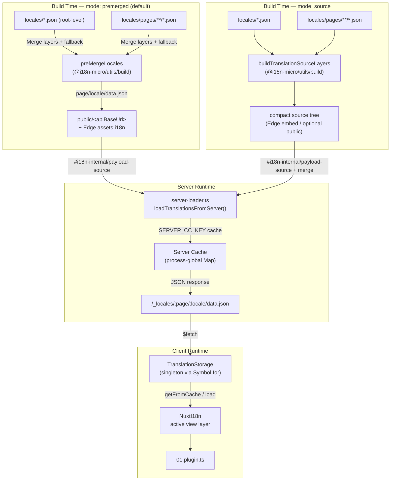

# 🗄️ Tarjima keshi va saqlash arxitekturasi

## 📖 Umumiy ko'rinish

Nuxt I18n Micro v3 tarjimalar uchun ko'p qatlamli keshlash arxitekturasidan foydalanadi. Payload yuklash `translationPayloads.mode` ga bog'liq:

- **`premerged`** (standart) — root, page, fallback va qatlam fayllari build vaqtida `@i18n-micro/utils/build` orqali `\{page\}/\{locale\}/data.json` ga birlashtiriladi
- **`source`** — ixcham manba fayllar `@i18n-micro/utils/source-loader` va `@i18n-micro/utils/merge-source` orqali runtime birlashtirish uchun saqlanadi (Edge ularni Nitro `serverAssets` ga embed qiladi; Node ular nusxa ko'chirilganda `public/` dan o'qiydi)

Ushbu sahifa o'rnatilgan keshning qanday ishlashini va maxsus foydalanish holatlari (admin vositalar, tashqi API'lar, keshni bekor qilish) uchun uni qanday kengaytirishni tavsiflaydi.

## 📊 Arxitektura sharhi

### Ma'lumot oqimi



## 🧱 Asosiy komponentlar

### 1. `TranslationStorage` (Client + Server)

**Fayl**: `src/runtime/utils/storage.ts`

Ham client, ham server uchun birlashtirilgan tarjima saqlashni taqdim etadigan singleton klass. Bir nechta bundle yuklanganda ham faqat bitta instance mavjud bo'lishini ta'minlash uchun `globalThis` da `Symbol.for('__NUXT_I18N_STORAGE_CACHE__')` dan foydalanadi.

**Asosiy metodlar:**

| Metod                              | Tavsif                                                            |
| ----------------------------------- | ---------------------------------------------------------------------- |
| `getFromCache(locale, routeName?)`  | Sinxron tekshirish: keshlangan xotiradagi ma'lumotni yoki `null` ni qaytaradi            |
| `load(locale, routeName?, options)` | Keshlash bilan async yuklash: avval keshni tekshiradi, so'ng `$fetch` orqali oladi |
| `clear()`                           | Butun keshni tozalaydi                                                |

**Kesh kalit formati**: `\{locale\}:\{routeName\}` (masalan, `en:index`, `fr:about`)

```typescript
import { translationStorage } from '../utils/storage'

// Synchronous cache check
const cached = translationStorage.getFromCache('en', 'index')

// Async load (with automatic caching)
const result = await translationStorage.load('en', 'index', {
  apiBaseUrl: '_locales',
  baseURL: '/',
  dateBuild: '2024-01-01',
})
// result.data — merged translations
// result.cacheKey — cache key used
```

### ⚙️ Deterministik kesh bekor qilish (`i18n.dateBuild`)

Standart bo'yicha, ushbu modul build vaqtida `Date.now()` yordamida `dateBuild` ni generatsiya qiladi. So'ngra u generatsiya qilingan `#build/i18n.strategy.mjs` ga embed qilinadi va rebuild'lardan keyin tarjima olib kelish keshlarini bekor qilish uchun query parametr sifatida (`?v=...`) ishlatiladi.

Agar sizga takrorlanadigan build'lar kerak bo'lsa (masalan, rolling deployment'larda chunk kesh urishlar tezligini oshirish uchun), `nuxt.config` da barqaror qiymatni o'rnating:

```ts
export default defineNuxtConfig({
  i18n: {
    // Any stable string/number (git SHA, CI build number, release tag, etc.)
    dateBuild: process.env.GIT_SHA ?? 'local-dev',
  },
})
```

### 2. `loadTranslationsFromServer()` (Faqat server)

**Fayl**: `src/runtime/server/utils/server-loader.ts`

Locale/sahifa uchun tarjimalarni yuklaydi va birlashtirilgan natijani `@i18n-micro/hmr/cache-keys` (`SERVER_CC_KEY`) bo'yicha kalitlangan jarayon-global `CacheControl` xaritada keshlaydi.

Xatti-harakat: SSR `#i18n-internal/payload-source` dan yuklaydi — **Node** `public/<apiBaseUrl>` ostidagi `readFile` (premerged rejimda `\{page\}/\{locale\}/data.json`), **Edge** `assets:i18n`. `premerged` bitta faylni o'qiydi; `source` root/page/fallback'ni `@i18n-micro/utils/source-loader` orqali birlashtiradi.

```typescript
import { loadTranslationsFromServer } from '../server/utils/server-loader'

// Returns { data: Translations, json: string }
const { data, json } = await loadTranslationsFromServer('en', 'index')
```

### 3. Client yuklash (HTML'da embed yo'q)

Lug'atlar `nuxtApp.payload` ga **yozilmaydi**. Server ularni SSR render uchun xotirada saqlaydi; client plagin `switchContext` ni `await` qiladi, u `/\{apiBaseUrl\}/:page/:locale/data.json` ni yuklaydi (`experimental.preload: false` bilan `@nuxtjs/i18n` bilan bir xil standart holat).

`NuxtI18n` `$t()` va `$has()` tomonidan ishlatiladigan faol ko'rish qatlami lug'atini saqlaydi. `NuxtTranslationLoader` locale/yo'nalish kontekstini almashtiradi va chunk'larni o'sha qatlamga birlashtiradi.

### 4. Server API yo'nalishi

**Yo'nalish**: `/_locales/\{page\}/\{locale\}/data.json`

**Fayl**: `src/runtime/server/routes/i18n.ts`

Ushbu Nitro yo'nalishi faol payload rejimi uchun birlashtirilgan tarjimalarni taqdim etadi. U `loadTranslationsFromServer()` ni chaqiradi va natijani JSON sifatida qaytaradi.

Production'da u shuningdek quyidagini o'rnatadi:

```http
Cache-Control: public, max-age={httpCacheDuration}, immutable
```

Standart `httpCacheDuration` `31536000` (1 yil). Bu xavfsiz chunki client'lar payload'larni `?v=\{dateBuild\}` cache-busting bilan so'raydi. Header'ni o'tkazib yuborish uchun `httpCacheDuration: 0` ni o'rnating. Header development'da qo'llanmaydi.

## 📥 Kengaytirish: Maxsus tarjima yuklash

### Keshdan o'qish (server yo'nalishi)

```ts
// server/api/i18n/load-cache.[post].ts
import { defineEventHandler, readBody } from 'h3'
import { loadTranslationsFromServer } from '#imports'

export default defineEventHandler(async (event) => {
  const { page, locale } = await readBody<{ page: string; locale: string }>(event)
  const { data } = await loadTranslationsFromServer(locale, page)
  return { locale, page, data }
})
```

### Tarjimalarni yangilash (fayl + keshni bekor qilish)

```ts
// server/api/i18n/update.[post].ts
import { defineEventHandler, readBody, createError } from 'h3'
import { join } from 'node:path'
import { readFile, writeFile } from 'node:fs/promises'
import { deepMergeTranslations } from '@i18n-micro/utils/deep-merge'

export default defineEventHandler(async (event) => {
  const { path, updates } = await readBody<{ path: string; updates: Record<string, unknown> }>(event)

  if (!path || !updates) {
    throw createError({ statusCode: 400, statusMessage: 'Missing path or updates' })
  }

  const fullPath = join('locales', path)
  let existing: Record<string, unknown> = {}

  try {
    const content = await readFile(fullPath, 'utf-8')
    existing = JSON.parse(content) as Record<string, unknown>
  } catch {
    // File does not exist — create new
  }

  const merged = deepMergeTranslations(existing, updates)
  await writeFile(fullPath, JSON.stringify(merged, null, 2), 'utf-8')

  return { success: true, path, updated: merged }
})
```

<Tip>

</Tip>

## 🧹 Keshni tozalash

### Dasturiy kesh tozalash (client)

O'rnatilgan `$clearCache` metodidan foydalaning:

```vue
<script setup>
const { $clearCache } = useNuxtApp()

// Clears both TranslationStorage and plugin-level cache
$clearCache()
</script>
```

### Server kesh xatti-harakati

Server tomonidagi kesh (`loadTranslationsFromServer`) jarayon-global va quyidagi holatlarda saqlanadi:

- Server jarayoni qayta ishga tushirilguncha
- Yangi deployment aniqlanguncha (turli `dateBuild` qiymati)

Serverless muhitlar uchun har bir sovuq boshlanish yangi keshga ega.

## ⚙️ Serverless konfiguratsiyasi

Serverless muhitlar (Cloudflare Workers, AWS Lambda) uchun o'rnatilgan kesh xotiradagi `Map` obyektlaridan foydalanadi. Tarjima keshining o'zi uchun tashqi saqlash konfiguratsiyasi kerak emas.

Ammo, manba tarjima fayllari uchun Nitro saqlash konfiguratsiya talab qilishi mumkin:

```ts
export default defineNuxtConfig({
  nitro: {
    storage: {
      // Only needed if default file-system storage is unavailable
      'assets:server': {
        driver: 'cloudflare-kv-binding',
        binding: 'MY_KV_NAMESPACE',
      },
    },
  },
})
```

## 💡 v2 dan asosiy farqlar

| Jihat           | v2                            | v3                                                                       |
| ---------------- | ----------------------------- | ------------------------------------------------------------------------ |
| Client kesh     | `useStorage('cache')`         | `TranslationStorage` singleton (globalThis'da Symbol.for)                |
| SSR uzatish     | Runtime config                | `payload.data` orqali to'liq chunk'lar (v3.0 `useState` dan foydalangan)                    |
| Server kesh     | Nitro cache storage           | `Symbol.for` orqali jarayon-global `Map`                                    |
| Birlashtirish mantig'i      | Client tomonida                   | Build-time (`premerged`) yoki runtime (`source`) `@i18n-micro/utils/*` orqali |
| Kesh kalit formati | `i18n:merged:\{page\}:\{locale\}` | `\{locale\}:\{routeName\}`                                                   |

## 📚 Tegishli

- [Ishlash qo'llanmasi](/guides/performance) — Keshlash ishlashiga qanday ta'sir qiladi
- [Server tomonidagi tarjimalar](/guides/server-side-translations) — Server yo'nalishlarida tarjimalardan foydalanish
- [Firebase deployment](/guides/firebase) — Deployment-o'ziga xos kesh mulohazalari
