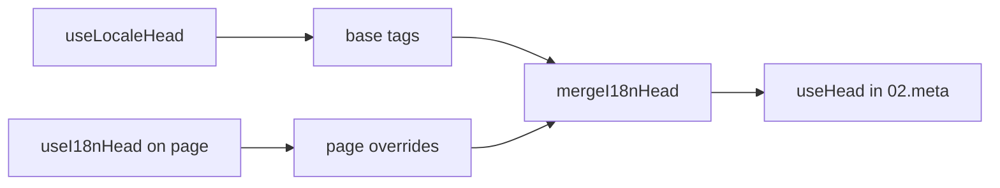

# `useI18nHead` composable

`useI18nHead` sizga maxsus meta plagini boʻlmasdan i18n SEO teglarini **sahifa boʻyicha** sozlash imkonini beradi. `meta: true` boʻlganda, modul sizning kiritishingizni [`useLocaleHead`](/api/composables/use-locale-head) chiqishi ustiga birlashtiradi.

Tipik holatlar:

- **CMS / blog maqolalari** — faqat baʼzi locale’lar tarjima qilingan; muqobil URL’lar til boʻyicha farq qiladi (turli sluglar yoki yoʻllar).
- **Dinamik canonical** — canonical URL API dan olingan maqola URL’iga mos kelishi kerak, `$switchLocalePath` ga emas.
- **Qoʻshimcha Open Graph** — avtomatik yaratilgan `og:locale` / `og:url` yonida `og:title`, `og:description`, `og:image`.
- **Qisman nazorat** — modul tomonidan yaratilgan canonical va `og:url` ni saqlab, faqat `hreflang` va `og:locale:alternate` ni almashtirish.

---

## Imzo

{/* generated:symbol:useI18nHead — do not edit; run `pnpm run docs:generate` */}

```ts
useI18nHead(input?: MaybeRefOrGetter<I18nHeadInput | null>): { pageHead: any; resetPageHead: () => void }
```

i18n SEO head teglari uchun sahifa darajasidagi bekor qilishlarni roʻyxatdan oʻtkazish.
`02.meta` plagini tomonidan `useLocaleHead` chiqishi ustiga birlashtiriladi.

| Parametr | Tur | Tavsif |
| --- | --- | --- |
| `input` *(ixtiyoriy)* | `MaybeRefOrGetter<I18nHeadInput \| null>` |  |

{/* /generated:symbol:useI18nHead */}

## Pipelinega qanday moslashadi



`useI18nHead` ni sahifa komponentida chaqirasiz. `02.meta` plagini har bir `updateMeta()` dan keyin bekor qilishlarni qoʻllaydi (marshrut oʻzgarishi, `$setI18nRouteParams`, mijozda `page:finish`).

---

## 1-misol — faqat baʼzi locale’larda tarjimalarga ega maqola

Umumiy naqsh: API qaysi locale’lar mavjudligini va ularning absolyut yoki nisbiy URL’larini qaytaradi.

```ts
interface Article {
  title: string
  slug: string
  /** Locale code → page URL (absolute or site-relative) */
  locales: Record<string, string>
}
```

```vue
<script setup lang="ts">
const route = useRoute()
const { data: article } = await useFetch<Article>(`/api/articles/${route.params.slug}`)

const localeCodes = computed(() => Object.keys(article.value?.locales ?? {}))

useI18nHead(() => {
  if (!article.value) return null

  return {
    meta: [
      { property: 'og:title', content: article.value.title },
      { property: 'og:type', content: 'article' },
    ],
    replace: {
      hreflang: localeCodes.value.map((locale) => ({
        rel: 'alternate',
        hreflang: locale,
        href: article.value!.locales[locale]!,
      })),
      ogAlternates: localeCodes.value,
    },
  }
})
</script>
```

`ogAlternates` `i18n.locales` konfiguratsiyangizdan **locale kodlarini** oladi. `og:locale:alternate` qiymatlari `locale.og` yoki `iso` orqali hal qilinadi (Open Graph `en_US` formati).

---

## 2-misol — locale boʻyicha sluglarga ega maqola (`$defineI18nRoute` + `$setI18nRouteParams`)

URL’lar mahalliylashtirilgan marshrut shablonlari va dinamik paramlardan tuzilganda:

```vue
<script setup lang="ts">
const { $defineI18nRoute, $setI18nRouteParams } = useNuxtApp()
const route = useRoute()

const { data: article } = await useFetch(`/api/articles/${route.params.slug}`)

$defineI18nRoute({
  localeRoutes: {
    en: '/blog/[slug]',
    de: '/de/blog/[slug]',
    fr: '/fr/blog/[slug]',
  },
})

if (article.value) {
  $setI18nRouteParams({
    en: { slug: article.value.slugEn },
    de: { slug: article.value.slugDe },
    fr: { slug: article.value.slugFr },
  })

  const availableLocales = article.value.availableLocales as string[]

  useI18nHead({
    meta: [{ property: 'og:title', content: article.value.title }],
    replace: {
      hreflang: availableLocales.map((locale) => ({
        rel: 'alternate',
        hreflang: locale,
        href: article.value!.urls[locale],
      })),
      ogAlternates: availableLocales,
    },
  })
}
</script>
```

Modul tomonidan yaratilgan muqobillar **barcha** sozlangan locale’larni sanaydi. `replace.hreflang` teglarni faqat haqiqatan tarjimasi bor locale’larga cheklaydi.

---

## 3-misol — standart locale maqola URL uchun maxsus `x-default`

Standart holatda `x-default` `$switchLocalePath` dan standart locale URL’iga ishora qiladi. Maqolalar uchun uni standart tarjima URL’iga yoʻnaltiring:

```vue
<script setup lang="ts">
const { $defaultLocale } = useNuxtApp()
const article = await loadArticle()

const defaultLocale = $defaultLocale() ?? 'en'
const defaultHref = article.locales[defaultLocale]

useI18nHead({
  replace: {
    hreflang: Object.entries(article.locales).map(([locale, href]) => ({
      rel: 'alternate',
      hreflang: locale,
      href,
    })),
    xDefault: defaultHref ? { rel: 'alternate', hreflang: 'x-default', href: defaultHref } : false,
    ogAlternates: Object.keys(article.locales),
  },
})
</script>
```

---

## 4-misol — canonical va `og:url` ni API maʼlumotlaridan almashtirish

Canonical CMS tomonidan taqdim etilgan URL ga mos kelishi kerak boʻlganda (koʻp domenli, maxsus yoʻl yoki oldindan tuzilgan absolyut URL):

```vue
<script setup lang="ts">
const article = await loadArticle()
const canonical = article.canonicalUrl // masalan https://www.example.com/en/blog/my-post

useI18nHead({
  replace: {
    canonical,
    ogUrl: canonical,
    hreflang: buildAlternateLinks(article),
    ogAlternates: Object.keys(article.locales),
  },
  meta: [
    { property: 'og:title', content: article.title },
    { name: 'description', content: article.excerpt },
  ],
})
</script>
```

---

## 5-misol — avtomatik canonical / `og:url` ni saqlash, faqat muqobillarni almashtirish

Agar `$switchLocalePath` + `$setI18nRouteParams` allaqachon toʻgʻri canonical va `og:url` ni chiqarayotgan boʻlsa, faqat kashfiyot teglarini almashtiring:

```vue
<script setup lang="ts">
const article = await loadArticle()

useI18nHead({
  replace: {
    hreflang: buildAlternateLinks(article),
    ogAlternates: Object.keys(article.locales),
  },
})
</script>
```

---

## 6-misol — kontent tafsilot sahifasi uchun toʻliq head (meta + link’lar)

“Sahifa meta” va “muqobil havolalar” ni alohida yordamchilarga boʻlishga oʻxshash naqsh — bitta chaqiruvda birlashtirilgan:

```vue
<script setup lang="ts">
const article = await loadArticle()
const alternates = Object.entries(article.locales).map(([locale, href]) => ({
  rel: 'alternate' as const,
  hreflang: locale,
  href: normalizeSeoUrl(href), // strip ?query and #hash if needed
}))

useI18nHead({
  meta: [
    { property: 'og:title', content: article.title },
    { property: 'og:description', content: article.description },
    { property: 'og:image', content: article.imageUrl },
    { name: 'twitter:card', content: 'summary_large_image' },
    { name: 'twitter:title', content: article.title },
  ],
  replace: {
    canonical: article.canonicalUrl,
    ogUrl: article.canonicalUrl,
    hreflang: alternates,
    ogAlternates: Object.keys(article.locales),
  },
})
</script>
```

```ts
/** Remove query and hash — useful when CMS URLs must be clean for SEO */
function normalizeSeoUrl(href: string): string {
  try {
    const url = new URL(href, 'https://placeholder.local')
    url.search = ''
    url.hash = ''
    return href.startsWith('http') ? url.href : `${url.pathname}`
  } catch {
    return href.split(/[?#]/)[0] ?? href
  }
}
```

---

## 7-misol — ikkita kontent turi, bir xil naqsh (yangiliklar va qoʻllanmalar)

Bir xil API shakli, turli marshrut nomlari — kichik yordamchini qayta ishlatish:

```ts
// composables/useArticleHead.ts
import type { I18nHeadInput } from '@i18n-micro/types'

interface LocalizedContent {
  title: string
  locales: Record<string, string>
  canonicalUrl?: string
}

export function buildArticleHead(content: LocalizedContent): I18nHeadInput {
  const localeCodes = Object.keys(content.locales)
  const canonical = content.canonicalUrl ?? content.locales.en

  return {
    meta: [{ property: 'og:title', content: content.title }],
    replace: {
      canonical,
      ogUrl: canonical,
      hreflang: localeCodes.map((locale) => ({
        rel: 'alternate',
        hreflang: locale,
        href: content.locales[locale]!,
      })),
      ogAlternates: localeCodes,
    },
  }
}
```

```vue
<!-- pages/blog/[slug].vue -->
<script setup lang="ts">
const article = await loadArticle()
useI18nHead(buildArticleHead(article))
</script>
```

```vue
<!-- pages/guides/[slug].vue -->
<script setup lang="ts">
const guide = await loadGuide()
useI18nHead(buildArticleHead(guide))
</script>
```

---

## 8-misol — oʻrnatilgan muqobillarni oʻchirish, oʻz roʻyxatingizni taqdim etish

Modulning hreflang generatorini oʻchirish va maxsus roʻyxatni uzatishga teng (muqobil toʻplamlar takrorlanmaydi):

```vue
<script setup lang="ts">
const article = await loadArticle()

useI18nHead({
  disable: ['hreflang', 'x-default', 'og-alternates'],
  link: Object.entries(article.locales).map(([locale, href]) => ({
    rel: 'alternate',
    hreflang: locale,
    href,
  })),
  replace: {
    ogAlternates: Object.keys(article.locales),
  },
})
</script>
```

Yoki `disable` siz `replace.hreflang` ni afzal koʻring — u barcha `rel="alternate"` havolalarni bir qadamda almashtiradi.

---

## 9-misol — landing sahifasi: faqat qoʻshimcha OG, barcha i18n teglarni saqlash

```vue
<script setup lang="ts">
const { t } = useI18n()

useI18nHead({
  meta: [
    { property: 'og:title', content: t('landing.ogTitle') },
    { property: 'og:description', content: t('landing.ogDescription') },
  ],
})
</script>
```

---

## 10-misol — mahsulot sahifasi: bitta locale eksperimenti uchun hreflang’ni oʻchirish

```vue
<script setup lang="ts">
useI18nHead({
  disable: ['hreflang', 'x-default'],
  // canonical, og:locale, og:url still generated
})
</script>
```

---

## 11-misol — mijoz tomonidagi olishdan keyin reaktiv yangilanishlar

```vue
<script setup lang="ts">
const article = ref<Article | null>(null)

onMounted(async () => {
  article.value = await $fetch('/api/articles/latest')
})

useI18nHead(() => {
  if (!article.value) return null
  return {
    meta: [{ property: 'og:title', content: article.value.title }],
    replace: {
      hreflang: Object.entries(article.value.locales).map(([locale, href]) => ({
        rel: 'alternate',
        hreflang: locale,
        href,
      })),
    },
  }
})
</script>
```

Head `page:finish` da va `pageHead` holati oʻzgarganda yangilanadi.

---

## 12-misol — teskari proksi ortidagi HTTPS manbasi

Agar avval canonical / muqobil absolyut URL’lar uchun “public origin” composable’ini hal qilgan boʻlsangiz, uning oʻrniga modul konfiguratsiyasidan foydalaning:

```ts
// nuxt.config.ts
export default defineNuxtConfig({
  i18n: {
    meta: true,
    // undefined = origin from current request (multi-domain friendly)
    metaBaseUrl: undefined,
    metaTrustForwardedHost: true,
    metaTrustForwardedProto: true,
  },
})
```

Keyin `replace.hreflang` / `replace.canonical` da **yoʻllar yoki toʻliq URL’lar** ni uzating. Modul SSR da `useRequestURL` ni `X-Forwarded-Host` / `X-Forwarded-Proto` bilan ishlatadi.

---

## API havolasi

### `meta`

Qoʻshimcha `<meta>` teglar. `id`, `property` yoki `name` boʻyicha dedupe qilinadi.

### `link`

Qoʻshimcha `<link>` teglar. `id` yoki `rel` + `hreflang` boʻyicha dedupe qilinadi.

### `htmlAttrs`

`useLocaleHead` dan `<html>` atributlariga (`lang`, `dir`) birlashtiriladi.

### `replace`

| Kalit            | Tur                      | Taʼsir                                         |
| -------------- | ------------------------- | ---------------------------------------------- |
| `canonical`    | `string \| false`         | Canonical havolani almashtirish yoki olib tashlash               |
| `hreflang`     | `I18nHeadLink[] \| false` | Barcha `rel="alternate"` havolalarni almashtirish yoki olib tashlash  |
| `xDefault`     | `I18nHeadLink \| false`   | `hreflang="x-default"` ni almashtirish yoki olib tashlash       |
| `ogLocale`     | `string \| false`         | `og:locale` ni almashtirish yoki olib tashlash                  |
| `ogUrl`        | `string \| false`         | `og:url` ni almashtirish yoki olib tashlash                     |
| `ogAlternates` | `string[] \| false`       | Locale kodlari uchun `og:locale:alternate` ni qayta qurish |

### `disable`

| Qiymat           | Nimani olib tashlaydi                                  |
| --------------- | ---------------------------------------- |
| `hreflang`      | Locale muqobil havolalari (`x-default` emas) |
| `x-default`     | `hreflang="x-default"` havolasi              |
| `canonical`     | Canonical havolasi                           |
| `og`            | `og:locale` va `og:url`                 |
| `og-alternates` | `og:locale:alternate` teglari               |
| `html`          | `<html>` dagi `lang` / `dir`               |

---

## `useLocaleHead` va `useI18nHead`

| Composable      | Qamrov                | Qachon ishlatish                                |
| --------------- | -------------------- | ------------------------------------------ |
| `useLocaleHead` | Global / qoʻlda head | `meta: false`, toʻliq maxsus `useHead` sozlash |
| `useI18nHead`   | Sahifa boʻyicha bekor qilishlar   | `meta: true`, muayyan sahifalarni sozlash     |

`meta: true` boʻlganda, faqat `useI18nHead` dan foydalanadigan sahifalarda `useLocaleHead` **kerak emas**.

---

## Maxsus i18n head plaginidan koʻchish

Koʻp loyihalar quyidagilarni bajaruvchi maxsus plaginni saqlaydi:

- ulashilgan holatdan sahifa boʻyicha muqobil havolalarni birlashtirish;
- takroriy mintaqaviy `hreflang` yozuvlarini filtrlash;
- `og:locale` qiymatlarini normallashtirish;
- SEO URL’lardan query satrlarini olib tashlash.

Buni har bir kontent sahifasida `useI18nHead` va modul standartlari bilan almashtirishingiz mumkin.

| Oldingi yondashuv                                     | `useI18nHead` bilan                                   |
| ----------------------------------------------------- | ---------------------------------------------------- |
| Ulashilgan holat + “bu maqola uchun qaysi locale’lar mavjud” | `replace: \{ ogAlternates: localeCodes \}`             |
| `rel="alternate"` havolalarini quruvchi alohida yordamchi      | `replace: \{ hreflang: links \}`                       |
| Sahifa holatini head’ga birlashtiruvchi maxsus plagin            | `02.meta` da oʻrnatilgan birlashtirish                          |
| Absolyut URL’lar uchun maxsus “public origin”              | `metaBaseUrl` + forwarded sarlavhalar (12-misolga qarang)   |
| Qisqa `og:locale` (`en_US` oʻrniga `en`)           | `locale.og` ni oʻrnating yoki `iso` → `en_US` (OG protokoli) dan foydalaning |

**`iso` dan `hreflang`:** har bir locale `hreflang = iso || code` bilan bitta muqobilni chiqaradi. `iso` oʻrnatilganda marshrutlash `code` hech qachon ishlatilmaydi (`hreflang="mx"` kabi yaroqsiz teglardan qochadi). Yalangʻoch til fallbacklarga (`es-ES` → `es` ham) `hreflangBaseLanguage: true` bilan qoʻshiling — `iso` dan olinadi, `code` dan emas. Toʻliq maxsus roʻyxatlar uchun `replace.hreflang` dan foydalaning.

**JSON-LD:** `useI18nHead` tuzilgan maʼlumotlarni yaratmaydi. `useHead(\{ script: [...] \})` yoki uning yonida maxsus JSON-LD yordamchisini saqlang.

---

## Shuningdek qarang

- [SEO qoʻllanmasi](/guides/seo) — avtomatik meta yaratish va sahifa darajasidagi bekor qilishlar
- [`useLocaleHead`](/api/composables/use-locale-head) — past darajali head API
