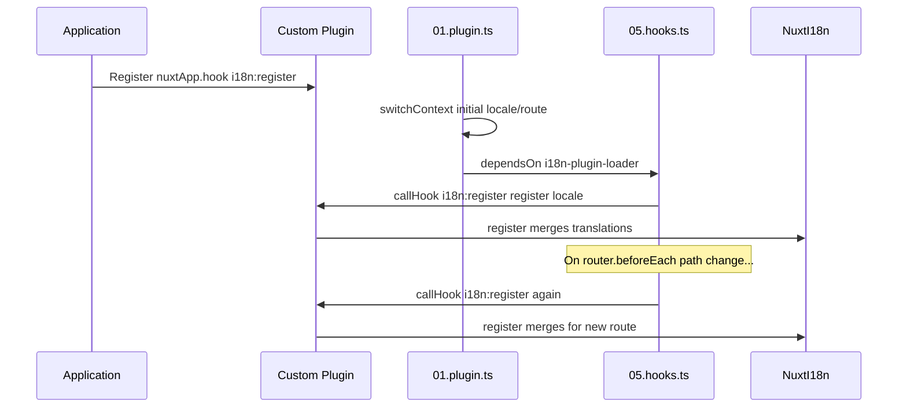

# 📢 Hodisalar

## 🔄 `i18n:register`

`Nuxt I18n Micro` dagi `i18n:register` hodisasi ilovangiz i18n kontekstiga tarjimalarni dinamik qo'shishga imkon beradi va xalqarolashtirish jarayonini muammosiz va moslashuvchan qiladi. Ushbu hodisa sizga kerak bo'lganda yangi tarjimalarni integratsiya qilish imkonini beradi va ilovangizning lokalizatsiya imkoniyatlarini yaxshilaydi.

### 📝 Hodisa tafsilotlari

- **Maqsad**:
  - Muayyan locale uchun mavjud to'plamga qo'shimcha tarjimalarni dinamik qo'shishga imkon beradi.

- **Payload**:
  - **`register`**:
    - Hodisa tomonidan taqdim etilgan funksiya, ikkita argumentni oladi:
      - **`translations`** (`Translations`):
        - `Translations` interfeysiga muvofiq tashkil qilingan tarjimalarni ifodalovchi kalit-qiymat juftliklarini o'z ichiga olgan obyekt.
      - **`locale`** (`string`, ixtiyoriy):
        - Tarjimalar ro'yxatdan o'tkaziladigan locale kodi (masalan, `'en'`, `'ru'`). Agar ko'rsatilmasa, hodisa tomonidan taqdim etilgan locale'ga o'tadi.

- **Xatti-harakat**:
  - Ishga tushirilganda, `register` funksiyasi yangi tarjimalarni ko'rsatilgan locale uchun joriy kontekstga birlashtiradi va ilova bo'ylab mavjud tarjimalarni yangilaydi.

### ⏱️ U qachon ishga tushadi

Modulning hooks plagini (`05.hooks.ts`, `dependsOn: ['i18n-plugin-loader']`) `nuxtApp.callHook('i18n:register', …)` ni chaqiradi:

1. **Ishga tushishda bir marta** — asosiy i18n plagini (`01.plugin.ts`) dastlabki yo'nalish uchun tarjimalarni yuklaganidan keyin
2. **Navigatsiyada** — yo'l o'zgarganda `router.beforeEach` da yoki `strategy: 'no_prefix'` bo'lganda har bir navigatsiyada

Tinglovchingizni oddiy Nuxt plaginida `nuxtApp.hook('i18n:register', …)` bilan ro'yxatdan o'tkazing. Hooks plagini loader tayyor bo'lgandan keyin ishga tushadi, shuning uchun sizning callback'ingiz tarjimalarni kengaytirish kerak bo'lganda chaqiriladi.

Avtomatik `i18n:register` chaqiruvlarini o'chirish uchun `nuxt.config` da `hooks: false` ni o'rnating ([Konfiguratsiya — `hooks`](/guides/configuration#hooks) ga qarang).

### 💡 Foydalanish misoli

Quyidagi misol dinamik ravishda tarjimalarni qo'shish uchun `i18n:register` hodisasidan qanday foydalanishni ko'rsatadi:

```typescript
nuxt.hook('i18n:register', async (register: (translations: unknown, locale?: string) => void, locale: string) => {
  register(
    {
      greeting: 'Hello',
      farewell: 'Goodbye',
    },
    locale,
  )
})
```

### 🛠️ Tushuntirish



- **Hodisani ishga tushirish**:
  - Hooks plagini (`05.hooks.ts`) asosiy loader tayyor bo'lgandan keyin va tegishli navigatsiyalarda `i18n:register` ni ishga tushiradi.

- **Tarjimalarni qo'shish**:
  - Misolda `"greeting"` va `"farewell"` uchun inglizcha tarjimalar ro'yxatdan o'tkaziladi.
  - `register` funksiyasi ushbu tarjimalarni taqdim etilgan locale uchun mavjud to'plamga birlashtiradi.

### 🔗 Asosiy foydalari

- **Dinamik yangilanishlar**:
  - Butun ilovangizni qayta deploy qilishga hojatsiz tarjimalarni oson yangilash yoki qo'shish.

- **Lokalizatsiya moslashuvchanligi**:
  - Foydalanuvchi yoki ilova ehtiyojlariga qarab real vaqt lokalizatsiya sozlashlarini qo'llab-quvvatlaydi.

`i18n:register` hodisasidan foydalanib, ilovangizning lokalizatsiya strategiyasi moslashuvchan va moslashuvchan bo'lib qolishini ta'minlashingiz va umumiy foydalanuvchi tajribasini yaxshilashingiz mumkin.

---

## 🛠️ Plaginlar bilan tarjimalarni o'zgartirish

Nuxt ilovangizda tarjimalarni dinamik ravishda o'zgartirish uchun plaginlardan foydalanish tavsiya etiladi. Plaginlar lokalizatsiya yangilanishlarini boshqarish uchun tuzilgan yo'lni taqdim etadi, ayniqsa modullar yoki tashqi tarjima fayllari bilan ishlaganda.

### **Plaginni ro'yxatdan o'tkazish**

Agar modul ishlatsangiz, tarjima o'zgartirishlari sodir bo'ladigan plaginni modul konfiguratsiyasiga qo'shib ro'yxatdan o'tkazing:

```javascript
addPlugin({
  src: resolve('./plugins/extend_locales'),
})
```

Bu tarjimalarning dinamik yuklash va ro'yxatdan o'tkazishni boshqaradigan `./plugins/extend_locales` da joylashgan plaginni ro'yxatdan o'tkazadi.

### **Plaginni amalga oshirish**

Plaginda locale o'zgarishlarini boshqarishingiz mumkin. Nuxt plaginida amalga oshirishning misoli:

```typescript
import { defineNuxtPlugin } from '#app'

export default defineNuxtPlugin(async (nuxtApp) => {
  // Function to load translations from JSON files and register them
  const loadTranslations = async (lang: string) => {
    try {
      const translations = await import(`../locales/${lang}.json`)
      return translations.default
    } catch (error) {
      console.error(`Error loading translations for language: ${lang}`, error)
      return null
    }
  }

  // Hook into the 'i18n:register' event to dynamically add translations
  // eslint-disable-next-line @typescript-eslint/ban-ts-comment
  // @ts-expect-error
  nuxtApp.hook('i18n:register', async (register: (translations: unknown, locale?: string) => void, locale: string) => {
    const translations = await loadTranslations(locale)
    if (translations) {
      register(translations, locale)
    }
  })
})
```

### 📝 Batafsil tushuntirish

1. **Tarjimalarni yuklash**:

- `loadTranslations` funksiyasi locale asosida tarjima fayllarini dinamik import qiladi. Fayllar `locales` katalogida bo'lishi va locale kodlariga qarab nomlanishi kutiladi (masalan, `en.json`, `de.json`).
- Muvaffaqiyatli yuklanganda, tarjimalar qaytariladi; aks holda xato log qilinadi.

2. **Tarjimalarni ro'yxatdan o'tkazish**:

- Plagin `nuxtApp.hook` yordamida `i18n:register` hodisasiga ulanadi.
- Hodisa ishga tushirilganda, `register` funksiyasi yuklangan tarjimalar va mos locale bilan chaqiriladi.
- Bu yangi tarjimalarni ko'rsatilgan locale uchun i18n kontekstiga birlashtiradi va ilova bo'ylab mavjud tarjimalarni yangilaydi.

### 🔗 Tarjima o'zgartirishlari uchun plaginlardan foydalanish afzalliklari

- **Vazifalarni ajratish**:
  - Lokalizatsiya mantig'ini asosiy ilova kodidan alohida joylashtiring, bu boshqarish va texnik xizmatni osonlashtiradi.

- **Dinamik va kengaytiriladigan**:
  - Tarjimalarni dinamik yuklash va ro'yxatdan o'tkazish orqali to'liq ilova qayta deploy qilishga hojatsiz kontentni yangilashingiz mumkin, bu ayniqsa tez-tez yangilanadigan yoki ko'p tilli kontentga ega ilovalar uchun foydalidir.

- **Kengaytirilgan lokalizatsiya moslashuvchanligi**:
  - Plaginlar sizga kerak bo'lganda tarjimalarni o'zgartirish yoki kengaytirish imkonini beradi va foydalanuvchi afzalliklari yoki biznes talablariga mos moslashuvchan va sezgir lokalizatsiya strategiyasini taqdim etadi.

Ushbu yondashuvni qabul qilib, plaginlar yordamida tuzilgan va texnik xizmat qilinadigan jarayon orqali ilovangizning lokalizatsiyasini samarali kengaytirish va o'zgartirish, xalqarolashtirishni o'zgarayotgan ehtiyojlarga moslashtirish va umumiy foydalanuvchi tajribasini yaxshilash mumkin.
