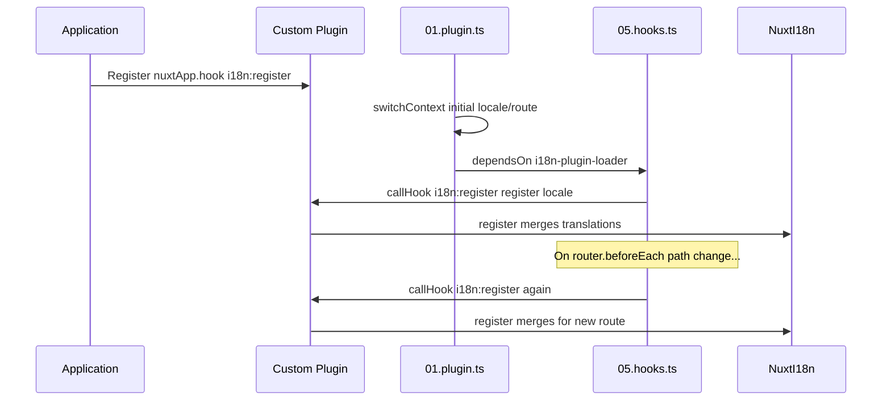

# 📢 Hodisalar

## 🔄 `i18n:register`

`Nuxt I18n Micro` dagi `i18n:register` hodisasi ilovangizning i18n kontekstiga tarjimalarni dinamik ravishda qoʻshish imkonini beradi. Bu xalqarolashtirish jarayonini uzluksiz va moslashuvchan qiladi. Ushbu hodisa sizga kerak boʻlgan yangi tarjimalarni integratsiya qilish imkonini beradi va ilovangizning mahalliylashtirish imkoniyatlarini kuchaytiradi.

### 📝 Hodisa tafsilotlari

- **Maqsad**:
  - Muayyan locale uchun mavjud toʻplamga qoʻshimcha tarjimalarni dinamik ravishda qoʻshish imkonini beradi.

- **Payload**:
  - **`register`**:
    - Hodisa tomonidan taqdim etilgan funksiya boʻlib, ikkita argumentni qabul qiladi:
      - **`translations`** (`Translations`):
        - `Translations` interfeysi boʻyicha tashkil etilgan, tarjimalarni ifodalovchi kalit-qiymat juftliklarini oʻz ichiga olgan obyekt.
      - **`locale`** (`string`, ixtiyoriy):
        - Tarjimalar roʻyxatdan oʻtkaziladigan locale kodi (masalan, `'en'`, `'ru'`). Belgilanmagan boʻlsa, hodisa tomonidan taqdim etilgan locale ishlatiladi.

- **Xatti-harakati**:
  - Ishga tushirilganda, `register` funksiyasi yangi tarjimalarni belgilangan locale uchun joriy kontekstga birlashtiradi va ilova boʻylab mavjud tarjimalarni yangilaydi.

### ⏱️ Qachon ishga tushadi

Modulning hooks plagini (`05.hooks.ts`, `dependsOn: ['i18n-plugin-loader']`) `nuxtApp.callHook('i18n:register', …)` ni chaqiradi:

1. **Ishga tushishda bir marta** — asosiy i18n plagini (`01.plugin.ts`) boshlangʻich marshrut uchun tarjimalarni yuklaganidan soʻng
2. **Navigatsiyada** — yoʻl oʻzgarganda `router.beforeEach` da yoki `strategy: 'no_prefix'` boʻlganda har bir navigatsiyada

Listeneringizni oddiy Nuxt plaginida `nuxtApp.hook('i18n:register', …)` bilan roʻyxatdan oʻtkazing. Hooks plagini yuklovchi tayyor boʻlgach ishga tushadi, shuning uchun sizning callback tarjimalar kengaytirilishi kerak boʻlganda chaqiriladi.

Avtomatik `i18n:register` chaqiruvlarini oʻchirish uchun `nuxt.config` da `hooks: false` ni oʻrnating ([Sozlash — `hooks`](/guides/configuration#hooks) ga qarang).

### 💡 Foydalanish misoli

Quyidagi misolda `i18n:register` hodisasidan foydalanib tarjimalarni dinamik qoʻshish koʻrsatilgan:

```typescript
nuxt.hook('i18n:register', async (register: (translations: unknown, locale?: string) => void, locale: string) => {
  register(
    {
      greeting: 'Hello',
      farewell: 'Goodbye',
    },
    locale,
  )
})
```

### 🛠️ Tushuntirish



- **Hodisani ishga tushirish**:
  - Hooks plagini (`05.hooks.ts`) asosiy yuklovchi tayyor boʻlganda va tegishli navigatsiyalarda `i18n:register` ni ishga tushiradi.

- **Tarjimalarni qoʻshish**:
  - Misolda `"greeting"` va `"farewell"` uchun inglizcha tarjimalar roʻyxatdan oʻtkaziladi.
  - `register` funksiyasi ushbu tarjimalarni taqdim etilgan locale uchun mavjud toʻplamga birlashtiradi.

### 🔗 Asosiy afzalliklar

- **Dinamik yangilanishlar**:
  - Butun ilovangizni qayta joylashtirmasdan tarjimalarni oson yangilash yoki qoʻshish.

- **Mahalliylashtirish moslashuvchanligi**:
  - Foydalanuvchi yoki ilova ehtiyojlariga qarab real vaqtda mahalliylashtirish sozlamalarini qoʻllab-quvvatlaydi.

`i18n:register` hodisasidan foydalanib, ilovangizning mahalliylashtirish strategiyasi moslashuvchan va oʻzgaruvchan boʻlishini taʼminlashingiz mumkin. Bu foydalanuvchi tajribasini yaxshilaydi.

---

## 🛠️ Plaginlar yordamida tarjimalarni oʻzgartirish

Nuxt ilovangizda tarjimalarni dinamik ravishda oʻzgartirish uchun plaginlardan foydalanish tavsiya etiladi. Plaginlar mahalliylashtirish yangilanishlarini boshqarish uchun tuzilgan usulni taqdim etadi, ayniqsa modullar yoki tashqi tarjima fayllari bilan ishlashda.

### **Plaginni roʻyxatdan oʻtkazish**

Agar modul ishlatayotgan boʻlsangiz, tarjima oʻzgarishlari sodir boʻladigan plaginni modul konfiguratsiyasiga qoʻshish orqali roʻyxatdan oʻtkazing:

```javascript
addPlugin({
  src: resolve('./plugins/extend_locales'),
})
```

Bu `./plugins/extend_locales` da joylashgan plaginni roʻyxatdan oʻtkazadi, u tarjimalarni dinamik yuklash va roʻyxatdan oʻtkazishni boshqaradi.

### **Plaginni amalga oshirish**

Plaginda locale oʻzgarishlarini boshqarishingiz mumkin. Nuxt plaginidagi amalga oshirish misoli:

```typescript
import { defineNuxtPlugin } from '#app'

export default defineNuxtPlugin(async (nuxtApp) => {
  // Function to load translations from JSON files and register them
  const loadTranslations = async (lang: string) => {
    try {
      const translations = await import(`../locales/${lang}.json`)
      return translations.default
    } catch (error) {
      console.error(`Error loading translations for language: ${lang}`, error)
      return null
    }
  }

  // Hook into the 'i18n:register' event to dynamically add translations
  // eslint-disable-next-line @typescript-eslint/ban-ts-comment
  // @ts-expect-error
  nuxtApp.hook('i18n:register', async (register: (translations: unknown, locale?: string) => void, locale: string) => {
    const translations = await loadTranslations(locale)
    if (translations) {
      register(translations, locale)
    }
  })
})
```

### 📝 Batafsil tushuntirish

1. **Tarjimalarni yuklash**:

- `loadTranslations` funksiyasi locale asosida tarjima fayllarini dinamik ravishda import qiladi. Fayllar `locales` katalogida joylashgan va locale kodlariga muvofiq nomlangan boʻlishi kutiladi (masalan, `en.json`, `de.json`).
- Muvaffaqiyatli yuklashda tarjimalar qaytariladi; aks holda xato loglanadi.

2. **Tarjimalarni roʻyxatdan oʻtkazish**:

- Plagin `nuxtApp.hook` yordamida `i18n:register` hodisasiga ulanadi.
- Hodisa ishga tushirilganda, `register` funksiyasi yuklangan tarjimalar va tegishli locale bilan chaqiriladi.
- Bu yangi tarjimalarni belgilangan locale uchun i18n kontekstiga birlashtiradi va ilova boʻylab mavjud tarjimalarni yangilaydi.

### 🔗 Tarjimalarni oʻzgartirish uchun plaginlardan foydalanish afzalliklari

- **Vazifalarni ajratish**:
  - Mahalliylashtirish mantigʻini asosiy ilova kodidan alohida inkapsulyatsiya qilib, boshqaruv va parvarishni osonlashtiradi.

- **Dinamik va kengaytirilgan**:
  - Tarjimalarni dinamik ravishda yuklash va roʻyxatdan oʻtkazish orqali toʻliq ilovani qayta joylashtirmasdan kontentni yangilashingiz mumkin, bu esa tez-tez yangilanadigan yoki koʻp tilli kontentga ega ilovalar uchun ayniqsa foydali.

- **Kengaytirilgan mahalliylashtirish moslashuvchanligi**:
  - Plaginlar kerakli tarjimalarni oʻzgartirish yoki kengaytirish imkonini beradi va foydalanuvchi afzalliklari yoki biznes talablariga javob beradigan moslashuvchan mahalliylashtirish strategiyasini taʼminlaydi.

Ushbu yondashuvni qabul qilib, plaginlar orqali tuzilgan va parvarishlanadigan jarayon yordamida ilovangizning mahalliylashtirishini samarali ravishda kengaytirish va oʻzgartirish, xalqarolashtirishni oʻzgaruvchi ehtiyojlarga moslashtirish va foydalanuvchi tajribasini yaxshilash mumkin.
