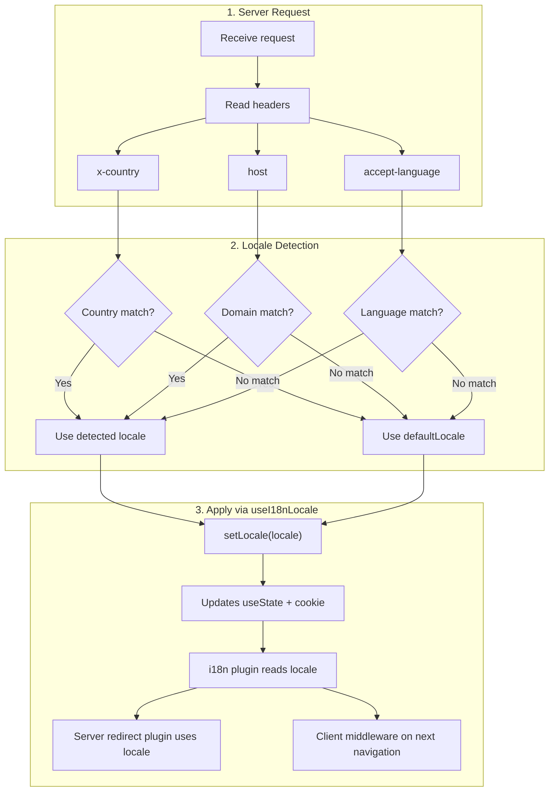

# 🔧 Nuxt I18n Micro'da maxsus til aniqlash

## 📖 Umumiy ko'rinish

Nuxt I18n Micro v3 barcha locale boshqaruvi uchun markazlashgan composable — `useI18nLocale()` ni taqdim etadi. Bu v2'dagi qo'lda `useState`/`useCookie` naqshlarini almashtiradi. Server plaginida `useI18nLocale().setLocale()` dan foydalanib, siz modulning redirect va cookie tizimlari bilan to'liq muvofiqlikni saqlab qolgan holda har qanday maxsus aniqlash mantig'ini amalga oshirishingiz mumkin.

## 🏗️ Arxitektura

```mermaid
flowchart TB
    subgraph Plugins["Plugin Execution Order"]
        A["Your plugin<br/>order: -10"] -->|setLocale()| B["01.plugin.ts<br/>order: -5"]
        B --> C["06.redirect.ts server<br/>order: 10"]
    end

    subgraph Client["Client SPA Navigation"]
        D["i18n-redirect.global.ts<br/>route middleware"]
    end

    subgraph State["Locale State"]
        E["useState('i18n-locale')"]
        F["localeCookie"]
    end

    A -->|"setLocale() updates both"| E
    A -->|"setLocale() updates both"| F
    B -->|reads| E
    C -->|reads| E
    C -->|reads| F
    D -->|reads target route +| E
```

**Asosiy tamoyil**: `order: -10` bilan server plaginida `useI18nLocale().setLocale()` ni chaqiring. Bu ham `useState('i18n-locale')`, ham locale cookie'sini atomik tarzda yangilaydi, shuning uchun i18n plagini (`order: -5`) va server redirect plagini (`order: 10`) birinchi SSR so'rovida to'g'ri locale'ni ko'radi. Client tomonidagi avtomatik redirect'lar keyingi navigatsiyalarda global yo'nalish middleware'ida ishga tushadi.

## 🛠️ O'rnatilgan avtomatik aniqlashni o'chirish

Agar locale aniqlash ustidan to'liq nazoratni xohlasangiz, o'rnatilgan mexanizmni o'chiring:

```ts
export default defineNuxtConfig({
  i18n: {
    autoDetectLanguage: false,
  },
})
```

## ✨ Misol: `useI18nLocale` bilan server tomonida aniqlash

Bu barcha strategiyalar uchun **tavsiya qilingan yondashuv**.

### 1-qadam: `nuxt.config.ts` ni sozlash

```ts
export default defineNuxtConfig({
  modules: ['nuxt-i18n-micro'],
  i18n: {
    strategy: 'no_prefix', // Works with ANY strategy
    defaultLocale: 'en',
    localeCookie: 'user-locale',
    autoDetectLanguage: false,
    locales: [
      { code: 'en', iso: 'en-US' },
      { code: 'de', iso: 'de-DE' },
      { code: 'ja', iso: 'ja-JP' },
    ],
  },
})
```

### 2-qadam: `plugins/i18n-loader.server.ts` ni yaratish

```ts
import { defineNuxtPlugin, useRequestHeaders } from '#imports'

export default defineNuxtPlugin({
  name: 'i18n-custom-loader',
  enforce: 'pre',
  order: -10, // Execute BEFORE the i18n plugin (which has order -5)

  setup() {
    const { setLocale } = useI18nLocale()
    const headers = useRequestHeaders(['host', 'x-country', 'accept-language'])
    let detectedLocale = 'en'

    // --- YOUR DETECTION LOGIC ---

    // Example 1: By domain
    const host = headers['host']
    if (host?.includes('example.de')) {
      detectedLocale = 'de'
    }
    // Example 2: By custom header
    else if (headers['x-country'] === 'JP') {
      detectedLocale = 'ja'
    }
    // Example 3: By Accept-Language header
    else if (headers['accept-language']?.includes('de')) {
      detectedLocale = 'de'
    }

    // --- APPLY THE LOCALE ---
    setLocale(detectedLocale)
  },
})
```

### Qanday ishlaydi



1. **Plagin avval ishlaydi** (`order: -10`) — header'lar, domen yoki boshqa manbalardan locale'ni aniqlaydi
2. **`setLocale()` ikkalasini ham yangilaydi** — `useState('i18n-locale')` va cookie — barcha keyingi plaginlarga darhol ko'rinishni ta'minlaydi
3. **i18n plagini** (`order: -5`) locale'ni o'qiydi va to'g'ri tarjimalarni yuklaydi
4. **Server redirect plagini** (`order: 10`) SSR'da redirect qarorlari uchun locale'dan foydalanadi
5. **Client yo'nalish middleware** (`i18n-redirect`) URL locale'i afzallik bilan mos kelmasa SPA navigatsiyasida redirect'larni qo'llaydi

## 🌐 Strategiyaga xos xatti-harakat

`useI18nLocale().setLocale()` **barcha strategiyalar bilan** ishlaydi. Redirect xatti-harakati strategiyaga bog'liq:

<Tip>
| Strategiya | `setLocale('de')` ta'siri |
|----------|---------------------------|
| `no_prefix` | Nemis tilida render qilinadi, URL o'zgarmaydi |
| `prefix` | 302 → `/de/` (server tomonidagi redirect) |
| `prefix_except_default` | Agar `de` ≠ standart bo'lsa 302 → `/de/`; agar `de` = standart bo'lsa redirect yo'q |
| `prefix_and_default` | Redirect yo'q (ham `/`, ham `/de/` yaroqli) |
</Tip>

**Muhim eslatmalar:**

- Cookie asosidagi locale aniqlash standart bo'yicha o'chirilgan (`localeCookie: null`)
- Cookie doimiyligini yoqish uchun `localeCookie: 'user-locale'` ni o'rnating
- Agar cookie/state qiymati `locales` ro'yxatida bo'lmasa, u `defaultLocale` ga qaytadi

## 🏢 Kengaytirilgan: Domen asosida aniqlash

Har bir domen boshqa locale'ga xizmat qiladigan ko'p-domenli sozlash uchun:

```ts
import { defineNuxtPlugin, useRequestHeaders } from '#imports'

export default defineNuxtPlugin({
  name: 'i18n-domain-loader',
  enforce: 'pre',
  order: -10,

  setup() {
    const { setLocale } = useI18nLocale()
    const headers = useRequestHeaders(['host'])
    const host = headers['host'] || ''

    let detectedLocale = 'en'

    if (host.endsWith('.de') || host.includes('german.')) {
      detectedLocale = 'de'
    } else if (host.endsWith('.fr') || host.includes('french.')) {
      detectedLocale = 'fr'
    } else if (host.endsWith('.jp') || host.includes('japanese.')) {
      detectedLocale = 'ja'
    }

    setLocale(detectedLocale)
  },
})
```

## 🔄 Kengaytirilgan: Foydalanuvchi afzalligini hurmat qilish

Agar foydalanuvchilar tilni qo'lda almashtira olsalar, avtomatik aniqlashdan ko'ra ularning tanlovini hurmat qiling:

```ts
import { defineNuxtPlugin, useRequestHeaders } from '#imports'

export default defineNuxtPlugin({
  name: 'i18n-smart-loader',
  enforce: 'pre',
  order: -10,

  setup() {
    const { getLocale, setLocale } = useI18nLocale()

    // If user already has a preference (from cookie), respect it
    if (getLocale()) {
      return
    }

    // Otherwise, detect locale from headers
    const headers = useRequestHeaders(['accept-language'])
    let detectedLocale = 'en'

    const acceptLanguage = headers['accept-language'] || ''
    if (acceptLanguage.includes('de')) {
      detectedLocale = 'de'
    } else if (acceptLanguage.includes('ja')) {
      detectedLocale = 'ja'
    }

    setLocale(detectedLocale)
  },
})
```

## ⚙️ Faqat server yoki faqat client plaginlari

Plaginingiz qayerda ishga tushishini nazorat qilish uchun [Nuxt fayl nomlash konvensiyalari](https://nuxt.com/docs/getting-started/directory-structure#plugins) dan foydalaning:

- **Faqat server**: `i18n-loader.server.ts` — faqat SSR davomida ishlaydi (header asosidagi aniqlash uchun tavsiya etiladi)
- **Faqat client**: `i18n-loader.client.ts` — faqat brauzerda ishlaydi (`localStorage` yoki DOM asosidagi aniqlash uchun)

<Tip>

</Tip>

## ✅ Xulosa

| Xususiyat                                | Tavsif                                                       |
| -------------------------------------- | ----------------------------------------------------------------- |
| `useI18nLocale().setLocale()`          | `useState` + cookie'ni atomik tarzda yangilaydi; barcha strategiyalar bilan ishlaydi |
| `useI18nLocale().getLocale()`          | State yoki cookie'dan joriy locale'ni qaytaradi                       |
| `useI18nLocale().getPreferredLocale()` | Afzal locale'ni qaytaradi (`locales` ro'yxatiga qarshi tekshiriladi)       |
| Plagin `order: -10`                    | Plaginingiz i18n ishga tushirilishidan oldin ishga tushishini ta'minlaydi               |
| `enforce: 'pre'`                       | "pre" plagin guruhida ishga tushadi                                    |

**BUNI QILMANG:**

- `useCookie('user-locale')` ni to'g'ridan-to'g'ri ishlatmang — `useI18nLocale()` cookie'larni ichki boshqaradi
- `useState('i18n-locale')` ni to'g'ridan-to'g'ri ishlatmang — buning o'rniga `useI18nLocale().setLocale()` ni ishlating
- `order` ni >= -5 qilib o'rnatmang — plaginingiz i18n plaginidan oldin ishga tushishi kerak
