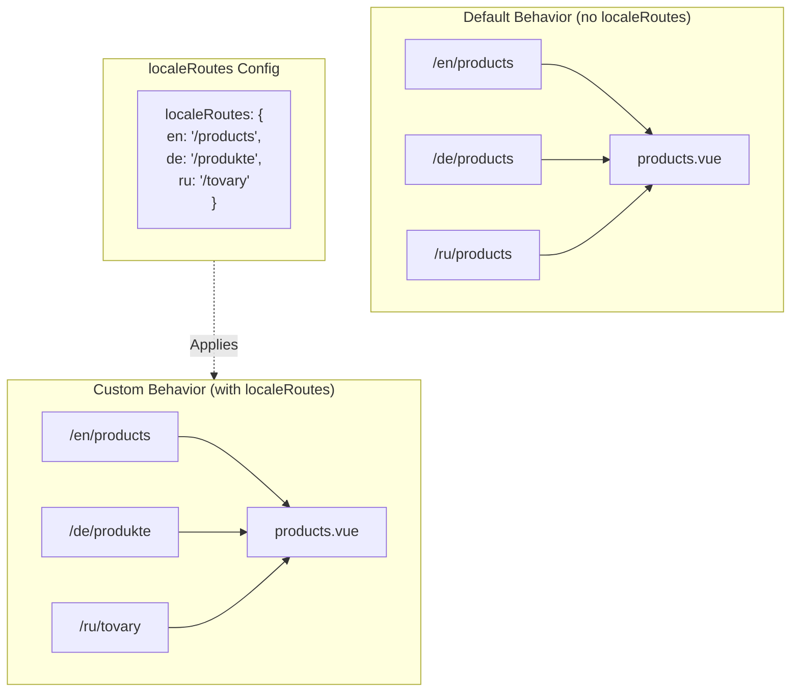

# 🔗 `Nuxt I18n Micro` da `localeRoutes` bilan maxsus lokalizatsiyalangan yo'nalishlar

## 📖 `localeRoutes` ga kirish

`Nuxt I18n Micro` dagi `localeRoutes` xususiyati muayyan locale'lar uchun maxsus yo'nalishlarni aniqlash imkonini beradi, ilovangizning yo'naltirish tuzilishi ustidan moslashuvchanlik va nazoratni taqdim etadi. Ushbu xususiyat ayniqsa ba'zi locale'lar boshqa URL tuzilmalarini, moslashtirilgan yo'llarni yoki muayyan mintaqaviy yoki lingvistik konvensiyalarga rioya qilishni talab qilganda foydalidir.

## 🚀 `localeRoutes` ning asosiy foydalanish holati

`localeRoutes` uchun asosiy foydalanish holati turli locale'lar uchun alohida yo'nalishlarni taqdim etish bo'lib, URL'larning maqsad auditoriyaga intuitiv va tegishli ekanligini ta'minlash orqali foydalanuvchi tajribasini yaxshilaydi. Masalan, sizda sahifaning ingliz va rus versiyalari uchun turli yo'llar bo'lishi mumkin, bunda rus locale lokalizatsiyalangan URL formatiga amal qiladi.

### 📄 Misol: `$defineI18nRoute` da `localeRoutes` ni aniqlash

`$defineI18nRoute` funksiyasida `localeRoutes` yordamida muayyan locale'lar uchun maxsus yo'nalishlarni qanday aniqlashingiz mumkinligining misoli:

```typescript
import { useNuxtApp } from '#imports'

const { $defineI18nRoute } = useNuxtApp()

$defineI18nRoute({
  localeRoutes: {
    ru: '/localesubpage', // Custom route path for the Russian locale
    de: '/lokaleseite', // Custom route path for the German locale
  },
})
```

> [!IMPORTANT]
> `$defineI18nRoute` global funksiya emas. `script setup` da avval uni `useNuxtApp()` dan oling, so'ng chaqiring.

### 🔄 `localeRoutes` qanday ishlaydi



- **Standart xatti-harakat**: `localeRoutes` siz barcha locale'lar asosiy yo'l tomonidan aniqlangan umumiy yo'nalish tuzilmasidan foydalanadi.
- **Maxsus xatti-harakat**: `localeRoutes` bilan muayyan locale'lar o'z yo'nalishlariga ega bo'lishi mumkin, standart yo'lni konfiguratsiyada aniqlangan locale-o'ziga xos yo'nalishlar bilan bekor qiladi.

## 🌱 `localeRoutes` uchun foydalanish holatlari

### 📄 Misol: Sahifada `localeRoutes` dan foydalanish

`$defineI18nRoute` va `localeRoutes` dan foydalanishni namoyish etuvchi oddiy Vue komponenti:

```vue
<template>
  <div>
    <!-- Display greeting message based on the current locale -->
    <p>{{ $t('greeting') }}</p>

    <!-- Navigation links -->
    <div>
      <NuxtLink :to="$localeRoute({ name: 'index' })"> Go to Index </NuxtLink>
      |
      <NuxtLink :to="$localeRoute({ name: 'about' })"> Go to About Page </NuxtLink>
    </div>
  </div>
</template>

<script setup>
import { useNuxtApp } from '#imports'

const { $getLocale, $switchLocale, $getLocales, $localeRoute, $t, $defineI18nRoute } = useNuxtApp()

// Define translations and custom routes for specific locales
$defineI18nRoute({
  localeRoutes: {
    ru: '/localesubpage', // Custom route path for Russian locale
  },
})
</script>
```

### 🛠️ Turli kontekstlarda `localeRoutes` dan foydalanish

- **Landing sahifalar**: Landing sahifalar uchun URL'larni lokalizatsiya qilish uchun maxsus yo'nalishlardan foydalaning, marketing kampaniyalari bilan mos kelishini ta'minlang.
- **Hujjatlar saytlari**: Lokalizatsiyalangan kontent tuzilmasiga yaxshiroq mos kelishi uchun har bir locale uchun alohida yo'nalishlarni taqdim eting.
- **E-tijorat saytlari**: Yaxshilangan SEO va foydalanuvchi tajribasi uchun har bir locale uchun mahsulot yoki kategoriya URL'larini moslashtiring.

## `localeRoutes` bilan navigatsiyadan foydalanish

Lokalizatsiyalangan yo'nalishlar sahifa katalogidagi fayl nomlariga to'g'ridan-to'g'ri mos kelmaganligi sababli, navigatsiyangizni nom emas, obyekt bo'yicha havola qilishingiz kerak.

```vue
<template>
  /**
   * Exemple page: /pages/about-us.vue
   * EN /about-us
   * ES /sobre-nosotros
   * FR /a-propos
   */

  // Using NuxtLink
  <NuxtLink :to="$localeRoute({ name: 'about-us' })">
    Go to About Page
  </NuxtLink>

  // Using I18nLink
  <I18nLink :to="{ name: 'about-us' }">
    Go to About Page
  </NuxtLink>

  // The string literal navigation wouldn't work for any locale but english
  <I18nLink to="/about-us">
    Go to About Page
  </NuxtLink>
</template>
```

### Nested sahifa nomlash

Standart bo'yicha, sahifalaringiz ularning fayl va yo'l nomiga qarab nomlanadi. Bu shuni bildiradi:

- `/pages/about-us.vue` `$localeRoute(\{ name: 'about-us' \})` bilan erishilishi mumkin
- `/pages/about-us/physical-stores.vue` `$localeRoute(\{ name: 'about-us-physical-stores' \})` bilan erishilishi mumkin

Ushbu xatti-harakatni bekor qilish uchun sahifangizni `definePageMeta` bilan aniq nomlang.

```vue
// /pages/about-us/physical-stores.vue
<script setup>
definePageMeta({
  name: 'our-stores'
})
```

Bu sahifa endi `our-stores` nomi bilan `$localeRoute` yoki `I18nLink` orqali havola qilinishi mumkin: `:to='\{ name: "our-stores" \}'`.

## 🎯 Slug'lar va `$setI18nRouteParams` bilan dinamik yo'nalishlar

Slug'lar yoki parametrlarni o'z ichiga olgan dinamik yo'nalishlar bilan ishlaganda, har bir locale uchun locale-o'ziga xos slug'larni taqdim etish uchun dinamik segmentlar va `$setI18nRouteParams` bilan `localeRoutes` dan foydalanishingiz mumkin.

### `localeRoutes` dagi dinamik yo'nalish parametrlari

Nuxt yo'nalish parametr sintaksisini (`[...slug]` catch-all yo'nalishlar uchun, `[param]` yagona parametrlar uchun yoki `:param()` nomli parametrlar uchun) ishlatib dinamik yo'nalishlarni aniqlashingiz mumkin:

```vue
<script setup lang="ts">
import { useNuxtApp, useRoute, useFetch, createError } from '#imports'

const { $defineI18nRoute, $setI18nRouteParams } = useNuxtApp()

// Define custom routes with dynamic segments
$defineI18nRoute({
  localeRoutes: {
    en: '/our-products/[...slug]',
    es: '/nuestros-productos/[...slug]',
  },
})
</script>
```

### Locale-o'ziga xos yo'nalish parametrlarini o'rnatish

`$setI18nRouteParams` funksiyasi har bir locale uchun turli parametr qiymatlarini (slug'lar kabi) o'rnatishga imkon beradi. Bu ayniqsa kontentingiz locale-o'ziga xos URL'larga ega bo'lganda foydalidir.

**Muhim**: `$setI18nRouteParams` odatda `useFetch` yoki `useAsyncData` ichida, locale-o'ziga xos slug'larni o'z ichiga olgan ma'lumotlarni olib kelgandan keyin chaqirilishi kerak.

```vue
<script setup lang="ts">
import { useNuxtApp, useRoute, useFetch, createError } from '#imports'

interface Product {
  title: string
  price: string
  urlEn: string // English slug
  urlEs: string // Spanish slug
}

const { $defineI18nRoute, $setI18nRouteParams } = useNuxtApp()

const route = useRoute()
const slug = Array.isArray(route.params.slug) ? route.params.slug[0] : route.params.slug

// Fetch product data that includes locale-specific slugs
const { data: product, error } = await useFetch<Product>(`/api/product/${slug}`)
if (error.value)
  throw createError({
    statusCode: error.value?.statusCode,
    statusMessage: error.value?.statusMessage,
    fatal: true,
  })

// Define custom routes with dynamic segments
$defineI18nRoute({
  localeRoutes: {
    en: '/our-products/[...slug]',
    es: '/nuestros-productos/[...slug]',
  },
})

// Set different slugs for different locales
if (product.value) {
  $setI18nRouteParams({
    en: { slug: product.value.urlEn },
    es: { slug: product.value.urlEs },
  })
}
</script>
```

### To'liq misol: Locale-o'ziga xos slug'lar bilan mahsulot sahifalari

`localeRoutes` va `$setI18nRouteParams` ni mahsulot tafsilotlari sahifasi uchun birgalikda qanday ishlatishni ko'rsatuvchi to'liq misol:

```vue
<template>
  <div v-if="product">
    <h1>{{ product.title }}</h1>
    <p>{{ $t('price') }}: {{ product.price }}</p>
    <div class="locale-switcher">
      <a :href="$switchLocalePath('en')">English</a>
      <a :href="$switchLocalePath('es')">Español</a>
    </div>
  </div>
</template>

<script setup lang="ts">
import { useNuxtApp, useRoute, useFetch, createError } from '#imports'

interface Product {
  title: string
  price: string
  urlEn: string
  urlEs: string
}

const { $t, $defineI18nRoute, $setI18nRouteParams, $switchLocalePath } = useNuxtApp()

// Set page name for easier navigation
definePageMeta({ name: 'product-slug' })

const route = useRoute()
const slug = Array.isArray(route.params.slug) ? route.params.slug[0] : route.params.slug

// Fetch product data
const { data: product, error } = await useFetch<Product>(`/api/product/${slug}`)
if (error.value)
  throw createError({
    statusCode: error.value?.statusCode,
    statusMessage: error.value?.statusMessage,
    fatal: true,
  })

// Define locale-specific routes with dynamic segments
$defineI18nRoute({
  localeRoutes: {
    en: '/our-products/[...slug]',
    es: '/nuestros-productos/[...slug]',
  },
})

// Set locale-specific slugs so $switchLocalePath works correctly
if (product.value) {
  $setI18nRouteParams({
    en: { slug: product.value.urlEn },
    es: { slug: product.value.urlEs },
  })
}
</script>
```

### Misol: Mahsulot ro'yxati sahifasi

Ro'yxat sahifasidan dinamik yo'nalishlarga havola qilganda, yo'nalish nomini parametrlar bilan ishlating:

```vue
<template>
  <div>
    <h1>{{ $t('title') }}</h1>
    <ul>
      <li v-for="product in products?.[$getLocale()] || []" :key="product.id">
        <I18nLink :to="{ name: 'product-slug', params: { slug: product.url } }"> {{ product.title }} – {{ product.price }} </I18nLink>
      </li>
    </ul>
  </div>
</template>

<script setup lang="ts">
import { useNuxtApp, useFetch, createError } from '#imports'

interface Product {
  id: string
  title: string
  price: string
  url: string
}

type ProductsByLocale = Record<string, Product[]>

const { $t, $defineI18nRoute, $getLocale } = useNuxtApp()

const { data: products, error } = await useFetch<ProductsByLocale>('/api/product')
if (error.value)
  throw createError({
    statusCode: error.value?.statusCode,
    statusMessage: error.value?.statusMessage,
    fatal: true,
  })

$defineI18nRoute({
  locales: {
    en: {
      title: 'Our Product Range',
      description: 'Discover our collection of high-quality products.',
    },
    es: {
      title: 'Nuestra Gama de Productos',
      description: 'Descubra nuestra colección de productos de alta calidad.',
    },
  },
  localeRoutes: {
    en: '/our-products',
    es: '/nuestros-productos',
  },
})
</script>
```

### Qanday ishlaydi

1. **Yo'nalish ta'rifi**: `localeRoutes` har bir locale uchun asosiy yo'l tuzilmasini aniqlaydi, jumladan `[...slug]` yoki `[id]` kabi dinamik segmentlar.

2. **Parametrni o'rnatish**: `$setI18nRouteParams` har bir locale uchun haqiqiy parametr qiymatlarini o'rnatadi. Foydalanuvchi `$switchLocalePath` yordamida locale'ni almashtirganda, modul to'g'ri URL'ni qurish uchun bu parametrlardan foydalanadi.

3. **Parametr formati**: Parametr obyekti tuzilishga mos kelishi kerak:

   ```typescript
   {
     [localeCode]: {
       [paramName]: paramValue
     }
   }
   ```

4. **Navigatsiya**: Dinamik yo'nalishlarning lokalizatsiyalangan versiyalari o'rtasida navigatsiya qilish uchun yo'nalish nomi va parametrlar bilan `I18nLink` yoki `$localeRoute` dan foydalaning.

### Muhim eslatmalar

- **Vaqt**: `$setI18nRouteParams` odatda `useFetch` yoki `useAsyncData` ichida, locale-o'ziga xos slug'larni o'z ichiga olgan ma'lumotlarni olib kelgandan keyin chaqirilishi kerak.

- **Parametr nomlari**: `$setI18nRouteParams` dagi parametr nomlari yo'nalish parametr nomlariga mos kelishi kerak (masalan, `[...slug]` uchun `slug` yoki `[id]` uchun `id`).

- **Yo'nalish nomlari**: `definePageMeta(\{ name: 'route-name' \})` dan foydalanganda, `I18nLink` yoki `$localeRoute` bilan yo'nalishga havola qilishda bu nomni ishlating.

- **Catch-all yo'nalishlar**: Catch-all yo'nalishlar uchun (`[...slug]`), slug parametri massiv yoki massivga aylantiriladigan satr bo'lishi kerak.

## 🧩 Dasturiy yo'nalishlar (`pages:extend`) — #244

`pages:extend` da yaratilgan yo'nalishlarda `defineI18nRoute()` uchun joy yo'q, va bir nechta yo'nalishlar ko'pincha bitta wrapper SFC ni bo'lishadi. Fayl-kalitli skanerlash keyin ularni bitta yozuvga birlashtiradi.

Lokalizatsiyalangan yo'llarni `route.meta` ga qo'ymang (ular client yo'nalish jadvaliga jo'natiladi). Bitta reyestrni saqlang va uni ikki marta proyektsiyalang:

1. `pages:extend` ga (Nuxt yo'nalishlarini yaratadi)
2. yo'nalish **nomi** (fayl yo'li emas) bo'yicha kalitlangan `i18n.globalLocaleRoutes` ga

`@i18n-micro/utils/split-locale-routes` dan `splitLocaleRoutes` ni ishlating:

```typescript
import { splitLocaleRoutes } from '@i18n-micro/utils/split-locale-routes'

const dynamic = splitLocaleRoutes([
  {
    name: 'products_tag',
    path: '/products/:tag',
    file: '~/pages/_dynamic.vue',
    paths: { fr: '/produits/:tag', de: '/produkte/:tag' },
  },
  {
    name: 'products_category',
    path: '/products/category/:category',
    file: '~/pages/_dynamic.vue',
    paths: { fr: '/produits/categorie/:category' },
  },
  // Disable localization for a programmatic route:
  // { name: 'internal', path: '/internal', file: '~/pages/_dynamic.vue', paths: false },
])

export default defineNuxtConfig({
  hooks: {
    'pages:extend'(pages) {
      pages.push(...dynamic.pages)
    },
  },
  i18n: {
    globalLocaleRoutes: dynamic.globalLocaleRoutes,
  },
})
```

Ikkala qism sinxron qoladi; umumiy wrapper'lar endi bir-birini qoplamaydi. `globalLocaleRoutes` yolg'iz o'zi yetarli emas — u faqat Nuxt sahifa jadvalida allaqachon mavjud bo'lgan yo'nalishlar uchun yo'llarni sozlaydi.

## 📝 `localeRoutes` dan foydalanish uchun eng yaxshi amaliyotlar

- **🚀 Tegishli locale'lar uchun ishlating**: `localeRoutes` ni asosan URL tuzilmasi foydalanuvchi tajribasi yoki SEO'ga sezilarli ta'sir qiladigan joyda qo'llang. Kichik farqlar uchun ortiqcha ishlatishdan qoching.
- **🔧 Izchillikni saqlang**: Chetlanish uchun kuchli sabab bo'lmasa, locale'lar bo'ylab izchil yo'naltirish naqshini saqlang. Bu yondashuv ravshanlikni saqlashga va murakkablikni kamaytirishga yordam beradi.
- **📚 Maxsus yo'nalishlarni hujjatlashtiring**: `localeRoutes` bilan aniqlagan har qanday maxsus yo'nalishlarni aniq hujjatlashtiring, ayniqsa modulli ilovalarda, jamoa a'zolari yo'naltirish mantig'ini tushunishini ta'minlash uchun.
