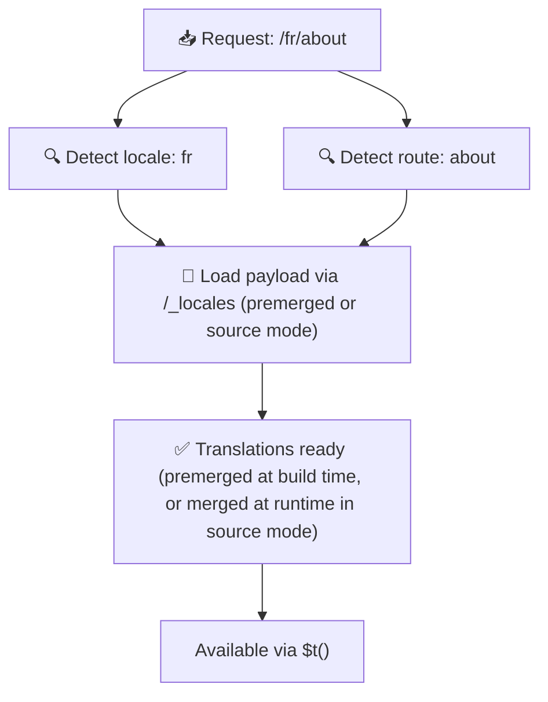

# 📂 Papka tuzilishi qo'llanmasi

## 📖 Kirish

Tarjima fayllaringizni samarali tashkil qilish kengaytiriladigan va samarali xalqarolashtirish (i18n) tizimini saqlash uchun juda muhim. `Nuxt I18n Micro` root darajasidagi va sahifaga tegishli tarjimalarni boshqarish uchun aniq yondashuvni taklif qilib, ushbu jarayonni soddalashtiradi. Ushbu qo'llanma tavsiya qilingan papka tuzilishi bo'yicha sizga yo'l ko'rsatadi va `Nuxt I18n Micro` bu tarjimalarni qanday boshqarishini tushuntiradi.

## 🗂️ Tavsiya qilinadigan papka tuzilishi

`Nuxt I18n Micro` tarjimalarni root darajasidagi fayllar va `pages` katalogi ichidagi sahifaga tegishli fayllarga tashkil qiladi. `translationPayloads.mode: 'premerged'` (standart) bilan root darajasidagi tarjimalar build vaqtida har bir sahifa fayliga avtomatik birlashtiriladi, shuning uchun har bir sahifa runtime birlashtirish yukisiz to'liq tarjima to'plamiga ega bo'ladi.

`mode: 'source'` bilan manba fayllar Nitro aktivlarida alohida saqlanadi va runtime'da `/_locales` yo'nalishi orqali birlashtiriladi. [Serverless Payload chiqishi](/guides/performance#serverless-payload-output) bo'limiga qarang.

### 🔧 Asosiy tuzilma

Amal qilishingiz kerak bo'lgan papka tuzilishining asosiy misoli:

```text
locales/
├── pages/
│   ├── index/
│   │   ├── en.json
│   │   ├── fr.json
│   │   └── ar.json
│   ├── about/
│   │   ├── en.json
│   │   ├── fr.json
│   │   └── ar.json
├── en.json
├── fr.json
└── ar.json

```

### 📄 Tuzilma tushuntirishi

#### 1. 🌍 Root darajasidagi tarjima fayllari

- **Yo'l:** `/locales/\{locale\}.json` (masalan, `/locales/en.json`)
- **Maqsad:** Bu fayllar butun ilova bo'ylab umumiy tarjimalarni o'z ichiga oladi (navigatsiya menyulari, sarlavhalar, footer va h.k.). `mode: 'premerged'` (standart) bilan ular build vaqtida har bir sahifaga tegishli faylga avtomatik birlashtiriladi, shuning uchun server har bir sahifa uchun bitta oldindan tayyorlangan faylni qaytaradi.

  **Kontent namunasi (`/locales/en.json`):**

  ```json
  {
    "menu": {
      "home": "Home",
      "about": "About Us",
      "contact": "Contact"
    },
    "footer": {
      "copyright": "© 2024 Your Company"
    }
  }
  ```

#### 2. 📄 Sahifaga tegishli tarjima fayllari

- **Yo'l:** `/locales/pages/\{routeName\}/\{locale\}.json` (masalan, `/locales/pages/index/en.json`)
- **Maqsad:** Bu fayllar alohida sahifalarga xos tarjimalarni o'z ichiga oladi. `mode: 'premerged'` (standart) bilan root darajasidagi tarjimalar build vaqtida asos sifatida birlashtiriladi, shuning uchun har bir sahifa fayli o'zi-o'ziga yetarli bo'ladi.

  **Kontent namunasi (`/locales/pages/index/en.json`):**

  ```json
  {
    "title": "Welcome to Our Website",
    "description": "We offer a wide range of products and services to meet your needs."
  }
  ```

  **Kontent namunasi (`/locales/pages/about/en.json`):**

  ```json
  {
    "title": "About Us",
    "description": "Learn more about our mission, vision, and values."
  }
  ```

### 📂 Dinamik yo'nalishlar va nested yo'llarni boshqarish

`Nuxt I18n Micro` yo'nalishlardagi dinamik segmentlar va nested yo'llarni maxsus qayta nomlash konvensiyasidan foydalanib tekis papka tuzilishiga avtomatik o'zgartiradi. Bu barcha tarjimalarning izchil va oson kirish mumkin bo'lgan tarzda saqlanishini ta'minlaydi.

#### Dinamik yo'nalish tarjima papka tuzilishi

`/products/[id]` kabi dinamik yo'nalishlar bilan ishlashda modul dinamik segment `[id]` ni fayl tuzilishida statik formatga aylantiradi.

**Dinamik yo'nalishlar uchun papka tuzilishi namunasi:**

`/products/[id]` kabi yo'nalish uchun tarjima fayllari `products-id` nomli papkada saqlanadi:

```text
locales/pages/
├── products-id/
│   ├── en.json
│   ├── fr.json
│   └── ar.json

```

**Nested dinamik yo'nalishlar uchun papka tuzilishi namunasi:**

`/products/key/[id]` kabi nested yo'nalish uchun tarjima fayllari `products-key-id` nomli papkada saqlanadi:

```text
locales/pages/
├── products-key-id/
│   ├── en.json
│   ├── fr.json
│   └── ar.json

```

**Ko'p darajali nested yo'nalishlar uchun papka tuzilishi namunasi:**

`/products/category/[id]/details` kabi murakkabroq nested yo'nalish uchun tarjima fayllari `products-category-id-details` nomli papkada saqlanadi:

```text
locales/pages/
├── products-category-id-details/
│   ├── en.json
│   ├── fr.json
│   └── ar.json

```

### 🛠 Katalog tuzilishini sozlash

Agar tarjimalarni boshqa katalogda saqlashni afzal ko'rsangiz, `Nuxt I18n Micro` tarjima fayllari saqlanadigan katalogni sozlash imkonini beradi. Buni `nuxt.config.ts` faylida sozlashingiz mumkin.

**Misol: Tarjima katalogini sozlash**

```typescript
export default defineNuxtConfig({
  i18n: {
    translationDir: 'i18n', // Custom directory path
  },
})
```

Bu `Nuxt I18n Micro` ga tarjima fayllarini standart `/locales` katalogi o'rniga `/i18n` katalogida izlashini buyuradi.

## ⚙️ Tarjimalar qanday yuklanadi

### 🌍 Dinamik locale yo'nalishlari

`Nuxt I18n Micro` tarjimalarni samarali yuklash uchun dinamik locale yo'nalishlaridan foydalanadi. Foydalanuvchi sahifaga tashrif buyurganda, modul mos locale'ni aniqlaydi va joriy yo'nalish hamda locale asosida tegishli tarjima fayllarini yuklaydi.



Masalan:

- `/en/index` ga tashrif buyurish `/locales/pages/index/en.json` dan tarjimalarni yuklaydi.
- `/fr/about` ga tashrif buyurish `/locales/pages/about/fr.json` dan tarjimalarni yuklaydi.

Bu usul faqat zarur tarjimalarning yuklanishini ta'minlaydi va server yuki hamda mijoz tomonidagi ishlashni optimallashtiradi.

### 💾 Kesh va oldindan render qilish

Ishlashni yanada oshirish uchun `Nuxt I18n Micro` tarjima fayllarini keshlash va oldindan render qilishni qo'llab-quvvatlaydi:

- **Keshlash**: Tarjima fayli bir marta yuklangandan so'ng, u keyingi so'rovlar uchun keshlanadi va bir xil ma'lumotlarni qayta-qayta olib kelishga bo'lgan ehtiyojni kamaytiradi.
- **Oldindan render qilish**: Build jarayoni davomida barcha sozlangan locale'lar va yo'nalishlar uchun tarjima fayllarini oldindan render qilishingiz mumkin, bu esa ularni runtime kechikishlarsiz to'g'ridan-to'g'ri serverdan taqdim etishga imkon beradi.

## 📝 Eng yaxshi amaliyotlar

### 📂 Sahifaga tegishli fayllardan oqilona foydalaning

Tarjimalarni tartibli saqlash uchun sahifaga tegishli fayllardan foydalaning. Bu har bir sahifaning tarjimalarini yengil va tez yuklanadigan qiladi, bu esa ayniqsa murakkab yoki katta kontentli sahifalar uchun muhim.

### 🔑 Tarjima kalitlarini izchil tuting

Fayllar bo'ylab tarjima kalitlaringiz uchun izchil nomlash konvensiyalaridan foydalaning. Bu ravshanlikni saqlashga yordam beradi va ilovangiz o'sib borayotgan sari tarjimalarni boshqarishda muammolarning oldini oladi.

### 🗂️ Tarjimalarni kontekst bo'yicha tashkil qiling

Fayllaringiz ichida bog'liq tarjimalarni birga guruhlashtiring. Masalan, barcha tugma yorliqlarini `buttons` kaliti ostiga va barcha formaga oid matnlarni `forms` kaliti ostiga guruhlang. Bu nafaqat o'qish qulayligini yaxshilaydi, balki turli locale'lar bo'yicha tarjimalarni boshqarishni ham osonlashtiradi.

### ⚠️ Nesting chuqurligi cheklovi (2 daraja tavsiya etiladi)

Client tomonidagi navigatsiya davomida `Nuxt I18n Micro` chiqib ketayotgan va kirayotgan sahifalardan tarjimalarni birlashtirish uchun optimallashtirilgan 2-daraja chuqurlikdagi merge'dan foydalanadi. Bu bir-birini qoplaydigan nested kalitlar (masalan, ikkala sahifada ham `common.*` ostidagi kalitlar) tranzitsiya animatsiyalari davomida saqlanishini ta'minlaydi.

**Bu standart `Section → Key → Value` tuzilmasi (2 daraja) uchun to'g'ri ishlaydi:**

```json
// Page A translations
{ "common": { "fromA": "Text A" } }

// Page B translations
{ "common": { "fromB": "Text B" } }

// During transition, both are available:
// { "common": { "fromA": "Text A", "fromB": "Text B" } }
```

**Ammo agar siz 3+ darajali nesting'dan foydalansangiz, chuqurroq kalitlar tranzitsiyalar davomida qayta yozib yuborilishi mumkin:**

```json
// Page A translations
{ "auth": { "form": { "login": "Login" } } }

// Page B translations
{ "auth": { "form": { "register": "Register" } } }

// During transition: "login" key is lost
// { "auth": { "form": { "register": "Register" } } }
```

<Tip>

</Tip>

### 🧹 Foydalanilmagan tarjimalarni muntazam tozalang

Vaqt o'tishi bilan ilovangiz foydalanilmagan tarjima kalitlarini to'plashi mumkin, ayniqsa xususiyatlar olib tashlangan yoki qayta tuzilgan bo'lsa. Tarjima fayllaringizni yengil va boshqarish oson holatda saqlash uchun ularni vaqti-vaqti bilan ko'rib chiqing va tozalang.
