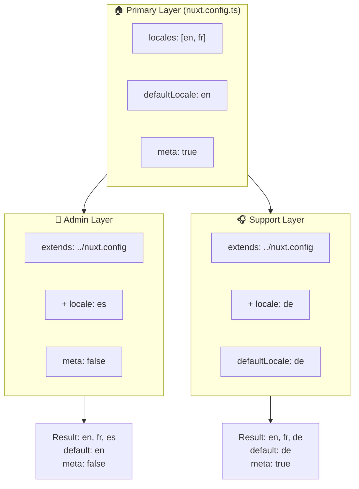

# 🗂️ `Nuxt I18n Micro` da qatlamlar

## 📖 Qatlamlarga kirish

`Nuxt I18n Micro` dagi qatlamlar sizga ilovangizning turli qismlarida lokalizatsiya sozlamalarini moslashuvchan tarzda boshqarish va sozlash imkonini beradi. Turli qatlamlarni aniqlash orqali siz turli kontekstlar uchun konfiguratsiyani sozlashingiz mumkin, masalan, saytning muayyan bo'limlari uchun sozlamalarni bekor qilish yoki ilovangizning boshqa qismlari tomonidan kengaytirilishi mumkin bo'lgan qayta ishlatiladigan asosiy konfiguratsiyalarni yaratish.

### Qatlam vorislik oqimi



## 🛠️ Asosiy konfiguratsiya qatlami

**Asosiy konfiguratsiya qatlami** — bu butun ilovangiz uchun standart lokalizatsiya sozlamalarini o'rnatadigan joy. Bu qatlam muhim, chunki u qo'llab-quvvatlanadigan locale'lar, standart til va boshqa muhim i18n sozlamalarini o'z ichiga olgan global konfiguratsiyani belgilaydi.

### 📄 Misol: Asosiy konfiguratsiya qatlamini aniqlash

`nuxt.config.ts` faylida asosiy konfiguratsiya qatlamini qanday aniqlashingiz mumkinligi:

```typescript
export default defineNuxtConfig({
  i18n: {
    locales: [
      { code: 'en', iso: 'en-EN', dir: 'ltr' },
      { code: 'fr', iso: 'fr-FR', dir: 'ltr' },
      { code: 'ar', iso: 'ar-SA', dir: 'rtl' },
    ],
    defaultLocale: 'en', // The default locale for the entire app
    translationDir: 'locales', // Directory where translations are stored
    meta: true, // Automatically generate SEO-related meta tags like `alternate`
    autoDetectLanguage: true, // Automatically detect and use the user's preferred language
  },
})
```

## 🌱 Bola qatlamlar

Bola qatlamlar ilovangizning muayyan qismlari uchun asosiy konfiguratsiyani kengaytirish yoki bekor qilish uchun ishlatiladi. Masalan, muayyan bo'limga qo'shimcha locale'lar qo'shishni yoki standart locale'ni o'zgartirishni xohlashingiz mumkin. Bola qatlamlar ayniqsa turli qismlar turli lokalizatsiya talablariga ega bo'lishi mumkin bo'lgan modul ilovalarda foydalidir.

### 📄 Misol: Bola qatlamda asosiy qatlamni kengaytirish

Faraz qilaylik, saytingizning bir qismi qo'shimcha locale'larni qo'llab-quvvatlashi kerak yoki muayyan kontekstda muayyan locale'ni o'chirishni xohlaysiz. Asosiy konfiguratsiya qatlamini kengaytirish orqali buni qanday qilib amalga oshirishingiz mumkin:

```typescript
// basic/nuxt.config.ts (Primary Layer)
export default defineNuxtConfig({
  i18n: {
    locales: [
      { code: 'en', iso: 'en-EN', dir: 'ltr' },
      { code: 'fr', iso: 'fr-FR', dir: 'ltr' },
    ],
    defaultLocale: 'en',
    meta: true,
    translationDir: 'locales',
  },
})
```

```typescript
// extended/nuxt.config.ts (Child Layer)
export default defineNuxtConfig({
  extends: '../basic', // Inherit the base configuration from the 'basic' layer
  i18n: {
    locales: [
      { code: 'en', iso: 'en-EN', dir: 'ltr' }, // Inherited from the base layer
      { code: 'fr', iso: 'fr-FR', dir: 'ltr' }, // Inherited from the base layer
      { code: 'de', iso: 'de-DE', dir: 'ltr' }, // Added in the child layer
    ],
    defaultLocale: 'fr', // Override the default locale to French for this section
    autoDetectLanguage: false, // Disable automatic language detection in this section
  },
})
```

### 🌐 Modul ilovada qatlamlardan foydalanish

Kattaroq, modul Nuxt ilovada bir nechta bo'limlar bo'lishi mumkin, ularning har biri o'z i18n sozlamalarini talab qiladi. Qatlamlardan foydalanib, siz toza va kengaytiriladigan konfiguratsiya tuzilishini saqlashingiz mumkin.

### 📄 Misol: Modul ilovada qatlamlashtirilgan konfiguratsiya

Faraz qilaylik, sizda asosiy veb-sayt, admin paneli va mijozlar qo'llab-quvvatlash portali kabi alohida bo'limlarga ega e-tijorat sayti bor. Har bir bo'limga turli locale to'plami yoki boshqa i18n sozlamalari kerak bo'lishi mumkin.

#### **Asosiy qatlam (Global konfiguratsiya):**

```typescript
// nuxt.config.ts
export default defineNuxtConfig({
  i18n: {
    locales: [
      { code: 'en', iso: 'en-EN', dir: 'ltr' },
      { code: 'fr', iso: 'fr-FR', dir: 'ltr' },
    ],
    defaultLocale: 'en',
    meta: true,
    translationDir: 'locales',
    autoDetectLanguage: true,
  },
})
```

#### **Admin paneli uchun bola qatlam:**

```typescript
// admin/nuxt.config.ts
export default defineNuxtConfig({
  extends: '../nuxt.config', // Inherit the global settings
  i18n: {
    locales: [
      { code: 'en', iso: 'en-EN', dir: 'ltr' }, // Inherited
      { code: 'fr', iso: 'fr-FR', dir: 'ltr' }, // Inherited
      { code: 'es', iso: 'es-ES', dir: 'ltr' }, // Specific to the admin panel
    ],
    defaultLocale: 'en',
    meta: false, // Disable automatic meta generation in the admin panel
  },
})
```

#### **Mijozlar qo'llab-quvvatlash portali uchun bola qatlam:**

```typescript
// support/nuxt.config.ts
export default defineNuxtConfig({
  extends: '../nuxt.config', // Inherit the global settings
  i18n: {
    locales: [
      { code: 'en', iso: 'en-EN', dir: 'ltr' }, // Inherited
      { code: 'fr', iso: 'fr-FR', dir: 'ltr' }, // Inherited
      { code: 'de', iso: 'de-DE', dir: 'ltr' }, // Specific to the support portal
    ],
    defaultLocale: 'de', // Default to German in the support portal
    autoDetectLanguage: false, // Disable automatic language detection
  },
})
```

Ushbu modul misolda:

- Har bir bo'lim (admin, support) o'z i18n sozlamalariga ega, lekin barchasi asosiy konfiguratsiyani meros qilib oladi.
- Admin paneli locale sifatida ispancha (`es`) ni qo'shadi va meta-teg generatsiyasini o'chiradi.
- Support portali locale sifatida nemischa (`de`) ni qo'shadi va foydalanuvchi interfeysi uchun nemischani standart qiladi.

## 📝 Qatlamlardan foydalanishda eng yaxshi amaliyotlar

- **🔧 Asosiy qatlamni sodda qiling:** Asosiy qatlam ilovangiz bo'ylab globallar tarzda qo'llaniladigan eng ko'p ishlatiladigan sozlamalarni o'z ichiga olishi kerak. Izchillikni ta'minlash uchun uni oddiy tuting.
- **⚙️ Muayyan sozlamalar uchun bola qatlamlardan foydalaning:** Sozlamalarni bola qatlamlarda faqat zarur bo'lganda bekor qiling yoki kengaytiring. Bu yondashuv konfiguratsiyangizda ortiqcha murakkablikdan qochadi.
- **📚 Qatlamlaringizni hujjatlashtiring:** Loyihangizdagi har bir qatlamning maqsadi va xususiyatlarini aniq hujjatlashtiring. Bu ravshanlikni saqlashga yordam beradi va boshqalarga (yoki kelajakdagi sizga) konfiguratsiyani tushunishni osonlashtiradi.
