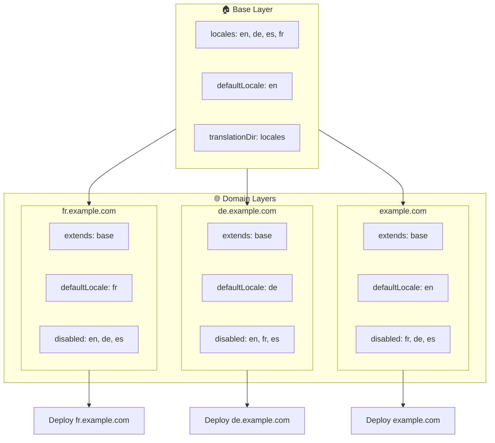

# 🌍 Qatlamlar yordamida `Nuxt I18n Micro` bilan ko'p-domenli locale'larni sozlash

## 📝 Kirish

`Nuxt I18n Micro` dagi qatlamlardan foydalanib, siz moslashuvchan va texnik xizmat qilinadigan ko'p-domenli lokalizatsiya sozlamalarini yaratishingiz mumkin. Ushbu yondashuv nafaqat murakkab funksiyalarga bo'lgan ehtiyojni yo'q qilib, domen boshqaruvini soddalashtiradi, balki yukning samarali taqsimlanishi va loyiha murakkabligini kamaytirish imkonini beradi. Turli locale'lar uchun alohida loyihalar ishga tushirilganda, ilovangiz oson kengaytirilishi va bir nechta domenlar bo'yicha turli locale talablariga moslashishi mumkin, bu global ilovalar uchun mustahkam va kengaytiriladigan yechim taklif qiladi.

## 🎯 Maqsad

Bola qatlamlarda konfiguratsiyani moslashtirish orqali turli domenlar muayyan locale'larga xizmat qiladigan sozlamalarni yaratish. Bu usul Nuxt'ning qatlamlash tizimidan foydalanadi va sizga har bir domen uchun asosiy konfiguratsiyani saqlab qolgan holda uni kengaytirish yoki o'zgartirish imkonini beradi.

### Ko'p-domenli arxitektura



## 🛠 Ko'p-domenli locale'larni amalga oshirish qadamlari

### 1. **Asosiy qatlamni yaratish**

Ilovangiz uchun barcha umumiy locale sozlamalarini o'z ichiga oladigan asosiy konfiguratsiya qatlamini yaratishdan boshlang. Ushbu konfiguratsiya boshqa domenga xos konfiguratsiyalar uchun asos bo'lib xizmat qiladi.

#### **Asosiy qatlam konfiguratsiyasi**

`base/nuxt.config.ts` asosiy konfiguratsiya faylini yarating:

```typescript
// base/nuxt.config.ts

export default defineNuxtConfig({
  i18n: {
    locales: [
      { code: 'en', iso: 'en-US', dir: 'ltr' },
      { code: 'de', iso: 'de-DE', dir: 'ltr' },
      { code: 'es', iso: 'es-ES', dir: 'ltr' },
    ],
    defaultLocale: 'en',
    translationDir: 'locales',
    meta: true,
    autoDetectLanguage: true,
  },
})
```

### 2. **Domenga xos bola qatlamlar yaratish**

Har bir domen uchun asosiy konfiguratsiyani o'sha domenning muayyan talablariga moslashtiradigan bola qatlamni yarating. Muayyan domen uchun kerak bo'lmagan locale'larni o'chirishingiz mumkin.

#### **Misol: Fransuz domeni uchun konfiguratsiya**

`fr/nuxt.config.ts` da fransuz domeni uchun bola qatlam konfiguratsiyasini yarating:

```typescript
// fr/nuxt.config.ts

export default defineNuxtConfig({
  extends: '../base', // Inherit from the base configuration

  i18n: {
    locales: [
      { code: 'en', iso: 'en-US', dir: 'ltr', disabled: true }, // Disable English
      { code: 'fr', iso: 'fr-FR', dir: 'ltr' }, // Add and enable the French locale
      { code: 'de', iso: 'de-DE', dir: 'ltr', disabled: true }, // Disable German
      { code: 'es', iso: 'es-ES', dir: 'ltr', disabled: true }, // Disable Spanish
    ],
    defaultLocale: 'fr', // Set French as the default locale
    autoDetectLanguage: false, // Disable automatic language detection
  },
})
```

#### **Misol: Nemis domeni uchun konfiguratsiya**

Xuddi shunday, `de/nuxt.config.ts` da nemis domeni uchun bola qatlam konfiguratsiyasini yarating:

```typescript
// de/nuxt.config.ts

export default defineNuxtConfig({
  extends: '../base', // Inherit from the base configuration

  i18n: {
    locales: [
      { code: 'en', iso: 'en-US', dir: 'ltr', disabled: true }, // Disable English
      { code: 'fr', iso: 'fr-FR', dir: 'ltr', disabled: true }, // Disable French
      { code: 'de', iso: 'de-DE', dir: 'ltr' }, // Use the German locale
      { code: 'es', iso: 'es-ES', dir: 'ltr', disabled: true }, // Disable Spanish
    ],
    defaultLocale: 'de', // Set German as the default locale
    autoDetectLanguage: false, // Disable automatic language detection
  },
})
```

### 3. **Har bir domen uchun ilovani deploy qilish**

Har bir domen uchun mos konfiguratsiya bilan ilovani deploy qiling. Masalan:

- `fr` qatlam konfiguratsiyasini `fr.example.com` ga deploy qiling.
- `de` qatlam konfiguratsiyasini `de.example.com` ga deploy qiling.

### 4. **Turli locale'lar uchun bir nechta loyihalarni sozlash**

Har bir locale va domen uchun ilovaning alohida instance'ini ishga tushirishingiz kerak bo'ladi. Bu har bir domenning to'g'ri locale konfiguratsiyasini taqdim etishini ta'minlaydi, yuk taqsimotini optimallashtiradi va loyiha tuzilishini soddalashtiradi. Har bir locale'ga moslashtirilgan bir nechta loyihalarni ishga tushirish orqali konfiguratsiyalar o'rtasida toza ajratishni saqlashingiz va umumiy sozlashning murakkabligini kamaytirishingiz mumkin.

### 5. **Domenga qarab yo'naltirishni sozlash**

Yo'naltirishingiz foydalanuvchilarni ular kirayotgan domenga qarab to'g'ri loyihaga yo'naltirish uchun sozlanganligiga ishonch hosil qiling. Bu har bir domenning tegishli locale'ga xizmat qilishini ta'minlaydi, foydalanuvchi tajribasini yaxshilaydi va turli mintaqalar bo'yicha izchillikni saqlaydi.

### 6. **Deploy qilish va tekshirish**

Qatlamlarni sozlab, ularni tegishli domenlarga deploy qilgandan so'ng, har bir domenning to'g'ri locale'ga xizmat qilayotganiga ishonch hosil qiling. Domenga qarab to'g'ri locale yuklanayotganini tasdiqlash uchun ilovani sinchkovlik bilan test qiling.

## 📝 Eng yaxshi amaliyotlar

- **Asosiy konfiguratsiyani umumiy tuting**: Asosiy konfiguratsiya barcha domenlarga tegishli umumiy sozlamalarni qamrab olishi kerak.
- **Domenga xos mantiqni ajratib qo'ying**: Ravshanlik va vazifalar ajratimini saqlash uchun domenga xos konfiguratsiyalarni ularning tegishli qatlamlarida saqlang.

## 🎉 Xulosa

`Nuxt I18n Micro` dagi qatlamlardan foydalanib, siz moslashuvchan va texnik xizmat qilinadigan ko'p-domenli lokalizatsiya sozlashini yaratishingiz mumkin. Ushbu yondashuv nafaqat murakkab domen boshqaruvi funksiyalariga bo'lgan ehtiyojni yo'q qiladi, balki yukni samarali taqsimlash va loyiha murakkabligini kamaytirish imkonini ham beradi. Turli locale'lar uchun alohida loyihalarni ishga tushirish ilovangizning oson kengaytirilishi va turli domenlar bo'yicha turli locale talablariga moslashishini ta'minlaydi, global ilovalar uchun mustahkam va kengaytiriladigan yechimni taqdim etadi.
