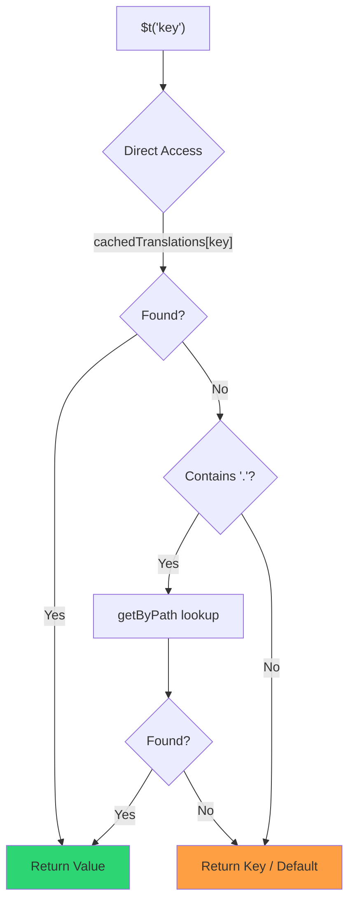

# 🚀 Ishlash qo'llanmasi

## 📖 Kirish

`Nuxt I18n Micro` ishlashni hisobga olgan holda ishlab chiqilgan bo'lib, `nuxt-i18n` kabi an'anaviy xalqarolashtirish (i18n) modullariga nisbatan sezilarli yaxshilanish taklif qiladi. Ushbu qo'llanma `Nuxt I18n Micro` dan foydalanishning ishlash bo'yicha afzalliklarini va uning boshqa yechimlar bilan solishtirishni chuqur ko'rib chiqadi.

## 🤔 Nima uchun ishlashga e'tibor qaratish kerak?

Katta miqyosdagi loyihalar va yuqori trafikli muhitlarda ishlash bo'yicha to'siqlar sekin build vaqtlari, ortiqcha xotira sarfi va zaif server javob vaqtlariga olib kelishi mumkin. Bu muammolar katta tarjima fayllarni o'z ichiga olgan murakkab i18n sozlamalarida yanada aniqroq bo'ladi. `Nuxt I18n Micro` tezlik, xotira samaradorligi va ilovangiz bundle hajmiga minimal ta'sir uchun optimallashtirish orqali ushbu muammolarni bevosita hal qilish uchun yaratilgan.

## 📊 Ishlash solishtirishi

Biz `pnpm test:performance` (`pnpm -C scripts cli performance`) orqali **`@nuxtjs/i18n@10.6.0`** ga qarshi bir xil fixture'larda testlar seriyasini o'tkazdik. To'liq metodologiya va grafiklar: [Ishlash test natijalari](/guides/performance-results).

Standart CLI profili: **4 locale** × **2 sahifa** (`index`, `page`) × ~10k index leaf kalitlar. Og'irroq regressiya-radar yuki uchun `--locales` / `--keys` ni oshiring. Hisobot **kod**, **tarjimalar** (jumladan `@nuxtjs/i18n` `chunks/raw/*`) va **jami** deploy qilinadigan chiqishni bo'lib beradi.

```bash
pnpm test:performance
pnpm -C scripts cli performance --only micro --skip-stress
pnpm -C scripts cli performance --locales 12 --keys 100000 --runs 3
```

### ⏱️ Build vaqti va resurs sarfi

<Accordion title="**@nuxtjs/i18n v10.6**">
- **Kod bundle**: 2.16 MB
- **Tarjimalar**: 7.21 MB (xabar chunk'lari + locale payload'lari)
- **Jami deploy qilinadigan**: 9.37 MB
- **Maksimal xotira sarfi**: 1,821 MB
- **O'tgan vaqt**: 8.34s (3 taning o'rtachasi)
</Accordion>

<Tip>
- **Kod bundle**: 1.74 MB — **`@nuxtjs/i18n` v10.6 ga qaraganda ~19% kichikroq kod**
- **Tarjimalar**: 6.8 MB (lazy-load qilingan JSON)
- **Jami deploy qilinadigan**: 8.54 MB
- **Maksimal xotira sarfi**: 1,065 MB — **`@nuxtjs/i18n` v10.6 ga qaraganda ~41% kamroq xotira**
- **O'tgan vaqt**: 5.34s — **`@nuxtjs/i18n` v10.6 ga qaraganda ~36% tezroq** (≈ plain-nuxt baseline)
</Tip>

> `@nuxtjs/i18n` "kod ≈ 15 MB / tarjimalar 0 B" ni ko'rsatgan eski hujjatlar `chunks/raw` xabar fayllarini ilova kodi sifatida hisoblagan. Joriy klassifikator ularni ajratadi; **kod** bo'yicha bo'shliq kichikroq va micro build vaqti, peak RSS va yuk testlari bo'yicha oldinda qolmoqda.

Grafiklar, Autocannon natijalari va fixture tafsilotlari uchun [to'liq benchmark hisobotini](/guides/performance-results) ko'ring.

### 🌐 Yuk ostidagi server ishlashi

Artillery (6s@6 + 60s@60) va Autocannon (10c / 10s), har bir fixture uchun 3 ta ketma-ket ishga tushirishning o'rtachasi.

<Accordion title="**@nuxtjs/i18n v10.6**">
- **Sekundiga so'rovlar (Artillery)**: 143 [#/sec]
- **O'rtacha javob vaqti**: 956 ms
- **Autocannon RPS / o'rtacha kechikish**: 72 / 139 ms
</Accordion>

<Tip>
- **Sekundiga so'rovlar (Artillery)**: 275 [#/sec] — **`@nuxtjs/i18n` v10.6 ga qaraganda ~93% ko'proq**
- **O'rtacha javob vaqti**: 483 ms — **`@nuxtjs/i18n` v10.6 ga qaraganda ~49% tezroq**
- **Autocannon RPS / o'rtacha kechikish**: 162 / 62 ms
</Tip>

### 📈 Vizual solishtirish

<Note>
Interaktiv grafik Mintlify hujjatlarida olib tashlangan. Ushbu sahifadagi benchmark jadvallarini yoki grafik uchun [VitePress hujjatlarini](https://s00d.github.io/nuxt-i18n-micro/guide/performance-results) ko'ring: `chart`.
</Note>

<Note>
Interaktiv grafik Mintlify hujjatlarida olib tashlangan. Ushbu sahifadagi benchmark jadvallarini yoki grafik uchun [VitePress hujjatlarini](https://s00d.github.io/nuxt-i18n-micro/guide/performance-results) ko'ring: `chart`.
</Note>

| Ko'rsatkich          | @nuxtjs/i18n v10.6 | i18n-micro | Yaxshilanish        |
| --------------- | ------------------ | ---------- | ------------------ |
| Build vaqti      | 8.34s              | 5.34s      | **~36% tezroq**    |
| Xotira (build)  | 1,821 MB           | 1,065 MB   | **~41% kamroq**      |
| Kod bundle     | 2.16 MB            | 1.74 MB    | **~19% kichikroq**   |
| Javob vaqti   | 956 ms             | 483 ms     | **~49% tezroq**    |
| RPS (Artillery) | 143                | 275        | **~93% ko'proq**      |

### 🔍 Natijalar sharhi

Joriy `@nuxtjs/i18n` **v10.6** ga qarshi (standart CLI profili, 3 taning o'rtachasi):

- 🗜️ **Kichikroq kod grafi**: xabar chunk'lari "kod" sifatida noto'g'ri belgilanmaganda ~1.74 MB vs ~2.16 MB.
- 🧠 **Pastroq build RSS**: ~1.1 GB peak vs ~1.8 GB.
- 🕒 **Tezroq build'lar**: ~5.3s vs ~8.3s (micro ushbu profilda plain-Nuxt baseline'iga mos keladi).
- ⚡ **Yuk ostida ancha yaxshiroq**: ~275 vs ~143 Artillery RPS, ~162 vs ~72 Autocannon RPS, pastroq o'rtacha kechikish.

Absolyut sonlar eski nashr etilgan jadvallardan farq qiladi (kichikroq lug'atlar, eski Nuxt va `@nuxtjs/i18n` uchun adolatsiz "0 B tarjimalar" bo'linishi). Yo'nalish jihatidan bir xil: micro build xarajatlari va so'rov o'tkazuvchanligi bo'yicha oldinda qolmoqda.

## ⚙️ Asosiy optimizatsiyalar

### 🛠️ Minimalist dizayn

`Nuxt I18n Micro` kichik yadro va maxsus strategiya paketlari bilan minimalist arxitektura atrofida qurilgan. Bu ortiqcha yukni kamaytiradi va ichki mantiqni soddalashtiradi, natijada ishlash yaxshilanadi.

### 🚦 Samarali yo'naltirish

v3'da yo'nalish generatsiyasi va runtime yo'l mantig'i optimal tree-shaking uchun maxsus paketlarga bo'lingan:

- **`@i18n-micro/route-strategy`** — Build-time yo'nalish generatsiyasi: Nuxt sahifalarini lokalizatsiyalangan yo'nalishlar bilan kengaytiradi. Faqat tanlangan strategiya (`no_prefix`, `prefix`, `prefix_except_default`, `prefix_and_default`) kiritiladi.
- **`@i18n-micro/path-strategy`** — Runtime yo'l hal qilish, redirect'lar va havolalarni generatsiya qilish. Hot path'larda ajratilishlarni minimallashtirish uchun sof funksiyalar va oldindan hisoblangan kontekst bayroqlaridan foydalanadi. Subpath eksportlari (`/prefix`, `/no-prefix` va h.k.) faqat tanlangan implementatsiyaning bundle qilinishini ta'minlaydi.

Ushbu yondashuv yo'naltirish konfiguratsiyasini yengil saqlaydi va locale'lar soniga qaramay tez yo'nalish hal qilishni ta'minlaydi.

### 📂 Soddalashtirilgan tarjima yuklash

Modul tarjimalar uchun faqat JSON fayllarni qo'llab-quvvatlaydi, global va sahifaga tegishli fayllar o'rtasida aniq ajratish bilan. Bu berilgan vaqtda faqat kerakli tarjima ma'lumotlarining yuklanishini ta'minlaydi va ishlashni yanada oshiradi.

### 🔒 GlobalThis Singleton kesh

v3.0.0 dan boshlab, modul butun Node.js jarayoni bo'ylab bitta kesh instance'ini kafolatlash uchun `Symbol.for` bilan `globalThis` singleton naqshidan foydalanadi. Bu quyidagilarning oldini oladi:

- Bir xil modul bir necha marta bundle qilinganda kesh dublikatlanishi
- Garbage collection bosimini keltirib chiqaruvchi har bir so'rov uchun obyektni qayta yaratish
- Ega-egasiz kesh instance'laridan xotira sizib chiqishi

```mermaid
flowchart LR
    subgraph Process["Node.js Process"]
        G["globalThis[Symbol.for('CACHE')]"]

        subgraph R1["SSR Request 1"]
            P1[Plugin Instance] --> G
        end

        subgraph R2["SSR Request 2"]
            P2[Plugin Instance] --> G
        end

        subgraph R3["SSR Request 3"]
            P3[Plugin Instance] --> G
        end
    end

    G --> Cache["Single Map Instance"]
    Cache --> D1["en:index → translations"]
    Cache --> D2["en:about → translations"
```

```typescript
// Internal implementation pattern
const CACHE_KEY = Symbol.for('__NUXT_I18N_STORAGE_CACHE__')
if (!globalThis[CACHE_KEY]) {
  globalThis[CACHE_KEY] = new Map()
}
```

### ⚡ Optimallashtirilgan tarjima funksiyasi (tFast)

`$t()` funksiyasi tezlik uchun optimallashtirilgan to'g'ridan-to'g'ri lookup strategiyasidan foydalanadi:

1. **Oldindan hisoblangan kontekst**: Locale va yo'nalish nomi har bir `$t()` chaqirig'ida emas, navigatsiya davomida bir marta hisoblanadi
2. **Bitta manba lookup**: Barcha tarjimalar (root + sahifaga tegishli + fallback) build vaqtida har bir sahifa uchun bitta faylga oldindan birlashtiriladi — qatlamli qidiruv kerak emas
3. **Navigatsiyada kumulyativ deep merge**: Bir xil locale ichida navigatsiya qilishda yangi sahifa tarjimalari faol lug'atga deep-merge qilinadi (2-daraja chuqurlik), shuning uchun oldingi sahifadan kalitlar tranzitsiya animatsiyalari davomida ko'rinib turadi — hatto sahifalar bir-birini qoplaydigan nested prefikslarga ega bo'lganda ham (masalan, ikkala sahifada ham `common.*` ostidagi kalitlar)
4. **`page:transition:finish` orqali garbage collection**: Tranzitsiya animatsiyasi to'liq tugagandan so'ng, birlashtirilgan lug'at faqat yangi sahifa uchun toza tarjimalar bilan almashtiriladi va eski-sahifa kalitlaridan xotirani bo'shatadi
5. **To'g'ridan-to'g'ri xususiyatga kirish**: Hot path'lar uchun Map lookup'lari o'rniga `obj[key]` dan foydalanadi



```typescript
// Simplified lookup logic — single active dictionary
let val = cachedTranslations[key]
if (val === undefined && key.includes('.')) {
  val = getByPath(cachedTranslations, key)
}
```

### 💉 Server tomonida yuklash (HTML'da embed qilinmaydi)

SSR davomida yuklangan tarjimalar render davomida `$t` uchun **server xotirasida** qoladi. Ular `nuxtApp.payload` / HTML hujjatiga **ko'chirilmaydi** (`@nuxtjs/i18n` bilan `experimental.preload: false` bir xil g'oya).

Client'da `01.plugin.ts` `switchContext` ni `await` qiladi, u ilova davom etishidan oldin `/\{apiBaseUrl\}/:page/:locale/data.json` ni yuklaydi — bitta so'rov, 8 MB inline blob emas.

`NuxtI18n` `$t()` / `$has()` uchun hali ham faol birlashtirilgan lug'atni (`cachedTranslations`) saqlaydi. Bir xil locale navigatsiyalari `page:transition:finish` eskirgan kalitlarni tozalaguncha sahifa chunk'larini deep-merge qiladi.

#### Bugungi holat

Quyidagi sonlar `pnpm run budget:payload` o'lchaydigan va majburiy qiluvchi budjet faylidan o'qiladi.

{/* generated:payload-budget — do not edit; run `pnpm run docs:generate` */}

`playground` da `/`, `/de` bo'ylab o'lchandi:

| O'lchov | Hajmi |
| --- | --- |
| Diskdagi tarjima manbalari | 15.2 MB |
| Alohida payload fayllar sifatida taqdim etilgan | 76.3 MB |
| Eng katta inline `__NUXT_DATA__` | 6.9 MB |
| Client aktivlari | 449.5 KB |

Playground ataylab kattalashtirilgan lug'atni ko'taradi, shuning uchun bu haqiqiy ilovadan kutiladigan raqamlar emas — ular o'lchash uchun qat'iy nuqta. Ular kutilmaganda o'sganda budjet muvaffaqiyatsiz bo'ladi, bu esa payload nima ko'tarib borishidagi tasodifiy o'zgarishlar sezilishining usulidir.

{/* /generated:payload-budget */}

### 💾 Keshlash va oldindan render qilish

Tarjimalar bir necha keshdan o'tadi va so'rovga qaysi biri javob berganini bilish besh-daqiqalik va besh-soatlik debug seansi orasidagi farqdir. Ularning to'rttasi bor, so'rov ular bilan uchrashadigan tartibda:

| Qatlam | Qayerda | Umr | Qanday tozalanadi |
| --- | --- | --- | --- |
| Brauzer / CDN | `/\{apiBaseUrl\}/**` da `Cache-Control` | `httpCacheDuration`, `immutable` | yangi `?v=` — ya'ni tarjimalar o'zgargan deploy |
| Nitro yo'nalish keshi | `routeRules['/\{apiBaseUrl\}/**'].cache` | 60 s, stale-while-revalidate | server qayta ishga tushirish |
| Server loader | jarayon-ichidagi `CacheControl`, `locale:routeName` bo'yicha kalitlangan | jarayon umri yoki `cacheTtl` | server qayta ishga tushirish, dev'da HMR |
| Client store | `translationStorage` + `NuxtI18n` dagi faol chunk | sahifa umri | qayta yuklash |

Ikkita qoida ularni bir-biriga qarama-qarshi bo'lishdan saqlaydi:

- **Nitro yo'nalish keshi faqat `?v=` mavjud bo'lganda mavjud.** Cache-buster bilan har bir URL o'z kontenti uchun noyob, shuning uchun uni server tomonida keshlash eskirishdan xoli. `dateBuild: 0` ni o'rnating va bu qatlam o'chiriladi, chunki URL barqaror bo'ladi va javob `must-revalidate` deydi — server tomonidagi kesh eski yozuvdan bir daqiqagacha javob berib, uni jimgina yo'q qiladi.
- **`immutable` ham `?v=` ni talab qiladi.** Buster'siz `httpCacheDuration` nima desa ham header `public, max-age=0, must-revalidate` bo'ladi: hech qachon o'zgarmaydigan URL'da uzoq `max-age` brauzer birinchi ko'rgan javobni mahkamlab qo'yadi.

<Warning>
`translationPayloads.publicAssets` (premerged rejimda standart) bilan payload'lar `public/<apiBaseUrl>/\{page\}/\{locale\}/data.json` ga ko'chiriladi. O'sha katalogni o'zi taqdim etadigan platforma (Cloudflare Pages, Firebase Hosting, `npx serve`) o'zining header'larini qo'llaydi — Nitro `routeRules` header'i faqat serverdan o'tuvchi javoblarga yetadi. O'sha statik fayllar uchun kesh siyosatini platformaning o'z konfiguratsiyasida o'rnating.
</Warning>

🏁 **Oldindan render qilish**: premerged rejimda `publicAssets` client URL daraxtini allaqachon `public/` ga yozadi. `prerenderRoutes` ga qo'shilish faqat o'sha nusxa o'chirilganda Nitro handler yo'nalishlarini materiallashtirishi kerak bo'lsa kerak.

### 🗜️ Siqilgan Public payload'lar

`nitro.compressPublicAssets` yoqilganda, public katalogga ko'chirilgan tarjima payload'lari ham `.gz` va `.br` qardoshlarni oladi:

```ts
export default defineNuxtConfig({
  nitro: { compressPublicAssets: true },
})
```

Nitro payload'larni ko'chiruvchi hook'dan oldin public aktivlarni siqadi, shuning uchun busiz ular statik build'ning yagona siqilmagan qismi bo'lar edi. Modul o'zi siqilishni yoqmaydi — u faqat siz tanlagan sozlamani qo'llaydi. Har bir kodlash uchun tanlov (`\{ gzip: true, brotli: false \}`) hurmat qilinadi.

Playground index payload: 6 651 984 B raw, 1 012 831 B gzip, 821 617 B brotli.

### ☁️ Serverless Payload chiqishi

**Node** da SSR tarjima JSON'ini `public/<apiBaseUrl>` dan o'qiydi (`readFile`, Nitro `serverAssets` / Rollup `raw:` yo'q). **Edge**'da Nitro `serverAssets` bir xil daraxtni embed qiladi (katta kataloglar uchun `mode: 'source'` ni afzal ko'ring).

```typescript
export default defineNuxtConfig({
  i18n: {
    translationPayloads: {
      serverAssets: true, // default — Node → public copy; Edge → serverAssets embed
      publicAssets: true, // default in premerged mode
    },
  },
})
```

Ixcham Edge embed'lar (va ixtiyoriy ixcham public nusxalar) uchun `translationPayloads.mode: 'source'` dan foydalaning:

```typescript
export default defineNuxtConfig({
  i18n: {
    translationPayloads: {
      mode: 'source',
    },
  },
})
```

`mode: 'source'` qatlam-birlashtirilgan manba fayllarni ixcham saqlaydi va root/page/fallback'ni runtime'da o'rnatilgan `/_locales` yo'nalishi (yoki Edge `assets:i18n`) orqali birlashtiradi. Standart bo'yicha u public asset nusxalari va prerender qilingan payload yo'nalishlarini o'chiradi.

<Warning>
`prerenderRoutes` standart bo'yicha `false`. `mode: 'source'` bilan `publicAssets` ham standart bo'yicha `false`. Nitro/edge runtime'siz sof statik hosting shuning uchun ushbu chiqishlardan birini yoqmasangiz, runtime'da `serverHandler` mavjud saqlanmasa yoki payload'larni tashqi tarzda hostlashtirsangiz, client'da tarjimalarni yuklay olmaydi.

Standart premerged + `publicAssets` allaqachon `/\{apiBaseUrl\}/\{page\}/\{locale\}/data.json` ni `public/` ostiga joylashtiradi, shuning uchun statik hostlar Nitro'siz client fetch'larga xizmat qilishi mumkin.
</Warning>

<Warning>
`apiBaseServerHost` yoki `apiBaseClientHost` ni o'rnatish payload'larga xizmat ko'rsatishni o'sha origin'ga ko'chiradi, bu esa o'z talablari bilan keladi — [Konfiguratsiya → Tashqi CDN hostlari](/guides/configuration#external-cdn-hosts) ga qarang.
</Warning>

Yoki alohida HTTP/public chiqishlarni o'chiring va payload'larni tashqi tarzda hostlashtiring:

```typescript
export default defineNuxtConfig({
  i18n: {
    apiBaseClientHost: 'https://cdn.example.com',
    apiBaseServerHost: 'https://cdn.example.com',
    translationPayloads: {
      serverHandler: false,
      publicAssets: false,
      prerenderRoutes: false,
    },
  },
})
```

O'rnatilgan mahalliy `/\{apiBaseUrl\}/:page/:locale/data.json` yo'nalishiga tayanganda `serverHandler` ni yoqilgan holda saqlang. Payload'lar tashqi tarzda hostlangan va `apiBaseServerHost` o'sha tashqi origin'ga ishora qilganda uni o'chiring. `prerenderRoutes` ni faqat Nitro statik payload yo'nalishlarini materiallashtirishi kerak bo'lganda va `publicAssets` allaqachon ularni yozmaganda yoqing.

Build davomida modul generatsiya qilingan payload chiqishi `translationPayloads.warnFileCount` (standart 500) yoki `translationPayloads.warnSizeBytes` (standart 10 MB) dan oshsa ogohlantiradi. Shuningdek, tashqi payload hostlari sozlanmagan holda barcha mahalliy chiqishlar o'chirilganda ogohlantiradi.

## 📝 Ishlashni maksimallashtirish uchun maslahatlar

`Nuxt I18n Micro` dan eng yaxshi ishlashni olish uchun bir necha maslahatlar:

- 📉 **Locale ma'lumotlarini cheklang**: Bundle hajmini kichik saqlash uchun loyihangizga faqat kerakli locale'larni kiriting.
- 🗂️ **Sahifaga tegishli tarjimalardan foydalaning**: Keraksiz ma'lumotlarni yuklashdan qochish uchun tarjima fayllaringizni sahifa bo'yicha tashkil qiling.
- 💾 **Keshlashni yoqing**: Server yukini kamaytirish va javob vaqtlarini yaxshilash uchun kesh xususiyatlaridan foydalaning.
- 🏁 **Oldindan render qilishdan foydalaning**: Sahifa yuklashlarini tezlashtirish va runtime yukini kamaytirish uchun tarjimalaringizni oldindan render qiling.

Ishlash testlarining batafsil natijalari uchun [Ishlash test natijalari](/guides/performance-results) ga murojaat qiling.
