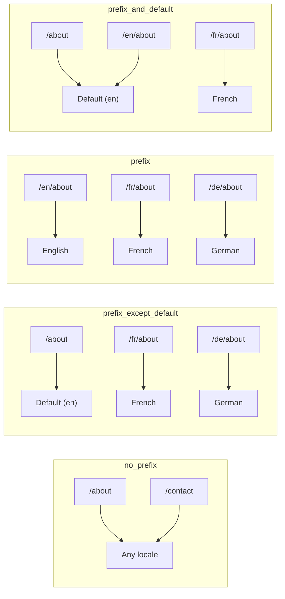
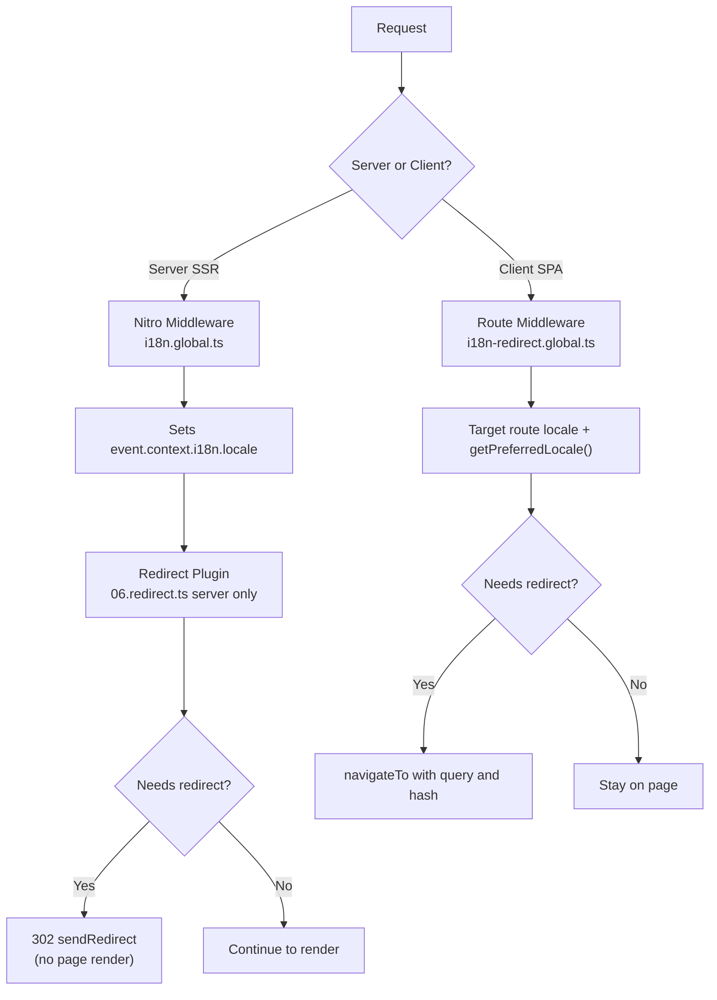

# 🗂️ Nuxt I18n Micro'da yo'naltirish strategiyalari

## 📖 Umumiy ko'rinish

Nuxt I18n Micro `strategy` opsiyasi orqali URL'larda locale prefikslari qanday paydo bo'lishini boshqaradi. Ostki qismida, buni ikkita paket amalga oshiradi:

- **`@i18n-micro/route-strategy`** — build-time yo'nalish generatsiyasi (Nuxt sahifalarini lokalizatsiyalangan yo'nalishlar bilan kengaytiradi)
- **`@i18n-micro/path-strategy`** — runtime yo'lni hal qilish, redirect'lar, SEO atributlari va havolalarni generatsiya qilish

Nuxt moduli build vaqtida to'g'ri strategiya klassini tanlaydi va uni `#i18n-strategy` orqali taxallus qiladi, shuning uchun faqat tanlangan implementatsiya bundle qilinadi.

## 🚦 Mavjud strategiyalar

{/* generated:option:strategy — do not edit; run `pnpm run docs:generate` */}

**Tur** `Strategies` · **Standart** `'prefix_except_default'`

Locale prefikslari uchun URL yo'naltirish strategiyasi.

- `'no_prefix'` — URL'da locale yo'q; locale cookie'da saqlanadi.
- `'prefix_except_default'` — standart tashqari barcha locale'larni prefikslash.
- `'prefix'` — har doim prefikslash, jumladan standart locale.
- `'prefix_and_default'` — `prefix` kabi, ammo standart locale prefikssiz ham mavjud.

{/* /generated:option:strategy */}

### Strategiyalar solishtirmasi



### 🛑 `no_prefix`

URL'larda locale segmenti yo'q. Locale cookie, `useI18nLocale()` holati yoki brauzer aniqlashi orqali aniqlanadi.

- **Yo'nalishlar**: `/about`, `/contact` — barcha locale'lar uchun bir xil URL naqshi (`/en/`, `/fr/` prefiksi yo'q)
- **Locale saqlash**: `localeCookie` orqali (agar ko'rsatilmagan bo'lsa avtomatik ravishda `'user-locale'` ga o'rnatiladi)
- **Maxsus yo'llar**: [`globalLocaleRoutes`](/guides/configuration#globallocaleroutes) va [`defineI18nRoute`](/guides/custom-locale-routes) orqali qo'llab-quvvatlanadi — URL'larga locale prefiksi qo'shmasdan lokalizatsiyalangan slug'lar generatsiya qilinadi (masalan, `/about` vs `/ueber-uns`). Nested yo'nalishlar, taxalluslar va har bir locale uchun cheklovlar `prefix_except_default` ga qaraganda soddaroq.

<Tip>
`no_prefix` dan foydalanganda, agar ko'rsatilmagan bo'lsa `localeCookie` avtomatik ravishda `'user-locale'` ga o'rnatiladi. Bu talab qilinadi chunki URL locale ma'lumotlarini o'z ichiga olmaydi.
</Tip>

```typescript
i18n: {
  strategy: 'no_prefix'
  // localeCookie is automatically set to 'user-locale'
}
```

### 🚧 `prefix_except_default`

Barcha yo'nalishlarda locale prefiksi mavjud, standart locale **tashqari**.

- **Standart locale**: `/about`, `/contact`
- **Boshqa locale'lar**: `/fr/about`, `/de/contact`
- **Prefiks bilan standart locale 404 qaytaradi**: `/en/about` → 404 (agar `en` standart bo'lsa)

```typescript
i18n: {
  strategy: 'prefix_except_default' // This is the default
}
```

### 🌍 `prefix`

Har bir yo'nalishda locale prefiksi mavjud, jumladan standart locale.

- **Barcha locale'lar**: `/en/about`, `/fr/about`, `/de/about`
- **Root `/`**: Foydalanuvchi afzalligiga qarab `/\{locale\}/` ga yo'naltiradi

```typescript
i18n: {
  strategy: 'prefix'
}
```

### 🔄 `prefix_and_default`

Standart locale ham prefiks bilan, ham prefikssiz mavjud. Standart bo'lmagan locale'larda doim prefiks bor.

- **Standart locale**: ham `/about`, ham `/en/about` yaroqli
- **Boshqa locale'lar**: `/fr/about`, `/de/about`
- **`/` dan yo'naltirish yo'q**: Ham `/`, ham `/en/` standart locale'ga xizmat qiladi

```typescript
i18n: {
  strategy: 'prefix_and_default'
}
```

## 🔀 Redirect arxitekturasi (v3)

v3'da redirect mantig'i optimal ishlash uchun ikkita qatlamga bo'lingan:

### Qanday ishlaydi



### Server tomonida (yaltirashsiz)

1. **Nitro middleware** (`i18n.global.ts`) avval ishga tushadi — URL, cookie yoki `Accept-Language` header'idan locale'ni aniqlaydi va `event.context.i18n.locale` ni o'rnatadi
2. **Redirect plagini** (`06.redirect.ts`, faqat server) `i18nStrategy.getClientRedirect()` yordamida joriy yo'l redirectga muhtoj yoki yo'qligini tekshiradi va sahifa render qilinishidan **oldin** 302 chiqaradi
3. Bu foydalanuvchilar redirectdan oldin qisqa vaqt noto'g'ri sahifani ko'radigan "xato yaltirashi"ni oldini oladi

### Client tomonida (SPA navigatsiyasi)

1. `redirects` yoqilganda har bir client navigatsiyasida global yo'nalish middleware (`i18n-redirect.global.ts`) ishga tushadi
2. Avval **maqsad yo'nalish**dan afzal locale'ni oladi, so'ng `useI18nLocale().getPreferredLocale()` ga qaytadi
3. Redirect kerak yoki yo'qligini hal qilish uchun `i18nStrategy.getClientRedirect()` dan foydalanadi
4. Yo'naltirish davomida `query` va `hash` ni saqlaydi

### Locale ustuvorlik tartibi

Serverda redirect plagini afzal locale'ni quyidagi tartibda aniqlaydi:

1. **`useState('i18n-locale')`** — eng yuqori ustuvorlik (`useI18nLocale().setLocale()` orqali dasturiy tarzda o'rnatiladi)
2. **Cookie** — agar `localeCookie` sozlangan bo'lsa
3. **`Accept-Language` header** — agar `autoDetectLanguage: true` bo'lsa
4. **`defaultLocale`** — yakuniy fallback

Client'da yo'nalish middleware avval maqsad yo'nalishdagi locale'ni afzal ko'radi, so'ng bir xil state/cookie fallback zanjiridan foydalanadi.

### Strategiya bo'yicha redirect xatti-harakati

| Strategiya                | `GET /` xatti-harakati                              | Cookie talab qilinadimi? |
| ----------------------- | --------------------------------------------- | ---------------- |
| `no_prefix`             | Redirect yo'q (cookie/state'dan locale)        | Avtomatik o'rnatiladi         |
| `prefix`                | 302 → `/\{locale\}/`                            | Tavsiya etiladi      |
| `prefix_except_default` | 302 → `/\{locale\}/` agar locale ≠ standart bo'lsa        | Tavsiya etiladi      |
| `prefix_and_default`    | Redirect yo'q (ham `/`, ham `/\{locale\}/` yaroqli) | Ixtiyoriy         |

### Redirect'larni o'chirish

```typescript
i18n: {
  redirects: false // Disables automatic locale redirects
}
```

`redirects: false` bo'lganda, avtomatik locale redirect'lari o'chiriladi:

- **Server**: redirect plagini (`06.redirect.ts`, faqat server) ro'yxatdan o'tgan holicha qoladi, ammo redirect mantig'ini o'tkazib yuboradi. U hali ham yaroqsiz locale prefikslari uchun **404 tekshiruvlari**ni bajaradi (masalan, `/xx/about`, bu yerda `xx` yaroqli locale emas) va URL prefiksidan **cookie sinxronizatsiyasi**ni bajaradi (masalan, `/fr/about` ga tashrif buyurish cookie'ni `fr` ga sinxronlashtiradi)
- **Client**: `i18n-redirect` global yo'nalish middleware **ro'yxatdan o'tkazilmaydi** — SPA avtomatik redirect'lari yo'q

## 🍪 Cookie asosidagi locale saqlash

<Warning>
`redirects: true` (standart) bilan `prefix` yoki `prefix_except_default` dan foydalanganda, redirect'lar to'g'ri ishlashi uchun `localeCookie` ni **o'rnatishingiz kerak**. Cookie'siz redirect plagini foydalanuvchining locale afzalligini sahifa qayta yuklashlar bo'ylab eslay olmaydi.

```typescript
i18n: {
  strategy: 'prefix_except_default',
  localeCookie: 'user-locale' // Required for redirects to work properly
}
```
</Warning>

**v3'da `localeCookie` qanday ishlaydi:**

- `useI18nLocale()` tomonidan ichki tarzda boshqariladi — `useCookie()` orqali uni **qo'lda o'rnatmang**
- Foydalanuvchi prefiksli URL'ga tashrif buyurganda (masalan, `/fr/about`), cookie avtomatik ravishda `fr` ga sinxronlanadi
- `/` ga keyingi tashrifda cookie qiymati `/\{locale\}/` ga yo'naltirish uchun ishlatiladi
- Agar cookie yaroqsiz locale'ni o'z ichiga olsa (`locales` ro'yxatida yo'q), u `defaultLocale` ga qaytadi

| Strategiya                | `localeCookie` standarti | Eslatmalar                                |
| ----------------------- | ---------------------- | ------------------------------------ |
| `no_prefix`             | Avto: `'user-locale'`  | Talab qilinadi; avtomatik o'rnatiladi          |
| `prefix`                | `null` (o'chirilgan)      | Redirect'lar uchun `'user-locale'` ga o'rnating |
| `prefix_except_default` | `null` (o'chirilgan)      | Redirect'lar uchun `'user-locale'` ga o'rnating |
| `prefix_and_default`    | `null` (o'chirilgan)      | Ixtiyoriy                             |

## 🔍 `autoDetectLanguage` va `autoDetectPath`

### `autoDetectLanguage`

{/* generated:option:autoDetectLanguage — do not edit; run `pnpm run docs:generate` */}

**Tur** `boolean` · **Standart** `true`

`Accept-Language` HTTP header'idan foydalanuvchining afzal tilini avtomatik aniqlash.
Aniqlash qachon sodir bo'lishini hal qilish uchun `autoDetectPath` bilan birgalikda ishlatiladi.

{/* /generated:option:autoDetectLanguage */}

Tekshiruv server middleware'da ishga tushadi va fallback hisoblanadi: cookie yoki mavjud holat ustunlik qiladi.

```typescript
i18n: {
  autoDetectLanguage: true
}
```

### `autoDetectPath`

{/* generated:option:autoDetectPath — do not edit; run `pnpm run docs:generate` */}

**Tur** `string` · **Standart** `'/'`

Cookie / Accept-Language afzallik redirect'lari qayerda ishga tushishi mumkin (agar `redirects` yoqilgan bo'lsa).

- `'/'` — faqat `/` (standart locale'dagi chuqur havolalar erishilishi mumkin bo'lib qoladi; standart)
- `'no_prefix'` — faqat locale prefikssiz yo'llar
- `'*'` — har bir yo'l, jumladan aniq locale prefiksini qayta yozish
  (masalan, cookie `de` ni afzal ko'rsa `/fr/about` → `/de/about`)

- boshqa har qanday satr — aniq yo'l mosligi (masalan, `'/welcome'`)

Prefiksli strategiya tozalash (masalan, `prefix_except_default` ostida `/en` → `/`) cheklanmaydi.

{/* /generated:option:autoDetectPath */}

```typescript
i18n: {
  autoDetectPath: '/' // Default: only root
  // autoDetectPath: '*' // All paths — redirects even /fr/about to /de/about
}
```

<Warning>
`autoDetectPath: '*'` bilan, hatto aniq locale prefiksi bilan URL'lar (masalan, `/fr/about`) foydalanuvchining afzal locale'i farq qilsa qayta yo'naltiriladi. Bu domen asosidagi sozlash uchun foydali bo'lishi mumkin, lekin URL'larni bo'lishuvchi foydalanuvchilarni chalkashtirib yuborishi mumkin.
</Warning>

Standart `autoDetectPath: '/'` va locale cookie'si bilan:

| so'rov | cookie | natija |
| --- | --- | --- |
| `/` | `de` | 302 → `/de` |
| `/about` | `de` | 200, standart locale (qayta yozish yo'q) |

```typescript
i18n: {
  localeCookie: 'user-locale',
  strategy: 'prefix_except_default',
  // Default — remember language on entry, keep deep links stable
  autoDetectPath: '/',
  // Or redirect on every unprefixed path (but not /de/… → /fr/…):
  // autoDetectPath: 'no_prefix',
}
```

## ⚠️ Ma'lum muammolar va eng yaxshi amaliyotlar

### 1. `no_prefix` strategiyasidagi hydration mos kelmasligi

`no_prefix` dan foydalanganda locale dinamik ravishda aniqlanadi. Agar server va client locale bo'yicha rozi bo'lmasa, hydration mos kelmasligini ko'rasiz.

**Yechim**: i18n ishga tushirilishidan oldin locale'ni o'rnatish uchun server plaginida (`order: -10` bilan) `useI18nLocale().setLocale()` dan foydalaning:

```ts
// plugins/i18n-loader.server.ts
export default defineNuxtPlugin({
  name: 'i18n-custom-loader',
  enforce: 'pre',
  order: -10,
  setup() {
    const { setLocale } = useI18nLocale()
    setLocale('ja') // Your detection logic here
  },
})
```

Batafsil misollar uchun [Maxsus til aniqlash](/guides/custom-language-detection) ga qarang.

### 2. `localeRoute` bilan nomli yo'nalishlardan foydalaning

Yo'lga asoslangan yo'naltirish yo'nalish hal qilishida muammolar keltirib chiqarishi mumkin:

```typescript
// May cause issues
$localeRoute('/page')

// Preferred approach
$localeRoute({ name: 'page' })
```

### 3. i18n bilan `pages: false` dan foydalanish

`pages: false` bilan Nuxt'dan foydalanganda:

```typescript
export default defineNuxtConfig({
  pages: false,
  i18n: {
    strategy: 'no_prefix', // Recommended
    disablePageLocales: true, // Required
    localeCookie: 'user-locale', // Required for persistence
  },
})
```

**`pages: false` bilan cheklovlar:**

- Avtomatik redirect'lar yo'q
- URL asosidagi locale aniqlash yo'q
- Client tomonidagi locale almashtirish sahifani qayta yuklash yoki qo'lda tarjima yuklashni talab qiladi

### 4. Yaroqsiz cookie boshqaruvi

Agar cookie yaroqsiz locale'ni o'z ichiga olsa (`locales` ro'yxatida yo'q), modul yumshoq tarzda `defaultLocale` ga qaytadi. Hech qanday xatolik chiqmaydi.

## 📝 Eng yaxshi amaliyotlar xulosasi

| Tavsiya            | Tafsilotlar                                                                             |
| ------------------------- | ----------------------------------------------------------------------------------- |
| **`localeCookie` ni o'rnating**    | `redirects: true` bilan prefiks strategiyalari uchun har doim o'rnating                             |
| **`useI18nLocale()` dan foydalaning** | Locale holatini boshqarishning markazlashgan usuli (qo'lda `useState`/`useCookie` ni almashtiradi) |
| **Nomli yo'nalishlardan foydalaning**      | `$localeRoute('/page')` o'rniga `$localeRoute(\{ name: 'page' \})`                       |
| **Dasturiy locale**   | `order: -10` bilan server plaginida `useI18nLocale().setLocale()` dan foydalaning              |
| **Qo'lda cookie'lardan qoching**  | `useCookie('user-locale')` ni to'g'ridan-to'g'ri ishlatmang — `useI18nLocale()` buni boshqaradi      |
