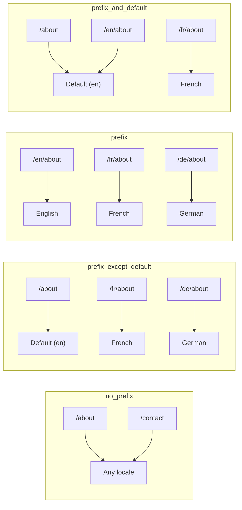
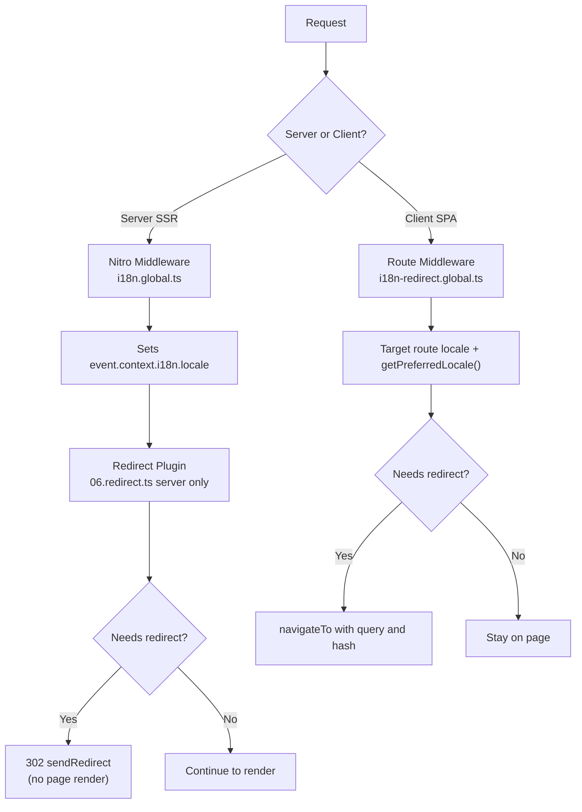

# 🗂️ Nuxt I18n Micro’dagi marshrutlash strategiyalari

## 📖 Umumiy sharh

Nuxt I18n Micro `strategy` parametri orqali URL’larda locale prefikslari qanday koʻrinishini boshqaradi. Buni ichkarida ikkita paket amalga oshiradi:

- **`@i18n-micro/route-strategy`** — build vaqtida marshrut yaratish (Nuxt sahifalarini mahalliylashtirilgan marshrutlar bilan kengaytiradi)
- **`@i18n-micro/path-strategy`** — ishlash paytida yoʻlni hal qilish, yoʻnaltirishlar, SEO atributlari va havola yaratish

Nuxt moduli build vaqtida toʻgʻri strategiya klassini tanlaydi va uni `#i18n-strategy` orqali taxallus qiladi, shuning uchun faqat tanlangan amalga oshirilishi bundle qilinadi.

## 🚦 Mavjud strategiyalar

{/* generated:option:strategy — do not edit; run `pnpm run docs:generate` */}

**Tur** `Strategies` · **Standart** `'prefix_except_default'`

Locale prefikslari uchun URL marshrutlash strategiyasi.

- `'no_prefix'` — URL da locale yoʻq; locale cookie da saqlanadi.
- `'prefix_except_default'` — standart’dan tashqari barcha locale’larga prefiks qoʻyish.
- `'prefix'` — har doim prefiks, standart locale’ni ham qoʻshgan holda.
- `'prefix_and_default'` — `prefix` ga oʻxshash, lekin standart locale prefikssiz ham mavjud.

{/* /generated:option:strategy */}

### Strategiyalarni taqqoslash



### 🛑 `no_prefix`

URL’larda locale segmenti yoʻq. Locale cookie, `useI18nLocale()` holati yoki brauzer aniqlashi bilan aniqlanadi.

- **Marshrutlar**: `/about`, `/contact` — barcha locale’lar uchun bir xil URL naqshi (`/en/`, `/fr/` prefiksi yoʻq)
- **Locale saqlanishi**: `localeCookie` orqali (belgilanmagan boʻlsa avtomatik ravishda `'user-locale'` ga oʻrnatiladi)
- **Maxsus yoʻllar**: [`globalLocaleRoutes`](/guides/configuration#globallocaleroutes) va [`defineI18nRoute`](/guides/custom-locale-routes) orqali qoʻllab-quvvatlanadi — mahalliylashtirilgan sluglar URL’larga locale prefiksini qoʻshmasdan yaratiladi (masalan, `/about` va `/ueber-uns`). Ichma-ich marshrutlar, taxalluslar va locale boʻyicha cheklovlar `prefix_except_default` ga qaraganda sodda.

<Tip>
`no_prefix` dan foydalanganda `localeCookie` belgilanmagan boʻlsa avtomatik ravishda `'user-locale'` ga oʻrnatiladi. Bu talab qilinadi, chunki URL da hech qanday locale maʼlumoti yoʻq.
</Tip>

```typescript
i18n: {
  strategy: 'no_prefix'
  // localeCookie buutomatically set to 'user-locale'
}
```

### 🚧 `prefix_except_default`

Barcha marshrutlarda standart locale’dan **tashqari** locale prefiksi mavjud.

- **Standart locale**: `/about`, `/contact`
- **Boshqa locale’lar**: `/fr/about`, `/de/contact`
- **Prefiksli standart locale 404 qaytaradi**: `/en/about` → 404 (`en` standart boʻlganda)

```typescript
i18n: {
  strategy: 'prefix_except_default' // This is the default
}
```

### 🌍 `prefix`

Har bir marshrutda, jumladan standart locale’da ham locale prefiksi mavjud.

- **Barcha locale’lar**: `/en/about`, `/fr/about`, `/de/about`
- **Root `/`**: foydalanuvchi afzalligiga qarab `/\{locale\}/` ga yoʻnaltiradi

```typescript
i18n: {
  strategy: 'prefix'
}
```

### 🔄 `prefix_and_default`

Standart locale prefiks bilan ham, prefiks siz ham mavjud. Standart boʻlmagan locale’larda har doim prefiks bor.

- **Standart locale**: `/about` va `/en/about` ikkalasi ham yaroqli
- **Boshqa locale’lar**: `/fr/about`, `/de/about`
- **`/` dan yoʻnaltirish yoʻq**: `/` va `/en/` ikkalasi ham standart locale’ni beradi

```typescript
i18n: {
  strategy: 'prefix_and_default'
}
```

## 🔀 Yoʻnaltirish arxitekturasi (v3)

v3 da yoʻnaltirish mantigʻi optimal samaradorlik uchun ikkita qatlamga boʻlingan:

### Qanday ishlaydi



### Server tomonida (yaltiroqsiz)

1. **Nitro middleware** (`i18n.global.ts`) birinchi ishga tushadi — URL, cookie yoki `Accept-Language` sarlavhasidan locale’ni aniqlaydi va `event.context.i18n.locale` ni oʻrnatadi
2. **Yoʻnaltirish plagini** (`06.redirect.ts`, faqat server) `i18nStrategy.getClientRedirect()` yordamida joriy yoʻlga yoʻnaltirish kerakligini tekshiradi va sahifa renderlanmasdan **oldin** 302 chiqaradi
3. Bu foydalanuvchilar yoʻnaltirishdan oldin qisqa vaqt notoʻgʻri sahifani koʻradigan "xato yaltirashi" ni oldini oladi

### Mijoz tomonida (SPA navigatsiyasi)

1. Global marshrut middleware (`i18n-redirect.global.ts`) `redirects` yoqilganda har bir mijoz navigatsiyasida ishga tushadi
2. Afzal locale’ni avval **maqsad marshrutdan** oladi, keyin `useI18nLocale().getPreferredLocale()` ga qaytadi
3. Yoʻnaltirish kerakligini hal qilish uchun `i18nStrategy.getClientRedirect()` dan foydalanadi
4. Yoʻnaltirishda `query` va `hash` ni saqlaydi

### Locale ustunlik tartibi

Serverda yoʻnaltirish plagini afzal locale’ni quyidagi tartibda aniqlaydi:

1. **`useState('i18n-locale')`** — eng yuqori ustunlik (`useI18nLocale().setLocale()` orqali dasturiy ravishda oʻrnatiladi)
2. **Cookie** — agar `localeCookie` sozlangan boʻlsa
3. **`Accept-Language` sarlavhasi** — agar `autoDetectLanguage: true` boʻlsa
4. **`defaultLocale`** — oxirgi zaxira

Mijozda marshrut middleware maqsad marshrutidagi locale’ni afzal koʻradi, keyin bir xil holat/cookie zaxira zanjiridan foydalanadi.

### Strategiya boʻyicha yoʻnaltirish xatti-harakati

| Strategiya                | `GET /` xatti-harakati                              | Cookie kerakmi? |
| ----------------------- | --------------------------------------------- | ---------------- |
| `no_prefix`             | Yoʻnaltirish yoʻq (locale cookie/holatdan)        | Avtomatik oʻrnatiladi         |
| `prefix`                | 302 → `/\{locale\}/`                            | Tavsiya etiladi      |
| `prefix_except_default` | Agar locale ≠ standart boʻlsa 302 → `/\{locale\}/`        | Tavsiya etiladi      |
| `prefix_and_default`    | Yoʻnaltirish yoʻq (`/` va `/\{locale\}/` ikkalasi yaroqli) | Ixtiyoriy         |

### Yoʻnaltirishlarni oʻchirish

```typescript
i18n: {
  redirects: false // Disables automatic locale redirects
}
```

`redirects: false` boʻlganda avtomatik locale yoʻnaltirishlari oʻchiriladi:

- **Server**: yoʻnaltirish plagini (`06.redirect.ts`, faqat server) roʻyxatdan oʻtgan boʻlib qoladi, lekin yoʻnaltirish mantigʻini oʻtkazib yuboradi. U hali ham yaroqsiz locale prefikslari uchun **404 tekshiruvlarini** (masalan, `/xx/about` bu yerda `xx` yaroqli locale emas) va URL prefiksidan **cookie sinxronizatsiyasini** (masalan, `/fr/about` ga tashrif buyurish cookie’ni `fr` ga sinxronlashtiradi) bajaradi
- **Mijoz**: `i18n-redirect` global marshrut middleware **roʻyxatdan oʻtmaydi** — SPA avtomatik yoʻnaltirishlari yoʻq

## 🍪 Cookie asosidagi locale saqlash

<Warning>
`prefix` yoki `prefix_except_default` ni `redirects: true` (standart) bilan ishlatganda, yoʻnaltirishlar toʻgʻri ishlashi uchun `localeCookie` ni **oʻrnatishingiz kerak**. Cookie boʻlmasa, yoʻnaltirish plagini foydalanuvchining sahifa qayta yuklashlar orasidagi locale afzalligini eslay olmaydi.

```typescript
i18n: {
  strategy: 'prefix_except_default',
  localeCookie: 'user-locale' // Required for redirects to work properly
}
```
</Warning>

**`localeCookie` v3 da qanday ishlaydi:**

- `useI18nLocale()` tomonidan ichkarida boshqariladi — **uni `useCookie()` orqali qoʻlda oʻrnatmang**
- Foydalanuvchi prefiksli URL’ga (masalan, `/fr/about`) tashrif buyurganda, cookie avtomatik ravishda `fr` ga sinxronlanadi
- Keyingi `/` tashrifida cookie qiymati `/\{locale\}/` ga yoʻnaltirish uchun ishlatiladi
- Cookie yaroqsiz locale’ni oʻz ichiga olsa (`locales` roʻyxatida yoʻq), `defaultLocale` ga qaytadi

| Strategiya                | `localeCookie` standarti | Eslatmalar                                |
| ----------------------- | ---------------------- | ------------------------------------ |
| `no_prefix`             | Avtomatik: `'user-locale'`  | Talab qilinadi; avtomatik oʻrnatiladi          |
| `prefix`                | `null` (oʻchirilgan)      | Yoʻnaltirishlar uchun `'user-locale'` ga oʻrnating |
| `prefix_except_default` | `null` (oʻchirilgan)      | Yoʻnaltirishlar uchun `'user-locale'` ga oʻrnating |
| `prefix_and_default`    | `null` (oʻchirilgan)      | Ixtiyoriy                             |

## 🔍 `autoDetectLanguage` va `autoDetectPath`

### `autoDetectLanguage`

{/* generated:option:autoDetectLanguage — do not edit; run `pnpm run docs:generate` */}

**Tur** `boolean` · **Standart** `true`

`Accept-Language` HTTP sarlavhasidan foydalanuvchining afzal tilini avtomatik aniqlash.
Aniqlash qachon sodir boʻlishini hal qilish uchun `autoDetectPath` bilan birga ishlatiladi.

{/* /generated:option:autoDetectLanguage */}

Tekshiruv server middleware da ishlaydi va zaxira hisoblanadi: cookie yoki mavjud holat ustunlik qiladi.

```typescript
i18n: {
  autoDetectLanguage: true
}
```

### `autoDetectPath`

{/* generated:option:autoDetectPath — do not edit; run `pnpm run docs:generate` */}

**Tur** `string` · **Standart** `'/'`

Cookie / Accept-Language afzallik yoʻnaltirishlari qayerda ishlashi mumkin (`redirects` yoqilganda).

- `'/'` — faqat `/` (standart locale’dagi chuqur havolalar erishiladigan qoladi; standart)
- `'no_prefix'` — faqat locale prefiksi boʻlmagan yoʻllar
- `'*'` — barcha yoʻllar, aniq locale prefiksini qayta yozishni ham qoʻshgan holda
  (masalan, cookie `de` ni afzal koʻrsa `/fr/about` → `/de/about`)

- boshqa har qanday satr — aniq yoʻl mosligi (masalan, `'/welcome'`)

Prefiksli strategiya tozalash (masalan, `prefix_except_default` ostida `/en` → `/`) cheklanmaydi.

{/* /generated:option:autoDetectPath */}

```typescript
i18n: {
  autoDetectPath: '/' // Default: only root
  // autoDetectPath: '*' // All paths — redirects even /fr/about to /de/about
}
```

<Warning>
`autoDetectPath: '*'` bilan, aniq locale prefiksiga ega URL’lar ham (masalan, `/fr/about`) foydalanuvchining afzal locale’si farq qilsa yoʻnaltiriladi. Bu domenga asoslangan sozlashlar uchun foydali boʻlishi mumkin, lekin URL’larni ulashadigan foydalanuvchilarni chalkashtirishi mumkin.
</Warning>

Standart `autoDetectPath: '/'` va locale cookie bilan:

| soʻrov | cookie | natija |
| --- | --- | --- |
| `/` | `de` | 302 → `/de` |
| `/about` | `de` | 200, standart locale (qayta yozish yoʻq) |

```typescript
i18n: {
  localeCookie: 'user-locale',
  strategy: 'prefix_except_default',
  // Default — remember language on entry, keep deep links stable
  autoDetectPath: '/',
  // Or redirect on every unprefixed path (but not /de/… → /fr/…):
  // autoDetectPath: 'no_prefix',
}
```

## ⚠️ Maʼlum muammolar va eng yaxshi amaliyotlar

### 1. `no_prefix` strategiyasidagi gidratatsiya nomuvofiqligi

`no_prefix` dan foydalanganda locale dinamik ravishda aniqlanadi. Server va mijoz locale boʻyicha rozi boʻlmasa, gidratatsiya nomuvofiqligini koʻrasiz.

**Yechim**: i18n initsializatsiyasidan oldin locale’ni oʻrnatish uchun server plaginida (`order: -10` bilan) `useI18nLocale().setLocale()` dan foydalaning:

```ts
// plugins/i18n-loader.server.ts
export default defineNuxtPlugin({
  name: 'i18n-custom-loader',
  enforce: 'pre',
  order: -10,
  setup() {
    const { setLocale } = useI18nLocale()
    setLocale('ja') // Your detection logic here
  },
})
```

Batafsil misollar uchun [Maxsus til aniqlash](/guides/custom-language-detection) ga qarang.

### 2. `localeRoute` bilan nomlangan marshrutlardan foydalaning

Yoʻlga asoslangan marshrutlash marshrutni hal qilishda muammolar keltirib chiqarishi mumkin:

```typescript
// May cause issues
$localeRoute('/page')

// Preferred approach
$localeRoute({ name: 'page' })
```

### 3. `pages: false` ni i18n bilan ishlatish

Nuxt’ni `pages: false` bilan ishlatganda:

```typescript
export default defineNuxtConfig({
  pages: false,
  i18n: {
    strategy: 'no_prefix', // Recommended
    disablePageLocales: true, // Required
    localeCookie: 'user-locale', // Required for persistence
  },
})
```

**`pages: false` bilan cheklovlar:**

- Avtomatik yoʻnaltirishlar yoʻq
- URL asosidagi locale aniqlash yoʻq
- Mijoz tomonidagi locale almashtirish sahifani qayta yuklash yoki tarjimalarni qoʻlda yuklashni talab qiladi

### 4. Yaroqsiz cookie boshqaruvi

Cookie yaroqsiz locale’ni (`locales` roʻyxatida yoʻq) oʻz ichiga olsa, modul silliqlik bilan `defaultLocale` ga qaytadi. Hech qanday xato chiqarilmaydi.

## 📝 Eng yaxshi amaliyotlar xulosasi

| Tavsiya            | Tafsilotlar                                                                             |
| ------------------------- | ----------------------------------------------------------------------------------- |
| **`localeCookie` ni oʻrnating**    | `redirects: true` bilan prefix strategiyalari uchun har doim oʻrnating                             |
| **`useI18nLocale()` dan foydalaning** | Locale holatini boshqarishning markazlashtirilgan usuli (qoʻlda `useState`/`useCookie` ni almashtiradi) |
| **Nomlangan marshrutlardan foydalaning**      | `$localeRoute('/page')` oʻrniga `$localeRoute(\{ name: 'page' \})`                       |
| **Dasturiy locale**   | Server plaginida `order: -10` bilan `useI18nLocale().setLocale()` dan foydalaning              |
| **Qoʻlda cookielardan qoching**  | `useCookie('user-locale')` ni bevosita ishlatmang — buni `useI18nLocale()` boshqaradi      |
