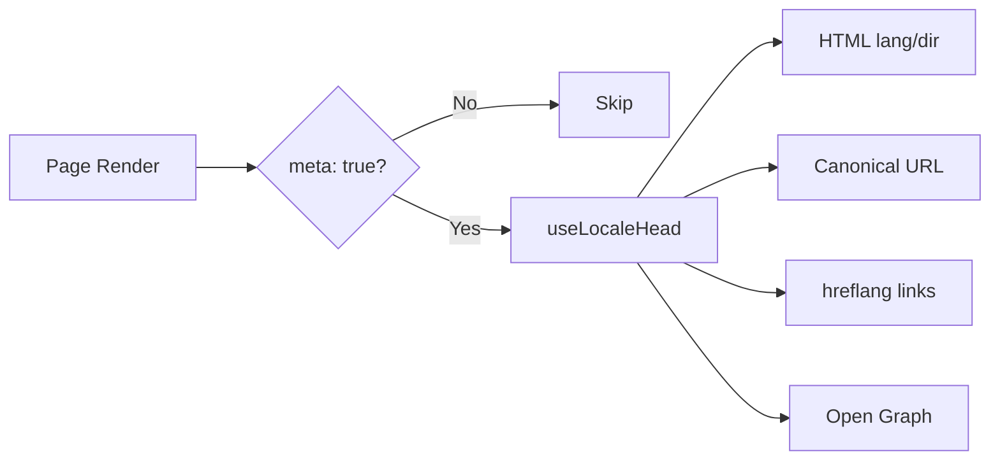

# 🌐 Nuxt I18n Micro uchun SEO qo'llanmasi

## 📖 Kirish

Samarali SEO (Qidiruv Tizimi Optimizatsiyasi) sizning ko'p tilli saytingiz qidiruv tizimlari orqali butun dunyoda foydalanuvchilarga kirish mumkin va ko'rinishi uchun juda muhim. `Nuxt I18n Micro` saytingiz tuzilishi va kontenti haqida qidiruv tizimlarini xabardor qiluvchi muhim meta-teglar va atributlarni avtomatik generatsiya qilish orqali ko'p tilli saytlar uchun SEO ni boshqarish jarayonini soddalashtiradi.

Ushbu qo'llanma qo'shimcha sozlashsiz saytingiz ko'rinishi va foydalanuvchi tajribasini oshirish uchun `Nuxt I18n Micro` SEO'ni qanday boshqarishini tushuntiradi.

## ⚙️ Avtomatik SEO boshqaruvi

### SEO meta generatsiya oqimi



**Generatsiya qilingan teglar:**

| Teg             | Misol                                                  |
| --------------- | -------------------------------------------------------- |
| HTML atributlari | `<html lang="en" dir="ltr">`                             |
| Canonical       | `<link rel="canonical" href="...">`                      |
| hreflang        | `<link rel="alternate" hreflang="en" href="...">`        |
| x-default       | `<link rel="alternate" hreflang="x-default" href="...">` |
| Open Graph      | `<meta property="og:locale" content="en_US">`            |

#### Har bir locale uchun `og` (`og:locale` vs BCP 47)

`<html lang>` va `hreflang` `locale.iso` orqali **BCP 47** dan foydalanadi (masalan, `ar-AE`).  
Open Graph [OG protokoli](https://ogp.me/) bo'yicha **`language_TERRITORY`** ni **pastki chiziq** bilan (`ar_AE`) talab qiladi.

Standart bo'yicha, `og:locale` mos moslik aniq bo'lganda `iso` dan olinadi (`en-US` → `en_US`).  
Maxsus qiymat kerak bo'lganda (masalan, `zh-Hans` → `zh_CN`) aniq **`og`** satrini o'rnating.  
Agar `og` ham, konvertatsiya qilinadigan `iso` ham mavjud bo'lmasa, `og:locale` teglari generatsiya qilinmaydi — development'da siz konsol ogohlantirishini olasiz (`missingWarn` ni hurmat qiladi).

```typescript
i18n: {
  meta: true,
  locales: [
    { code: 'ar', iso: 'ar-AE', og: 'ar_AE', dir: 'rtl' },
    { code: 'en', iso: 'en-US' }, // og:locale → en_US
    { code: 'zh', iso: 'zh-Hans', og: 'zh_CN' }, // script tags need explicit og
  ],
}
```

### 🔑 Asosiy SEO xususiyatlari

`Nuxt I18n Micro` da `meta` opsiyasi yoqilganda, modul avtomatik ravishda quyidagi SEO jihatlarni boshqaradi:

1. **🌍 Til va yo'nalish atributlari**:
   - Modul joriy locale va matn yo'nalishiga qarab `<html>` tegida `lang` va `dir` atributlarini o'rnatadi (masalan, ingliz uchun `ltr` yoki arab uchun `rtl`).

2. **🔗 Canonical URL'lar**:
   - Modul har bir sahifa uchun canonical havola (`<link rel="canonical">`) generatsiya qiladi va qidiruv tizimlari kontentning asosiy versiyasini tanishini ta'minlaydi.

3. **🌐 Muqobil til havolalari (`hreflang`)**:
   - Modul barcha mavjud locale'lar uchun `<link rel="alternate" hreflang="">` teglarini avtomatik generatsiya qiladi. Bu qidiruv tizimlariga kontentingizning qaysi til versiyalari mavjudligini tushunishga yordam beradi va global auditoriya uchun foydalanuvchi tajribasini yaxshilaydi.
   - Har bir locale **bitta** teg chiqaradi: `hreflang = iso || code`. `iso` o'rnatilganda, yo'naltirish `code` hech qachon `hreflang` sifatida ishlatilmaydi (shuning uchun `mx` kabi bozor kalitlari yaroqsiz til teglariga aylanmaydi).
   - Ixtiyoriy `hreflangBaseLanguage: true` shuningdek `iso` dan olingan yalang'och-til tegini chiqaradi (masalan, `es-ES` → `es`), `locales` dagi birinchi mintaqaviy locale tomonidan da'vo qilinadi.

4. **🌏 `x-default` Hreflang**:
   - Modul standart locale URL'iga ishora qiluvchi `<link rel="alternate" hreflang="x-default">` tegini avtomatik generatsiya qiladi. Bu qidiruv tizimlariga aniqlangan locale'lardan biriga tili mos kelmaydigan foydalanuvchilarga qaysi URL'ni ko'rsatishni aytadi. Qo'shimcha sozlash kerak emas — `meta: true` o'rnatilganda avtomatik ishlaydi.

5. **🔖 Open Graph metadatalari**:
   - Modul har bir locale uchun Open Graph meta teglarini (`og:locale`, `og:url` va h.k.) generatsiya qiladi, bu ijtimoiy tarmoq ulashuvi va qidiruv tizimi indekslash uchun ayniqsa foydalidir.

### 🛠️ Konfiguratsiya

Ushbu SEO xususiyatlarini yoqish uchun `nuxt.config.ts` faylida `meta` opsiyasi `true` ga o'rnatilganligiga ishonch hosil qiling:

```typescript
export default defineNuxtConfig({
  modules: ['nuxt-i18n-micro'],
  i18n: {
    locales: [
      { code: 'en', iso: 'en-US', dir: 'ltr' },
      { code: 'fr', iso: 'fr-FR', dir: 'ltr' },
      { code: 'ar', iso: 'ar-SA', dir: 'rtl' },
    ],
    defaultLocale: 'en',
    translationDir: 'locales',
    meta: true, // Enables automatic SEO management
  },
})
```

### 🌍 Ko'p-domenli deployment'lar uchun dinamik `metaBaseUrl`

`metaBaseUrl` o'rnatilmaganda, absolyut SEO URL'lari quyidagi tartibda hal qilinadi (#240):

1. [`nuxt-site-config`](https://nuxtseo.com/docs/site-config) dan `site.url` (agar u modul mavjud bo'lsa — masalan, `@nuxtjs/seo` orqali)
2. Aks holda joriy so'rovdan host nomi (`useRequestURL()` / `window.location.origin`)

So'rov-origin fallback teskari-proksi header'larni (`X-Forwarded-Host`, `X-Forwarded-Proto`) hurmat qiladi, shuning uchun u nginx, Cloudflare, AWS ALB va shunga o'xshash proksilar orqasida to'g'ri ishlaydi.

Bu shuni anglatadiki, sitemap / robots / schema.org uchun `site.url` ni allaqachon o'rnatgan ilovalarga ikkinchi `metaBaseUrl` deklaratsiyasi kerak **emas**:

```typescript
export default defineNuxtConfig({
  site: {
    url: process.env.NUXT_SITE_URL, // also used by micro for canonical / og:url / hreflang
  },
  i18n: {
    meta: true,
    // metaBaseUrl omitted — picks up site.url, then request origin
  },
})
```

`site.url` bo'lmaganda, bitta ilova instance'i so'rov origin'i orqali har biri uchun to'g'ri SEO teglari bilan **bir nechta domenlarga** xizmat qilishi mumkin:

```typescript
export default defineNuxtConfig({
  i18n: {
    meta: true,
    // metaBaseUrl is undefined by default — resolved dynamically from the request
  },
})
```

Masalan, `https://site-a.com/en/about` ga so'rov quyidagini ishlab chiqaradi:

```html
<link rel="canonical" href="https://site-a.com/en/about" /> <meta property="og:url" content="https://site-a.com/en/about" />
```

Bir xil ilova `https://site-b.com/en/about` ga xizmat qilganda quyidagini ishlab chiqaradi:

```html
<link rel="canonical" href="https://site-b.com/en/about" /> <meta property="og:url" content="https://site-b.com/en/about" />
```

Agar sizga `site.url` dan doim ustun bo'ladigan qat'iy base URL kerak bo'lsa, statik satr uzating:

```typescript
metaBaseUrl: 'https://example.com'
```

### 🔍 Canonical query oq ro'yxati

Standart bo'yicha, dublikat kontentdan qochish uchun query parametrlari canonical va `og:url` dan olib tashlanadi. Saqlanishi kerak bo'lgan muayyan query parametrlarni oq ro'yxatga kiritishingiz mumkin:

```typescript
i18n: {
  canonicalQueryWhitelist: ['page', 'sort', 'filter', 'search', 'q', 'query', 'tag']
}
```

Faqat `canonicalQueryWhitelist` da ko'rsatilgan parametrlar canonical URL'larda paydo bo'ladi. Boshqa barcha query parametrlari (masalan, kuzatuv, sessiya ID'lari) olib tashlanadi.

### 🚫 Sahifa bo'yicha meta teglarni o'chirish

`defineI18nRoute()` yordamida muayyan sahifalar uchun SEO meta-teg generatsiyasini o'chirishingiz mumkin:

```vue
<script setup>
// Disable all SEO meta tags for this page
defineI18nRoute({
  disableMeta: true,
})
</script>
```

Meta'ni faqat muayyan locale'lar uchun ham o'chirishingiz mumkin:

```vue
<script setup>
// Disable meta tags only for English locale on this page
defineI18nRoute({
  disableMeta: ['en'],
})
</script>
```

`disableMeta` faol bo'lganda, ta'sirlangan sahifa/locale uchun `hreflang`, `canonical`, `og:locale`, `og:url` yoki `x-default` teglari generatsiya qilinmaydi.

### 🔇 O'chirilgan locale'lar

`disabled: true` bilan locale'lar barcha SEO teg generatsiyasidan avtomatik chiqarib tashlanadi — ular uchun `hreflang`, `og:locale:alternate` yoki muqobil havolalar yaratilmaydi:

```typescript
i18n: {
  locales: [
    { code: 'en', iso: 'en-US' },
    { code: 'fr', iso: 'fr-FR', disabled: true }, // excluded from SEO tags
  ]
}
```

### 🙈 Chiqib ketish locale'lari (`seo: false`)

Yo'naltirish mumkin va tarjima qilingan bo'lib qolishi kerak, lekin locale-o'rta topilish teglarida paydo bo'lmasligi kerak bo'lgan locale'lar uchun `seo: false` ni o'rnating. O'sha locale'lar `hreflang` muqobillari va `og:locale:alternate` dan o'tkazib yuboriladi. Agar sozlangan **standart** locale'ingiz `seo: false` bo'lsa, `x-default` havolasi ham chiqarilmaydi.

```typescript
i18n: {
  locales: [
    { code: 'en', iso: 'en-US' },
    { code: 'ru', iso: 'ru-RU', seo: false }, // internal / non-indexed locale
  ]
}
```

### 📌 Strategiyaga xos xatti-harakat

| Strategiya                | hreflang havolalari   | x-default             | canonical      | og:url |
| ----------------------- | ---------------- | --------------------- | -------------- | ------ |
| `prefix`                | ✅ Barcha locale'lar   | ✅ Standart locale URL | ✅ Joriy URL | ✅     |
| `prefix_except_default` | ✅ Barcha locale'lar   | ✅ Prefikssiz URL     | ✅ Joriy URL | ✅     |
| `prefix_and_default`    | ✅ Barcha locale'lar   | ✅ Standart locale URL | ✅ Joriy URL | ✅     |
| `no_prefix`             | ❌ Generatsiya qilinmaydi | ❌ Generatsiya qilinmaydi      | ✅ Joriy URL | ✅     |

`no_prefix` strategiyasi uchun faqat `canonical`, `og:url`, `og:locale` va `html` atributlari (`lang`, `dir`) generatsiya qilinadi. Muqobil til havolalari (`hreflang`) va `x-default` generatsiya qilinmaydi chunki har bir locale uchun alohida URL'lar yo'q.

## Sahifa darajasidagi bekor qilishlar (`useI18nHead`)

Har bir locale mavjud emas yoki URL'lar API'dan keladigan **maqolalar, qo'llanmalar yoki har qanday CMS kontenti** uchun maxsus i18n head plagini o'rniga sahifada [`useI18nHead`](/api/composables/use-i18n-head) dan foydalaning.

### Qisman tarjimalar bilan maqola

```vue
<script setup lang="ts">
const article = await loadArticle()
// article.locales = { en: '...', de: '...' } — only translated locales

useI18nHead({
  meta: [{ property: 'og:title', content: article.title }],
  replace: {
    hreflang: Object.entries(article.locales).map(([locale, href]) => ({
      rel: 'alternate',
      hreflang: locale,
      href,
    })),
    ogAlternates: Object.keys(article.locales),
  },
})
</script>
```

### `$setI18nRouteParams` bilan har bir locale uchun slug'lar

Slug'lar til bo'yicha farq qilganda, avval yo'nalish parametrlarini o'rnating, so'ng muqobillarni haqiqiy URL'lar bilan bekor qiling:

```vue
<script setup lang="ts">
const { $defineI18nRoute, $setI18nRouteParams } = useNuxtApp()
const { data: article } = await useFetch(`/api/articles/${slug}`)

$defineI18nRoute({
  localeRoutes: { en: '/blog/[slug]', de: '/de/blog/[slug]' },
})

$setI18nRouteParams({
  en: { slug: article.value.slugEn },
  de: { slug: article.value.slugDe },
})

useI18nHead({
  replace: {
    hreflang: ['en', 'de'].map((locale) => ({
      rel: 'alternate',
      hreflang: locale,
      href: article.value.urls[locale],
    })),
    ogAlternates: ['en', 'de'],
  },
})
</script>
```

### Proksi orqasidagi HTTPS origin

Maxsus origin composable'siz SSR'da to'g'ri absolyut URL'lar uchun:

```ts
i18n: {
  meta: true,
  metaBaseUrl: undefined,
  metaTrustForwardedHost: true,
  metaTrustForwardedProto: true,
}
```

Ko'proq misollar (canonical bekor qilish, `x-default`, reaktiv fetch, umumiy yordamchilar): [useI18nHead composable](/api/composables/use-i18n-head).

### ⚠️ Trailing slash

Modul canonical va `hreflang` URL'larini `useRoute().fullPath` dan haqiqiy yo'l asosida generatsiya qiladi. Agar ilovangiz trailing slash'lardan foydalansa (masalan, Nuxt'ning `router.options` orqali), generatsiya qilingan URL'lar buni aks ettiradi. Ammo `$switchLocalePath` yo'llarni normallashtirishi va trailing slash'larni olib tashlashi mumkin. Agar trailing slash izchilligi sizning SEO'ingiz uchun kritik bo'lsa, generatsiya qilingan URL'lar ilovangizning URL tuzilmasiga mos kelishini tekshiring.

### 🎯 Foydalari

`meta` opsiyasini yoqib, siz quyidagilardan foyda ko'rasiz:

- **📈 Yaxshilangan qidiruv tizimi reytingi**: Qidiruv tizimlari saytingizni yaxshiroq indekslashi mumkin, turli til versiyalari o'rtasidagi munosabatlarni tushunadi.
- **👥 Yaxshi foydalanuvchi tajribasi**: Foydalanuvchilarga afzalliklariga qarab to'g'ri til versiyasi taqdim etiladi, bu shaxsiylashtirilgan tajribaga olib keladi.
- **🔧 Qo'lda konfiguratsiya kamayadi**: Modul SEO vazifalarini avtomatik boshqaradi, sizni SEO bilan bog'liq meta-teglar va atributlarni qo'lda qo'shish zaruratidan ozod qiladi.

## 🔗 Nuxt SEO (`@nuxtjs/seo`)

[`@nuxtjs/seo`](https://nuxtseo.com/) sitemap, robots, schema.org, OG rasmlar va tegishli modullarni jamlaydi. U [`nuxt-site-config`](https://nuxtseo.com/docs/site-config/guides/i18n) (v4+) orqali **nuxt-i18n-micro** bilan integratsiyalanadi.

### Talablar

- **`@nuxtjs/seo` 3+** (joriy nashrlar `nuxt-site-config` 4+ dan foydalanadi, bu micro uchun `nuxt-site-config:i18n` plaginini ro'yxatdan o'tkazadi)
- **`i18n.meta: true`** (tavsiya etiladi — micro locale'ga sezgir head teglarini taqdim etadi; Nuxt SEO sitemap, schema.org va h.k. qo'shadi)

### Modul tartibi

Sayt konfiguratsiyasi locale sozlash'ingizni o'qishi uchun **nuxt-i18n-micro'ni `@nuxtjs/seo` dan oldin** qo'ying:

```typescript
export default defineNuxtConfig({
  modules: ['nuxt-i18n-micro', '@nuxtjs/seo'],
  site: {
    url: 'https://example.com',
    name: 'My Site',
  },
  i18n: {
    meta: true,
    defaultLocale: 'en',
    locales: [
      { code: 'en', iso: 'en-US' },
      { code: 'de', iso: 'de-DE' },
    ],
  },
})
```

### Tarjima qilingan sayt nomi va tavsifi

Nuxt Site Config locale fayllaringizdan ixtiyoriy tarjima kalitlarini o'qiydi:

```json
{
  "nuxtSiteConfig": {
    "name": "My Site",
    "description": "My site description"
  }
}
```

`locales/en.json`, `locales/de.json` va h.k.dagi har bir locale uchun qiymatlar avtomatik olinadi.

### Muammolarni bartaraf etish

Agar `Plugin nuxt-seo:defaults depends on nuxt-site-config:i18n but they are not registered` ni ko'rsangiz, **`@nuxtjs/seo` ni 3+** ga yangilang ([issue #133](https://github.com/s00d/nuxt-i18n-micro/issues/133) ga qarang). Eski `nuxt-site-config` 3.x faqat `@nuxtjs/i18n` uchun i18n'ni ulagan, micro uchun emas.

Ko'proq: [Sitemap i18n qo'llanmasi](https://nuxtseo.com/docs/sitemap/guides/i18n), [Site Config i18n qo'llanmasi](https://nuxtseo.com/docs/site-config/guides/i18n).
