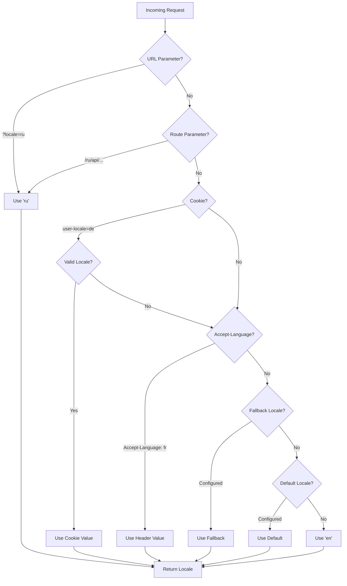

# 🌍 Nuxt I18n Micro'da server tomonidagi tarjimalar va locale ma'lumotlari

## 📖 Umumiy ko'rinish

Nuxt I18n Micro server tomonidagi tarjimalar va locale ma'lumotlarini qo'llab-quvvatlaydi, bu esa serverda kontentni tarjima qilish va locale tafsilotlariga kirish imkonini beradi. Bu ayniqsa lokalizatsiya client'ga yetguncha kerak bo'lgan API'lar yoki server tomonidan render qilinadigan ilovalar uchun foydalidir.

Tarjimalar Nuxt I18n konfiguratsiyasida aniqlangan locale xabarlaridan foydalanadi va aniqlangan locale asosida dinamik ravishda hal qilinadi.

Standart bo'yicha (`translationPayloads.mode: 'premerged'`), root darajasidagi fayllar build vaqtida har bir sahifa payload'iga `\{page\}/\{locale\}/data.json` sifatida qo'shiladi. Server client `/\{apiBaseUrl\}/...` ostida oladigan bir xil oldindan tayyorlangan fayllarni yuklaydi, shuning uchun barcha kalitlar (ham umumiy, ham sahifaga tegishli) server handler'larida mavjud.

`translationPayloads.mode: 'source'` bilan `loadTranslationsFromServer()` (yoki `/_locales` yo'nalishi) chaqirilganda ixcham manba fayllar runtime'da birlashtiriladi — **Edge** da Nitro `serverAssets` orqali, **Node** da ixtiyoriy public nusxadan. Batafsil ma'lumot uchun [Ishlash qo'llanmasi — Serverless Payload chiqishi](/guides/performance#serverless-payload-output) va [Kesh va saqlash arxitekturasi](/api/cache) ga qarang.

Runtime va server API'larining birlashtirilgan ro'yxati uchun [API ma'lumotnomasi](/api/overview) ga qarang.

## 🛠️ Server tomonidagi middleware'ni sozlash

Server tomonidagi tarjimalar va locale ma'lumotlarini yoqish uchun taqdim etilgan middleware funksiyalaridan foydalaning:

- `useTranslationServerMiddleware` - kontentni tarjima qilish uchun
- `useLocaleServerMiddleware` - locale ma'lumotlariga kirish uchun

Ikkala middleware funksiyasi ham barcha server yo'nalishlarida avtomatik mavjud.

Locale aniqlash mantig'i modul bo'ylab izchillikni ta'minlash uchun `detectCurrentLocale` yordamchi funksiyasi orqali ikkala middleware funksiyasi o'rtasida bo'lishiladi.

## ✨ Server handler'larida tarjimalardan foydalanish

Tarjima middleware'idan foydalanib har qanday `eventHandler` da kontentni muammosiz tarjima qilishingiz mumkin.

### Misol: Asosiy tarjima foydalanishi

```typescript
import { defineEventHandler } from 'h3'

export default defineEventHandler(async (event) => {
  const t = await useTranslationServerMiddleware(event)
  return {
    message: t('greeting'), // Returns the translated value for the key "greeting"
  }
})
```

Bu misolda:

- Foydalanuvchining locale'i query parametrlar, cookie'lar yoki header'lardan avtomatik aniqlanadi.
- `t` funksiyasi aniqlangan locale uchun mos tarjimani oladi.

## 🌍 Server handler'larida locale ma'lumotlaridan foydalanish

### Asosiy locale ma'lumotlaridan foydalanish

```typescript
import { defineEventHandler } from 'h3'

export default defineEventHandler((event) => {
  const localeInfo = useLocaleServerMiddleware(event)

  return {
    success: true,
    data: localeInfo,
    timestamp: new Date().toISOString(),
  }
})
```

### Maxsus locale parametrlarini taqdim etish

```typescript
import { defineEventHandler } from 'h3'

export default defineEventHandler((event) => {
  // Force specific locale with custom default
  const localeInfo = useLocaleServerMiddleware(event, 'en', 'ru')

  return {
    success: true,
    data: localeInfo,
    timestamp: new Date().toISOString(),
  }
})
```

### Javob tuzilmasi

Locale middleware quyidagi xususiyatlar bilan `LocaleInfo` obyektini qaytaradi:

```typescript
interface LocaleInfo {
  current: string // Current detected locale code
  default: string // Default locale code
  fallback: string // Fallback locale code
  available: string[] // Array of all available locale codes
  locale: Locale | null // Full locale configuration object
  isDefault: boolean // Whether current locale is the default
  isFallback: boolean // Whether current locale is the fallback
}
```

### Misol javob

```json
{
  "success": true,
  "data": {
    "current": "ru",
    "default": "en",
    "fallback": "en",
    "available": ["en", "ru", "de"],
    "locale": {
      "code": "ru",
      "iso": "ru-RU",
      "dir": "ltr",
      "displayName": "Русский"
    },
    "isDefault": false,
    "isFallback": false
  },
  "timestamp": "2024-01-15T10:30:00.000Z"
}
```

## 🌐 Maxsus locale'ni taqdim etish

Agar locale'ni qo'lda ko'rsatishingiz kerak bo'lsa (masalan, testlash yoki ba'zi so'rovlar uchun), uni tarjima middleware'iga uzatishingiz mumkin:

### Misol: Maxsus locale

```typescript
import { defineEventHandler } from 'h3'

function detectLocale(event): string | null {
  const urlSearchParams = new URLSearchParams(event.node.req.url?.split('?')[1])
  const localeFromQuery = urlSearchParams.get('locale')
  if (localeFromQuery) return localeFromQuery

  return 'en'
}

export default defineEventHandler(async (event) => {
  const t = await useTranslationServerMiddleware(event, 'en', detectLocale(event)) // Force French local, en - default locale
  return {
    message: t('welcome'), // Returns the French translation for "welcome"
  }
})
```

## 📋 Locale aniqlash mantig'i

Ikkala middleware funksiyasi ham foydalanuvchining locale'ini quyidagi ustuvorlik tartibida avtomatik aniqlaydi:



1. **URL parametrlari**: `?locale=ru`
2. **Yo'nalish parametrlari**: `/ru/api/endpoint`
3. **Cookie'lar**: `user-locale` cookie
4. **HTTP header'lari**: `Accept-Language` header
5. **Fallback locale**: Modul opsiyalarida sozlanganidek
6. **Standart locale**: Modul opsiyalarida sozlanganidek
7. **Qat'iy kodlangan fallback**: `'en'`

> **Eslatma**: Locale aniqlash mantig'i modul bo'ylab izchillikni ta'minlash uchun `useLocaleServerMiddleware` va `useTranslationServerMiddleware` o'rtasida bo'lishiladi.

## 📋 Kengaytirilgan foydalanish misollari

### Locale asosida shartli javob

```typescript
import { defineEventHandler } from 'h3'

export default defineEventHandler((event) => {
  const { current, isDefault, locale } = useLocaleServerMiddleware(event)

  // Return different content based on locale
  if (current === 'ru') {
    return {
      message: 'Привет, мир!',
      locale: current,
      isDefault,
    }
  }

  if (current === 'de') {
    return {
      message: 'Hallo, Welt!',
      locale: current,
      isDefault,
    }
  }

  // Default English response
  return {
    message: 'Hello, World!',
    locale: current,
    isDefault,
  }
})
```

### Maxsus locale aniqlash

```typescript
import { defineEventHandler } from 'h3'

export default defineEventHandler((event) => {
  // Force German locale with English as fallback
  const { current, isDefault, locale } = useLocaleServerMiddleware(event, 'en', 'de')

  return {
    message: 'Hallo, Welt!',
    locale: current,
    isDefault: false, // Will be false since we forced German
  }
})
```

### Tekshirish bilan locale-sezgir API

```typescript
import { defineEventHandler, createError } from 'h3'

export default defineEventHandler((event) => {
  const { current, available, locale } = useLocaleServerMiddleware(event)

  // Validate if the detected locale is supported
  if (!available.includes(current)) {
    throw createError({
      statusCode: 400,
      statusMessage: `Unsupported locale: ${current}. Available locales: ${available.join(', ')}`,
    })
  }

  // Return locale-specific configuration
  return {
    locale: current,
    direction: locale?.dir || 'ltr',
    displayName: locale?.displayName || current,
    availableLocales: available,
  }
})
```

### Tarjima middleware bilan integratsiya

Keng qamrovli xalqarolashtirish uchun locale ma'lumotlarini tarjima middleware'i bilan birlashtirishingiz mumkin:

```typescript
import { defineEventHandler } from 'h3'

export default defineEventHandler(async (event) => {
  const localeInfo = useLocaleServerMiddleware(event)
  const t = await useTranslationServerMiddleware(event)

  return {
    locale: localeInfo.current,
    message: t('welcome_message'),
    availableLocales: localeInfo.available,
    isDefault: localeInfo.isDefault,
  }
})
```

## 📝 Eng yaxshi amaliyotlar

1. **Locale'larni doim tekshiring**: Aniqlangan locale sizning mavjud locale'lar ro'yxatingizda ekanligiga ishonch hosil qiling
2. **Fallback mantig'idan foydalaning**: Locale aniqlash muvaffaqiyatsizlik yuz berganda oqilona standart qiymatlarni taqdim eting
3. **Locale ma'lumotlarini keshlang**: Ishlash uchun kritik ilovalarda locale aniqlash natijalarini keshlashni ko'rib chiqing
4. **Chekka holatlarni boshqaring**: Qo'llab-quvvatlanmaydigan locale'larni hisobga oling va mos xato javoblarini taqdim eting
5. **Tarjimalar bilan birlashtiring**: To'liq i18n qo'llab-quvvatlashi uchun locale ma'lumotlaridan tarjima middleware bilan birgalikda foydalaning

## 🚀 Ishlash mulohazalari

- Ikkala middleware funksiyasi ham yengil va tez ishga tushirish uchun mo'ljallangan
- Locale aniqlash samarali fallback zanjirlaridan foydalanadi
- Locale aniqlash davomida tashqi API chaqiruvlari amalga oshirilmaydi
- Optimal ishlash uchun natijalar sinxron tarzda hisoblanadi
