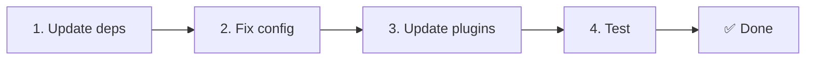

# 📦 v2.x'dan v3.x'ga yangilash

<Tip>
[nuxt-i18n'dan ko'chirish](/migration/from-nuxtjs-i18n) ga qarang — bu qo'llanma vue-i18n ekotizimidan ko'chirishni qamrab oladi, nuxt-i18n-micro v2'dan emas.
</Tip>

v3.0.0 fundamental arxitektura o'zgarishlarini kiritadi: strategiya paketlari, yangi keshlash tizimi, `useI18nLocale()` orqali markazlashgan locale boshqaruvi va qayta ishlab chiqilgan redirect pipeline. Ushbu bo'lim barcha buzuvchi o'zgarishlarni va kodingizni qanday yangilashni qamrab oladi.

## Ko'chirish qadamlari



## Buzuvchi o'zgarishlar xulosasi

- **Locale holati** — qo'lda `useState` / `useCookie` → `useI18nLocale()` composable
- **Konfiguratsiyaga kirish** — `useRuntimeConfig().public.i18nConfig` → `#build/i18n.strategy.mjs` dan `getI18nConfig()`
- **Redirect komponenti** — `fallbackRedirectComponentPath` opsiyasi → Server redirect plagini + client yo'nalish middleware (avtomatik)
- **`includeDefaultLocaleRoute`** — Qo'llab-quvvatlangan (deprecated) → Olib tashlangan, `strategy` opsiyasidan foydalaning
- **`experimental.hmr`** — `experimental` ostida → Root darajasidagi opsiya
- **`previousPageFallback`** — To'liq olib tashlangan (kumulyativ merge strategiyasi buni avtomatik boshqaradi)
- **Keshlash** — `useStorage('cache')` → `TranslationStorage` singleton (`globalThis` da `Symbol.for`)
- **SSR uzatish** — Runtime config → Nuxt payload (v3 `useState` dan foydalangan; chunk'lar endi `payload.data` da, [Ishlash](/guides/performance#server-side-payload-transfer) ga qarang)
- **Strategiya klasslari** — Ichki → Alohida paketlar (`@i18n-micro/route-strategy`, `@i18n-micro/path-strategy`)

## Olib tashlangan: `fallbackRedirectComponentPath`

`fallbackRedirectComponentPath` opsiyasi va `locale-redirect.vue` fallback komponenti olib tashlangan. Redirect mantig'i endi quyidagi tomondan boshqariladi:

1. **Server middleware** (`i18n.global.ts`) — `event.context.i18n.locale` ni o'rnatadi
2. **Server redirect plagini** (`06.redirect.ts`, faqat server) — render'dan oldin 302 redirect
3. **Client yo'nalish middleware** (`i18n-redirect.global.ts`) — hydration'dan keyin SPA redirect'lari

```diff
 i18n: {
   strategy: 'prefix_except_default',
-  fallbackRedirectComponentPath: '~/components/MyRedirect.vue',
 }
```

Agar sizda fallback komponentida maxsus redirect mantig'i bo'lsa, uni server plaginida amalga oshiring:

```ts
// plugins/i18n-loader.server.ts
export default defineNuxtPlugin({
  name: 'i18n-custom-redirect',
  enforce: 'pre',
  order: -10,
  setup() {
    const { setLocale } = useI18nLocale()
    // Your custom detection logic
    setLocale(detectedLocale)
  },
})
```

## Olib tashlangan: `includeDefaultLocaleRoute`

O'rniga `strategy` opsiyasidan foydalaning:

- `includeDefaultLocaleRoute: true` → `strategy: 'prefix'`
- `includeDefaultLocaleRoute: false` → `strategy: 'prefix_except_default'` (standart)

```diff
 i18n: {
-  includeDefaultLocaleRoute: true,
+  strategy: 'prefix',
 }
```

## Konfiguratsiyaga kirish: `getI18nConfig()` `useRuntimeConfig` ni almashtiradi

```diff
- const config = useRuntimeConfig()
- const cookieName = config.public.i18nConfig?.localeCookie || 'user-locale'
+ import { getI18nConfig } from '#build/i18n.strategy.mjs'
+ const { localeCookie: configCookie } = getI18nConfig()
+ const cookieName = configCookie ?? 'user-locale'
```

## Locale boshqaruvi: `useI18nLocale()` qo'lda holatni almashtiradi

v2'da siz `useState('i18n-locale')` yoki `useCookie('user-locale')` ni to'g'ridan-to'g'ri ishlatgan bo'lishingiz mumkin. v3'da markazlashgan `useI18nLocale()` composable'ini ishlating:

```diff
- const locale = useState('i18n-locale')
- const cookie = useCookie('user-locale')
- locale.value = 'fr'
- cookie.value = 'fr'
+ const { setLocale } = useI18nLocale()
+ setLocale('fr') // Updates both state and cookie atomically
```

Batafsil misollar uchun [Maxsus til aniqlash](/guides/custom-language-detection) ga qarang.

## Eksperimental opsiyalar ko'chirilgan / olib tashlangan

`hmr` `experimental` dan root darajasiga ko'chirildi. `previousPageFallback` to'liq olib tashlandi — modul endi kumulyativ deep merge strategiyasidan (2-daraja chuqurlik) foydalanadi, bu tranzitsiya animatsiyalari davomida avvalgi sahifadan tarjimalarni avtomatik saqlaydi, hatto sahifalar bir-birini qoplaydigan nested kalitlarni bo'lishganda ham. Tranzitsiya animatsiyasi tugagandan so'ng, `page:transition:finish` hook eski-sahifa kalitlarini xotiradan tozalaydi.

```diff
 i18n: {
-  experimental: {
-    hmr: true,
-    previousPageFallback: true
-  }
+  hmr: true,
+  // previousPageFallback removed — handled automatically
 }
```

## Redirect arxitekturasi (v3)

Redirect'lar endi ikkita komponent tomonidan avtomatik boshqariladi:

1. **Server tomonida** (`06.redirect.ts`, faqat server): SSR davomida ishga tushadi, har qanday sahifa render qilinishidan oldin 302 redirect'larni chiqaradi — "xato yaltirashi" yo'q
2. **Client tomonida** (`i18n-redirect.global.ts`): SPA navigatsiyasida global yo'nalish middleware; query string va hash'ni saqlaydi

Redirect'lar uchun locale ustuvorligi:

1. `useState('i18n-locale')` — `useI18nLocale().setLocale()` orqali o'rnatilgan
2. Cookie — agar `localeCookie` sozlangan bo'lsa
3. `Accept-Language` header — agar `autoDetectLanguage: true` bo'lsa
4. `defaultLocale` — fallback

Standart sozlashlar uchun kod o'zgarishlari talab qilinmaydi.

<Warning>
`redirects: true` bilan `prefix` va `prefix_except_default` strategiyalari uchun sahifa qayta yuklashlari bo'ylab locale saqlanishini yoqish uchun `localeCookie: 'user-locale'` ni o'rnating. Busiz redirect'lar faqat `Accept-Language` yoki `defaultLocale` dan foydalanadi.
</Warning>

## TypeScript: Ichki modul turlari (ixtiyoriy)

Agar `#i18n-internal/plural`, `#i18n-internal/strategy` yoki `#i18n-internal/config` kabi ichki import'lar bilan bog'liq tur xatolariga duch kelsangiz, loyihangizning `package.json` fayliga `imports` bo'limini qo'shing:

```json
{
  "imports": {
    "#i18n-internal/plural": "nuxt-i18n-micro/internals",
    "#i18n-internal/strategy": "nuxt-i18n-micro/internals",
    "#i18n-internal/config": "nuxt-i18n-micro/internals"
  }
}
```

<Tip>

</Tip>
