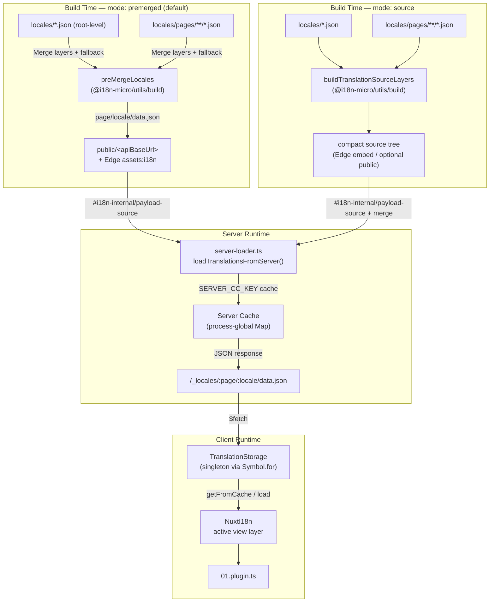

# 🗄️ Kiến trúc Cache & Storage bản dịch

## 📖 Tổng quan

Nuxt I18n Micro v3 dùng một kiến trúc caching nhiều lớp cho các bản dịch. Việc tải payload phụ thuộc vào `translationPayloads.mode`:

- **`premerged`** (mặc định) — các tệp root, page, fallback và layer được gộp tại thời điểm build qua `@i18n-micro/utils/build` vào `\{page\}/\{locale\}/data.json`
- **`source`** — các tệp nguồn nhỏ gọn được giữ lại để gộp tại runtime qua `@i18n-micro/utils/source-loader` và `@i18n-micro/utils/merge-source` (Edge nhúng chúng trong Nitro `serverAssets`; Node đọc chúng từ `public/` khi được sao chép)

Trang này mô tả cách cache tích hợp sẵn hoạt động và cách mở rộng nó cho các trường hợp sử dụng tùy chỉnh (công cụ admin, API bên ngoài, vô hiệu hóa cache).

## 📊 Tổng quan kiến trúc

### Luồng dữ liệu



## 🧱 Thành phần cốt lõi

### 1. `TranslationStorage` (Client + Server)

**Tệp**: `src/runtime/utils/storage.ts`

Một lớp singleton cung cấp storage bản dịch thống nhất cho cả client và server. Dùng `Symbol.for('__NUXT_I18N_STORAGE_CACHE__')` trên `globalThis` để đảm bảo chỉ một instance tồn tại, ngay cả khi nhiều bundle được tải.

**Các phương thức chính:**

| Phương thức                              | Mô tả                                                            |
| ----------------------------------- | ---------------------------------------------------------------------- |
| `getFromCache(locale, routeName?)`  | Kiểm tra đồng bộ: trả về dữ liệu trong bộ nhớ đã cache, hoặc `null`            |
| `load(locale, routeName?, options)` | Tải bất đồng bộ với caching: kiểm tra cache trước, sau đó fetch qua `$fetch` |
| `clear()`                           | Xóa toàn bộ cache                                                |

**Định dạng khóa cache**: `\{locale\}:\{routeName\}` (ví dụ, `en:index`, `fr:about`)

```typescript
import { translationStorage } from '../utils/storage'

// Synchronous cache check
const cached = translationStorage.getFromCache('en', 'index')

// Async load (with automatic caching)
const result = await translationStorage.load('en', 'index', {
  apiBaseUrl: '_locales',
  baseURL: '/',
  dateBuild: '2024-01-01',
})
// result.data — merged translations
// result.cacheKey — cache key used
```

### ⚙️ Cache Busting xác định (`i18n.dateBuild`)

Theo mặc định, module này tạo `dateBuild` tại thời điểm build bằng `Date.now()`. Sau đó, nó được nhúng vào `#build/i18n.strategy.mjs` được tạo và được dùng làm tham số query (`?v=...`) để vô hiệu hóa các cache fetch bản dịch sau các lần build lại.

Nếu bạn cần các bản build có thể tái tạo (ví dụ, để cải thiện tỷ lệ cache hit của chunk trong các triển khai rolling), hãy đặt một giá trị ổn định trong `nuxt.config`:

```ts
export default defineNuxtConfig({
  i18n: {
    // Any stable string/number (git SHA, CI build number, release tag, etc.)
    dateBuild: process.env.GIT_SHA ?? 'local-dev',
  },
})
```

### 2. `loadTranslationsFromServer()` (Chỉ Server)

**Tệp**: `src/runtime/server/utils/server-loader.ts`

Tải các bản dịch cho một locale/trang và cache kết quả đã gộp trong một map `CacheControl` toàn cục tiến trình được keyed bởi `@i18n-micro/hmr/cache-keys` (`SERVER_CC_KEY`).

Hành vi: SSR tải từ `#i18n-internal/payload-source` — **Node** `readFile` dưới `public/<apiBaseUrl>` (`\{page\}/\{locale\}/data.json` trong chế độ premerged), **Edge** `assets:i18n`. `premerged` đọc một tệp; `source` gộp root/page/fallback qua `@i18n-micro/utils/source-loader`.

```typescript
import { loadTranslationsFromServer } from '../server/utils/server-loader'

// Returns { data: Translations, json: string }
const { data, json } = await loadTranslationsFromServer('en', 'index')
```

### 3. Tải client (không nhúng HTML)

Các từ điển **không** được ghi vào `nuxtApp.payload`. Server giữ chúng trong bộ nhớ cho SSR
render; plugin client `await` `switchContext`, tải `/\{apiBaseUrl\}/:page/:locale/data.json`
(cùng tư thế mặc định như `@nuxtjs/i18n` với `experimental.preload: false`).

`NuxtI18n` giữ từ điển lớp xem đang hoạt động được dùng bởi `$t()` và `$has()`. `NuxtTranslationLoader` chuyển đổi ngữ cảnh locale/route và gộp các chunk vào lớp đó.

### 4. Server API Route

**Route**: `/_locales/\{page\}/\{locale\}/data.json`

**Tệp**: `src/runtime/server/routes/i18n.ts`

Route Nitro này phục vụ các bản dịch đã gộp cho chế độ payload đang hoạt động. Nó gọi `loadTranslationsFromServer()` và trả về kết quả dưới dạng JSON.

Trong production, nó cũng đặt:

```http
Cache-Control: public, max-age={httpCacheDuration}, immutable
```

Mặc định `httpCacheDuration` là `31536000` (1 năm). Điều này an toàn vì client yêu cầu các payload với cache-busting `?v=\{dateBuild\}`. Đặt `httpCacheDuration: 0` để bỏ header. Header không được áp dụng trong development.

## 📥 Mở rộng: Tải bản dịch tùy chỉnh

### Đọc từ cache (server route)

```ts
// server/api/i18n/load-cache.[post].ts
import { defineEventHandler, readBody } from 'h3'
import { loadTranslationsFromServer } from '#imports'

export default defineEventHandler(async (event) => {
  const { page, locale } = await readBody<{ page: string; locale: string }>(event)
  const { data } = await loadTranslationsFromServer(locale, page)
  return { locale, page, data }
})
```

### Cập nhật bản dịch (tệp + vô hiệu hóa cache)

```ts
// server/api/i18n/update.[post].ts
import { defineEventHandler, readBody, createError } from 'h3'
import { join } from 'node:path'
import { readFile, writeFile } from 'node:fs/promises'
import { deepMergeTranslations } from '@i18n-micro/utils/deep-merge'

export default defineEventHandler(async (event) => {
  const { path, updates } = await readBody<{ path: string; updates: Record<string, unknown> }>(event)

  if (!path || !updates) {
    throw createError({ statusCode: 400, statusMessage: 'Missing path or updates' })
  }

  const fullPath = join('locales', path)
  let existing: Record<string, unknown> = {}

  try {
    const content = await readFile(fullPath, 'utf-8')
    existing = JSON.parse(content) as Record<string, unknown>
  } catch {
    // File does not exist — create new
  }

  const merged = deepMergeTranslations(existing, updates)
  await writeFile(fullPath, JSON.stringify(merged, null, 2), 'utf-8')

  return { success: true, path, updated: merged }
})
```

<Tip>

</Tip>

## 🧹 Xóa Cache

### Xóa cache bằng chương trình (client)

Dùng phương thức `$clearCache` tích hợp sẵn:

```vue
<script setup>
const { $clearCache } = useNuxtApp()

// Clears both TranslationStorage and plugin-level cache
$clearCache()
</script>
```

### Hành vi cache Server

Cache phía server (`loadTranslationsFromServer`) là toàn cục tiến trình và tồn tại cho đến khi:

- Tiến trình server khởi động lại
- Một triển khai mới được phát hiện (giá trị `dateBuild` khác)

Đối với môi trường serverless, mỗi cold start có một cache mới.

## ⚙️ Cấu hình Serverless

Đối với môi trường serverless (Cloudflare Workers, AWS Lambda), cache tích hợp sẵn dùng các đối tượng `Map` trong bộ nhớ. Không cần cấu hình storage bên ngoài cho chính cache bản dịch.

Tuy nhiên, storage Nitro cho các tệp bản dịch nguồn có thể cần cấu hình:

```ts
export default defineNuxtConfig({
  nitro: {
    storage: {
      // Only needed if default file-system storage is unavailable
      'assets:server': {
        driver: 'cloudflare-kv-binding',
        binding: 'MY_KV_NAMESPACE',
      },
    },
  },
})
```

## 💡 Sự khác biệt chính so với v2

| Khía cạnh           | v2                            | v3                                                                       |
| ---------------- | ----------------------------- | ------------------------------------------------------------------------ |
| Cache Client     | `useStorage('cache')`         | Singleton `TranslationStorage` (Symbol.for trên globalThis)                |
| Truyền SSR     | Cấu hình Runtime                | Các chunk đầy đủ qua `payload.data` (v3.0 đã dùng `useState`)                    |
| Cache Server     | Nitro cache storage           | `Map` toàn cục tiến trình qua `Symbol.for`                                    |
| Logic gộp      | Phía Client                   | Thời điểm build (`premerged`) hoặc runtime (`source`) qua `@i18n-micro/utils/*` |
| Định dạng khóa cache | `i18n:merged:\{page\}:\{locale\}` | `\{locale\}:\{routeName\}`                                                   |

## 📚 Liên quan

- [Hướng dẫn hiệu năng](/guides/performance) — Cách caching ảnh hưởng đến hiệu năng
- [Bản dịch phía Server](/guides/server-side-translations) — Dùng bản dịch trong các server route
- [Triển khai Firebase](/guides/firebase) — Cân nhắc cache theo triển khai
