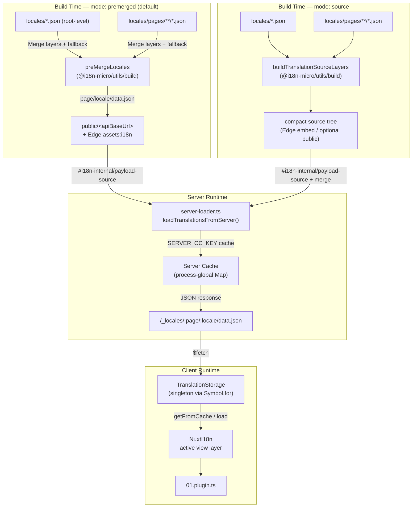

# 🗄️ Kiến trúc bộ nhớ đệm và lưu trữ bản dịch

## 📖 Tổng quan

Nuxt I18n Micro v3 sử dụng kiến trúc bộ nhớ đệm nhiều lớp cho bản dịch. Việc tải payload phụ thuộc vào `translationPayloads.mode`:

- **`premerged`** (mặc định) — các tệp root, page, fallback và layer được gộp tại thời điểm build thông qua `@i18n-micro/utils/build` thành `\{page\}/\{locale\}/data.json`.
- **`source`** — các tệp nguồn gọn nhẹ được giữ nguyên để hợp nhất tại runtime thông qua `@i18n-micro/utils/source-loader` và `@i18n-micro/utils/merge-source` (Edge nhúng chúng vào `serverAssets` của Nitro; Node đọc chúng từ `public/` khi được sao chép).

Trang này mô tả cách hoạt động của bộ nhớ đệm tích hợp sẵn và cách mở rộng nó cho các trường hợp tùy chỉnh (công cụ quản trị, API bên ngoài, vô hiệu hóa bộ nhớ đệm).

## 📊 Tổng quan kiến trúc

### Luồng dữ liệu



## 🧱 Các thành phần cốt lõi

### 1. `TranslationStorage` (Client + Server)

**Tệp**: `src/runtime/utils/storage.ts`

Một lớp singleton cung cấp bộ lưu trữ bản dịch thống nhất cho cả client và server. Nó sử dụng `Symbol.for('__NUXT_I18N_STORAGE_CACHE__')` trên `globalThis` để đảm bảo chỉ tồn tại một thể hiện duy nhất, ngay cả khi nhiều bundle được tải.

**Các phương thức chính:**

| Phương thức | Mô tả |
| ----------------------------------- | ---------------------------------------------------------------------- |
| `getFromCache(locale, routeName?)`  | Kiểm tra đồng bộ: trả về dữ liệu đã đệm trong bộ nhớ, hoặc `null` |
| `load(locale, routeName?, options)` | Tải bất đồng bộ có đệm: kiểm tra bộ nhớ đệm trước, sau đó lấy thông qua `$fetch` |
| `clear()`                           | Xóa toàn bộ bộ nhớ đệm |

**Định dạng khóa bộ nhớ đệm**: `\{locale\}:\{routeName\}` (ví dụ, `en:index`, `fr:about`)

```typescript
import { translationStorage } from '../utils/storage'

// Synchronous cache check
const cached = translationStorage.getFromCache('en', 'index')

// Async load (with automatic caching)
const result = await translationStorage.load('en', 'index', {
  apiBaseUrl: '_locales',
  baseURL: '/',
  dateBuild: '2024-01-01',
})
// result.data — merged translations
// result.cacheKey — cache key used
```

### ⚙️ Vô hiệu hóa bộ nhớ đệm có tính xác định (`i18n.dateBuild`)

Theo mặc định, mô-đun này sinh `dateBuild` trong thời điểm build bằng `Date.now()`. Sau đó nó được nhúng vào `#build/i18n.strategy.mjs` được sinh ra và dùng làm tham số truy vấn (`?v=...`) để vô hiệu hóa bộ nhớ đệm tải bản dịch sau khi build lại.

Nếu bạn cần build có thể tái tạo (ví dụ để cải thiện tỷ lệ trúng cache chunk trong các triển khai luân phiên), hãy đặt một giá trị ổn định trong `nuxt.config`:

```ts
export default defineNuxtConfig({
  i18n: {
    // Any stable string/number (git SHA, CI build number, release tag, etc.)
    dateBuild: process.env.GIT_SHA ?? 'local-dev',
  },
})
```

### 2. `loadTranslationsFromServer()` (Chỉ phía máy chủ)

**Tệp**: `src/runtime/server/utils/server-loader.ts`

Tải bản dịch cho một cặp ngôn ngữ/trang và lưu bộ đệm kết quả đã gộp vào một map `CacheControl` toàn cục ở mức tiến trình, khóa bởi `@i18n-micro/hmr/cache-keys` (`SERVER_CC_KEY`).

Hành vi: SSR tải từ `#i18n-internal/payload-source` — **Node** dùng `readFile` bên dưới `public/<apiBaseUrl>` (`\{page\}/\{locale\}/data.json` trong chế độ premerged), **Edge** dùng `assets:i18n`. `premerged` đọc một tệp; `source` gộp root/page/fallback thông qua `@i18n-micro/utils/source-loader`.

```typescript
import { loadTranslationsFromServer } from '../server/utils/server-loader'

// Returns { data: Translations, json: string }
const { data, json } = await loadTranslationsFromServer('en', 'index')
```

### 3. Tải phía client (không nhúng HTML)

Từ điển **không** được ghi vào `nuxtApp.payload`. Máy chủ giữ chúng trong bộ nhớ để render SSR;
plugin phía client `await` `switchContext`, hàm này tải `/\{apiBaseUrl\}/:page/:locale/data.json`
(cùng tư thế mặc định như `@nuxtjs/i18n` với `experimental.preload: false`).

`NuxtI18n` giữ từ điển view-layer hiện đang hoạt động, được `$t()` và `$has()` sử dụng. `NuxtTranslationLoader` chuyển đổi ngữ cảnh ngôn ngữ/route và gộp các chunk vào layer đó.

### 4. Route API máy chủ

**Route**: `/_locales/\{page\}/\{locale\}/data.json`

**Tệp**: `src/runtime/server/routes/i18n.ts`

Route Nitro này phục vụ các bản dịch đã gộp cho chế độ payload đang hoạt động. Nó gọi `loadTranslationsFromServer()` và trả về kết quả dưới dạng JSON.

Trong môi trường production nó còn đặt:

```http
Cache-Control: public, max-age={httpCacheDuration}, immutable
```

Giá trị `httpCacheDuration` mặc định là `31536000` (1 năm). Điều này an toàn vì client yêu cầu payload với chuỗi vô hiệu bộ nhớ đệm `?v=\{dateBuild\}`. Đặt `httpCacheDuration: 0` để bỏ qua header. Header này không được áp dụng trong môi trường phát triển.

## 📥 Mở rộng: Tải bản dịch tùy chỉnh

### Đọc từ bộ nhớ đệm (route máy chủ)

```ts
// server/api/i18n/load-cache.[post].ts
import { defineEventHandler, readBody } from 'h3'
import { loadTranslationsFromServer } from '#imports'

export default defineEventHandler(async (event) => {
  const { page, locale } = await readBody<{ page: string; locale: string }>(event)
  const { data } = await loadTranslationsFromServer(locale, page)
  return { locale, page, data }
})
```

### Cập nhật bản dịch (tệp + vô hiệu hóa bộ nhớ đệm)

```ts
// server/api/i18n/update.[post].ts
import { defineEventHandler, readBody, createError } from 'h3'
import { join } from 'node:path'
import { readFile, writeFile } from 'node:fs/promises'
import { deepMergeTranslations } from '@i18n-micro/utils/deep-merge'

export default defineEventHandler(async (event) => {
  const { path, updates } = await readBody<{ path: string; updates: Record<string, unknown> }>(event)

  if (!path || !updates) {
    throw createError({ statusCode: 400, statusMessage: 'Missing path or updates' })
  }

  const fullPath = join('locales', path)
  let existing: Record<string, unknown> = {}

  try {
    const content = await readFile(fullPath, 'utf-8')
    existing = JSON.parse(content) as Record<string, unknown>
  } catch {
    // File does not exist — create new
  }

  const merged = deepMergeTranslations(existing, updates)
  await writeFile(fullPath, JSON.stringify(merged, null, 2), 'utf-8')

  return { success: true, path, updated: merged }
})
```


## 🧹 Xóa bộ nhớ đệm

### Xóa bộ nhớ đệm theo cách lập trình (client)

Sử dụng phương thức `$clearCache` tích hợp sẵn:

```vue
<script setup>
const { $clearCache } = useNuxtApp()

// Clears both TranslationStorage and plugin-level cache
$clearCache()
</script>
```

### Hành vi bộ nhớ đệm phía máy chủ

Bộ nhớ đệm phía máy chủ (`loadTranslationsFromServer`) là toàn cục ở mức tiến trình và tồn tại cho đến khi:

- Tiến trình máy chủ khởi động lại.
- Phát hiện một lần triển khai mới (giá trị `dateBuild` khác).

Với môi trường serverless, mỗi lần khởi động nguội sẽ có bộ nhớ đệm mới.

## ⚙️ Cấu hình serverless

Với môi trường serverless (Cloudflare Workers, AWS Lambda), bộ nhớ đệm tích hợp sử dụng đối tượng `Map` trong bộ nhớ. Không cần cấu hình lưu trữ ngoài cho bản thân bộ nhớ đệm bản dịch.

Tuy nhiên, bộ lưu trữ Nitro cho các tệp bản dịch nguồn có thể cần cấu hình:

```ts
export default defineNuxtConfig({
  nitro: {
    storage: {
      // Only needed if default file-system storage is unavailable
      'assets:server': {
        driver: 'cloudflare-kv-binding',
        binding: 'MY_KV_NAMESPACE',
      },
    },
  },
})
```

## 💡 Điểm khác biệt chính so với v2

| Khía cạnh | v2 | v3 |
| ---------------- | ----------------------------- | ------------------------------------------------------------------------ |
| Bộ nhớ đệm client | `useStorage('cache')` | Singleton `TranslationStorage` (Symbol.for trên globalThis) |
| Truyền SSR | Runtime config | Toàn bộ chunk qua `payload.data` (v3.0 dùng `useState`) |
| Bộ nhớ đệm server | Kho lưu trữ bộ nhớ đệm Nitro | `Map` toàn cục ở mức tiến trình qua `Symbol.for` |
| Logic gộp | Phía client | Thời điểm build (`premerged`) hoặc runtime (`source`) qua `@i18n-micro/utils/*` |
| Định dạng khóa bộ nhớ đệm | `i18n:merged:\{page\}:\{locale\}` | `\{locale\}:\{routeName\}` |

## 📚 Liên quan

- [Hướng dẫn hiệu năng](/guides/performance) — Cách bộ nhớ đệm ảnh hưởng đến hiệu năng
- [Bản dịch phía máy chủ](/guides/server-side-translations) — Sử dụng bản dịch trong các route máy chủ
- [Triển khai Firebase](/guides/firebase) — Các cân nhắc bộ nhớ đệm dành cho triển khai
