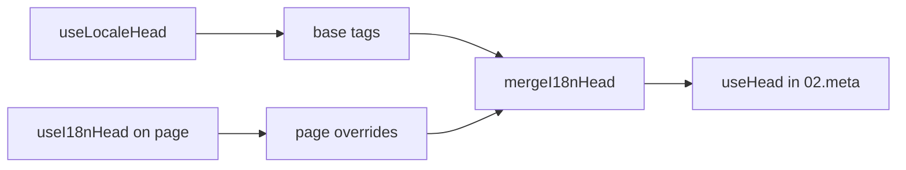

# Composable `useI18nHead`

`useI18nHead` cho phép bạn tùy chỉnh các thẻ SEO i18n **theo từng trang** mà không cần plugin meta tùy chỉnh. Khi `meta: true`, mô-đun sẽ hợp nhất đầu vào của bạn lên trên đầu ra của [`useLocaleHead`](/api/composables/use-locale-head).

Các trường hợp điển hình:

- **Bài viết CMS / blog** — chỉ một số ngôn ngữ được dịch; các URL thay thế khác nhau theo ngôn ngữ (slug hoặc đường dẫn khác nhau).
- **Canonical động** — URL canonical phải khớp với URL bài viết từ API, không phải từ `$switchLocalePath`.
- **Open Graph bổ sung** — `og:title`, `og:description`, `og:image` bên cạnh các thẻ `og:locale` / `og:url` được tạo tự động.
- **Kiểm soát một phần** — giữ canonical và `og:url` do mô-đun tạo, nhưng chỉ thay thế `hreflang` và `og:locale:alternate`.

---

## Chữ ký

{/* generated:symbol:useI18nHead — do not edit; run `pnpm run docs:generate` */}

```ts
useI18nHead(input?: MaybeRefOrGetter<I18nHeadInput | null>): { pageHead: any; resetPageHead: () => void }
```

Đăng ký các ghi đè ở cấp trang cho các thẻ head SEO i18n.
Được hợp nhất lên trên đầu ra của `useLocaleHead` bởi plugin `02.meta`.

| Tham số | Kiểu | Mô tả |
| --- | --- | --- |
| `input` *(tùy chọn)* | `MaybeRefOrGetter<I18nHeadInput \| null>` |  |

{/* /generated:symbol:useI18nHead */}

## Vị trí trong quy trình



Bạn gọi `useI18nHead` trong một thành phần trang. Plugin `02.meta` áp dụng các ghi đè sau mỗi `updateMeta()` (đổi route, `$setI18nRouteParams`, `page:finish` trên client).

---

## Ví dụ 1 — Bài viết chỉ có bản dịch ở một số ngôn ngữ

Một mẫu phổ biến: API trả về những ngôn ngữ nào tồn tại và URL tuyệt đối hoặc tương đối của chúng.

```ts
interface Article {
  title: string
  slug: string
  /** Locale code → page URL (absolute or site-relative) */
  locales: Record<string, string>
}
```

```vue
<script setup lang="ts">
const route = useRoute()
const { data: article } = await useFetch<Article>(`/api/articles/${route.params.slug}`)

const localeCodes = computed(() => Object.keys(article.value?.locales ?? {}))

useI18nHead(() => {
  if (!article.value) return null

  return {
    meta: [
      { property: 'og:title', content: article.value.title },
      { property: 'og:type', content: 'article' },
    ],
    replace: {
      hreflang: localeCodes.value.map((locale) => ({
        rel: 'alternate',
        hreflang: locale,
        href: article.value!.locales[locale]!,
      })),
      ogAlternates: localeCodes.value,
    },
  }
})
</script>
```

`ogAlternates` nhận **mã ngôn ngữ** từ cấu hình `i18n.locales` của bạn. Giá trị cho `og:locale:alternate` được phân giải qua `locale.og` hoặc `iso` (định dạng Open Graph `en_US`).

---

## Ví dụ 2 — Bài viết với slug theo từng ngôn ngữ (`$defineI18nRoute` + `$setI18nRouteParams`)

Khi URL được xây dựng từ các mẫu route được bản địa hóa và tham số động:

```vue
<script setup lang="ts">
const { $defineI18nRoute, $setI18nRouteParams } = useNuxtApp()
const route = useRoute()

const { data: article } = await useFetch(`/api/articles/${route.params.slug}`)

$defineI18nRoute({
  localeRoutes: {
    en: '/blog/[slug]',
    de: '/de/blog/[slug]',
    fr: '/fr/blog/[slug]',
  },
})

if (article.value) {
  $setI18nRouteParams({
    en: { slug: article.value.slugEn },
    de: { slug: article.value.slugDe },
    fr: { slug: article.value.slugFr },
  })

  const availableLocales = article.value.availableLocales as string[]

  useI18nHead({
    meta: [{ property: 'og:title', content: article.value.title }],
    replace: {
      hreflang: availableLocales.map((locale) => ({
        rel: 'alternate',
        hreflang: locale,
        href: article.value!.urls[locale],
      })),
      ogAlternates: availableLocales,
    },
  })
}
</script>
```

Các thẻ alternate do mô-đun sinh sẽ liệt kê **tất cả** ngôn ngữ đã cấu hình. `replace.hreflang` giới hạn các thẻ chỉ ở những ngôn ngữ thực sự có bản dịch.

---

## Ví dụ 3 — `x-default` tùy chỉnh cho URL bài viết ở ngôn ngữ mặc định

Theo mặc định, `x-default` trỏ đến URL của ngôn ngữ mặc định từ `$switchLocalePath`. Với bài viết, hãy trỏ nó đến URL bản dịch mặc định:

```vue
<script setup lang="ts">
const { $defaultLocale } = useNuxtApp()
const article = await loadArticle()

const defaultLocale = $defaultLocale() ?? 'en'
const defaultHref = article.locales[defaultLocale]

useI18nHead({
  replace: {
    hreflang: Object.entries(article.locales).map(([locale, href]) => ({
      rel: 'alternate',
      hreflang: locale,
      href,
    })),
    xDefault: defaultHref ? { rel: 'alternate', hreflang: 'x-default', href: defaultHref } : false,
    ogAlternates: Object.keys(article.locales),
  },
})
</script>
```

---

## Ví dụ 4 — Thay canonical và `og:url` từ dữ liệu API

Khi canonical phải khớp với URL do CMS cung cấp (đa miền, đường dẫn tùy chỉnh, hoặc URL tuyệt đối được tạo sẵn):

```vue
<script setup lang="ts">
const article = await loadArticle()
const canonical = article.canonicalUrl // e.g. https://www.example.com/en/blog/my-post

useI18nHead({
  replace: {
    canonical,
    ogUrl: canonical,
    hreflang: buildAlternateLinks(article),
    ogAlternates: Object.keys(article.locales),
  },
  meta: [
    { property: 'og:title', content: article.title },
    { name: 'description', content: article.excerpt },
  ],
})
</script>
```

---

## Ví dụ 5 — Giữ canonical / `og:url` tự động, chỉ thay các thẻ alternate

Nếu `$switchLocalePath` + `$setI18nRouteParams` đã tạo canonical và `og:url` đúng, hãy chỉ thay các thẻ khám phá:

```vue
<script setup lang="ts">
const article = await loadArticle()

useI18nHead({
  replace: {
    hreflang: buildAlternateLinks(article),
    ogAlternates: Object.keys(article.locales),
  },
})
</script>
```

---

## Ví dụ 6 — Head đầy đủ cho trang chi tiết nội dung (meta + link)

Mẫu tương tự như tách "meta của trang" và "liên kết alternate" thành các trợ giúp riêng, kết hợp trong một lời gọi:

```vue
<script setup lang="ts">
const article = await loadArticle()
const alternates = Object.entries(article.locales).map(([locale, href]) => ({
  rel: 'alternate' as const,
  hreflang: locale,
  href: normalizeSeoUrl(href), // strip ?query and #hash if needed
}))

useI18nHead({
  meta: [
    { property: 'og:title', content: article.title },
    { property: 'og:description', content: article.description },
    { property: 'og:image', content: article.imageUrl },
    { name: 'twitter:card', content: 'summary_large_image' },
    { name: 'twitter:title', content: article.title },
  ],
  replace: {
    canonical: article.canonicalUrl,
    ogUrl: article.canonicalUrl,
    hreflang: alternates,
    ogAlternates: Object.keys(article.locales),
  },
})
</script>
```

```ts
/** Remove query and hash — useful when CMS URLs must be clean for SEO */
function normalizeSeoUrl(href: string): string {
  try {
    const url = new URL(href, 'https://placeholder.local')
    url.search = ''
    url.hash = ''
    return href.startsWith('http') ? url.href : `${url.pathname}`
  } catch {
    return href.split(/[?#]/)[0] ?? href
  }
}
```

---

## Ví dụ 7 — Hai loại nội dung, cùng một mẫu (tin tức so với hướng dẫn)

Cùng cấu trúc API, khác tên route. Hãy tái sử dụng một trợ giúp nhỏ:

```ts
// composables/useArticleHead.ts
import type { I18nHeadInput } from '@i18n-micro/types'

interface LocalizedContent {
  title: string
  locales: Record<string, string>
  canonicalUrl?: string
}

export function buildArticleHead(content: LocalizedContent): I18nHeadInput {
  const localeCodes = Object.keys(content.locales)
  const canonical = content.canonicalUrl ?? content.locales.en

  return {
    meta: [{ property: 'og:title', content: content.title }],
    replace: {
      canonical,
      ogUrl: canonical,
      hreflang: localeCodes.map((locale) => ({
        rel: 'alternate',
        hreflang: locale,
        href: content.locales[locale]!,
      })),
      ogAlternates: localeCodes,
    },
  }
}
```

```vue
<!-- pages/blog/[slug].vue -->
<script setup lang="ts">
const article = await loadArticle()
useI18nHead(buildArticleHead(article))
</script>
```

```vue
<!-- pages/guides/[slug].vue -->
<script setup lang="ts">
const guide = await loadGuide()
useI18nHead(buildArticleHead(guide))
</script>
```

---

## Ví dụ 8 — Tắt các thẻ alternate tích hợp, cung cấp danh sách của riêng bạn

Tương đương với việc tắt bộ sinh hreflang của mô-đun và truyền danh sách tùy chỉnh (không có tập alternate trùng lặp):

```vue
<script setup lang="ts">
const article = await loadArticle()

useI18nHead({
  disable: ['hreflang', 'x-default', 'og-alternates'],
  link: Object.entries(article.locales).map(([locale, href]) => ({
    rel: 'alternate',
    hreflang: locale,
    href,
  })),
  replace: {
    ogAlternates: Object.keys(article.locales),
  },
})
</script>
```

Hoặc ưu tiên dùng `replace.hreflang` mà không cần `disable`. Nó thay thế mọi liên kết `rel="alternate"` chỉ trong một bước.

---

## Ví dụ 9 — Trang landing: chỉ thêm OG bổ sung, giữ tất cả thẻ i18n

```vue
<script setup lang="ts">
const { t } = useI18n()

useI18nHead({
  meta: [
    { property: 'og:title', content: t('landing.ogTitle') },
    { property: 'og:description', content: t('landing.ogDescription') },
  ],
})
</script>
```

---

## Ví dụ 10 — Trang sản phẩm: tắt hreflang cho một thử nghiệm ngôn ngữ đơn lẻ

```vue
<script setup lang="ts">
useI18nHead({
  disable: ['hreflang', 'x-default'],
  // canonical, og:locale, og:url still generated
})
</script>
```

---

## Ví dụ 11 — Cập nhật phản ứng sau khi fetch phía client

```vue
<script setup lang="ts">
const article = ref<Article | null>(null)

onMounted(async () => {
  article.value = await $fetch('/api/articles/latest')
})

useI18nHead(() => {
  if (!article.value) return null
  return {
    meta: [{ property: 'og:title', content: article.value.title }],
    replace: {
      hreflang: Object.entries(article.value.locales).map(([locale, href]) => ({
        rel: 'alternate',
        hreflang: locale,
        href,
      })),
    },
  }
})
</script>
```

Head làm mới ở sự kiện `page:finish` và khi trạng thái `pageHead` thay đổi.

---

## Ví dụ 12 — Origin HTTPS sau reverse proxy

Nếu bạn từng phân giải một composable "public origin" cho URL canonical / alternate tuyệt đối, hãy dùng cấu hình mô-đun thay thế:

```ts
// nuxt.config.ts
export default defineNuxtConfig({
  i18n: {
    meta: true,
    // undefined = origin from current request (multi-domain friendly)
    metaBaseUrl: undefined,
    metaTrustForwardedHost: true,
    metaTrustForwardedProto: true,
  },
})
```

Sau đó truyền **đường dẫn hoặc URL đầy đủ** trong `replace.hreflang` / `replace.canonical`. Mô-đun dùng `useRequestURL` với `X-Forwarded-Host` / `X-Forwarded-Proto` trên SSR.

---

## Tham chiếu API

### `meta`

Các thẻ `<meta>` bổ sung. Bỏ trùng lặp theo `id`, `property`, hoặc `name`.

### `link`

Các thẻ `<link>` bổ sung. Bỏ trùng lặp theo `id` hoặc `rel` + `hreflang`.

### `htmlAttrs`

Được hợp nhất vào các thuộc tính `<html>` từ `useLocaleHead` (`lang`, `dir`).

### `replace`

| Khóa | Kiểu | Hiệu ứng |
| -------------- | ------------------------- | ---------------------------------------------- |
| `canonical` | `string \| false` | Thay hoặc bỏ liên kết canonical |
| `hreflang` | `I18nHeadLink[] \| false` | Thay hoặc bỏ mọi liên kết `rel="alternate"` |
| `xDefault` | `I18nHeadLink \| false` | Thay hoặc bỏ `hreflang="x-default"` |
| `ogLocale` | `string \| false` | Thay hoặc bỏ `og:locale` |
| `ogUrl` | `string \| false` | Thay hoặc bỏ `og:url` |
| `ogAlternates` | `string[] \| false` | Tái tạo `og:locale:alternate` cho các mã ngôn ngữ |

### `disable`

| Giá trị | Loại bỏ |
| --------------- | ---------------------------------------- |
| `hreflang` | Các liên kết alternate ngôn ngữ (không phải `x-default`) |
| `x-default` | Liên kết `hreflang="x-default"` |
| `canonical` | Liên kết canonical |
| `og` | `og:locale` và `og:url` |
| `og-alternates` | Các thẻ `og:locale:alternate` |
| `html` | `lang` / `dir` trên `<html>` |

---

## `useLocaleHead` so với `useI18nHead`

| Composable | Phạm vi | Khi nào dùng |
| --------------- | -------------------- | ------------------------------------------ |
| `useLocaleHead` | Head toàn cục / thủ công | `meta: false`, thiết lập `useHead` tùy chỉnh hoàn toàn |
| `useI18nHead` | Ghi đè theo trang | `meta: true`, tùy chỉnh các trang cụ thể |

Khi `meta: true`, bạn **không** cần `useLocaleHead` trên các trang chỉ dùng `useI18nHead`.

---

## Di chuyển từ plugin head i18n tùy chỉnh

Nhiều dự án duy trì một plugin tùy chỉnh:

- gộp các liên kết alternate theo trang từ trạng thái dùng chung;
- lọc các mục `hreflang` khu vực trùng lặp;
- chuẩn hóa các giá trị `og:locale`;
- loại bỏ chuỗi truy vấn khỏi URL SEO.

Bạn có thể thay thế điều đó bằng `useI18nHead` trên mỗi trang nội dung cùng với các mặc định của mô-đun.

| Cách tiếp cận trước đây | Với `useI18nHead` |
| ----------------------------------------------------- | ---------------------------------------------------- |
| Trạng thái dùng chung + "ngôn ngữ nào có cho bài viết này" | `replace: \{ ogAlternates: localeCodes \}` |
| Trợ giúp riêng xây dựng các liên kết `rel="alternate"` | `replace: \{ hreflang: links \}` |
| Plugin tùy chỉnh gộp trạng thái trang vào head | Gộp tích hợp trong `02.meta` |
| "Public origin" tùy chỉnh cho URL tuyệt đối | `metaBaseUrl` + header forwarded (xem Ví dụ 12) |
| `og:locale` ngắn (`en` thay cho `en_US`) | Đặt `locale.og` hoặc dùng `iso` → `en_US` (theo giao thức OG) |

**`hreflang` từ `iso`:** mỗi ngôn ngữ phát ra một alternate với `hreflang = iso || code`. Mã `code` khi định tuyến không bao giờ được dùng khi `iso` đã được đặt (tránh các thẻ không hợp lệ như `hreflang="mx"`). Bật fallback ngôn ngữ trần (`es-ES` → cũng có `es`) bằng `hreflangBaseLanguage: true`. Fallback được suy ra từ `iso`, không phải `code`. Với danh sách tùy chỉnh hoàn toàn, hãy dùng `replace.hreflang`.

**JSON-LD:** `useI18nHead` không sinh dữ liệu có cấu trúc. Hãy giữ `useHead(\{ script: [...] \})` hoặc một trợ giúp JSON-LD chuyên dụng bên cạnh nó.

---

## Xem thêm

- [Hướng dẫn SEO](/guides/seo) — tạo meta tự động và ghi đè theo trang
- [`useLocaleHead`](/api/composables/use-locale-head) — API head cấp thấp
