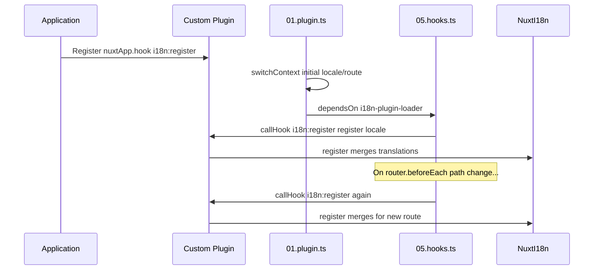

# 📢 Sự kiện

## 🔄 `i18n:register`

Sự kiện `i18n:register` trong `Nuxt I18n Micro` cho phép thêm bản dịch động vào ngữ cảnh i18n của ứng dụng, giúp quá trình quốc tế hóa liền mạch và linh hoạt. Sự kiện này cho phép bạn tích hợp bản dịch mới khi cần, nâng cao khả năng bản địa hóa của ứng dụng.

### 📝 Chi tiết sự kiện

- **Mục đích**:
  - Cho phép hợp nhất động các bản dịch bổ sung vào tập hợp hiện có cho một ngôn ngữ cụ thể.

- **Payload**:
  - **`register`**:
    - Một hàm do sự kiện cung cấp, nhận hai đối số:
      - **`translations`** (`Translations`):
        - Một đối tượng chứa các cặp khóa-giá trị đại diện cho bản dịch, được tổ chức theo interface `Translations`.
      - **`locale`** (`string`, tùy chọn):
        - Mã ngôn ngữ (ví dụ `'en'`, `'ru'`) mà bản dịch được đăng ký cho. Mặc định là ngôn ngữ do sự kiện cung cấp nếu không được chỉ định.

- **Hành vi**:
  - Khi được kích hoạt, hàm `register` hợp nhất các bản dịch mới vào ngữ cảnh hiện tại cho ngôn ngữ được chỉ định, cập nhật các bản dịch có sẵn trên toàn ứng dụng.

### ⏱️ Khi nào nó kích hoạt

Plugin hooks của mô-đun (`05.hooks.ts`, `dependsOn: ['i18n-plugin-loader']`) gọi `nuxtApp.callHook('i18n:register', …)`:

1. **Một lần khi khởi động** — sau khi plugin i18n chính (`01.plugin.ts`) đã tải các bản dịch cho route ban đầu.
2. **Khi điều hướng** — trong `router.beforeEach` khi đường dẫn thay đổi, hoặc trên mọi lần điều hướng khi `strategy: 'no_prefix'`.

Đăng ký listener của bạn trong một plugin Nuxt thông thường với `nuxtApp.hook('i18n:register', …)`. Plugin hooks chạy sau khi loader đã sẵn sàng, nên callback của bạn được gọi khi cần mở rộng bản dịch.

Đặt `hooks: false` trong `nuxt.config` để tắt các lời gọi `i18n:register` tự động (xem [Cấu hình — `hooks`](/guides/configuration#hooks)).

### 💡 Ví dụ sử dụng

Ví dụ sau minh họa cách dùng sự kiện `i18n:register` để thêm bản dịch một cách động:

```typescript
nuxt.hook('i18n:register', async (register: (translations: unknown, locale?: string) => void, locale: string) => {
  register(
    {
      greeting: 'Hello',
      farewell: 'Goodbye',
    },
    locale,
  )
})
```

### 🛠️ Giải thích



- **Kích hoạt sự kiện**:
  - Plugin hooks (`05.hooks.ts`) kích hoạt `i18n:register` sau khi loader chính đã sẵn sàng và trên các lần điều hướng có liên quan.

- **Thêm bản dịch**:
  - Ví dụ đăng ký các bản dịch tiếng Anh cho `"greeting"` và `"farewell"`.
  - Hàm `register` hợp nhất các bản dịch này vào tập hợp hiện có cho ngôn ngữ được cung cấp.

### 🔗 Lợi ích chính

- **Cập nhật động**:
  - Dễ dàng cập nhật hoặc thêm bản dịch mà không cần triển khai lại toàn bộ ứng dụng.

- **Bản địa hóa linh hoạt**:
  - Hỗ trợ điều chỉnh bản địa hóa theo thời gian thực dựa trên nhu cầu của người dùng hoặc ứng dụng.

Sử dụng sự kiện `i18n:register`, bạn có thể đảm bảo chiến lược bản địa hóa của ứng dụng luôn linh hoạt và thích ứng, nâng cao trải nghiệm người dùng tổng thể.

---

## 🛠️ Sửa đổi bản dịch bằng plugin

Để sửa đổi bản dịch động trong ứng dụng Nuxt, bạn nên dùng plugin. Plugin cung cấp cách có cấu trúc để xử lý cập nhật bản địa hóa, đặc biệt khi làm việc với các mô-đun hoặc tệp bản dịch bên ngoài.

### **Đăng ký plugin**

Nếu bạn dùng một mô-đun, hãy đăng ký plugin nơi diễn ra việc sửa đổi bản dịch bằng cách thêm nó vào cấu hình của mô-đun:

```javascript
addPlugin({
  src: resolve('./plugins/extend_locales'),
})
```

Đoạn này đăng ký plugin nằm ở `./plugins/extend_locales`, plugin này sẽ xử lý việc tải và đăng ký bản dịch động.

### **Triển khai plugin**

Trong plugin, bạn có thể quản lý các sửa đổi ngôn ngữ. Đây là một triển khai ví dụ trong plugin Nuxt:

```typescript
import { defineNuxtPlugin } from '#app'

export default defineNuxtPlugin(async (nuxtApp) => {
  // Function to load translations from JSON files and register them
  const loadTranslations = async (lang: string) => {
    try {
      const translations = await import(`../locales/${lang}.json`)
      return translations.default
    } catch (error) {
      console.error(`Error loading translations for language: ${lang}`, error)
      return null
    }
  }

  // Hook into the 'i18n:register' event to dynamically add translations
  // eslint-disable-next-line @typescript-eslint/ban-ts-comment
  // @ts-expect-error
  nuxtApp.hook('i18n:register', async (register: (translations: unknown, locale?: string) => void, locale: string) => {
    const translations = await loadTranslations(locale)
    if (translations) {
      register(translations, locale)
    }
  })
})
```

### 📝 Giải thích chi tiết

1. **Tải bản dịch**:

- Hàm `loadTranslations` nhập động các tệp bản dịch dựa trên ngôn ngữ. Các tệp được mong đợi nằm trong thư mục `locales` và được đặt tên theo mã ngôn ngữ (ví dụ `en.json`, `de.json`).
- Khi tải thành công, bản dịch được trả về; nếu không, một lỗi được ghi log.

2. **Đăng ký bản dịch**:

- Plugin gắn vào sự kiện `i18n:register` bằng `nuxtApp.hook`.
- Khi sự kiện được kích hoạt, hàm `register` được gọi với các bản dịch đã tải và ngôn ngữ tương ứng.
- Nó hợp nhất các bản dịch mới vào ngữ cảnh i18n cho ngôn ngữ được chỉ định, cập nhật các bản dịch có sẵn trên toàn ứng dụng.

### 🔗 Lợi ích khi dùng plugin để sửa đổi bản dịch

- **Phân tách trách nhiệm**:
  - Đóng gói logic bản địa hóa tách biệt với mã ứng dụng chính, giúp quản lý và bảo trì dễ dàng hơn.

- **Động và có khả năng mở rộng**:
  - Bằng cách tải và đăng ký bản dịch động, bạn có thể cập nhật nội dung mà không cần triển khai lại toàn bộ ứng dụng. Điều này đặc biệt hữu ích cho các ứng dụng có nội dung được cập nhật thường xuyên hoặc đa ngôn ngữ.

- **Linh hoạt bản địa hóa nâng cao**:
  - Plugin cho phép bạn sửa đổi hoặc mở rộng bản dịch khi cần, cung cấp một chiến lược bản địa hóa linh hoạt và đáp ứng nhu cầu người dùng hoặc yêu cầu kinh doanh.

Bằng cách áp dụng cách tiếp cận này, bạn có thể mở rộng và sửa đổi bản địa hóa của ứng dụng một cách hiệu quả thông qua một quy trình có cấu trúc và dễ bảo trì bằng cách sử dụng plugin, giữ cho quốc tế hóa thích ứng với nhu cầu thay đổi và cải thiện trải nghiệm người dùng tổng thể.
