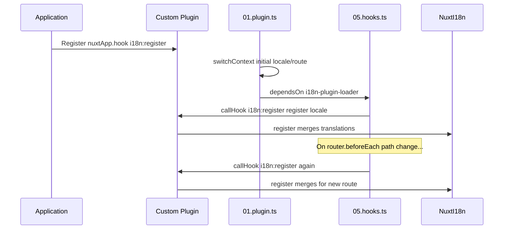

# 📢 Sự kiện

## 🔄 `i18n:register`

Sự kiện `i18n:register` trong `Nuxt I18n Micro` cho phép thêm động các bản dịch vào ngữ cảnh i18n của ứng dụng, làm cho quy trình quốc tế hóa liền mạch và linh hoạt. Sự kiện này cho phép bạn tích hợp các bản dịch mới khi cần, nâng cao khả năng bản địa hóa của ứng dụng.

### 📝 Chi tiết sự kiện

- **Mục đích**:
  - Cho phép kết hợp động các bản dịch bổ sung vào tập hợp hiện có cho một locale cụ thể.

- **Payload**:
  - **`register`**:
    - Một hàm được cung cấp bởi sự kiện, nhận hai đối số:
      - **`translations`** (`Translations`):
        - Một object chứa các cặp khóa-giá trị đại diện cho các bản dịch, được tổ chức theo interface `Translations`.
      - **`locale`** (`string`, tùy chọn):
        - Mã locale (ví dụ, `'en'`, `'ru'`) mà các bản dịch được đăng ký. Mặc định là locale được cung cấp bởi sự kiện nếu không được chỉ định.

- **Hành vi**:
  - Khi được kích hoạt, hàm `register` gộp các bản dịch mới vào ngữ cảnh hiện tại cho locale đã chỉ định, cập nhật các bản dịch khả dụng trên toàn ứng dụng.

### ⏱️ Khi nào nó kích hoạt

Plugin hook của module (`05.hooks.ts`, `dependsOn: ['i18n-plugin-loader']`) gọi `nuxtApp.callHook('i18n:register', …)`:

1. **Một lần khi khởi động** — sau khi plugin i18n chính (`01.plugin.ts`) đã tải các bản dịch cho route ban đầu
2. **Khi điều hướng** — trong `router.beforeEach` khi đường dẫn thay đổi, hoặc trên mọi lần điều hướng khi `strategy: 'no_prefix'`

Đăng ký listener của bạn trong một plugin Nuxt thông thường với `nuxtApp.hook('i18n:register', …)`. Plugin hook chạy sau khi loader sẵn sàng, nên callback của bạn được gọi khi các bản dịch cần mở rộng.

Đặt `hooks: false` trong `nuxt.config` để vô hiệu hóa các cuộc gọi `i18n:register` tự động (xem [Cấu hình — `hooks`](/guides/configuration#hooks)).

### 💡 Ví dụ sử dụng

Ví dụ sau minh họa cách dùng sự kiện `i18n:register` để thêm động các bản dịch:

```typescript
nuxt.hook('i18n:register', async (register: (translations: unknown, locale?: string) => void, locale: string) => {
  register(
    {
      greeting: 'Hello',
      farewell: 'Goodbye',
    },
    locale,
  )
})
```

### 🛠️ Giải thích



- **Kích hoạt sự kiện**:
  - Plugin hook (`05.hooks.ts`) phát `i18n:register` sau khi loader chính sẵn sàng và trên các điều hướng liên quan.

- **Thêm bản dịch**:
  - Ví dụ đăng ký các bản dịch tiếng Anh cho `"greeting"` và `"farewell"`.
  - Hàm `register` gộp các bản dịch này vào tập hợp hiện có cho locale được cung cấp.

### 🔗 Lợi ích chính

- **Cập nhật động**:
  - Dễ dàng cập nhật hoặc thêm các bản dịch mà không cần redeploy toàn bộ ứng dụng.

- **Tính linh hoạt bản địa hóa**:
  - Hỗ trợ điều chỉnh bản địa hóa theo thời gian thực dựa trên nhu cầu của người dùng hoặc ứng dụng.

Bằng cách dùng sự kiện `i18n:register`, bạn có thể đảm bảo chiến lược bản địa hóa của ứng dụng vẫn linh hoạt và dễ thích ứng, nâng cao trải nghiệm người dùng tổng thể.

---

## 🛠️ Sửa đổi bản dịch bằng Plugin

Để sửa đổi các bản dịch động trong ứng dụng Nuxt, dùng plugin được khuyến nghị. Plugin cung cấp một cách có cấu trúc để xử lý các cập nhật bản địa hóa, đặc biệt khi làm việc với các module hoặc các tệp bản dịch bên ngoài.

### **Đăng ký Plugin**

Nếu bạn đang dùng một module, hãy đăng ký plugin nơi các sửa đổi bản dịch sẽ xảy ra bằng cách thêm nó vào cấu hình module:

```javascript
addPlugin({
  src: resolve('./plugins/extend_locales'),
})
```

Điều này đăng ký plugin nằm tại `./plugins/extend_locales`, sẽ xử lý tải động và đăng ký các bản dịch.

### **Triển khai Plugin**

Trong plugin, bạn có thể quản lý các sửa đổi locale. Đây là ví dụ triển khai trong một plugin Nuxt:

```typescript
import { defineNuxtPlugin } from '#app'

export default defineNuxtPlugin(async (nuxtApp) => {
  // Function to load translations from JSON files and register them
  const loadTranslations = async (lang: string) => {
    try {
      const translations = await import(`../locales/${lang}.json`)
      return translations.default
    } catch (error) {
      console.error(`Error loading translations for language: ${lang}`, error)
      return null
    }
  }

  // Hook into the 'i18n:register' event to dynamically add translations
  // eslint-disable-next-line @typescript-eslint/ban-ts-comment
  // @ts-expect-error
  nuxtApp.hook('i18n:register', async (register: (translations: unknown, locale?: string) => void, locale: string) => {
    const translations = await loadTranslations(locale)
    if (translations) {
      register(translations, locale)
    }
  })
})
```

### 📝 Giải thích chi tiết

1. **Tải bản dịch**:

- Hàm `loadTranslations` import động các tệp bản dịch dựa trên locale. Các tệp được mong đợi ở trong thư mục `locales` và được đặt tên theo các mã locale (ví dụ, `en.json`, `de.json`).
- Khi tải thành công, các bản dịch được trả về; nếu không, một lỗi được ghi log.

2. **Đăng ký bản dịch**:

- Plugin hook vào sự kiện `i18n:register` bằng `nuxtApp.hook`.
- Khi sự kiện được kích hoạt, hàm `register` được gọi với các bản dịch đã tải và locale tương ứng.
- Điều này gộp các bản dịch mới vào ngữ cảnh i18n cho locale đã chỉ định, cập nhật các bản dịch khả dụng trong toàn bộ ứng dụng.

### 🔗 Lợi ích của việc dùng Plugin cho các sửa đổi bản dịch

- **Tách biệt mối quan tâm**:
  - Đóng gói logic bản địa hóa riêng biệt với mã ứng dụng chính, giúp quản lý và bảo trì dễ dàng hơn.

- **Động và có thể mở rộng**:
  - Bằng cách tải và đăng ký các bản dịch động, bạn có thể cập nhật nội dung mà không cần redeploy toàn bộ ứng dụng, điều này đặc biệt hữu ích cho các ứng dụng có nội dung thường xuyên cập nhật hoặc đa ngôn ngữ.

- **Tính linh hoạt bản địa hóa được nâng cao**:
  - Plugin cho phép bạn sửa đổi hoặc mở rộng các bản dịch khi cần, cung cấp chiến lược bản địa hóa dễ thích ứng và phản hồi hơn đáp ứng sở thích người dùng hoặc yêu cầu kinh doanh.

Bằng cách áp dụng cách tiếp cận này, bạn có thể mở rộng và sửa đổi hiệu quả việc bản địa hóa của ứng dụng thông qua một quy trình có cấu trúc và dễ bảo trì bằng cách dùng plugin, giữ cho quốc tế hóa thích ứng với các nhu cầu thay đổi và cải thiện trải nghiệm người dùng tổng thể.
