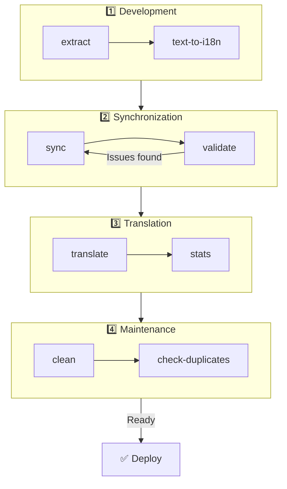

# 🌐 Hướng dẫn nuxt-i18n-micro-cli

## 📖 Giới thiệu

`nuxt-i18n-micro-cli` là một công cụ dòng lệnh được thiết kế để tinh gọn quá trình bản địa hóa và quốc tế hóa trong các dự án Nuxt.js dùng mô-đun `nuxt-i18n-micro` (Nuxt I18n Micro). Nó cung cấp các tiện ích để trích xuất khóa bản dịch từ mã nguồn, quản lý các tệp bản dịch, đồng bộ hóa bản dịch giữa các ngôn ngữ và tự động hóa quá trình dịch bằng các dịch vụ dịch bên ngoài.

Hướng dẫn này sẽ dẫn bạn qua việc cài đặt, cấu hình và sử dụng `nuxt-i18n-micro-cli` để quản lý các bản dịch dự án một cách hiệu quả. Gói trên [npmjs.com](https://www.npmjs.com/package/nuxt-i18n-micro-cli).

## 🔧 Cài đặt và thiết lập

### 📦 Cài đặt nuxt-i18n-micro-cli

Cài đặt toàn cục hoặc dưới dạng dev dependency trong dự án Nuxt (khuyến nghị cho CI):

```bash
# global
npm install -g nuxt-i18n-micro-cli

# or per project
pnpm add -D nuxt-i18n-micro-cli
pnpm exec i18n-micro text-to-i18n --dryRun
```

Dùng **`nuxt-i18n-micro-cli` ≥ 2.1.1** nếu dự án của bạn dùng thư mục `app/` của Nuxt 4 (`app/pages`, `app/components`, v.v.). Các phiên bản CLI cũ chỉ quét `pages/` ở gốc dự án.

### 🛠 Khởi tạo trong dự án

Sau khi cài đặt, bạn có thể chạy các lệnh `i18n-micro` trong thư mục dự án Nuxt.js.

Đảm bảo dự án đã được thiết lập với `nuxt-i18n-micro` và có cấu hình cần thiết trong `nuxt.config.ts` (hoặc `nuxt.config.js`).

### 📄 Đối số phổ biến

- `--cwd`: Chỉ định thư mục làm việc hiện tại (mặc định là `.`).
- `--logLevel`: Đặt mức log (`silent`, `info`, `verbose`).
- `--translationDir`: Thư mục chứa các tệp JSON bản dịch (mặc định: `locales`).

## 📊 Tổng quan quy trình CLI



### Các bước quy trình

| Giai đoạn | Lệnh | Mục đích |
| --------------- | --------------------------- | --------------------------------- |
| **Phát triển** | `extract`, `text-to-i18n` | Tìm và trích xuất khóa bản dịch |
| **Đồng bộ** | `sync`, `validate` | Đảm bảo mọi ngôn ngữ có cùng khóa |
| **Dịch** | `translate`, `stats` | Tự động dịch các khóa thiếu |
| **Bảo trì** | `clean`, `check-duplicates` | Giữ các bản dịch gọn gàng |

## 📋 Các lệnh

### 🔄 Lệnh `text-to-i18n`

Gói CLI: [`nuxt-i18n-micro-cli`](https://www.npmjs.com/package/nuxt-i18n-micro-cli)

**Mô tả**: Quét các tệp Vue/TS/JS để tìm các chuỗi cứng hướng tới người dùng, thay chúng bằng `$t('...')`, và gộp các khóa mới vào tệp JSON bản dịch. Chạy từ **gốc dự án Nuxt** (nơi có `nuxt.config`).

**Cách dùng**:

```bash
i18n-micro text-to-i18n [options]
```

**Tùy chọn**:

| Tùy chọn | Mặc định | Mô tả |
| ----------------------- | ----------------- | --------------------------------------------------------------------- |
| `--translationFile`     | `locales/en.json` | Tệp JSON cho các khóa mới (tương đối với gốc dự án). |
| `--path`                | —                 | Chỉ xử lý một tệp hoặc thư mục (ví dụ `app/pages/about.vue`). |
| `--context`             | —                 | Tiền tố khóa (ví dụ `auth` → `auth.*`). |
| `--dryRun`              | `false`           | Xem trước mà không ghi tệp. |
| `--verbose`             | `false`           | Ghi log thêm. |
| `--interactive`         | `false`           | Xác nhận hoặc chỉnh sửa mỗi khóa trước khi áp dụng. |
| `--extractOnlyDirs`     | `plugins`         | Thư mục nơi khóa được trích xuất nhưng tệp nguồn **không** bị viết lại. |
| `--extractOnlyPatterns` | —                 | Các mẫu glob chỉ trích xuất (ví dụ `**/*.plugin.ts`). |

**Ví dụ**:

```bash
i18n-micro text-to-i18n --translationFile locales/en.json --context auth --dryRun
```

#### Thư mục nào được quét?

<Info>
Kể từ CLI **v2.1.1**, `text-to-i18n` quét cả các thư mục root cổ điển và các thư mục tương đương `app/*`. Chạy lệnh từ **gốc dự án**. Không `cd app`.
</Info>

Thu thập `*.vue`, `*.js` và `*.ts` dưới:

| Nuxt 3 (gốc dự án) | Nuxt 4 (thư mục `app/`) |
| --------------------- | ------------------------- |
| `pages/`              | `app/pages/`              |
| `components/`         | `app/components/`         |
| `plugins/`            | `app/plugins/`            |
| `layouts/`            | `app/layouts/`            |

Các thư mục khác (`server/`, `composables/`, `middleware/`, v.v.) bị bỏ qua trừ khi bạn dùng `--path`. Với Nuxt 4, chạy từ gốc dự án (không cần `cd app`). Khớp `i18n.translationDir` trong `--translationFile` nếu nó không phải `locales/`.

```bash
i18n-micro text-to-i18n --path app/pages
```

#### Cách hoạt động

1. Thu thập các tệp từ các thư mục ở trên (hoặc từ `--path`).
2. Thay thế các literal / văn bản template bằng `$t('generated.key')` (`plugins/` chỉ trích xuất theo mặc định).
3. Gộp các khóa mới vào `--translationFile` mà không xóa các mục hiện có.

**Ví dụ chuyển đổi**:

Trước:

```vue
<template>
  <div>
    <h1>Welcome to our site</h1>
    <p>Please sign in to continue</p>
  </div>
</template>
```

Sau:

```vue
<template>
  <div>
    <h1>{{ $t('pages.home.welcome_to_our_site') }}</h1>
    <p>{{ $t('pages.home.please_sign_in') }}</p>
  </div>
</template>
```

**Thực hành tốt nhất**: chạy dry run trước; commit trước khi chạy đầy đủ; căn chỉnh `--translationFile` với `i18n.translationDir` trong `nuxt.config`; giữ `--extractOnlyDirs plugins` cho mã bootstrap.

**Hạn chế**: gói npm riêng (không đóng gói với mô-đun); không đọc `nuxt.config` tự động; xuất `$t(...)`; các chuỗi động phức tạp có thể cần `extract` / `search` thay thế.

### 📊 Lệnh `stats`

**Mô tả**: Lệnh `stats` được dùng để hiển thị thống kê bản dịch cho mỗi ngôn ngữ trong dự án Nuxt.js. Nó giúp bạn hiểu tiến độ bản dịch bằng cách hiển thị bao nhiêu khóa được dịch so với tổng số khóa khả dụng.

**Cách dùng**:

```bash
i18n-micro stats [options]
```

**Tùy chọn**:

- `--full`: Chỉ hiển thị thống kê bản dịch kết hợp (mặc định: `false`).

**Ví dụ**:

```bash
i18n-micro stats --full
```

### 🌍 Lệnh `translate`

**Mô tả**: Lệnh `translate` tự động dịch các khóa thiếu bằng các dịch vụ dịch bên ngoài. Lệnh này đơn giản hóa quá trình dịch bằng cách tận dụng các API từ các dịch vụ như Google Translate, DeepL và những dịch vụ khác để điền các bản dịch thiếu.

**Cách dùng**:

```bash
i18n-micro translate [options]
```

**Tùy chọn**:

- `--service`: Dịch vụ dịch để dùng (ví dụ `google`, `deepl`, `yandex`). Nếu không chỉ định, lệnh sẽ nhắc bạn chọn.
- `--token`: Khóa API tương ứng với dịch vụ dịch đã chọn. Nếu không cung cấp, bạn sẽ được nhắc nhập.
- `--options`: Các tùy chọn bổ sung cho dịch vụ dịch, cung cấp dưới dạng cặp key:value, ngăn cách bằng dấu phẩy (ví dụ `model:gpt-3.5-turbo,max_tokens:1000`).
- `--replace`: Dịch tất cả khóa, thay các bản dịch hiện có (mặc định: `false`).

**Ví dụ**:

```bash
i18n-micro translate --service deepl --token YOUR_DEEPL_API_KEY
```

#### 🌐 Dịch vụ dịch được hỗ trợ

Lệnh `translate` hỗ trợ nhiều dịch vụ dịch. Một số dịch vụ được hỗ trợ:

- **Google Translate** (`google`)
- **DeepL** (`deepl`)
- **Yandex Translate** (`yandex`)
- **OpenAI** (`openai`)
- **Azure Translator** (`azure`)
- **IBM Watson** (`ibm`)
- **Baidu Translate** (`baidu`)
- **LibreTranslate** (`libretranslate`)
- **MyMemory** (`mymemory`)
- **Lingva Translate** (`lingvatranslate`)
- **Papago** (`papago`)
- **Tencent Translate** (`tencent`)
- **Systran Translate** (`systran`)
- **Yandex Cloud Translate** (`yandexcloud`)
- **ModernMT** (`modernmt`)
- **Lilt** (`lilt`)
- **Unbabel** (`unbabel`)
- **Reverso Translate** (`reverso`)

#### ⚙️ Cấu hình dịch vụ

Một số dịch vụ yêu cầu cấu hình cụ thể hoặc khóa API. Khi dùng lệnh `translate`, bạn có thể chỉ định dịch vụ và cung cấp `--token` yêu cầu (khóa API) và `--options` bổ sung nếu cần.

Ví dụ:

```bash
i18n-micro translate --service openai --token YOUR_OPENAI_API_KEY --options openaiModel:gpt-3.5-turbo,max_tokens:1000
```

### 🛠️ Lệnh `extract`

**Mô tả**: Trích xuất các khóa bản dịch từ mã nguồn và tổ chức chúng theo phạm vi.

**Cách dùng**:

```bash
i18n-micro extract [options]
```

**Tùy chọn**:

- `--prod, -p`: Chạy ở chế độ production.

**Ví dụ**:

```bash
i18n-micro extract
```

### 🔄 Lệnh `sync`

**Mô tả**: Đồng bộ hóa các tệp bản dịch giữa các ngôn ngữ, đảm bảo mọi ngôn ngữ có cùng khóa.

**Cách dùng**:

```bash
i18n-micro sync [options]
```

**Ví dụ**:

```bash
i18n-micro sync
```

### ✅ Lệnh `validate`

**Mô tả**: Xác thực các tệp bản dịch để tìm các khóa thiếu hoặc thừa so với ngôn ngữ tham chiếu.

**Cách dùng**:

```bash
i18n-micro validate [options]
```

**Ví dụ**:

```bash
i18n-micro validate
```

### 🧹 Lệnh `clean`

**Mô tả**: Loại bỏ các khóa bản dịch không sử dụng khỏi các tệp bản dịch.

**Cách dùng**:

```bash
i18n-micro clean [options]
```

**Ví dụ**:

```bash
i18n-micro clean
```

### 📤 Lệnh `import`

**Mô tả**: Chuyển các tệp PO trở lại định dạng JSON và lưu chúng vào thư mục bản dịch.

**Cách dùng**:

```bash
i18n-micro import [options]
```

**Tùy chọn**:

- `--potsDir`: Thư mục chứa các tệp PO (mặc định: `pots`).

**Ví dụ**:

```bash
i18n-micro import --potsDir pots
```

### 📥 Lệnh `export`

**Mô tả**: Xuất các bản dịch sang tệp PO cho việc quản lý bản dịch bên ngoài.

**Cách dùng**:

```bash
i18n-micro export [options]
```

**Tùy chọn**:

- `--potsDir`: Thư mục để lưu các tệp PO (mặc định: `pots`).

**Ví dụ**:

```bash
i18n-micro export --potsDir pots
```

### 🗂️ Lệnh `export-csv`

**Mô tả**: Lệnh `export-csv` xuất các khóa bản dịch và giá trị từ các tệp JSON, bao gồm cả đường dẫn tệp của chúng, sang định dạng CSV. Lệnh này hữu ích cho các nhóm ưa thích làm việc với dữ liệu bản dịch trong phần mềm bảng tính.

**Cách dùng**:

```bash
i18n-micro export-csv [options]
```

**Tùy chọn**:

- `--csvDir`: Thư mục nơi các tệp CSV được xuất sẽ được lưu.
- `--delimiter`: Chỉ định dấu phân cách cho tệp CSV (mặc định: `,`).

**Ví dụ**:

```bash
i18n-micro export-csv --csvDir csv_files
```

### 📑 Lệnh `import-csv`

**Mô tả**: Lệnh `import-csv` nhập dữ liệu bản dịch từ các tệp CSV, cập nhật các tệp JSON tương ứng. Điều này hữu ích để áp dụng cập nhật bản dịch hàng loạt từ bảng tính.

**Cách dùng**:

```bash
i18n-micro import-csv [options]
```

**Tùy chọn**:

- `--csvDir`: Thư mục chứa các tệp CSV để nhập.
- `--delimiter`: Chỉ định dấu phân cách được dùng trong tệp CSV (mặc định: `,`).

**Ví dụ**:

```bash
i18n-micro import-csv --csvDir csv_files
```

### 🧾 Lệnh `diff`

**Mô tả**: So sánh các tệp bản dịch giữa ngôn ngữ mặc định và các ngôn ngữ khác trong cùng thư mục (bao gồm thư mục con). Lệnh xác định các khóa thiếu và giá trị của chúng trong ngôn ngữ mặc định so với các ngôn ngữ khác, giúp dễ theo dõi tiến độ hoặc sự khác biệt trong bản dịch.

**Cách dùng**:

```bash
i18n-micro diff [options]
```

**Ví dụ**:

```bash
i18n-micro diff
```

### 🔍 Lệnh `check-duplicates`

**Mô tả**: Lệnh `check-duplicates` kiểm tra các giá trị bản dịch trùng lặp trong mỗi ngôn ngữ trên tất cả các tệp bản dịch, bao gồm cả bản dịch cấp gốc và riêng theo trang. Nó đảm bảo các khóa khác nhau trong cùng ngôn ngữ không chia sẻ các giá trị bản dịch giống hệt nhau, giúp duy trì sự rõ ràng và nhất quán trong bản dịch.

**Cách dùng**:

```bash
i18n-micro check-duplicates [options]
```

**Ví dụ**:

```bash
i18n-micro check-duplicates
```

**Cách hoạt động**:

- Lệnh kiểm tra cả tệp bản dịch cấp gốc và riêng theo trang cho mỗi ngôn ngữ.
- Nếu một giá trị bản dịch xuất hiện ở nhiều vị trí (hoặc trong các bản dịch cấp gốc hoặc trên các trang khác nhau), nó báo cáo các giá trị trùng lặp cùng với tệp và khóa nơi chúng được tìm thấy.
- Nếu không tìm thấy trùng lặp, lệnh xác nhận ngôn ngữ không có các giá trị bản dịch trùng lặp.

Lệnh này giúp đảm bảo các khóa bản dịch duy trì giá trị duy nhất, ngăn sự lặp lại vô tình trong cùng ngôn ngữ.

### 🔄 Lệnh `replace-values`

**Mô tả**: Lệnh `replace-values` cho phép bạn thực hiện thay thế hàng loạt các giá trị bản dịch trên tất cả các ngôn ngữ. Nó hỗ trợ cả thay thế văn bản đơn giản và thay thế nâng cao dùng biểu thức chính quy (regex). Bạn cũng có thể dùng các nhóm bắt trong các mẫu regex và tham chiếu chúng trong chuỗi thay thế, làm cho nó lý tưởng cho các kịch bản thay thế phức tạp hơn.

**Cách dùng**:

```bash
i18n-micro replace-values [options]
```

**Tùy chọn**:

- `--search`: Văn bản hoặc mẫu regex để tìm trong các bản dịch. Đây là tùy chọn bắt buộc.
- `--replace`: Văn bản thay thế được dùng cho các bản dịch được tìm thấy. Đây là tùy chọn bắt buộc.
- `--useRegex`: Bật tìm kiếm bằng mẫu biểu thức chính quy (mặc định: `false`).

**Ví dụ 1**: Thay thế đơn giản

Thay chuỗi "Hello" bằng "Hi" trên tất cả các ngôn ngữ:

```bash
i18n-micro replace-values --search "Hello" --replace "Hi"
```

**Ví dụ 2**: Thay thế regex

Bật tìm kiếm regex và thay thế bất kỳ chuỗi nào bắt đầu bằng "Hello" theo sau là số (ví dụ "Hello123") bằng "Hi" trên tất cả các ngôn ngữ:

```bash
i18n-micro replace-values --search "Hello\\d+" --replace "Hi" --useRegex
```

**Ví dụ 3**: Sử dụng các nhóm bắt regex

Dùng các nhóm bắt để chèn động phần chuỗi được khớp vào chuỗi thay thế. Ví dụ, thay "Hello [name]" bằng "Hi [name]" trong khi vẫn giữ tên nguyên vẹn:

```bash
i18n-micro replace-values --search "Hello (\\w+)" --replace "Hi $1" --useRegex
```

Trong trường hợp này, `$1` tham chiếu đến nhóm bắt đầu tiên, khớp phần `[name]` sau "Hello". Việc thay thế sẽ giữ tên từ chuỗi gốc.

**Cách hoạt động**:

- Lệnh quét qua tất cả các tệp bản dịch (cả toàn cục và riêng theo trang).
- Khi tìm thấy một khớp dựa trên chuỗi tìm kiếm hoặc mẫu regex, nó thay thế văn bản đã khớp bằng thay thế được cung cấp.
- Khi dùng regex, các nhóm bắt có thể được dùng trong chuỗi thay thế bằng cách tham chiếu chúng với `$1`, `$2`, v.v.
- Tất cả các thay đổi được ghi log, hiển thị đường dẫn tệp, khóa bản dịch và trạng thái trước/sau của giá trị bản dịch.

**Ghi log**:
Với mỗi thay thế, lệnh ghi log chi tiết bao gồm:

- Ngôn ngữ và đường dẫn tệp
- Khóa bản dịch đang được sửa đổi
- Giá trị cũ và giá trị mới sau khi thay thế
- Nếu dùng regex với các nhóm bắt, log sẽ hiển thị các khớp nhóm và cách chúng được thay thế.

Điều này cho phép bạn theo dõi chính xác nơi và những gì thay đổi đã được thực hiện trong hoạt động thay thế, cung cấp lịch sử rõ ràng về các sửa đổi trên các tệp bản dịch.

## 🛠 Ví dụ

- **Trích xuất bản dịch**:

  ```bash
  i18n-micro extract
  ```

- **Dịch các khóa thiếu bằng Google Translate**:

  ```bash
  i18n-micro translate --service google --token YOUR_GOOGLE_API_KEY
  ```

- **Dịch tất cả khóa, thay các bản dịch hiện có**:

  ```bash
  i18n-micro translate --service deepl --token YOUR_DEEPL_API_KEY --replace
  ```

- **Xác thực các tệp bản dịch**:

  ```bash
  i18n-micro validate
  ```

- **Dọn dẹp các khóa bản dịch không sử dụng**:

  ```bash
  i18n-micro clean
  ```

- **Đồng bộ hóa các tệp bản dịch**:

  ```bash
  i18n-micro sync
  ```

## ⚙️ Hướng dẫn cấu hình

`nuxt-i18n-micro-cli` dựa vào cấu hình i18n Nuxt.js của bạn trong `nuxt.config.ts` (hoặc `nuxt.config.js`). Đảm bảo bạn đã cài đặt và cấu hình mô-đun `nuxt-i18n-micro`.

### 🔑 Ví dụ nuxt.config.js

```ts
export default defineNuxtConfig({
  modules: ['nuxt-i18n-micro'],
  i18n: {
    locales: [
      { code: 'en', iso: 'en-US' },
      { code: 'fr', iso: 'fr-FR' },
    ],
    defaultLocale: 'en',
    fallbackLocale: 'en',
    translationDir: 'locales', // or 'app/locales' for Nuxt 4 colocation
  },
})
```

Đảm bảo `translationDir` khớp với thư mục được dùng bởi `nuxt-i18n-micro-cli` (mặc định là `locales`).

## 📝 Thực hành tốt nhất

### 🔑 Đặt tên khóa nhất quán

Đảm bảo các khóa bản dịch nhất quán và mang tính mô tả để tránh nhầm lẫn và trùng lặp.

### 🧹 Bảo trì định kỳ

Sử dụng lệnh `clean` định kỳ để loại bỏ các khóa bản dịch không sử dụng và giữ các tệp bản dịch của bạn sạch.

### 🛠 Tự động hóa quy trình dịch

Tích hợp các lệnh `nuxt-i18n-micro-cli` vào quy trình phát triển hoặc pipeline CI/CD để tự động hóa trích xuất, dịch, xác thực và đồng bộ hóa các tệp bản dịch.

### 🛡️ Bảo mật khóa API

Khi dùng các dịch vụ dịch yêu cầu khóa API, đảm bảo các khóa của bạn được giữ an toàn và không được commit vào các hệ thống kiểm soát phiên bản. Cân nhắc dùng các biến môi trường hoặc các giải pháp quản lý khóa an toàn.

## 📞 Hỗ trợ và đóng góp

Nếu bạn gặp vấn đề hoặc có gợi ý cải thiện, hãy tự do đóng góp cho dự án hoặc mở một issue trên kho của dự án.

---

Bằng cách làm theo hướng dẫn này, bạn sẽ có thể quản lý bản dịch một cách hiệu quả trong dự án Nuxt.js bằng `nuxt-i18n-micro-cli`, tinh gọn các nỗ lực quốc tế hóa và đảm bảo trải nghiệm mượt mà cho người dùng ở các ngôn ngữ khác nhau.
