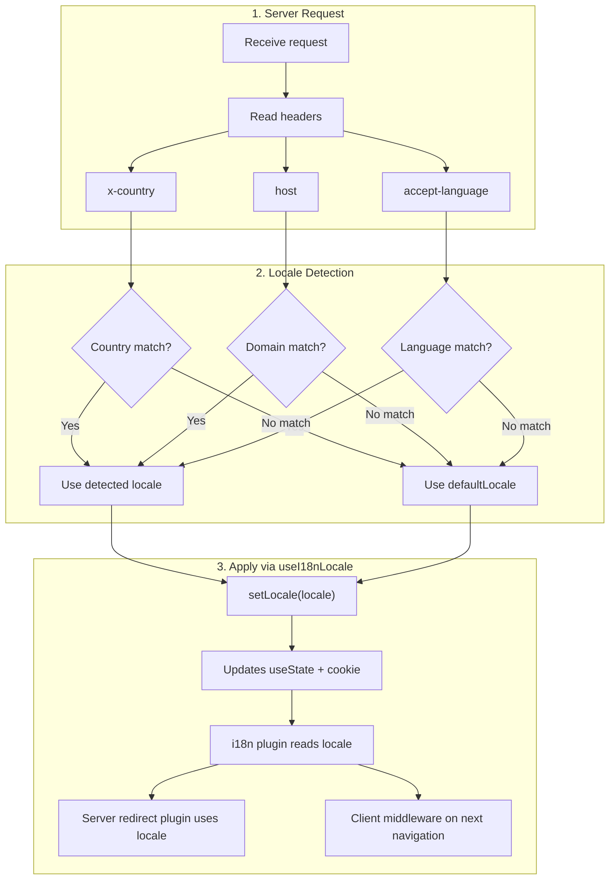

# 🔧 Phát hiện ngôn ngữ tùy chỉnh trong Nuxt I18n Micro

## 📖 Tổng quan

Nuxt I18n Micro v3 cung cấp một composable tập trung — `useI18nLocale()` — cho tất cả quản lý locale. Điều này thay thế các mẫu `useState`/`useCookie` thủ công từ v2. Bằng cách dùng `useI18nLocale().setLocale()` trong một plugin server, bạn có thể triển khai bất kỳ logic phát hiện tùy chỉnh nào trong khi vẫn tương thích đầy đủ với hệ thống chuyển hướng và cookie của module.

## 🏗️ Kiến trúc

```mermaid
flowchart TB
    subgraph Plugins["Plugin Execution Order"]
        A["Your plugin<br/>order: -10"] -->|setLocale()| B["01.plugin.ts<br/>order: -5"]
        B --> C["06.redirect.ts server<br/>order: 10"]
    end

    subgraph Client["Client SPA Navigation"]
        D["i18n-redirect.global.ts<br/>route middleware"]
    end

    subgraph State["Locale State"]
        E["useState('i18n-locale')"]
        F["localeCookie"]
    end

    A -->|"setLocale() updates both"| E
    A -->|"setLocale() updates both"| F
    B -->|reads| E
    C -->|reads| E
    C -->|reads| F
    D -->|reads target route +| E
```

**Nguyên tắc chính**: Gọi `useI18nLocale().setLocale()` trong một plugin server với `order: -10`. Điều này cập nhật cả `useState('i18n-locale')` và cookie locale một cách nguyên tử, để plugin i18n (`order: -5`) và plugin chuyển hướng server (`order: 10`) thấy locale chính xác trong request SSR đầu tiên. Chuyển hướng tự động phía client chạy trong global route middleware trên các lần điều hướng tiếp theo.

## 🛠️ Vô hiệu hóa Auto-Detection tích hợp sẵn

Nếu bạn muốn kiểm soát hoàn toàn việc phát hiện locale, hãy vô hiệu hóa cơ chế tích hợp sẵn:

```ts
export default defineNuxtConfig({
  i18n: {
    autoDetectLanguage: false,
  },
})
```

## ✨ Ví dụ: Phát hiện phía server với `useI18nLocale`

Đây là **cách tiếp cận được khuyến nghị** cho tất cả các chiến lược.

### Bước 1: Cấu hình `nuxt.config.ts`

```ts
export default defineNuxtConfig({
  modules: ['nuxt-i18n-micro'],
  i18n: {
    strategy: 'no_prefix', // Works with ANY strategy
    defaultLocale: 'en',
    localeCookie: 'user-locale',
    autoDetectLanguage: false,
    locales: [
      { code: 'en', iso: 'en-US' },
      { code: 'de', iso: 'de-DE' },
      { code: 'ja', iso: 'ja-JP' },
    ],
  },
})
```

### Bước 2: Tạo `plugins/i18n-loader.server.ts`

```ts
import { defineNuxtPlugin, useRequestHeaders } from '#imports'

export default defineNuxtPlugin({
  name: 'i18n-custom-loader',
  enforce: 'pre',
  order: -10, // Execute BEFORE the i18n plugin (which has order -5)

  setup() {
    const { setLocale } = useI18nLocale()
    const headers = useRequestHeaders(['host', 'x-country', 'accept-language'])
    let detectedLocale = 'en'

    // --- YOUR DETECTION LOGIC ---

    // Example 1: By domain
    const host = headers['host']
    if (host?.includes('example.de')) {
      detectedLocale = 'de'
    }
    // Example 2: By custom header
    else if (headers['x-country'] === 'JP') {
      detectedLocale = 'ja'
    }
    // Example 3: By Accept-Language header
    else if (headers['accept-language']?.includes('de')) {
      detectedLocale = 'de'
    }

    // --- APPLY THE LOCALE ---
    setLocale(detectedLocale)
  },
})
```

### Cách hoạt động



1. **Plugin chạy trước** (`order: -10`) — phát hiện locale từ headers, domain, hoặc các nguồn khác
2. **`setLocale()` cập nhật cả hai** `useState('i18n-locale')` và cookie — đảm bảo tất cả các plugin tiếp theo nhìn thấy ngay lập tức
3. **Plugin i18n** (`order: -5`) đọc locale và tải các bản dịch chính xác
4. **Plugin chuyển hướng server** (`order: 10`) dùng locale cho các quyết định chuyển hướng trên SSR
5. **Client route middleware** (`i18n-redirect`) áp dụng chuyển hướng trên điều hướng SPA khi locale trong URL không khớp với sở thích

## 🌐 Hành vi theo chiến lược

`useI18nLocale().setLocale()` hoạt động với **tất cả các chiến lược**. Hành vi chuyển hướng phụ thuộc vào chiến lược:

<Tip>
| Chiến lược | Hiệu ứng của `setLocale('de')` |
|----------|---------------------------|
| `no_prefix` | Render bằng tiếng Đức, URL không thay đổi |
| `prefix` | 302 → `/de/` (chuyển hướng phía server) |
| `prefix_except_default` | 302 → `/de/` nếu `de` ≠ mặc định; không chuyển hướng nếu `de` = mặc định |
| `prefix_and_default` | Không chuyển hướng (cả `/` và `/de/` đều hợp lệ) |
</Tip>

**Lưu ý quan trọng:**

- Phát hiện locale dựa trên cookie bị vô hiệu hóa theo mặc định (`localeCookie: null`)
- Đặt `localeCookie: 'user-locale'` để bật lưu trữ cookie
- Nếu giá trị cookie/state không có trong danh sách `locales`, nó sẽ quay lại `defaultLocale`

## 🏢 Nâng cao: Phát hiện dựa trên miền

Cho thiết lập đa miền nơi mỗi miền phục vụ một locale khác nhau:

```ts
import { defineNuxtPlugin, useRequestHeaders } from '#imports'

export default defineNuxtPlugin({
  name: 'i18n-domain-loader',
  enforce: 'pre',
  order: -10,

  setup() {
    const { setLocale } = useI18nLocale()
    const headers = useRequestHeaders(['host'])
    const host = headers['host'] || ''

    let detectedLocale = 'en'

    if (host.endsWith('.de') || host.includes('german.')) {
      detectedLocale = 'de'
    } else if (host.endsWith('.fr') || host.includes('french.')) {
      detectedLocale = 'fr'
    } else if (host.endsWith('.jp') || host.includes('japanese.')) {
      detectedLocale = 'ja'
    }

    setLocale(detectedLocale)
  },
})
```

## 🔄 Nâng cao: Tôn trọng sở thích của người dùng

Nếu người dùng có thể chuyển ngôn ngữ thủ công, hãy tôn trọng lựa chọn của họ hơn là auto-detect:

```ts
import { defineNuxtPlugin, useRequestHeaders } from '#imports'

export default defineNuxtPlugin({
  name: 'i18n-smart-loader',
  enforce: 'pre',
  order: -10,

  setup() {
    const { getLocale, setLocale } = useI18nLocale()

    // If user already has a preference (from cookie), respect it
    if (getLocale()) {
      return
    }

    // Otherwise, detect locale from headers
    const headers = useRequestHeaders(['accept-language'])
    let detectedLocale = 'en'

    const acceptLanguage = headers['accept-language'] || ''
    if (acceptLanguage.includes('de')) {
      detectedLocale = 'de'
    } else if (acceptLanguage.includes('ja')) {
      detectedLocale = 'ja'
    }

    setLocale(detectedLocale)
  },
})
```

## ⚙️ Plugin chỉ Server hoặc chỉ Client

Sử dụng [quy ước tên tệp của Nuxt](https://nuxt.com/docs/getting-started/directory-structure#plugins) để kiểm soát nơi plugin của bạn chạy:

- **Chỉ Server**: `i18n-loader.server.ts` — chỉ chạy trong SSR (khuyến nghị cho phát hiện dựa trên header)
- **Chỉ Client**: `i18n-loader.client.ts` — chỉ chạy trong trình duyệt (cho phát hiện dựa trên `localStorage` hoặc DOM)

<Tip>

</Tip>

## ✅ Tóm tắt

| Tính năng                              | Mô tả                                                              |
| -------------------------------------- | ----------------------------------------------------------------- |
| `useI18nLocale().setLocale()`          | Cập nhật `useState` + cookie một cách nguyên tử; hoạt động với tất cả các chiến lược |
| `useI18nLocale().getLocale()`          | Trả về locale hiện tại từ state hoặc cookie                        |
| `useI18nLocale().getPreferredLocale()` | Trả về locale ưu tiên (đã được xác thực với danh sách `locales`)   |
| Plugin `order: -10`                    | Đảm bảo plugin của bạn chạy trước khi khởi tạo i18n                |
| `enforce: 'pre'`                       | Chạy trong nhóm plugin "pre"                                       |

**KHÔNG:**

- Dùng trực tiếp `useCookie('user-locale')` — `useI18nLocale()` quản lý cookie nội bộ
- Dùng trực tiếp `useState('i18n-locale')` — hãy dùng `useI18nLocale().setLocale()` thay thế
- Đặt `order` >= -5 — plugin của bạn phải chạy trước plugin i18n
