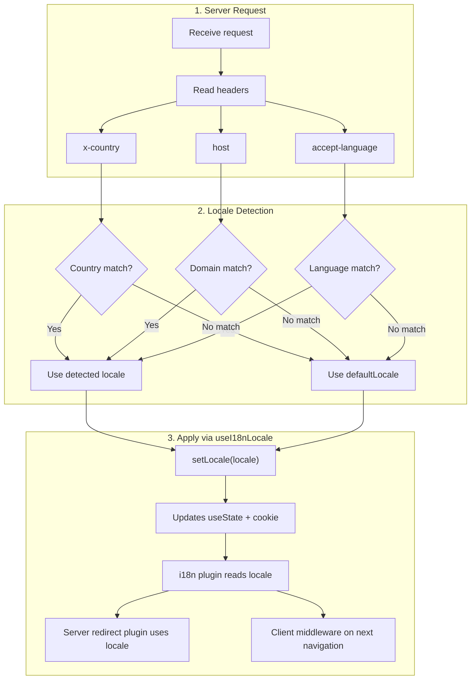

# 🔧 Phát hiện ngôn ngữ tùy chỉnh trong Nuxt I18n Micro

## 📖 Tổng quan

Nuxt I18n Micro v3 cung cấp một composable tập trung — `useI18nLocale()` — cho toàn bộ việc quản lý ngôn ngữ. Điều này thay thế các mẫu `useState`/`useCookie` thủ công từ v2. Bằng cách dùng `useI18nLocale().setLocale()` trong một plugin máy chủ, bạn có thể triển khai bất kỳ logic phát hiện tùy chỉnh nào trong khi vẫn tương thích đầy đủ với hệ thống chuyển hướng và cookie của mô-đun.

## 🏗️ Kiến trúc

```mermaid
flowchart TB
    subgraph Plugins["Plugin Execution Order"]
        A["Your plugin<br/>order: -10"] -->|setLocale()| B["01.plugin.ts<br/>order: -5"]
        B --> C["06.redirect.ts server<br/>order: 10"]
    end

    subgraph Client["Client SPA Navigation"]
        D["i18n-redirect.global.ts<br/>route middleware"]
    end

    subgraph State["Locale State"]
        E["useState('i18n-locale')"]
        F["localeCookie"]
    end

    A -->|"setLocale() updates both"| E
    A -->|"setLocale() updates both"| F
    B -->|reads| E
    C -->|reads| E
    C -->|reads| F
    D -->|reads target route +| E
```

**Nguyên tắc chính**: Gọi `useI18nLocale().setLocale()` trong một plugin máy chủ với `order: -10`. Điều này cập nhật cả `useState('i18n-locale')` và cookie ngôn ngữ một cách nguyên tử, để plugin i18n (`order: -5`) và plugin chuyển hướng máy chủ (`order: 10`) thấy ngôn ngữ đúng trong yêu cầu SSR đầu tiên. Chuyển hướng tự động phía client chạy trong middleware route toàn cục trên các lần điều hướng tiếp theo.

## 🛠️ Tắt phát hiện tự động tích hợp

Nếu bạn muốn kiểm soát hoàn toàn phát hiện ngôn ngữ, hãy tắt cơ chế tích hợp:

```ts
export default defineNuxtConfig({
  i18n: {
    autoDetectLanguage: false,
  },
})
```

## ✨ Ví dụ: Phát hiện phía máy chủ với `useI18nLocale`

Đây là **cách tiếp cận được khuyến nghị** cho mọi chiến lược.

### Bước 1: Cấu hình `nuxt.config.ts`

```ts
export default defineNuxtConfig({
  modules: ['nuxt-i18n-micro'],
  i18n: {
    strategy: 'no_prefix', // Works with ANY strategy
    defaultLocale: 'en',
    localeCookie: 'user-locale',
    autoDetectLanguage: false,
    locales: [
      { code: 'en', iso: 'en-US' },
      { code: 'de', iso: 'de-DE' },
      { code: 'ja', iso: 'ja-JP' },
    ],
  },
})
```

### Bước 2: Tạo `plugins/i18n-loader.server.ts`

```ts
import { defineNuxtPlugin, useRequestHeaders } from '#imports'

export default defineNuxtPlugin({
  name: 'i18n-custom-loader',
  enforce: 'pre',
  order: -10, // Execute BEFORE the i18n plugin (which has order -5)

  setup() {
    const { setLocale } = useI18nLocale()
    const headers = useRequestHeaders(['host', 'x-country', 'accept-language'])
    let detectedLocale = 'en'

    // --- YOUR DETECTION LOGIC ---

    // Example 1: By domain
    const host = headers['host']
    if (host?.includes('example.de')) {
      detectedLocale = 'de'
    }
    // Example 2: By custom header
    else if (headers['x-country'] === 'JP') {
      detectedLocale = 'ja'
    }
    // Example 3: By Accept-Language header
    else if (headers['accept-language']?.includes('de')) {
      detectedLocale = 'de'
    }

    // --- APPLY THE LOCALE ---
    setLocale(detectedLocale)
  },
})
```

### Cách hoạt động



1. **Plugin chạy trước** (`order: -10`) — phát hiện ngôn ngữ từ header, miền hoặc các nguồn khác
2. **`setLocale()` cập nhật cả hai** `useState('i18n-locale')` và cookie — đảm bảo hiển thị ngay lập tức cho các plugin tiếp theo
3. **Plugin i18n** (`order: -5`) đọc ngôn ngữ và tải các bản dịch chính xác
4. **Plugin chuyển hướng máy chủ** (`order: 10`) dùng ngôn ngữ cho các quyết định chuyển hướng trên SSR
5. **Middleware route phía client** (`i18n-redirect`) áp dụng chuyển hướng trên điều hướng SPA khi ngôn ngữ trong URL không khớp với sở thích

## 🌐 Hành vi theo chiến lược

`useI18nLocale().setLocale()` hoạt động với **mọi chiến lược**. Hành vi chuyển hướng phụ thuộc vào chiến lược:

<Tip>
| Chiến lược | Hiệu ứng của `setLocale('de')` |
|----------|---------------------------|
| `no_prefix` | Hiển thị bằng tiếng Đức, không thay đổi URL |
| `prefix` | 302 → `/de/` (chuyển hướng phía máy chủ) |
| `prefix_except_default` | 302 → `/de/` nếu `de` ≠ mặc định; không chuyển hướng nếu `de` = mặc định |
| `prefix_and_default` | Không chuyển hướng (cả `/` và `/de/` đều hợp lệ) |
</Tip>

**Ghi chú quan trọng:**

- Phát hiện ngôn ngữ dựa trên cookie bị tắt theo mặc định (`localeCookie: null`)
- Đặt `localeCookie: 'user-locale'` để bật lưu bằng cookie
- Nếu giá trị cookie/state không có trong danh sách `locales`, nó quay về `defaultLocale`

## 🏢 Nâng cao: Phát hiện dựa trên miền

Cho các thiết lập đa miền nơi mỗi miền phục vụ một ngôn ngữ khác nhau:

```ts
import { defineNuxtPlugin, useRequestHeaders } from '#imports'

export default defineNuxtPlugin({
  name: 'i18n-domain-loader',
  enforce: 'pre',
  order: -10,

  setup() {
    const { setLocale } = useI18nLocale()
    const headers = useRequestHeaders(['host'])
    const host = headers['host'] || ''

    let detectedLocale = 'en'

    if (host.endsWith('.de') || host.includes('german.')) {
      detectedLocale = 'de'
    } else if (host.endsWith('.fr') || host.includes('french.')) {
      detectedLocale = 'fr'
    } else if (host.endsWith('.jp') || host.includes('japanese.')) {
      detectedLocale = 'ja'
    }

    setLocale(detectedLocale)
  },
})
```

## 🔄 Nâng cao: Tôn trọng sở thích người dùng

Nếu người dùng có thể chuyển ngôn ngữ thủ công, hãy tôn trọng lựa chọn của họ hơn phát hiện tự động:

```ts
import { defineNuxtPlugin, useRequestHeaders } from '#imports'

export default defineNuxtPlugin({
  name: 'i18n-smart-loader',
  enforce: 'pre',
  order: -10,

  setup() {
    const { getLocale, setLocale } = useI18nLocale()

    // If user already has a preference (from cookie), respect it
    if (getLocale()) {
      return
    }

    // Otherwise, detect locale from headers
    const headers = useRequestHeaders(['accept-language'])
    let detectedLocale = 'en'

    const acceptLanguage = headers['accept-language'] || ''
    if (acceptLanguage.includes('de')) {
      detectedLocale = 'de'
    } else if (acceptLanguage.includes('ja')) {
      detectedLocale = 'ja'
    }

    setLocale(detectedLocale)
  },
})
```

## ⚙️ Plugin chỉ server hoặc chỉ client

Sử dụng [quy ước tên tệp Nuxt](https://nuxt.com/docs/getting-started/directory-structure#plugins) để kiểm soát nơi plugin của bạn chạy:

- **Chỉ máy chủ**: `i18n-loader.server.ts` — chỉ chạy trong SSR (khuyến nghị cho phát hiện dựa trên header)
- **Chỉ client**: `i18n-loader.client.ts` — chỉ chạy trong trình duyệt (cho phát hiện dựa trên `localStorage` hoặc DOM)


## ✅ Tóm tắt

| Tính năng | Mô tả |
| -------------------------------------- | ----------------------------------------------------------------- |
| `useI18nLocale().setLocale()`          | Cập nhật `useState` + cookie một cách nguyên tử; hoạt động với mọi chiến lược |
| `useI18nLocale().getLocale()`          | Trả về ngôn ngữ hiện tại từ state hoặc cookie |
| `useI18nLocale().getPreferredLocale()` | Trả về ngôn ngữ ưa thích (được xác thực với danh sách `locales`) |
| Plugin `order: -10`                    | Đảm bảo plugin của bạn chạy trước khởi tạo i18n |
| `enforce: 'pre'`                       | Chạy trong nhóm plugin "pre" |

**KHÔNG:**

- Dùng trực tiếp `useCookie('user-locale')`. `useI18nLocale()` quản lý cookie nội bộ
- Dùng trực tiếp `useState('i18n-locale')`. Hãy dùng `useI18nLocale().setLocale()` thay thế
- Đặt `order` >= -5. Plugin của bạn phải chạy trước plugin i18n
