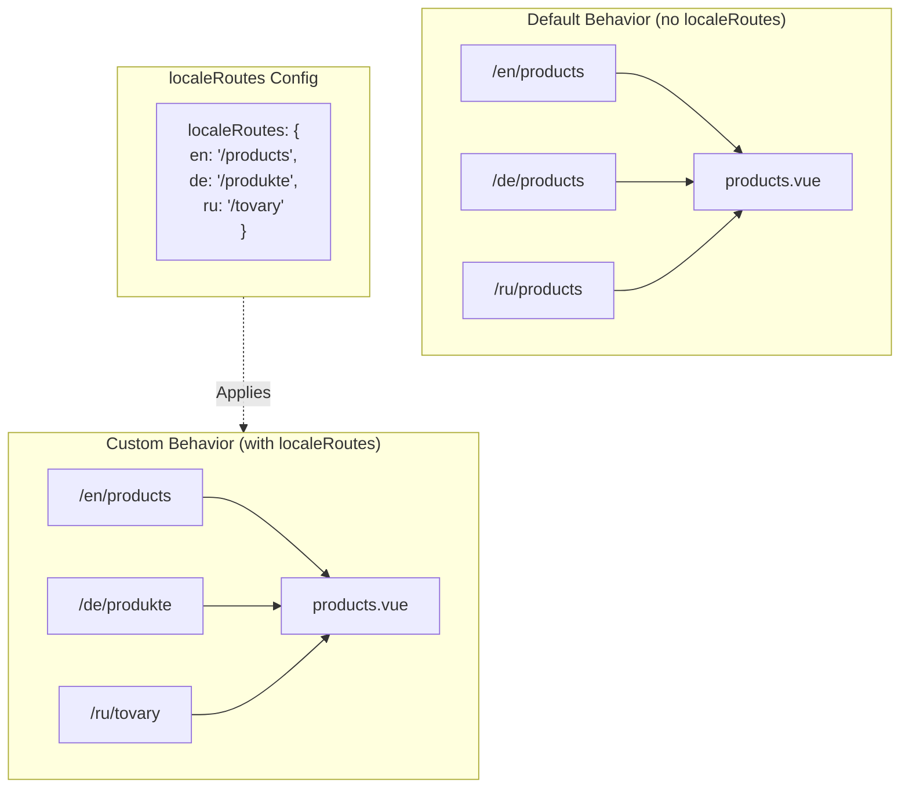

# 🔗 Route bản địa hóa tùy chỉnh với `localeRoutes` trong `Nuxt I18n Micro`

## 📖 Giới thiệu về `localeRoutes`

Tính năng `localeRoutes` trong `Nuxt I18n Micro` cho phép bạn định nghĩa các route tùy chỉnh cho các locale cụ thể, mang lại tính linh hoạt và kiểm soát cấu trúc định tuyến của ứng dụng. Tính năng này đặc biệt hữu ích khi một số locale nhất định yêu cầu các cấu trúc URL khác nhau, các đường dẫn được điều chỉnh, hoặc cần tuân theo các quy ước khu vực hoặc ngôn ngữ cụ thể.

## 🚀 Trường hợp sử dụng chính của `localeRoutes`

Trường hợp sử dụng chính của `localeRoutes` là cung cấp các route riêng biệt cho các locale khác nhau, nâng cao trải nghiệm người dùng bằng cách đảm bảo các URL trực quan và phù hợp với đối tượng mục tiêu. Ví dụ, bạn có thể có các đường dẫn khác nhau cho các phiên bản tiếng Anh và tiếng Nga của một trang, trong đó locale tiếng Nga tuân theo định dạng URL bản địa hóa.

### 📄 Ví dụ: Định nghĩa `localeRoutes` trong `$defineI18nRoute`

Đây là ví dụ về cách bạn có thể định nghĩa các route tùy chỉnh cho các locale cụ thể bằng `localeRoutes` trong hàm `$defineI18nRoute`:

```typescript
import { useNuxtApp } from '#imports'

const { $defineI18nRoute } = useNuxtApp()

$defineI18nRoute({
  localeRoutes: {
    ru: '/localesubpage', // Custom route path for the Russian locale
    de: '/lokaleseite', // Custom route path for the German locale
  },
})
```

> [!IMPORTANT]
> `$defineI18nRoute` không phải là một hàm toàn cục. Trong `script setup`, hãy lấy nó từ `useNuxtApp()` trước, sau đó gọi nó.

### 🔄 Cách `localeRoutes` hoạt động



- **Hành vi mặc định**: Không có `localeRoutes`, tất cả các locale sử dụng cấu trúc route chung được định nghĩa bởi đường dẫn chính.
- **Hành vi tùy chỉnh**: Với `localeRoutes`, các locale cụ thể có thể có các route riêng, ghi đè đường dẫn mặc định bằng các route theo locale được định nghĩa trong cấu hình.

## 🌱 Các trường hợp sử dụng `localeRoutes`

### 📄 Ví dụ: Sử dụng `localeRoutes` trong một Trang

Đây là một component Vue đơn giản minh họa việc sử dụng `$defineI18nRoute` với `localeRoutes`:

```vue
<template>
  <div>
    <!-- Display greeting message based on the current locale -->
    <p>{{ $t('greeting') }}</p>

    <!-- Navigation links -->
    <div>
      <NuxtLink :to="$localeRoute({ name: 'index' })"> Go to Index </NuxtLink>
      |
      <NuxtLink :to="$localeRoute({ name: 'about' })"> Go to About Page </NuxtLink>
    </div>
  </div>
</template>

<script setup>
import { useNuxtApp } from '#imports'

const { $getLocale, $switchLocale, $getLocales, $localeRoute, $t, $defineI18nRoute } = useNuxtApp()

// Define translations and custom routes for specific locales
$defineI18nRoute({
  localeRoutes: {
    ru: '/localesubpage', // Custom route path for Russian locale
  },
})
</script>
```

### 🛠️ Dùng `localeRoutes` trong các ngữ cảnh khác nhau

- **Trang Landing**: Dùng các route tùy chỉnh để bản địa hóa URL cho các trang landing, đảm bảo chúng phù hợp với các chiến dịch marketing.
- **Trang tài liệu**: Cung cấp các route riêng biệt cho mỗi locale để phù hợp hơn với cấu trúc nội dung được bản địa hóa.
- **Trang thương mại điện tử**: Điều chỉnh URL sản phẩm hoặc danh mục theo từng locale để cải thiện SEO và trải nghiệm người dùng.

## Sử dụng điều hướng với `localeRoutes`

Vì các route được bản địa hóa không khớp trực tiếp với tên tệp trong thư mục pages, bạn cần tham chiếu điều hướng bằng object thay vì bằng tên.

```vue
<template>
  /**
   * Exemple page: /pages/about-us.vue
   * EN /about-us
   * ES /sobre-nosotros
   * FR /a-propos
   */

  // Using NuxtLink
  <NuxtLink :to="$localeRoute({ name: 'about-us' })">
    Go to About Page
  </NuxtLink>

  // Using I18nLink
  <I18nLink :to="{ name: 'about-us' }">
    Go to About Page
  </NuxtLink>

  // The string literal navigation wouldn't work for any locale but english
  <I18nLink to="/about-us">
    Go to About Page
  </NuxtLink>
</template>
```

### Đặt tên trang lồng nhau

Theo mặc định, các trang của bạn được đặt tên dựa trên tên tệp & đường dẫn. Đây là ý nghĩa của nó:

- `/pages/about-us.vue` có thể được truy cập với `$localeRoute(\{ name: 'about-us' \})`
- `/pages/about-us/physical-stores.vue` có thể được truy cập với `$localeRoute(\{ name: 'about-us-physical-stores' \})`

Để ghi đè hành vi này, hãy đặt tên trang một cách rõ ràng bằng `definePageMeta`.

```vue
// /pages/about-us/physical-stores.vue
<script setup>
definePageMeta({
  name: 'our-stores'
})
```

Trang này giờ có thể được tham chiếu bằng `$localeRoute` hoặc `I18nLink` bằng tên của nó `:to='\{ name: "our-stores" \}'`.

## 🎯 Route động với Slug và `$setI18nRouteParams`

Khi làm việc với các route động chứa slug hoặc tham số, bạn có thể dùng `localeRoutes` với các đoạn động và `$setI18nRouteParams` để cung cấp các slug theo locale cho từng locale.

### Tham số Route động trong `localeRoutes`

Bạn có thể định nghĩa các route động bằng cú pháp tham số route của Nuxt (`[...slug]` cho các route catch-all, `[param]` cho các tham số đơn, hoặc `:param()` cho các tham số có tên):

```vue
<script setup lang="ts">
import { useNuxtApp, useRoute, useFetch, createError } from '#imports'

const { $defineI18nRoute, $setI18nRouteParams } = useNuxtApp()

// Define custom routes with dynamic segments
$defineI18nRoute({
  localeRoutes: {
    en: '/our-products/[...slug]',
    es: '/nuestros-productos/[...slug]',
  },
})
</script>
```

### Đặt tham số Route theo Locale

Hàm `$setI18nRouteParams` cho phép bạn đặt các giá trị tham số khác nhau (như slug) cho từng locale. Điều này đặc biệt hữu ích khi nội dung của bạn có URL theo locale.

**Quan trọng**: `$setI18nRouteParams` nên được gọi sau khi lấy dữ liệu chứa các slug theo locale, thường là bên trong `useFetch` hoặc `useAsyncData`.

```vue
<script setup lang="ts">
import { useNuxtApp, useRoute, useFetch, createError } from '#imports'

interface Product {
  title: string
  price: string
  urlEn: string // English slug
  urlEs: string // Spanish slug
}

const { $defineI18nRoute, $setI18nRouteParams } = useNuxtApp()

const route = useRoute()
const slug = Array.isArray(route.params.slug) ? route.params.slug[0] : route.params.slug

// Fetch product data that includes locale-specific slugs
const { data: product, error } = await useFetch<Product>(`/api/product/${slug}`)
if (error.value)
  throw createError({
    statusCode: error.value?.statusCode,
    statusMessage: error.value?.statusMessage,
    fatal: true,
  })

// Define custom routes with dynamic segments
$defineI18nRoute({
  localeRoutes: {
    en: '/our-products/[...slug]',
    es: '/nuestros-productos/[...slug]',
  },
})

// Set different slugs for different locales
if (product.value) {
  $setI18nRouteParams({
    en: { slug: product.value.urlEn },
    es: { slug: product.value.urlEs },
  })
}
</script>
```

### Ví dụ đầy đủ: Trang sản phẩm với các Slug theo Locale

Đây là ví dụ đầy đủ cho thấy cách dùng `localeRoutes` và `$setI18nRouteParams` cùng nhau cho trang chi tiết sản phẩm:

```vue
<template>
  <div v-if="product">
    <h1>{{ product.title }}</h1>
    <p>{{ $t('price') }}: {{ product.price }}</p>
    <div class="locale-switcher">
      <a :href="$switchLocalePath('en')">English</a>
      <a :href="$switchLocalePath('es')">Español</a>
    </div>
  </div>
</template>

<script setup lang="ts">
import { useNuxtApp, useRoute, useFetch, createError } from '#imports'

interface Product {
  title: string
  price: string
  urlEn: string
  urlEs: string
}

const { $t, $defineI18nRoute, $setI18nRouteParams, $switchLocalePath } = useNuxtApp()

// Set page name for easier navigation
definePageMeta({ name: 'product-slug' })

const route = useRoute()
const slug = Array.isArray(route.params.slug) ? route.params.slug[0] : route.params.slug

// Fetch product data
const { data: product, error } = await useFetch<Product>(`/api/product/${slug}`)
if (error.value)
  throw createError({
    statusCode: error.value?.statusCode,
    statusMessage: error.value?.statusMessage,
    fatal: true,
  })

// Define locale-specific routes with dynamic segments
$defineI18nRoute({
  localeRoutes: {
    en: '/our-products/[...slug]',
    es: '/nuestros-productos/[...slug]',
  },
})

// Set locale-specific slugs so $switchLocalePath works correctly
if (product.value) {
  $setI18nRouteParams({
    en: { slug: product.value.urlEn },
    es: { slug: product.value.urlEs },
  })
}
</script>
```

### Ví dụ: Trang danh sách sản phẩm

Khi liên kết đến các route động từ một trang danh sách, hãy dùng tên route với các tham số:

```vue
<template>
  <div>
    <h1>{{ $t('title') }}</h1>
    <ul>
      <li v-for="product in products?.[$getLocale()] || []" :key="product.id">
        <I18nLink :to="{ name: 'product-slug', params: { slug: product.url } }"> {{ product.title }} – {{ product.price }} </I18nLink>
      </li>
    </ul>
  </div>
</template>

<script setup lang="ts">
import { useNuxtApp, useFetch, createError } from '#imports'

interface Product {
  id: string
  title: string
  price: string
  url: string
}

type ProductsByLocale = Record<string, Product[]>

const { $t, $defineI18nRoute, $getLocale } = useNuxtApp()

const { data: products, error } = await useFetch<ProductsByLocale>('/api/product')
if (error.value)
  throw createError({
    statusCode: error.value?.statusCode,
    statusMessage: error.value?.statusMessage,
    fatal: true,
  })

$defineI18nRoute({
  locales: {
    en: {
      title: 'Our Product Range',
      description: 'Discover our collection of high-quality products.',
    },
    es: {
      title: 'Nuestra Gama de Productos',
      description: 'Descubra nuestra colección de productos de alta calidad.',
    },
  },
  localeRoutes: {
    en: '/our-products',
    es: '/nuestros-productos',
  },
})
</script>
```

### Cách hoạt động

1. **Định nghĩa Route**: `localeRoutes` định nghĩa cấu trúc đường dẫn cơ sở cho từng locale, bao gồm các đoạn động như `[...slug]` hoặc `[id]`.

2. **Đặt tham số**: `$setI18nRouteParams` đặt các giá trị tham số thực tế cho từng locale. Khi người dùng chuyển đổi locale bằng `$switchLocalePath`, module dùng các tham số này để tạo URL chính xác.

3. **Định dạng tham số**: Đối tượng tham số nên khớp với cấu trúc:

   ```typescript
   {
     [localeCode]: {
       [paramName]: paramValue
     }
   }
   ```

4. **Điều hướng**: Dùng `I18nLink` hoặc `$localeRoute` với tên route và các tham số để điều hướng giữa các phiên bản đã bản địa hóa của các route động.

### Lưu ý quan trọng

- **Thời điểm**: `$setI18nRouteParams` nên được gọi sau khi lấy dữ liệu chứa các slug theo locale, thường là bên trong `useFetch` hoặc `useAsyncData`.

- **Tên tham số**: Các tên tham số trong `$setI18nRouteParams` phải khớp với tên tham số route (ví dụ, `slug` cho `[...slug]` hoặc `id` cho `[id]`).

- **Tên Route**: Khi dùng `definePageMeta(\{ name: 'route-name' \})`, hãy dùng tên này khi liên kết đến route với `I18nLink` hoặc `$localeRoute`.

- **Route Catch-all**: Đối với các route catch-all (`[...slug]`), tham số slug nên là một mảng hoặc một chuỗi sẽ được chuyển đổi thành mảng.

## 🧩 Route theo chương trình (`pages:extend`) — #244

Các route được tạo trong `pages:extend` không có chỗ cho `defineI18nRoute()`, và nhiều route thường chia sẻ một SFC wrapper. Quét theo khóa tệp sau đó sẽ hợp nhất chúng thành một entry duy nhất.

**Đừng** đặt các đường dẫn đã bản địa hóa trong `route.meta` (chúng sẽ được ship trong bảng route phía client). Giữ một registry và chiếu nó hai lần:

1. vào `pages:extend` (tạo các route Nuxt)
2. vào `i18n.globalLocaleRoutes` được keyed theo **tên** route (không phải đường dẫn tệp)

Dùng `splitLocaleRoutes` từ `@i18n-micro/utils/split-locale-routes`:

```typescript
import { splitLocaleRoutes } from '@i18n-micro/utils/split-locale-routes'

const dynamic = splitLocaleRoutes([
  {
    name: 'products_tag',
    path: '/products/:tag',
    file: '~/pages/_dynamic.vue',
    paths: { fr: '/produits/:tag', de: '/produkte/:tag' },
  },
  {
    name: 'products_category',
    path: '/products/category/:category',
    file: '~/pages/_dynamic.vue',
    paths: { fr: '/produits/categorie/:category' },
  },
  // Disable localization for a programmatic route:
  // { name: 'internal', path: '/internal', file: '~/pages/_dynamic.vue', paths: false },
])

export default defineNuxtConfig({
  hooks: {
    'pages:extend'(pages) {
      pages.push(...dynamic.pages)
    },
  },
  i18n: {
    globalLocaleRoutes: dynamic.globalLocaleRoutes,
  },
})
```

Cả hai nửa vẫn đồng bộ; các wrapper dùng chung không còn ghi đè lẫn nhau. Chỉ `globalLocaleRoutes` không đủ — nó chỉ tùy chỉnh các đường dẫn cho các route đã tồn tại trong bảng trang Nuxt.

## 📝 Thực hành tốt nhất khi dùng `localeRoutes`

- **🚀 Dùng cho các Locale liên quan**: Áp dụng `localeRoutes` chủ yếu ở nơi cấu trúc URL ảnh hưởng đáng kể đến trải nghiệm người dùng hoặc SEO. Tránh sử dụng quá mức cho các khác biệt nhỏ.
- **🔧 Duy trì tính nhất quán**: Giữ một mẫu định tuyến nhất quán trên các locale trừ khi có lý do mạnh mẽ để lệch. Cách tiếp cận này giúp duy trì sự rõ ràng và giảm độ phức tạp.
- **📚 Ghi tài liệu các Route tùy chỉnh**: Ghi tài liệu rõ ràng bất kỳ route tùy chỉnh nào bạn định nghĩa với `localeRoutes`, đặc biệt trong các ứng dụng mô-đun, để đảm bảo các thành viên nhóm hiểu logic định tuyến.
