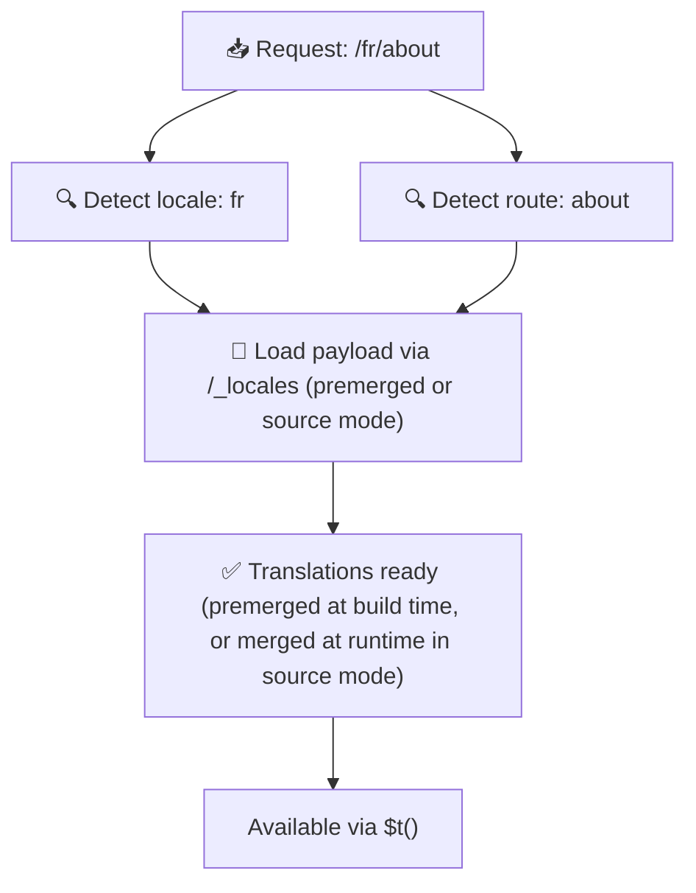

# 📂 Hướng dẫn cấu trúc thư mục

## 📖 Giới thiệu

Tổ chức các tệp bản dịch một cách hiệu quả là điều thiết yếu để duy trì một hệ thống quốc tế hóa (i18n) có khả năng mở rộng và hiệu quả. `Nuxt I18n Micro` đơn giản hóa quá trình này bằng cách cung cấp một cách tiếp cận rõ ràng để quản lý các bản dịch cấp gốc và theo trang. Hướng dẫn này sẽ hướng dẫn bạn cấu trúc thư mục được khuyến nghị và giải thích cách `Nuxt I18n Micro` xử lý các bản dịch này.

## 🗂️ Cấu trúc thư mục được khuyến nghị

`Nuxt I18n Micro` tổ chức các bản dịch thành tệp cấp gốc và tệp theo trang trong thư mục `pages`. Với `translationPayloads.mode: 'premerged'` (mặc định), các bản dịch cấp gốc được tự động gộp vào mỗi tệp trang tại thời điểm build, vì vậy mỗi trang có đầy đủ bản dịch mà không có chi phí gộp tại runtime.

Với `mode: 'source'`, các tệp nguồn vẫn tách biệt trong tài nguyên Nitro và được gộp tại runtime thông qua route `/_locales`. Xem [Đầu ra Payload Serverless](/guides/performance#serverless-payload-output).

### 🔧 Cấu trúc cơ bản

Đây là ví dụ cơ bản về cấu trúc thư mục bạn nên tuân theo:

```text
locales/
├── pages/
│   ├── index/
│   │   ├── en.json
│   │   ├── fr.json
│   │   └── ar.json
│   ├── about/
│   │   ├── en.json
│   │   ├── fr.json
│   │   └── ar.json
├── en.json
├── fr.json
└── ar.json

```

### 📄 Giải thích cấu trúc

#### 1. 🌍 Tệp bản dịch cấp gốc

- **Đường dẫn:** `/locales/\{locale\}.json` (ví dụ: `/locales/en.json`)
- **Mục đích:** Các tệp này chứa các bản dịch được dùng chung cho toàn bộ ứng dụng (menu điều hướng, header, footer, v.v.). Với `mode: 'premerged'` (mặc định), chúng được tự động gộp vào mỗi tệp theo trang tại thời điểm build, vì vậy máy chủ trả về một tệp đã được build sẵn cho mỗi trang.

  **Nội dung ví dụ (`/locales/en.json`):**

  ```json
  {
    "menu": {
      "home": "Home",
      "about": "About Us",
      "contact": "Contact"
    },
    "footer": {
      "copyright": "© 2024 Your Company"
    }
  }
  ```

#### 2. 📄 Tệp bản dịch theo trang

- **Đường dẫn:** `/locales/pages/\{routeName\}/\{locale\}.json` (ví dụ: `/locales/pages/index/en.json`)
- **Mục đích:** Các tệp này chứa các bản dịch dành riêng cho từng trang cụ thể. Với `mode: 'premerged'` (mặc định), các bản dịch cấp gốc được gộp vào làm cơ sở tại thời điểm build, vì vậy mỗi tệp trang trở nên độc lập.

  **Nội dung ví dụ (`/locales/pages/index/en.json`):**

  ```json
  {
    "title": "Welcome to Our Website",
    "description": "We offer a wide range of products and services to meet your needs."
  }
  ```

  **Nội dung ví dụ (`/locales/pages/about/en.json`):**

  ```json
  {
    "title": "About Us",
    "description": "Learn more about our mission, vision, and values."
  }
  ```

### 📂 Xử lý Route động và đường dẫn lồng nhau

`Nuxt I18n Micro` tự động chuyển đổi các đoạn động và đường dẫn lồng nhau trong route thành cấu trúc thư mục phẳng bằng cách sử dụng một quy ước đổi tên cụ thể. Điều này đảm bảo rằng tất cả các bản dịch được lưu trữ theo cách nhất quán và dễ truy cập.

#### Cấu trúc thư mục bản dịch cho route động

Khi xử lý các route động, chẳng hạn `/products/[id]`, module chuyển đổi đoạn động `[id]` thành định dạng tĩnh trong cấu trúc tệp.

**Ví dụ cấu trúc thư mục cho route động:**

Với một route như `/products/[id]`, các tệp bản dịch sẽ được lưu trong một thư mục có tên `products-id`:

```text
locales/pages/
├── products-id/
│   ├── en.json
│   ├── fr.json
│   └── ar.json

```

**Ví dụ cấu trúc thư mục cho route động lồng nhau:**

Với một route lồng nhau như `/products/key/[id]`, các tệp bản dịch sẽ được lưu trong một thư mục có tên `products-key-id`:

```text
locales/pages/
├── products-key-id/
│   ├── en.json
│   ├── fr.json
│   └── ar.json

```

**Ví dụ cấu trúc thư mục cho route lồng nhau nhiều cấp:**

Với một route lồng nhau phức tạp hơn như `/products/category/[id]/details`, các tệp bản dịch sẽ được lưu trong một thư mục có tên `products-category-id-details`:

```text
locales/pages/
├── products-category-id-details/
│   ├── en.json
│   ├── fr.json
│   └── ar.json

```

### 🛠 Tùy chỉnh cấu trúc thư mục

Nếu bạn muốn lưu trữ bản dịch ở một thư mục khác, `Nuxt I18n Micro` cho phép bạn tùy chỉnh thư mục nơi các tệp bản dịch được lưu. Bạn có thể cấu hình điều này trong tệp `nuxt.config.ts`.

**Ví dụ: Tùy chỉnh thư mục bản dịch**

```typescript
export default defineNuxtConfig({
  i18n: {
    translationDir: 'i18n', // Custom directory path
  },
})
```

Điều này sẽ chỉ định `Nuxt I18n Micro` tìm các tệp bản dịch trong thư mục `/i18n` thay vì thư mục `/locales` mặc định.

## ⚙️ Cách bản dịch được tải

### 🌍 Route locale động

`Nuxt I18n Micro` sử dụng các route locale động để tải bản dịch hiệu quả. Khi người dùng truy cập một trang, module xác định locale phù hợp và tải các tệp bản dịch tương ứng dựa trên route và locale hiện tại.



Ví dụ:

- Truy cập `/en/index` sẽ tải bản dịch từ `/locales/pages/index/en.json`.
- Truy cập `/fr/about` sẽ tải bản dịch từ `/locales/pages/about/fr.json`.

Phương pháp này đảm bảo chỉ tải các bản dịch cần thiết, tối ưu hóa cả tải máy chủ và hiệu năng phía client.

### 💾 Cache và Pre-rendering

Để nâng cao hiệu năng hơn nữa, `Nuxt I18n Micro` hỗ trợ cache và pre-rendering các tệp bản dịch:

- **Cache**: Khi một tệp bản dịch đã được tải, nó được cache cho các request tiếp theo, giảm nhu cầu lấy đi lấy lại cùng một dữ liệu.
- **Pre-rendering**: Trong quá trình build, bạn có thể pre-render các tệp bản dịch cho tất cả locale và route đã cấu hình, cho phép chúng được phục vụ trực tiếp từ máy chủ mà không bị trễ tại runtime.

## 📝 Thực hành tốt nhất

### 📂 Sử dụng tệp theo trang một cách khôn ngoan

Tận dụng các tệp theo trang để giữ bản dịch được tổ chức. Điều này giữ cho bản dịch của mỗi trang gọn nhẹ và tải nhanh, điều này đặc biệt quan trọng cho các trang có nội dung phức tạp hoặc lớn.

### 🔑 Giữ khóa bản dịch nhất quán

Sử dụng các quy ước đặt tên nhất quán cho các khóa bản dịch trên các tệp. Điều này giúp duy trì sự rõ ràng và ngăn ngừa các vấn đề khi quản lý bản dịch, đặc biệt khi ứng dụng của bạn phát triển.

### 🗂️ Tổ chức bản dịch theo ngữ cảnh

Nhóm các bản dịch liên quan cùng nhau trong tệp của bạn. Ví dụ, nhóm tất cả nhãn nút dưới khóa `buttons` và tất cả văn bản liên quan đến form dưới khóa `forms`. Điều này không chỉ cải thiện khả năng đọc mà còn giúp dễ dàng quản lý bản dịch trên các locale khác nhau.

### ⚠️ Giới hạn độ sâu lồng nhau (Khuyến nghị 2 cấp)

Trong quá trình điều hướng phía client, `Nuxt I18n Micro` sử dụng deep merge được tối ưu hóa 2 cấp để kết hợp các bản dịch từ trang rời đi và trang vào. Điều này đảm bảo rằng các khóa lồng nhau chồng chéo (ví dụ: cả hai trang đều có khóa dưới `common.*`) được giữ lại trong quá trình chuyển tiếp có hoạt hình.

**Điều này hoạt động chính xác cho cấu trúc chuẩn `Section → Key → Value` (2 cấp):**

```json
// Page A translations
{ "common": { "fromA": "Text A" } }

// Page B translations
{ "common": { "fromB": "Text B" } }

// During transition, both are available:
// { "common": { "fromA": "Text A", "fromB": "Text B" } }
```

**Tuy nhiên, nếu bạn sử dụng 3+ cấp lồng nhau, các khóa sâu hơn có thể bị ghi đè trong quá trình chuyển tiếp:**

```json
// Page A translations
{ "auth": { "form": { "login": "Login" } } }

// Page B translations
{ "auth": { "form": { "register": "Register" } } }

// During transition: "login" key is lost
// { "auth": { "form": { "register": "Register" } } }
```

<Tip>

</Tip>

### 🧹 Dọn dẹp bản dịch không dùng định kỳ

Theo thời gian, ứng dụng của bạn có thể tích lũy các khóa bản dịch không dùng, đặc biệt nếu các tính năng bị loại bỏ hoặc tái cấu trúc. Định kỳ xem xét và dọn dẹp các tệp bản dịch để giữ chúng gọn nhẹ và dễ bảo trì.
