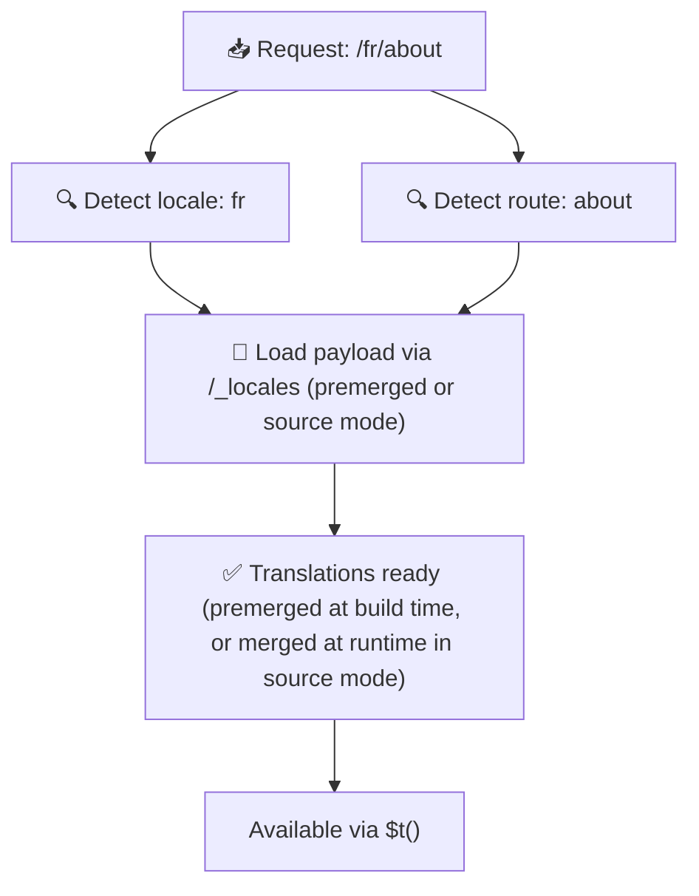

# 📂 Hướng dẫn cấu trúc thư mục

## 📖 Giới thiệu

Tổ chức các tệp bản dịch hiệu quả là yếu tố quan trọng để duy trì một hệ thống quốc tế hóa (i18n) có khả năng mở rộng và hiệu quả. `Nuxt I18n Micro` đơn giản hóa quá trình này bằng cách cung cấp cách tiếp cận rõ ràng để quản lý các bản dịch cấp gốc và riêng theo trang. Hướng dẫn này sẽ giúp bạn hiểu cấu trúc thư mục được khuyến nghị và giải thích cách `Nuxt I18n Micro` xử lý các bản dịch này.

## 🗂️ Cấu trúc thư mục được khuyến nghị

`Nuxt I18n Micro` tổ chức các bản dịch thành các tệp cấp gốc và các tệp riêng theo trang trong thư mục `pages`. Với `translationPayloads.mode: 'premerged'` (mặc định), các bản dịch cấp gốc tự động được gộp vào mọi tệp trang tại thời điểm build, nên mỗi trang có một tập hợp bản dịch đầy đủ mà không có chi phí gộp tại runtime.

Với `mode: 'source'`, các tệp nguồn nằm tách biệt trong các asset Nitro và được gộp tại runtime qua route `/_locales`. Xem [Đầu ra payload serverless](/guides/performance#serverless-payload-output).

### 🔧 Cấu trúc cơ bản

Đây là ví dụ cơ bản về cấu trúc thư mục bạn nên tuân theo:

```text
locales/
├── pages/
│   ├── index/
│   │   ├── en.json
│   │   ├── fr.json
│   │   └── ar.json
│   ├── about/
│   │   ├── en.json
│   │   ├── fr.json
│   │   └── ar.json
├── en.json
├── fr.json
└── ar.json

```

### 📄 Giải thích cấu trúc

#### 1. 🌍 Tệp bản dịch cấp gốc

- **Đường dẫn:** `/locales/\{locale\}.json` (ví dụ, `/locales/en.json`)
- **Mục đích:** Các tệp này chứa bản dịch được chia sẻ trên toàn ứng dụng (menu điều hướng, header, footer, v.v.). Với `mode: 'premerged'` (mặc định), chúng tự động được gộp vào mọi tệp riêng theo trang tại thời điểm build, nên máy chủ trả về một tệp được tạo trước duy nhất cho mỗi trang.

  **Nội dung ví dụ (`/locales/en.json`):**

  ```json
  {
    "menu": {
      "home": "Home",
      "about": "About Us",
      "contact": "Contact"
    },
    "footer": {
      "copyright": "© 2024 Your Company"
    }
  }
  ```

#### 2. 📄 Tệp bản dịch riêng theo trang

- **Đường dẫn:** `/locales/pages/\{routeName\}/\{locale\}.json` (ví dụ, `/locales/pages/index/en.json`)
- **Mục đích:** Các tệp này chứa bản dịch dành riêng cho các trang cụ thể. Với `mode: 'premerged'` (mặc định), các bản dịch cấp gốc được gộp vào làm nền tại thời điểm build, nên mỗi tệp trang trở nên tự chứa.

  **Nội dung ví dụ (`/locales/pages/index/en.json`):**

  ```json
  {
    "title": "Welcome to Our Website",
    "description": "We offer a wide range of products and services to meet your needs."
  }
  ```

  **Nội dung ví dụ (`/locales/pages/about/en.json`):**

  ```json
  {
    "title": "About Us",
    "description": "Learn more about our mission, vision, and values."
  }
  ```

### 📂 Xử lý route động và đường dẫn lồng nhau

`Nuxt I18n Micro` tự động chuyển đổi các segment động và đường dẫn lồng nhau trong route thành cấu trúc thư mục phẳng bằng quy ước đổi tên cụ thể. Điều này đảm bảo mọi bản dịch được lưu một cách nhất quán và dễ truy cập.

#### Cấu trúc thư mục dịch cho route động

Khi xử lý route động, chẳng hạn `/products/[id]`, mô-đun chuyển đổi segment động `[id]` thành định dạng tĩnh trong cấu trúc tệp.

**Cấu trúc thư mục ví dụ cho route động:**

Với một route như `/products/[id]`, các tệp bản dịch sẽ được lưu trong thư mục có tên `products-id`:

```text
locales/pages/
├── products-id/
│   ├── en.json
│   ├── fr.json
│   └── ar.json

```

**Cấu trúc thư mục ví dụ cho route động lồng nhau:**

Với một route lồng như `/products/key/[id]`, các tệp bản dịch sẽ được lưu trong thư mục có tên `products-key-id`:

```text
locales/pages/
├── products-key-id/
│   ├── en.json
│   ├── fr.json
│   └── ar.json

```

**Cấu trúc thư mục ví dụ cho route lồng nhau nhiều cấp:**

Với một route lồng phức tạp hơn như `/products/category/[id]/details`, các tệp bản dịch sẽ được lưu trong thư mục có tên `products-category-id-details`:

```text
locales/pages/
├── products-category-id-details/
│   ├── en.json
│   ├── fr.json
│   └── ar.json

```

### 🛠 Tùy chỉnh cấu trúc thư mục

Nếu bạn muốn lưu bản dịch trong một thư mục khác, `Nuxt I18n Micro` cho phép bạn tùy chỉnh thư mục nơi các tệp bản dịch được lưu. Bạn có thể cấu hình điều này trong tệp `nuxt.config.ts`.

**Ví dụ: Tùy chỉnh thư mục bản dịch**

```typescript
export default defineNuxtConfig({
  i18n: {
    translationDir: 'i18n', // Custom directory path
  },
})
```

Điều này sẽ chỉ dẫn `Nuxt I18n Micro` tìm các tệp bản dịch trong thư mục `/i18n` thay vì thư mục mặc định `/locales`.

## ⚙️ Cách bản dịch được tải

### 🌍 Route ngôn ngữ động

`Nuxt I18n Micro` sử dụng các route ngôn ngữ động để tải bản dịch hiệu quả. Khi người dùng truy cập một trang, mô-đun xác định ngôn ngữ phù hợp và tải các tệp bản dịch tương ứng dựa trên route và ngôn ngữ hiện tại.



Ví dụ:

- Truy cập `/en/index` sẽ tải bản dịch từ `/locales/pages/index/en.json`.
- Truy cập `/fr/about` sẽ tải bản dịch từ `/locales/pages/about/fr.json`.

Phương pháp này đảm bảo chỉ những bản dịch cần thiết được tải, tối ưu cả tải máy chủ và hiệu năng phía client.

### 💾 Bộ nhớ đệm và pre-render

Để tăng cường hiệu năng hơn nữa, `Nuxt I18n Micro` hỗ trợ bộ nhớ đệm và pre-render các tệp bản dịch:

- **Bộ nhớ đệm**: Sau khi một tệp bản dịch được tải, nó được lưu bộ đệm cho các yêu cầu tiếp theo, giảm nhu cầu lấy lại cùng dữ liệu.
- **Pre-render**: Trong quá trình build, bạn có thể pre-render các tệp bản dịch cho tất cả các ngôn ngữ và route đã cấu hình, cho phép chúng được phục vụ trực tiếp từ máy chủ mà không có độ trễ runtime.

## 📝 Thực hành tốt nhất

### 📂 Sử dụng tệp riêng theo trang một cách hợp lý

Tận dụng các tệp riêng theo trang để giữ bản dịch có tổ chức. Điều này giữ các bản dịch của mỗi trang gọn và nhanh để tải, đặc biệt quan trọng cho các trang có nội dung phức tạp hoặc lớn.

### 🔑 Giữ khóa bản dịch nhất quán

Sử dụng quy ước đặt tên nhất quán cho các khóa bản dịch trên các tệp. Điều này giúp duy trì sự rõ ràng và ngăn các vấn đề khi quản lý bản dịch, đặc biệt khi ứng dụng phát triển.

### 🗂️ Tổ chức bản dịch theo ngữ cảnh

Nhóm các bản dịch liên quan lại trong các tệp. Ví dụ, nhóm tất cả nhãn nút dưới khóa `buttons` và tất cả văn bản liên quan đến biểu mẫu dưới khóa `forms`. Điều này không chỉ cải thiện khả năng đọc mà còn giúp dễ quản lý bản dịch giữa các ngôn ngữ khác nhau.

### ⚠️ Giới hạn độ sâu lồng nhau (khuyến nghị 2 cấp)

Trong quá trình điều hướng phía client, `Nuxt I18n Micro` sử dụng một deep merge tối ưu 2 cấp để kết hợp các bản dịch từ trang đang rời đi và trang đang vào. Điều này đảm bảo các khóa lồng nhau chồng chéo (ví dụ, cả hai trang đều có khóa dưới `common.*`) được giữ lại trong các hoạt hình chuyển tiếp.

**Điều này hoạt động đúng với cấu trúc chuẩn `Section → Key → Value` (2 cấp):**

```json
// Page A translations
{ "common": { "fromA": "Text A" } }

// Page B translations
{ "common": { "fromB": "Text B" } }

// During transition, both are available:
// { "common": { "fromA": "Text A", "fromB": "Text B" } }
```

**Tuy nhiên, nếu bạn dùng 3+ cấp lồng nhau, các khóa sâu hơn có thể bị ghi đè trong quá trình chuyển tiếp:**

```json
// Page A translations
{ "auth": { "form": { "login": "Login" } } }

// Page B translations
{ "auth": { "form": { "register": "Register" } } }

// During transition: "login" key is lost
// { "auth": { "form": { "register": "Register" } } }
```


### 🧹 Định kỳ dọn dẹp các bản dịch không sử dụng

Theo thời gian, ứng dụng của bạn có thể tích lũy các khóa bản dịch không sử dụng, đặc biệt nếu các tính năng bị xóa hoặc tái cấu trúc. Định kỳ xem xét và dọn dẹp các tệp bản dịch để giữ chúng gọn gàng và dễ bảo trì.
