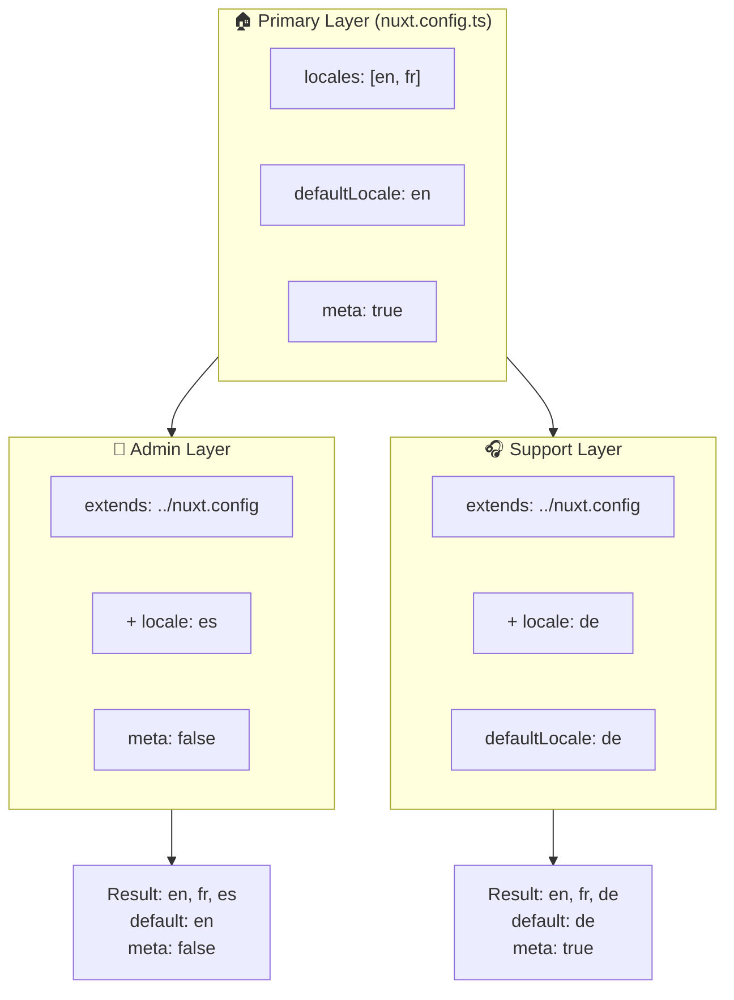

# 🗂️ Các layer trong `Nuxt I18n Micro`

## 📖 Giới thiệu các layer

Các layer trong `Nuxt I18n Micro` cho phép bạn quản lý và tùy chỉnh cài đặt bản địa hóa linh hoạt trên các phần khác nhau của ứng dụng. Bằng cách định nghĩa các layer khác nhau, bạn có thể điều chỉnh cấu hình cho các ngữ cảnh khác nhau, chẳng hạn ghi đè cài đặt cho các phần cụ thể của trang web hoặc tạo các cấu hình cơ sở tái sử dụng mà các phần khác của ứng dụng có thể mở rộng.

### Luồng kế thừa layer



## 🛠️ Layer cấu hình chính

**Layer cấu hình chính** là nơi bạn thiết lập cài đặt bản địa hóa mặc định cho toàn bộ ứng dụng. Layer này rất quan trọng vì nó định nghĩa cấu hình toàn cục, bao gồm các ngôn ngữ được hỗ trợ, ngôn ngữ mặc định và các cài đặt i18n quan trọng khác.

### 📄 Ví dụ: Định nghĩa layer cấu hình chính

Đây là ví dụ cách bạn có thể định nghĩa layer cấu hình chính trong tệp `nuxt.config.ts`:

```typescript
export default defineNuxtConfig({
  i18n: {
    locales: [
      { code: 'en', iso: 'en-EN', dir: 'ltr' },
      { code: 'fr', iso: 'fr-FR', dir: 'ltr' },
      { code: 'ar', iso: 'ar-SA', dir: 'rtl' },
    ],
    defaultLocale: 'en', // The default locale for the entire app
    translationDir: 'locales', // Directory where translations are stored
    meta: true, // Automatically generate SEO-related meta tags like `alternate`
    autoDetectLanguage: true, // Automatically detect and use the user's preferred language
  },
})
```

## 🌱 Layer con

Các layer con được dùng để mở rộng hoặc ghi đè cấu hình chính cho các phần cụ thể của ứng dụng. Ví dụ, bạn có thể muốn thêm các ngôn ngữ bổ sung hoặc sửa đổi ngôn ngữ mặc định cho một phần cụ thể của trang web. Layer con đặc biệt hữu ích trong các ứng dụng mô-đun nơi các phần khác nhau của ứng dụng có thể có yêu cầu bản địa hóa khác nhau.

### 📄 Ví dụ: Mở rộng layer chính trong một layer con

Giả sử bạn có một phần của trang web cần hỗ trợ các ngôn ngữ bổ sung, hoặc bạn muốn tắt một ngôn ngữ cụ thể trong một ngữ cảnh nhất định. Đây là cách bạn có thể đạt điều đó bằng cách mở rộng layer cấu hình chính:

```typescript
// basic/nuxt.config.ts (Primary Layer)
export default defineNuxtConfig({
  i18n: {
    locales: [
      { code: 'en', iso: 'en-EN', dir: 'ltr' },
      { code: 'fr', iso: 'fr-FR', dir: 'ltr' },
    ],
    defaultLocale: 'en',
    meta: true,
    translationDir: 'locales',
  },
})
```

```typescript
// extended/nuxt.config.ts (Child Layer)
export default defineNuxtConfig({
  extends: '../basic', // Inherit the base configuration from the 'basic' layer
  i18n: {
    locales: [
      { code: 'en', iso: 'en-EN', dir: 'ltr' }, // Inherited from the base layer
      { code: 'fr', iso: 'fr-FR', dir: 'ltr' }, // Inherited from the base layer
      { code: 'de', iso: 'de-DE', dir: 'ltr' }, // Added in the child layer
    ],
    defaultLocale: 'fr', // Override the default locale to French for this section
    autoDetectLanguage: false, // Disable automatic language detection in this section
  },
})
```

### 🌐 Sử dụng các layer trong ứng dụng mô-đun

Trong một ứng dụng Nuxt lớn hơn theo kiểu mô-đun, bạn có thể có nhiều phần, mỗi phần yêu cầu cài đặt i18n riêng. Bằng cách tận dụng các layer, bạn có thể duy trì cấu trúc cấu hình sạch và có khả năng mở rộng.

### 📄 Ví dụ: Cấu hình theo lớp trong ứng dụng mô-đun

Hãy tưởng tượng bạn có một trang thương mại điện tử với các phần riêng biệt như trang web chính, bảng quản trị và cổng hỗ trợ khách hàng. Mỗi phần có thể cần một tập hợp ngôn ngữ khác nhau hoặc các cài đặt i18n khác.

#### **Layer chính (cấu hình toàn cục):**

```typescript
// nuxt.config.ts
export default defineNuxtConfig({
  i18n: {
    locales: [
      { code: 'en', iso: 'en-EN', dir: 'ltr' },
      { code: 'fr', iso: 'fr-FR', dir: 'ltr' },
    ],
    defaultLocale: 'en',
    meta: true,
    translationDir: 'locales',
    autoDetectLanguage: true,
  },
})
```

#### **Layer con cho bảng quản trị:**

```typescript
// admin/nuxt.config.ts
export default defineNuxtConfig({
  extends: '../nuxt.config', // Inherit the global settings
  i18n: {
    locales: [
      { code: 'en', iso: 'en-EN', dir: 'ltr' }, // Inherited
      { code: 'fr', iso: 'fr-FR', dir: 'ltr' }, // Inherited
      { code: 'es', iso: 'es-ES', dir: 'ltr' }, // Specific to the admin panel
    ],
    defaultLocale: 'en',
    meta: false, // Disable automatic meta generation in the admin panel
  },
})
```

#### **Layer con cho cổng hỗ trợ khách hàng:**

```typescript
// support/nuxt.config.ts
export default defineNuxtConfig({
  extends: '../nuxt.config', // Inherit the global settings
  i18n: {
    locales: [
      { code: 'en', iso: 'en-EN', dir: 'ltr' }, // Inherited
      { code: 'fr', iso: 'fr-FR', dir: 'ltr' }, // Inherited
      { code: 'de', iso: 'de-DE', dir: 'ltr' }, // Specific to the support portal
    ],
    defaultLocale: 'de', // Default to German in the support portal
    autoDetectLanguage: false, // Disable automatic language detection
  },
})
```

Trong ví dụ mô-đun này:

- Mỗi phần (admin, support) có cài đặt i18n riêng, nhưng tất cả đều kế thừa cấu hình cơ sở.
- Bảng quản trị thêm tiếng Tây Ban Nha (`es`) làm một ngôn ngữ và tắt tạo thẻ meta.
- Cổng hỗ trợ thêm tiếng Đức (`de`) làm một ngôn ngữ và mặc định là tiếng Đức cho giao diện người dùng.

## 📝 Thực hành tốt nhất khi sử dụng layer

- **🔧 Giữ layer chính đơn giản:** Layer chính nên chứa các cài đặt được dùng phổ biến nhất áp dụng toàn cục trên ứng dụng của bạn. Giữ nó đơn giản để đảm bảo tính nhất quán.
- **⚙️ Dùng layer con cho các tùy chỉnh cụ thể:** Chỉ ghi đè hoặc mở rộng cài đặt trong layer con khi cần thiết. Cách tiếp cận này tránh sự phức tạp không cần thiết trong cấu hình.
- **📚 Ghi tài liệu các layer:** Ghi rõ mục đích và chi tiết của mỗi layer trong dự án. Điều này sẽ giúp duy trì sự rõ ràng và giúp người khác (hoặc chính bạn trong tương lai) hiểu cấu hình dễ hơn.
