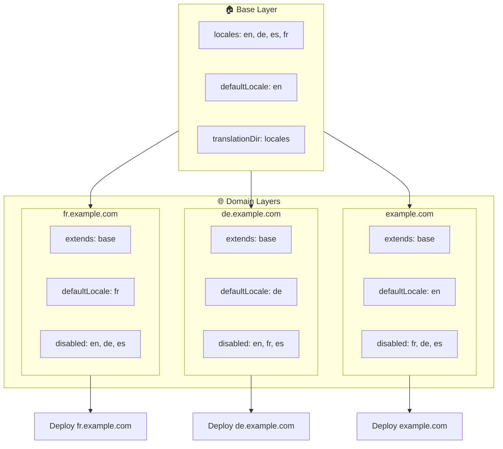

# 🌍 Thiết lập ngôn ngữ đa miền với `Nuxt I18n Micro` bằng các layer

## 📝 Giới thiệu

Bằng cách tận dụng các layer trong `Nuxt I18n Micro`, bạn có thể tạo một thiết lập bản địa hóa đa miền linh hoạt và dễ bảo trì. Cách tiếp cận này không chỉ đơn giản hóa việc quản lý miền bằng cách loại bỏ nhu cầu về các chức năng phức tạp mà còn cho phép phân phối tải hiệu quả và giảm độ phức tạp của dự án. Bằng cách chạy các dự án riêng cho các ngôn ngữ khác nhau, ứng dụng của bạn có thể dễ dàng mở rộng và thích ứng với các yêu cầu ngôn ngữ khác nhau trên nhiều miền, mang lại giải pháp mạnh mẽ và có khả năng mở rộng cho các ứng dụng toàn cầu.

## 🎯 Mục tiêu

Tạo một thiết lập nơi các miền khác nhau phục vụ các ngôn ngữ cụ thể bằng cách tùy chỉnh cấu hình trong các layer con. Phương pháp này tận dụng hệ thống phân lớp của Nuxt, cho phép bạn duy trì cấu hình cơ sở trong khi mở rộng hoặc sửa đổi nó cho từng miền.

### Kiến trúc đa miền



## 🛠 Các bước triển khai ngôn ngữ đa miền

### 1. **Tạo layer cơ sở**

Bắt đầu bằng cách tạo một layer cấu hình cơ sở bao gồm tất cả các thiết lập ngôn ngữ chung cho ứng dụng. Cấu hình này sẽ đóng vai trò nền tảng cho các cấu hình theo miền khác.

#### **Cấu hình layer cơ sở**

Tạo tệp cấu hình cơ sở `base/nuxt.config.ts`:

```typescript
// base/nuxt.config.ts

export default defineNuxtConfig({
  i18n: {
    locales: [
      { code: 'en', iso: 'en-US', dir: 'ltr' },
      { code: 'de', iso: 'de-DE', dir: 'ltr' },
      { code: 'es', iso: 'es-ES', dir: 'ltr' },
    ],
    defaultLocale: 'en',
    translationDir: 'locales',
    meta: true,
    autoDetectLanguage: true,
  },
})
```

### 2. **Tạo các layer con theo miền**

Với mỗi miền, tạo một layer con sửa đổi cấu hình cơ sở để đáp ứng các yêu cầu cụ thể của miền đó. Bạn có thể tắt các ngôn ngữ không cần thiết cho một miền cụ thể.

#### **Ví dụ: Cấu hình cho miền tiếng Pháp**

Tạo cấu hình layer con cho miền tiếng Pháp trong `fr/nuxt.config.ts`:

```typescript
// fr/nuxt.config.ts

export default defineNuxtConfig({
  extends: '../base', // Inherit from the base configuration

  i18n: {
    locales: [
      { code: 'en', iso: 'en-US', dir: 'ltr', disabled: true }, // Disable English
      { code: 'fr', iso: 'fr-FR', dir: 'ltr' }, // Add and enable the French locale
      { code: 'de', iso: 'de-DE', dir: 'ltr', disabled: true }, // Disable German
      { code: 'es', iso: 'es-ES', dir: 'ltr', disabled: true }, // Disable Spanish
    ],
    defaultLocale: 'fr', // Set French as the default locale
    autoDetectLanguage: false, // Disable automatic language detection
  },
})
```

#### **Ví dụ: Cấu hình cho miền tiếng Đức**

Tương tự, tạo cấu hình layer con cho miền tiếng Đức trong `de/nuxt.config.ts`:

```typescript
// de/nuxt.config.ts

export default defineNuxtConfig({
  extends: '../base', // Inherit from the base configuration

  i18n: {
    locales: [
      { code: 'en', iso: 'en-US', dir: 'ltr', disabled: true }, // Disable English
      { code: 'fr', iso: 'fr-FR', dir: 'ltr', disabled: true }, // Disable French
      { code: 'de', iso: 'de-DE', dir: 'ltr' }, // Use the German locale
      { code: 'es', iso: 'es-ES', dir: 'ltr', disabled: true }, // Disable Spanish
    ],
    defaultLocale: 'de', // Set German as the default locale
    autoDetectLanguage: false, // Disable automatic language detection
  },
})
```

### 3. **Triển khai ứng dụng cho từng miền**

Triển khai ứng dụng với cấu hình phù hợp cho từng miền. Ví dụ:

- Triển khai cấu hình layer `fr` lên `fr.example.com`.
- Triển khai cấu hình layer `de` lên `de.example.com`.

### 4. **Thiết lập nhiều dự án cho các ngôn ngữ khác nhau**

Với mỗi ngôn ngữ và miền, bạn cần chạy một thể hiện riêng của ứng dụng. Điều này đảm bảo mỗi miền phục vụ cấu hình ngôn ngữ đúng, tối ưu phân phối tải và đơn giản hóa cấu trúc dự án. Bằng cách chạy nhiều dự án được điều chỉnh cho từng ngôn ngữ, bạn có thể duy trì sự tách biệt sạch giữa các cấu hình và giảm độ phức tạp của thiết lập tổng thể.

### 5. **Cấu hình định tuyến dựa trên miền**

Đảm bảo định tuyến của bạn được cấu hình để đưa người dùng đến đúng dự án dựa trên miền họ truy cập. Điều này đảm bảo mỗi miền phục vụ ngôn ngữ phù hợp, nâng cao trải nghiệm người dùng và duy trì sự nhất quán trên các khu vực khác nhau.

### 6. **Triển khai và xác minh**

Sau khi cấu hình các layer và triển khai chúng lên các miền tương ứng, hãy đảm bảo mỗi miền phục vụ ngôn ngữ đúng. Kiểm thử ứng dụng kỹ lưỡng để xác nhận rằng ngôn ngữ đúng được tải tùy thuộc vào miền.

## 📝 Thực hành tốt nhất

- **Giữ cấu hình cơ sở tổng quát**: Cấu hình cơ sở nên bao gồm các cài đặt chung áp dụng cho tất cả các miền.
- **Cách ly logic theo miền**: Giữ các cấu hình theo miền trong các layer tương ứng để duy trì sự rõ ràng và phân tách trách nhiệm.

## 🎉 Kết luận

Bằng cách tận dụng các layer trong `Nuxt I18n Micro`, bạn có thể tạo một thiết lập bản địa hóa đa miền linh hoạt và dễ bảo trì. Cách tiếp cận này không chỉ loại bỏ nhu cầu về các chức năng quản lý miền phức tạp mà còn cho phép bạn phân phối tải hiệu quả và giảm độ phức tạp của dự án. Chạy các dự án riêng cho các ngôn ngữ khác nhau đảm bảo ứng dụng của bạn có thể mở rộng dễ dàng và thích ứng với các yêu cầu ngôn ngữ khác nhau trên các miền khác nhau, mang lại giải pháp mạnh mẽ và có khả năng mở rộng cho các ứng dụng toàn cầu.
