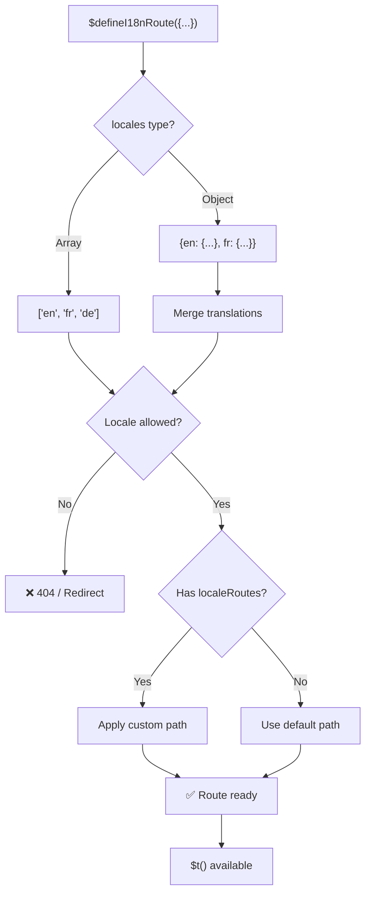
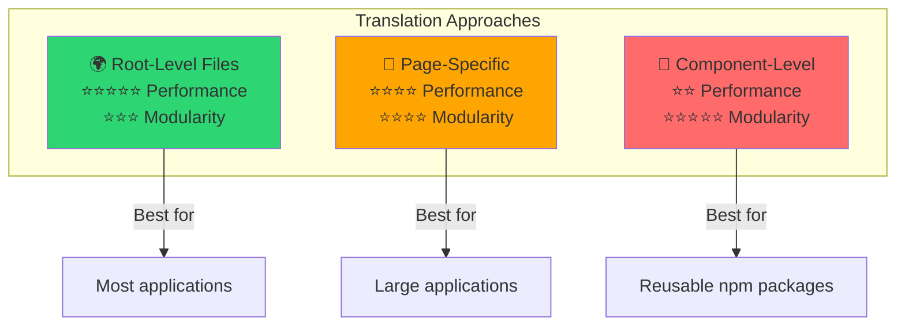

# 📖 Bản dịch theo Component

Tìm hiểu cách định nghĩa các bản dịch trực tiếp trong các component Vue bằng `$defineI18nRoute` để có bản địa hóa mô-đun và dễ bảo trì.

## 📖 Tổng quan

Bản dịch theo Component trong `Nuxt I18n Micro` cho phép bạn định nghĩa các bản dịch trực tiếp trong các component hoặc trang cụ thể bằng hàm `$defineI18nRoute`. Cách tiếp cận này lý tưởng để quản lý nội dung đã bản địa hóa duy nhất cho các component riêng lẻ, cung cấp một phương pháp mô-đun hơn và dễ bảo trì hơn để xử lý bản dịch.

## 🚀 Khởi động nhanh

### Cách dùng cơ bản

```vue
<template>
  <div>
    <h1>{{ $t('greeting') }}</h1>
    <p>{{ $t('farewell') }}</p>
  </div>
</template>

<script setup lang="ts">
import { useNuxtApp } from '#imports'

const { $defineI18nRoute, $t } = useNuxtApp()

$defineI18nRoute({
  locales: {
    en: { greeting: 'Hello', farewell: 'Goodbye' },
    fr: { greeting: 'Bonjour', farewell: 'Au revoir' },
    de: { greeting: 'Hallo', farewell: 'Auf Wiedersehen' },
  },
})
</script>
```

### Thiết lập bắt buộc (`script setup`)

`$defineI18nRoute` là một injection của Nuxt app, không phải một macro toàn cục.  
Luôn lấy nó từ `useNuxtApp()` trước khi gọi nó.

```ts
import { useNuxtApp } from '#imports'

const { $defineI18nRoute } = useNuxtApp()
```

## 🏗️ Meta Route tại thời điểm Build

Tại thời điểm build, một unplugin Vite quét các tệp `.vue` của trang để tìm các cuộc gọi `defineI18nRoute(...)` / `$defineI18nRoute(...)` và trích xuất các hạn chế locale, `localeRoutes`, và `disableMeta` vào metadata route được dùng bởi `@i18n-micro/route-strategy`.

- **Build**: unplugin (`src/unplugin-define-i18n-route.ts`) chạy trong quá trình transform Vite và ghi `i18n-route-meta.json` trong thư mục build Nuxt
- **Runtime**: plugin define (`03.define.ts`) vẫn phơi bày `$defineI18nRoute` trong `script setup` cho dev và cấu hình inline

Thông thường, bạn chỉ gọi `$defineI18nRoute` trong các trang — module xử lý việc trích xuất tại thời điểm build tự động.

## 🔧 Hàm `$defineI18nRoute`

Hàm `$defineI18nRoute` cấu hình hành vi route dựa trên locale hiện tại, cung cấp một giải pháp linh hoạt để:

- Kiểm soát truy cập đến các route cụ thể dựa trên các locale khả dụng
- Cung cấp bản dịch cho các locale cụ thể
- Đặt các route tùy chỉnh cho các locale khác nhau
- Kiểm soát việc tạo thẻ meta

### Cách hoạt động



### Chữ ký phương thức

```typescript
const { $defineI18nRoute } = useNuxtApp();
$defineI18nRoute(routeDefinition: DefineI18nRouteConfig);
```

### Tham số

| Tham số      | Kiểu                                       | Mô tả                        |
| -------------- | ------------------------------------------ | ---------------------------------- |
| `locales`      | `string[] \| Record<string, Translations>` | Các locale khả dụng cho route    |
| `localeRoutes` | `Record<string, string>`                   | Các route tùy chỉnh cho các locale cụ thể |
| `disableMeta`  | `boolean \| string[]`                      | Kiểm soát việc tạo thẻ meta i18n   |

### Mô tả chi tiết tham số

#### `locales`

Định nghĩa các locale nào khả dụng cho route:

<CodeGroup>
```typescript Định dạng mảng
$defineI18nRoute({
  locales: ['en', 'fr', 'de'], // Simple array of locale codes
})
```

```typescript Định dạng object
$defineI18nRoute({
  locales: {
    en: { greeting: 'Hello', farewell: 'Goodbye' },
    fr: { greeting: 'Bonjour', farewell: 'Au revoir' },
    de: { greeting: 'Hallo', farewell: 'Auf Wiedersehen' },
    ru: {}, // Russian locale allowed but no translations provided
  },
})
```
</CodeGroup>

#### `localeRoutes`

Cho phép các route tùy chỉnh cho các locale cụ thể:

```typescript
$defineI18nRoute({
  localeRoutes: {
    en: '/welcome',
    fr: '/bienvenue',
    de: '/willkommen',
    ru: '/privet', // Custom route path for Russian locale
  },
})
```

#### `disableMeta`

Kiểm soát việc tạo thẻ meta i18n:

<CodeGroup>
```typescript Tắt tất cả Meta
$defineI18nRoute({
  locales: ['en', 'fr', 'de'],
  disableMeta: true, // Disables all i18n meta tags
})
```

```typescript Tắt cho các Locale cụ thể
$defineI18nRoute({
  locales: ['en', 'fr', 'de'],
  disableMeta: ['en', 'fr'], // Only English and French won't have meta tags
})
```
</CodeGroup>

## 💡 Các trường hợp sử dụng

### 1. Kiểm soát truy cập dựa trên Locale

Định nghĩa các locale nào được phép cho các route cụ thể:

```typescript
$defineI18nRoute({
  locales: ['en', 'fr', 'de'], // Only these locales are allowed for this route
})
```

### 2. Cung cấp bản dịch dành riêng cho Component

Dùng đối tượng `locales` để cung cấp các bản dịch cụ thể cho mỗi route:

```typescript
$defineI18nRoute({
  locales: {
    en: {
      greeting: 'Hello',
      farewell: 'Goodbye',
      description: 'Welcome to our application',
    },
    fr: {
      greeting: 'Bonjour',
      farewell: 'Au revoir',
      description: 'Bienvenue dans notre application',
    },
    de: {
      greeting: 'Hallo',
      farewell: 'Auf Wiedersehen',
      description: 'Willkommen in unserer Anwendung',
    },
  },
})
```

### 3. Định tuyến tùy chỉnh cho Locale

Định nghĩa các đường dẫn tùy chỉnh cho các locale cụ thể:

```typescript
$defineI18nRoute({
  locales: ['en', 'fr', 'de'],
  localeRoutes: {
    en: '/welcome',
    fr: '/bienvenue',
    de: '/willkommen',
  },
})
```

### 4. Vô hiệu hóa thẻ Meta

Kiểm soát việc tạo thẻ meta SEO cho các route hoặc locale cụ thể:

```typescript
// Disable meta tags for all locales
$defineI18nRoute({
  locales: ['en', 'fr', 'de'],
  disableMeta: true,
})

// Disable meta tags only for specific locales
$defineI18nRoute({
  locales: ['en', 'fr', 'de'],
  disableMeta: ['en', 'fr'],
})
```

## ✅ Các định dạng cấu hình được hỗ trợ

Trình phân tích `$defineI18nRoute` hỗ trợ nhiều cấu hình JavaScript khác nhau:

### Cấu hình tĩnh

<CodeGroup>
```typescript Mảng tĩnh
$defineI18nRoute({
  locales: ['en', 'de', 'fr'],
})
```

```typescript Object tĩnh
$defineI18nRoute({
  locales: {
    en: { greeting: 'Hello' },
    de: { greeting: 'Hallo' },
  },
  localeRoutes: {
    en: '/welcome',
    de: '/willkommen',
  },
})
```
</CodeGroup>

### Cấu hình động

<CodeGroup>
```typescript Biến và hàm
const locales = ['en', 'de', 'fr']
const routes = { en: '/welcome', de: '/willkommen' }

$defineI18nRoute({
  locales: locales,
  localeRoutes: routes,
})
```

```typescript Template Literal
const prefix = 'api'

$defineI18nRoute({
  locales: [`${prefix}-en`, `${prefix}-de`],
  localeRoutes: {
    [`${prefix}-en`]: `/api/welcome`,
    [`${prefix}-de`]: `/api/willkommen`,
  },
})
```
</CodeGroup>

### Cấu hình nâng cao

<CodeGroup>
```typescript Toán tử Spread
const baseLocales = ['en', 'de']
const additionalLocales = ['fr', 'es']

$defineI18nRoute({
  locales: [...baseLocales, ...additionalLocales],
})
```

```typescript Mảng các object
$defineI18nRoute({
  locales: [
    { code: 'en', name: 'English' },
    { code: 'de', name: 'German' },
  ],
})
```
</CodeGroup>

### Logic điều kiện

```typescript
$defineI18nRoute({
  locales: process.env.NODE_ENV === 'production' ? ['en', 'de'] : ['en', 'de', 'fr', 'es'],
})
```

### Object lồng nhau phức tạp

```typescript
$defineI18nRoute({
  locales: {
    'en-us': {
      region: 'US',
      currency: 'USD',
      format: {
        date: 'MM/DD/YYYY',
        time: '12h',
      },
    },
    'de-de': {
      region: 'DE',
      currency: 'EUR',
      format: {
        date: 'DD.MM.YYYY',
        time: '24h',
      },
    },
  },
})
```

### Comment và định dạng

```typescript
$defineI18nRoute({
  // Supported locales for this component
  locales: [
    'en', // English
    'de', // German
    'fr', // French
  ],
  // Custom routes for each locale
  localeRoutes: {
    en: '/welcome',
    de: '/willkommen',
    fr: '/bienvenue',
  },
})
```

## ❌ Không được hỗ trợ

Trình phân tích có giới hạn và không thể xử lý:

- **Import bên ngoài** (câu lệnh `import`)
- **Hàm async/await**
- **Phương thức Class**
- **Luồng điều khiển phức tạp** (loop, try-catch, switch)
- **Arrow function** trong cấu hình
- **Generator function**

## 📝 Ví dụ hoàn chỉnh

Đây là một ví dụ toàn diện cho thấy tất cả các tính năng:

```vue
<template>
  <div class="welcome-page">
    <header>
      <h1>{{ $t('title') }}</h1>
      <p>{{ $t('subtitle') }}</p>
    </header>

    <main>
      <section>
        <h2>{{ $t('features.title') }}</h2>
        <ul>
          <li v-for="feature in $t('features.list')" :key="feature">
            {{ feature }}
          </li>
        </ul>
      </section>

      <section>
        <h2>{{ $t('contact.title') }}</h2>
        <p>{{ $t('contact.description') }}</p>
        <a :href="$t('contact.email')">{{ $t('contact.email') }}</a>
      </section>
    </main>

    <footer>
      <p>{{ $t('footer.copyright') }}</p>
    </footer>
  </div>
</template>

<script setup lang="ts">
import { useNuxtApp } from '#imports'

const { $defineI18nRoute, $t } = useNuxtApp()

// Define comprehensive i18n route configuration
$defineI18nRoute({
  locales: {
    en: {
      title: 'Welcome to Our Platform',
      subtitle: 'The best solution for your needs',
      features: {
        title: 'Key Features',
        list: ['High Performance', 'Easy to Use', 'Scalable Architecture'],
      },
      contact: {
        title: 'Get in Touch',
        description: "We'd love to hear from you",
        email: 'mailto:contact@example.com',
      },
      footer: {
        copyright: '© 2024 Example Company. All rights reserved.',
      },
    },
    fr: {
      title: 'Bienvenue sur Notre Plateforme',
      subtitle: 'La meilleure solution pour vos besoins',
      features: {
        title: 'Fonctionnalités Clés',
        list: ['Haute Performance', 'Facile à Utiliser', 'Architecture Évolutive'],
      },
      contact: {
        title: 'Contactez-Nous',
        description: 'Nous aimerions avoir de vos nouvelles',
        email: 'mailto:contact@example.com',
      },
      footer: {
        copyright: '© 2024 Example Company. Tous droits réservés.',
      },
    },
    de: {
      title: 'Willkommen auf Unserer Plattform',
      subtitle: 'Die beste Lösung für Ihre Bedürfnisse',
      features: {
        title: 'Hauptfunktionen',
        list: ['Hohe Leistung', 'Einfach zu Verwenden', 'Skalierbare Architektur'],
      },
      contact: {
        title: 'Kontaktieren Sie Uns',
        description: 'Wir würden gerne von Ihnen hören',
        email: 'mailto:contact@example.com',
      },
      footer: {
        copyright: '© 2024 Example Company. Alle Rechte vorbehalten.',
      },
    },
  },
  localeRoutes: {
    en: '/welcome',
    fr: '/bienvenue',
    de: '/willkommen',
  },
  disableMeta: false, // Enable SEO meta tags
})
</script>

<style scoped>
.welcome-page {
  max-width: 800px;
  margin: 0 auto;
  padding: 2rem;
}

header {
  text-align: center;
  margin-bottom: 3rem;
}

section {
  margin-bottom: 2rem;
}

footer {
  text-align: center;
  margin-top: 3rem;
  padding-top: 2rem;
  border-top: 1px solid #eee;
}
</style>
```

## ⚡ Cân nhắc về hiệu năng

Nhúng bản dịch vào Single File Component (SFC) có thể tác động đến hiệu năng:

### Các vấn đề tiềm ẩn

- **Kích thước tệp tăng**: Tất cả các locale nằm trong SFC, không giống như các tệp bản dịch riêng biệt cho phép tải theo locale
- **Render chậm hơn**: Bản dịch trong tệp được xử lý tại runtime
- **Sử dụng bộ nhớ**: Tất cả các bản dịch được tải bất kể locale hiện tại

### Thực hành tốt nhất

- **Dùng bản dịch theo trang** để có hiệu năng tối ưu
- **Dành bản dịch cấp component** cho các trường hợp cụ thể như:
  - Các component có thể tái sử dụng được xuất bản trên npm
  - Các bản dịch không phù hợp với tệp cấp gốc
  - Các component cần phải độc lập

### Hiệu năng so với tính mô-đun

Cân bằng nhu cầu dự án của bạn khi chọn cách tiếp cận:



| Cách tiếp cận             | Hiệu năng | Tính mô-đun | Trường hợp sử dụng            |
| -------------------- | ----------- | ---------- | ------------------- |
| **Tệp cấp gốc** | ⭐⭐⭐⭐⭐  | ⭐⭐⭐     | Hầu hết các ứng dụng   |
| **Theo trang**    | ⭐⭐⭐⭐    | ⭐⭐⭐⭐   | Các ứng dụng lớn  |
| **Cấp component**  | ⭐⭐        | ⭐⭐⭐⭐⭐ | Các component có thể tái sử dụng |

## 🎯 Thực hành tốt nhất

### 1. Giữ bản dịch gần với Component

Định nghĩa các bản dịch trực tiếp trong component liên quan để giữ nội dung đã bản địa hóa được tổ chức và dễ bảo trì.

### 2. Dùng Locale Object để linh hoạt

Tận dụng định dạng object cho thuộc tính `locales` khi cần các bản dịch cụ thể hoặc kiểm soát truy cập dựa trên locale.

### 3. Ghi tài liệu các Route tùy chỉnh

Ghi tài liệu rõ ràng bất kỳ route tùy chỉnh nào được đặt cho các locale khác nhau để duy trì sự rõ ràng và đơn giản hóa việc phát triển và bảo trì.

### 4. Cân nhắc tác động hiệu năng

Đánh giá xem các bản dịch cấp component có cần thiết cho trường hợp sử dụng của bạn không, cân nhắc các tác động về hiệu năng.

### 5. Dùng TypeScript

Tận dụng TypeScript để có type safety và hỗ trợ IntelliSense tốt hơn:

```typescript
interface ComponentTranslations {
  title: string
  subtitle: string
  features: {
    title: string
    list: string[]
  }
}

$defineI18nRoute({
  locales: {
    en: {
      title: 'Welcome',
      subtitle: 'Subtitle',
      features: {
        title: 'Features',
        list: ['Feature 1', 'Feature 2'],
      },
    } as ComponentTranslations,
  },
})
```

## 📚 Chủ đề liên quan

- **[Khởi động nhanh](/quickstart)** - Thiết lập và cấu hình cơ bản
- **[Tham chiếu API](/api/methods)** - Tài liệu phương thức đầy đủ
- **[Ví dụ](/examples)** - Ví dụ sử dụng trong thực tế

## Tóm tắt

Tính năng Per-Component Translations, được hỗ trợ bởi hàm `$defineI18nRoute`, cung cấp một cách mạnh mẽ và linh hoạt để quản lý bản địa hóa trong ứng dụng Nuxt của bạn. Bằng cách cho phép nội dung đã bản địa hóa và định tuyến được định nghĩa ở cấp component, nó giúp tạo ra một trải nghiệm được tùy chỉnh cao và thân thiện với người dùng phù hợp với sở thích ngôn ngữ và khu vực của khán giả của bạn.

Chọn cách tiếp cận phù hợp nhất với nhu cầu của dự án, cân nhắc cả yêu cầu hiệu năng và mối quan tâm bảo trì.
