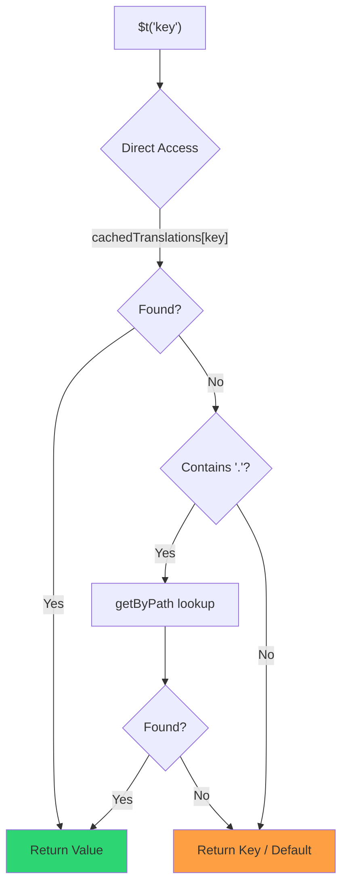

# 🚀 Hướng dẫn hiệu năng

## 📖 Giới thiệu

`Nuxt I18n Micro` được thiết kế với hiệu năng làm trọng tâm, mang lại cải tiến đáng kể so với các mô-đun quốc tế hóa (i18n) truyền thống như `nuxt-i18n`. Hướng dẫn này cung cấp cái nhìn sâu về những lợi ích hiệu năng khi dùng `Nuxt I18n Micro` và cách nó so với các giải pháp khác.

## 🤔 Vì sao tập trung vào hiệu năng?

Trong các dự án quy mô lớn và môi trường lưu lượng cao, các nút thắt hiệu năng có thể dẫn đến thời gian build chậm, tăng sử dụng bộ nhớ và thời gian phản hồi máy chủ kém. Những vấn đề này trở nên rõ rệt hơn với các thiết lập i18n phức tạp liên quan đến các tệp bản dịch lớn. `Nuxt I18n Micro` được xây dựng để giải quyết những thách thức này bằng cách tối ưu tốc độ, hiệu quả bộ nhớ và tối thiểu tác động lên kích thước bundle.

## 📊 So sánh hiệu năng

Chúng tôi đã thực hiện một loạt bài kiểm tra trên cùng các fixture qua `pnpm test:performance` (`pnpm -C scripts cli performance`) so với **`@nuxtjs/i18n@10.6.0`**. Phương pháp và biểu đồ đầy đủ: [Kết quả kiểm tra hiệu năng](/guides/performance-results).

Profile CLI mặc định: **4 ngôn ngữ** × **2 trang** (`index`, `page`) × ~10k khóa lá index. Tăng `--locales` / `--keys` để có tải regression nặng hơn. Báo cáo tách **code**, **translations** (bao gồm `@nuxtjs/i18n` `chunks/raw/*`) và **total** output có thể triển khai.

```bash
pnpm test:performance
pnpm -C scripts cli performance --only micro --skip-stress
pnpm -C scripts cli performance --locales 12 --keys 100000 --runs 3
```

### ⏱️ Thời gian build và tiêu thụ tài nguyên

<Accordion title="**@nuxtjs/i18n v10.6**">
- **Code Bundle**: 2.16 MB
- **Translations**: 7.21 MB (message chunks + locale payloads)
- **Total deployable**: 9.37 MB
- **Max Memory Usage**: 1,821 MB
- **Elapsed Time**: 8.34s (mean of 3)
</Accordion>

<Tip>
- **Code Bundle**: 1.74 MB — **nhỏ hơn ~19% so với `@nuxtjs/i18n` v10.6**
- **Translations**: 6.8 MB (JSON tải lười)
- **Total deployable**: 8.54 MB
- **Max Memory Usage**: 1,065 MB — **ít hơn ~41% so với `@nuxtjs/i18n` v10.6**
- **Elapsed Time**: 5.34s — **nhanh hơn ~36% so với `@nuxtjs/i18n` v10.6** (≈ baseline plain-nuxt)
</Tip>

> Tài liệu cũ hiển thị `@nuxtjs/i18n` "code ≈ 15 MB / translations 0 B" đã tính các tệp message `chunks/raw` là mã ứng dụng. Bộ phân loại hiện tại tách chúng ra; khoảng cách trên **code** nhỏ hơn, và micro vẫn dẫn đầu về thời gian build, đỉnh RSS và các bài kiểm tra tải.

Xem [báo cáo đo đầy đủ](/guides/performance-results) để có biểu đồ, kết quả Autocannon và chi tiết fixture.

### 🌐 Hiệu năng máy chủ dưới tải

Artillery (6s@6 + 60s@60) và Autocannon (10c / 10s), trung bình của 3 lần chạy liên tiếp cho mỗi fixture.

<Accordion title="**@nuxtjs/i18n v10.6**">
- **Requests per Second (Artillery)**: 143 [#/sec]
- **Average Response Time**: 956 ms
- **Autocannon RPS / avg latency**: 72 / 139 ms
</Accordion>

<Tip>
- **Requests per Second (Artillery)**: 275 [#/sec] — **nhiều hơn ~93% so với `@nuxtjs/i18n` v10.6**
- **Average Response Time**: 483 ms — **nhanh hơn ~49% so với `@nuxtjs/i18n` v10.6**
- **Autocannon RPS / avg latency**: 162 / 62 ms
</Tip>

### 📈 So sánh trực quan

<Note>
Biểu đồ tương tác bị lược trong tài liệu Mintlify. Xem các bảng đo trên trang này hoặc [tài liệu VitePress](https://s00d.github.io/nuxt-i18n-micro/guide/performance-results) để xem biểu đồ: `chart`.
</Note>

<Note>
Biểu đồ tương tác bị lược trong tài liệu Mintlify. Xem các bảng đo trên trang này hoặc [tài liệu VitePress](https://s00d.github.io/nuxt-i18n-micro/guide/performance-results) để xem biểu đồ: `chart`.
</Note>

| Chỉ số | @nuxtjs/i18n v10.6 | i18n-micro | Cải thiện |
| --------------- | ------------------ | ---------- | ------------------ |
| Thời gian build | 8.34s | 5.34s | **nhanh hơn ~36%** |
| Bộ nhớ (build) | 1,821 MB | 1,065 MB | **ít hơn ~41%** |
| Code Bundle | 2.16 MB | 1.74 MB | **nhỏ hơn ~19%** |
| Thời gian phản hồi | 956 ms | 483 ms | **nhanh hơn ~49%** |
| RPS (Artillery) | 143 | 275 | **nhiều hơn ~93%** |

### 🔍 Diễn giải kết quả

So với `@nuxtjs/i18n` **v10.6** hiện tại (profile CLI mặc định, trung bình của 3):

- 🗜️ **Đồ thị code nhỏ hơn**: ~1.74 MB so với ~2.16 MB khi các chunk message không bị dán nhãn sai là "code".
- 🧠 **RSS build thấp hơn**: đỉnh ~1.1 GB so với ~1.8 GB.
- 🕒 **Build nhanh hơn**: ~5.3s so với ~8.3s (micro tương đương baseline plain-Nuxt trên profile này).
- ⚡ **Tốt hơn nhiều dưới tải**: ~275 so với ~143 RPS Artillery, ~162 so với ~72 RPS Autocannon, độ trễ trung bình thấp hơn.

Các con số tuyệt đối khác với các bảng đã công bố cũ (từ điển nhỏ hơn, Nuxt cũ hơn, và cách chia "0 B translations" không công bằng cho `@nuxtjs/i18n`). Về mặt định hướng vẫn giống nhau: micro dẫn trước về chi phí build và throughput yêu cầu.

## ⚙️ Các tối ưu chính

### 🛠️ Thiết kế tối giản

`Nuxt I18n Micro` được xây dựng quanh một kiến trúc tối giản với lõi nhỏ và các gói chiến lược chuyên biệt. Điều này giảm chi phí và đơn giản hóa logic nội bộ, dẫn đến hiệu năng cải thiện.

### 🚦 Định tuyến hiệu quả

Trong v3, tạo route và logic đường dẫn tại runtime được chia thành các gói chuyên biệt để tree-shaking tối ưu:

- **`@i18n-micro/route-strategy`** — Tạo route tại thời điểm build: mở rộng các trang Nuxt với các route đã bản địa hóa. Chỉ chiến lược được chọn (`no_prefix`, `prefix`, `prefix_except_default`, `prefix_and_default`) được đưa vào.
- **`@i18n-micro/path-strategy`** — Phân giải đường dẫn runtime, chuyển hướng và tạo liên kết. Dùng các hàm thuần túy và các cờ ngữ cảnh được tính trước để tối thiểu hóa cấp phát trên các đường dẫn nóng. Xuất theo đường dẫn con (`/prefix`, `/no-prefix`, v.v.) đảm bảo chỉ triển khai đã chọn được đóng gói.

Cách tiếp cận này giữ cho cấu hình định tuyến nhẹ và đảm bảo phân giải route nhanh bất kể số lượng ngôn ngữ.

### 📂 Tải bản dịch tinh gọn

Mô-đun chỉ hỗ trợ tệp JSON cho bản dịch, với sự phân tách rõ giữa các tệp toàn cục và các tệp riêng theo trang. Điều này đảm bảo chỉ dữ liệu bản dịch cần thiết được tải tại bất kỳ thời điểm nào, tăng cường thêm hiệu năng.

### 🔒 Bộ nhớ đệm singleton GlobalThis

Bắt đầu từ v3.0.0, mô-đun sử dụng mẫu singleton `globalThis` với `Symbol.for` để đảm bảo một thể hiện bộ nhớ đệm duy nhất trên toàn tiến trình Node.js. Điều này ngăn:

- Trùng lặp bộ nhớ đệm khi cùng mô-đun được đóng gói nhiều lần
- Tạo lại đối tượng theo mỗi yêu cầu gây áp lực garbage collection
- Rò rỉ bộ nhớ từ các thể hiện bộ nhớ đệm mồ côi

```mermaid
flowchart LR
    subgraph Process["Node.js Process"]
        G["globalThis[Symbol.for('CACHE')]"]

        subgraph R1["SSR Request 1"]
            P1[Plugin Instance] --> G
        end

        subgraph R2["SSR Request 2"]
            P2[Plugin Instance] --> G
        end

        subgraph R3["SSR Request 3"]
            P3[Plugin Instance] --> G
        end
    end

    G --> Cache["Single Map Instance"]
    Cache --> D1["en:index → translations"]
    Cache --> D2["en:about → translations"
```

```typescript
// Internal implementation pattern
const CACHE_KEY = Symbol.for('__NUXT_I18N_STORAGE_CACHE__')
if (!globalThis[CACHE_KEY]) {
  globalThis[CACHE_KEY] = new Map()
}
```

### ⚡ Hàm dịch tối ưu (tFast)

Hàm `$t()` sử dụng chiến lược tra cứu trực tiếp được tối ưu cho tốc độ:

1. **Ngữ cảnh được tính trước**: Ngôn ngữ và tên route được tính một lần khi điều hướng, không phải trên mỗi lời gọi `$t()`
2. **Tra cứu một nguồn**: Tất cả bản dịch (root + theo trang + dự phòng) được gộp trước tại thời điểm build vào một tệp duy nhất cho mỗi trang. Không cần tìm kiếm theo lớp.
3. **Deep merge tích lũy khi điều hướng**: Khi điều hướng trong cùng ngôn ngữ, các bản dịch trang mới được deep-merge (độ sâu 2 cấp) vào từ điển đang hoạt động, nên các khóa từ trang trước vẫn hiển thị trong hoạt hình chuyển tiếp, ngay cả khi các trang chia sẻ các tiền tố lồng nhau chồng chéo (ví dụ, cả hai trang có khóa dưới `common.*`)
4. **Thu gom rác qua `page:transition:finish`**: Sau khi hoạt hình chuyển tiếp hoàn toàn hoàn tất, từ điển được gộp được thay thế bằng bản dịch sạch chỉ cho trang mới, giải phóng bộ nhớ khỏi các khóa của trang cũ
5. **Truy cập thuộc tính trực tiếp**: Dùng `obj[key]` thay vì tra cứu Map cho các đường dẫn nóng



```typescript
// Simplified lookup logic — single active dictionary
let val = cachedTranslations[key]
if (val === undefined && key.includes('.')) {
  val = getByPath(cachedTranslations, key)
}
```

### 💉 Tải phía server (không nhúng HTML)

Các bản dịch được tải trong SSR ở lại trong **bộ nhớ server** cho `$t` khi render. Chúng **không** được sao chép vào `nuxtApp.payload` / tài liệu HTML (cùng ý tưởng với `@nuxtjs/i18n` với `experimental.preload: false`).

Trên client, `01.plugin.ts` `await` `switchContext`, tải `/\{apiBaseUrl\}/:page/:locale/data.json` trước khi ứng dụng tiếp tục. Một yêu cầu, không phải một blob inline 8 MB.

`NuxtI18n` vẫn giữ từ điển được gộp đang hoạt động (`cachedTranslations`) cho `$t()` / `$has()`. Các điều hướng cùng ngôn ngữ deep-merge các chunk trang cho đến khi `page:transition:finish` dọn dẹp các khóa cũ.

#### Nó đang ở đâu hôm nay

Các con số dưới đây được đọc từ tệp ngân sách mà `pnpm run budget:payload` đo và thực thi.

{/* generated:payload-budget — do not edit; run `pnpm run docs:generate` */}

Đo trên `playground` qua `/`, `/de`:

| Phép đo | Kích thước |
| --- | --- |
| Nguồn bản dịch trên đĩa | 15.2 MB |
| Được phục vụ dưới dạng tệp payload riêng | 76.3 MB |
| `__NUXT_DATA__` inline lớn nhất | 6.9 MB |
| Tài sản client | 449.5 KB |

Playground mang một từ điển được cố ý quá cỡ, nên đây không phải là các con số bạn nên mong đợi từ một
ứng dụng thực. Đây là điểm cố định để đo lường. Ngân sách thất bại khi chúng tăng bất ngờ,
đó là cách một thay đổi vô tình về nội dung payload được chú ý.

{/* /generated:payload-budget */}

### 💾 Bộ nhớ đệm và pre-render

Các bản dịch đi qua nhiều bộ nhớ đệm, và biết cái nào đã trả lời một yêu cầu là sự
khác biệt giữa một phiên gỡ lỗi năm phút và năm giờ. Có bốn cái, theo
thứ tự mà một yêu cầu gặp chúng:

| Lớp | Ở đâu | Vòng đời | Được xóa bởi |
| --- | --- | --- | --- |
| Trình duyệt / CDN | `Cache-Control` trên `/\{apiBaseUrl\}/**` | `httpCacheDuration`, `immutable` | một `?v=` mới. Tức là triển khai thay đổi bản dịch |
| Bộ nhớ đệm route Nitro | `routeRules['/\{apiBaseUrl\}/**'].cache` | 60 s, stale-while-revalidate | khởi động lại máy chủ |
| Server loader | `CacheControl` trong tiến trình, khóa `locale:routeName` | vòng đời tiến trình, hoặc `cacheTtl` | khởi động lại máy chủ, HMR trong dev |
| Kho lưu trữ client | `translationStorage` + chunk đang hoạt động trong `NuxtI18n` | vòng đời trang | tải lại |

Hai quy tắc giúp chúng không mâu thuẫn:

- **Bộ nhớ đệm route Nitro chỉ tồn tại khi có `?v=`.** Với một cache-buster, mỗi URL là
  duy nhất theo nội dung của nó, nên đệm nó phía server không có nguy cơ lỗi thời. Đặt
  `dateBuild: 0` và lớp đó bị tắt, vì URL khi đó ổn định và
  phản hồi nói `must-revalidate`. Một bộ nhớ đệm phía server sẽ trả lời từ một mục cũ
  trong tối đa một phút và âm thầm đánh bại điều đó.
- **`immutable` cũng yêu cầu `?v=`.** Không có buster, header là
  `public, max-age=0, must-revalidate`, bất kể `httpCacheDuration` nói gì: một `max-age` dài
  trên một URL không bao giờ thay đổi sẽ giữ phản hồi đầu tiên mà trình duyệt từng thấy.

<Warning>
Với `translationPayloads.publicAssets` (mặc định trong chế độ premerged), các payload được sao chép tới
`public/<apiBaseUrl>/\{page\}/\{locale\}/data.json`. Một nền tảng phục vụ chính thư mục đó
(Cloudflare Pages, Firebase Hosting, `npx serve`) áp dụng header của riêng nó. Header
`routeRules` của Nitro chỉ đến các phản hồi đi qua server. Đặt chính sách bộ nhớ đệm cho
các tệp tĩnh đó trong cấu hình riêng của nền tảng.
</Warning>

🏁 **Pre-render**: trong chế độ premerged, `publicAssets` đã ghi cây URL client vào
`public/`. Chỉ chọn `prerenderRoutes` nếu bạn cần Nitro tạo route handler khi
bản sao đó bị tắt.

### 🗜️ Payload public được nén

Khi bật `nitro.compressPublicAssets`, các payload bản dịch được sao chép vào thư mục public
cũng nhận các anh chị em `.gz` và `.br`:

```ts
export default defineNuxtConfig({
  nitro: { compressPublicAssets: true },
})
```

Nitro nén các asset public trước hook sao chép payload, nên nếu không có điều này, chúng sẽ
là phần duy nhất không nén của một bản build tĩnh. Mô-đun không tự bật nén.
Nó chỉ áp dụng cài đặt bạn đã chọn. Lựa chọn theo mã hóa (`\{ gzip: true, brotli: false \}`)
được tôn trọng.

Playground index payload: 6 651 984 B thô, 1 012 831 B gzip, 821 617 B brotli.

### ☁️ Output payload serverless

Trên **Node**, SSR đọc JSON bản dịch từ `public/<apiBaseUrl>` (`readFile`, không dùng `serverAssets` của Nitro / Rollup `raw:`). Trên **Edge**, `serverAssets` của Nitro nhúng cùng cây (ưu tiên `mode: 'source'` cho các danh mục lớn).

```typescript
export default defineNuxtConfig({
  i18n: {
    translationPayloads: {
      serverAssets: true, // default — Node → public copy; Edge → serverAssets embed
      publicAssets: true, // default in premerged mode
    },
  },
})
```

Dùng `translationPayloads.mode: 'source'` cho các nhúng Edge gọn (và các bản sao public gọn tùy chọn):

```typescript
export default defineNuxtConfig({
  i18n: {
    translationPayloads: {
      mode: 'source',
    },
  },
})
```

`mode: 'source'` giữ các tệp nguồn được gộp theo lớp gọn nhẹ và gộp root/page/fallback tại runtime qua route `/_locales` tích hợp (hoặc `assets:i18n` trên Edge). Theo mặc định, nó tắt các bản sao public asset và các route payload được prerender.

<Warning>
`prerenderRoutes` mặc định là `false`. Với `mode: 'source'`, `publicAssets` cũng mặc định là `false`. Do đó, hosting tĩnh thuần không có runtime Nitro/edge không thể tải bản dịch trên client trừ khi bạn bật một trong các output này, giữ `serverHandler` khả dụng tại runtime, hoặc host payload ở bên ngoài.

Premerged mặc định + `publicAssets` đã đặt `/\{apiBaseUrl\}/\{page\}/\{locale\}/data.json` dưới `public/`, nên các host tĩnh có thể phục vụ các fetch client mà không cần Nitro.
</Warning>

<Warning>
Đặt `apiBaseServerHost` hoặc `apiBaseClientHost` chuyển việc phục vụ payload sang origin đó, kèm các yêu cầu riêng. Xem [Cấu hình → Host CDN bên ngoài](/guides/configuration#external-cdn-hosts).
</Warning>

Hoặc tắt các output HTTP/public riêng lẻ và host payload ở bên ngoài:

```typescript
export default defineNuxtConfig({
  i18n: {
    apiBaseClientHost: 'https://cdn.example.com',
    apiBaseServerHost: 'https://cdn.example.com',
    translationPayloads: {
      serverHandler: false,
      publicAssets: false,
      prerenderRoutes: false,
    },
  },
})
```

Giữ `serverHandler` được bật khi bạn dựa vào route cục bộ tích hợp `/\{apiBaseUrl\}/:page/:locale/data.json`. Tắt nó khi payload được host bên ngoài và `apiBaseServerHost` trỏ đến origin bên ngoài đó. Chỉ bật `prerenderRoutes` khi bạn cần Nitro tạo các route payload tĩnh và `publicAssets` chưa ghi chúng.

Trong build, mô-đun cảnh báo khi output payload được sinh vượt `translationPayloads.warnFileCount` (mặc định 500) hoặc `translationPayloads.warnSizeBytes` (mặc định 10 MB). Nó cũng cảnh báo khi tất cả output cục bộ bị tắt mà không có host payload bên ngoài được cấu hình.

## 📝 Mẹo tối đa hóa hiệu năng

Dưới đây là một số mẹo để đảm bảo bạn có được hiệu năng tốt nhất từ `Nuxt I18n Micro`:

- 📉 **Giới hạn dữ liệu ngôn ngữ**: Chỉ đưa vào các ngôn ngữ bạn cần trong dự án để giữ kích thước bundle nhỏ.
- 🗂️ **Dùng bản dịch riêng theo trang**: Tổ chức các tệp bản dịch theo trang để tránh tải dữ liệu không cần thiết.
- 💾 **Bật bộ nhớ đệm**: Tận dụng các tính năng bộ nhớ đệm để giảm tải máy chủ và cải thiện thời gian phản hồi.
- 🏁 **Tận dụng pre-render**: Pre-render các bản dịch để tăng tốc tải trang và giảm chi phí runtime.

Để biết kết quả chi tiết của các bài kiểm tra hiệu năng, vui lòng tham khảo [Kết quả kiểm tra hiệu năng](/guides/performance-results).
