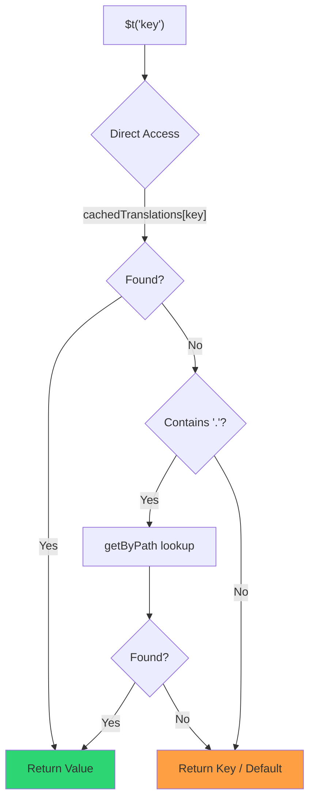

# 🚀 Hướng dẫn hiệu năng

## 📖 Giới thiệu

`Nuxt I18n Micro` được thiết kế với hiệu năng trong tâm trí, mang lại sự cải thiện đáng kể so với các module quốc tế hóa (i18n) truyền thống như `nuxt-i18n`. Hướng dẫn này cung cấp cái nhìn sâu sắc về các lợi ích hiệu năng khi dùng `Nuxt I18n Micro`, và cách nó so sánh với các giải pháp khác.

## 🤔 Tại sao tập trung vào hiệu năng?

Trong các dự án quy mô lớn và môi trường lưu lượng cao, các nút thắt hiệu năng có thể dẫn đến thời gian build chậm, sử dụng bộ nhớ tăng và thời gian phản hồi máy chủ kém. Những vấn đề này trở nên rõ ràng hơn với các thiết lập i18n phức tạp liên quan đến các tệp bản dịch lớn. `Nuxt I18n Micro` được xây dựng để giải quyết các thách thức này một cách trực tiếp bằng cách tối ưu cho tốc độ, hiệu quả bộ nhớ và tác động tối thiểu đến kích thước bundle của ứng dụng.

## 📊 So sánh hiệu năng

Chúng tôi đã tiến hành một loạt các bài kiểm tra trên các fixture giống nhau thông qua `pnpm test:performance` (`pnpm -C scripts cli performance`) so với **`@nuxtjs/i18n@10.6.0`**. Phương pháp và biểu đồ đầy đủ: [Kết quả kiểm tra hiệu năng](/guides/performance-results).

Profile CLI mặc định: **4 locale** × **2 trang** (`index`, `page`) × ~10k khóa lá index. Tăng `--locales` / `--keys` cho tải regression-radar nặng hơn. Báo cáo chia **code**, **translations** (bao gồm `@nuxtjs/i18n` `chunks/raw/*`), và **tổng** output có thể triển khai.

```bash
pnpm test:performance
pnpm -C scripts cli performance --only micro --skip-stress
pnpm -C scripts cli performance --locales 12 --keys 100000 --runs 3
```

### ⏱️ Thời gian build và mức tiêu thụ tài nguyên

<Accordion title="**@nuxtjs/i18n v10.6**">
- **Code Bundle**: 2.16 MB
- **Translations**: 7.21 MB (message chunks + payload locale)
- **Tổng có thể triển khai**: 9.37 MB
- **Sử dụng bộ nhớ tối đa**: 1,821 MB
- **Thời gian đã trôi qua**: 8.34s (trung bình 3 lần)
</Accordion>

<Tip>
- **Code Bundle**: 1.74 MB — **code nhỏ hơn ~19% so với `@nuxtjs/i18n` v10.6**
- **Translations**: 6.8 MB (JSON tải chậm)
- **Tổng có thể triển khai**: 8.54 MB
- **Sử dụng bộ nhớ tối đa**: 1,065 MB — **ít bộ nhớ hơn ~41% so với `@nuxtjs/i18n` v10.6**
- **Thời gian đã trôi qua**: 5.34s — **nhanh hơn ~36% so với `@nuxtjs/i18n` v10.6** (≈ đường cơ sở plain-nuxt)
</Tip>

> Tài liệu cũ hiển thị `@nuxtjs/i18n` "code ≈ 15 MB / translations 0 B" đã tính các tệp message `chunks/raw` là code ứng dụng. Trình phân loại hiện tại tách chúng; khoảng cách trên **code** nhỏ hơn, và micro vẫn dẫn đầu về thời gian build, RSS đỉnh và các bài kiểm tra tải.

Xem [báo cáo benchmark đầy đủ](/guides/performance-results) để biết biểu đồ, kết quả Autocannon và chi tiết fixture.

### 🌐 Hiệu năng máy chủ dưới tải

Artillery (6s@6 + 60s@60) và Autocannon (10c / 10s), trung bình 3 lần chạy liên tiếp cho mỗi fixture.

<Accordion title="**@nuxtjs/i18n v10.6**">
- **Requests mỗi giây (Artillery)**: 143 [#/sec]
- **Thời gian phản hồi trung bình**: 956 ms
- **Autocannon RPS / độ trễ trung bình**: 72 / 139 ms
</Accordion>

<Tip>
- **Requests mỗi giây (Artillery)**: 275 [#/sec] — **nhiều hơn ~93% so với `@nuxtjs/i18n` v10.6**
- **Thời gian phản hồi trung bình**: 483 ms — **nhanh hơn ~49% so với `@nuxtjs/i18n` v10.6**
- **Autocannon RPS / độ trễ trung bình**: 162 / 62 ms
</Tip>

### 📈 So sánh trực quan

<Note>
Biểu đồ tương tác được bỏ qua trong tài liệu Mintlify. Xem các bảng benchmark trên trang này hoặc [tài liệu VitePress](https://s00d.github.io/nuxt-i18n-micro/guide/performance-results) cho biểu đồ: `chart`.
</Note>

<Note>
Biểu đồ tương tác được bỏ qua trong tài liệu Mintlify. Xem các bảng benchmark trên trang này hoặc [tài liệu VitePress](https://s00d.github.io/nuxt-i18n-micro/guide/performance-results) cho biểu đồ: `chart`.
</Note>

| Chỉ số          | @nuxtjs/i18n v10.6 | i18n-micro | Cải thiện        |
| --------------- | ------------------ | ---------- | ------------------ |
| Thời gian Build      | 8.34s              | 5.34s      | **nhanh hơn ~36%**    |
| Bộ nhớ (build)  | 1,821 MB           | 1,065 MB   | **ít hơn ~41%**      |
| Code Bundle     | 2.16 MB            | 1.74 MB    | **nhỏ hơn ~19%**   |
| Thời gian phản hồi   | 956 ms             | 483 ms     | **nhanh hơn ~49%**    |
| RPS (Artillery) | 143                | 275        | **nhiều hơn ~93%**      |

### 🔍 Diễn giải kết quả

So với `@nuxtjs/i18n` **v10.6** hiện tại (profile CLI mặc định, trung bình 3 lần):

- 🗜️ **Biểu đồ code nhỏ hơn**: ~1.74 MB so với ~2.16 MB khi message chunks không bị dán nhãn sai là "code".
- 🧠 **RSS build thấp hơn**: đỉnh ~1.1 GB so với ~1.8 GB.
- 🕒 **Build nhanh hơn**: ~5.3s so với ~8.3s (micro khớp với đường cơ sở plain-Nuxt trên profile này).
- ⚡ **Tốt hơn nhiều dưới tải**: ~275 so với ~143 Artillery RPS, ~162 so với ~72 Autocannon RPS, độ trễ trung bình thấp hơn.

Số tuyệt đối khác với các bảng được công bố cũ (từ điển nhỏ hơn, Nuxt cũ hơn và cách chia "0 B translations" không công bằng cho `@nuxtjs/i18n`). Về hướng đi thì tương tự: micro vẫn dẫn đầu về chi phí build và thông lượng request.

## ⚙️ Các tối ưu hóa chính

### 🛠️ Thiết kế tối giản

`Nuxt I18n Micro` được xây dựng xung quanh một kiến trúc tối giản với lõi nhỏ và các gói chiến lược chuyên biệt. Điều này giảm chi phí phát sinh và đơn giản hóa logic nội bộ, dẫn đến hiệu năng được cải thiện.

### 🚦 Định tuyến hiệu quả

Trong v3, việc tạo route và logic đường dẫn runtime được chia thành các gói chuyên biệt để tree-shaking tối ưu:

- **`@i18n-micro/route-strategy`** — Tạo route tại thời điểm build: mở rộng các trang Nuxt với các route đã bản địa hóa. Chỉ chiến lược được chọn (`no_prefix`, `prefix`, `prefix_except_default`, `prefix_and_default`) được bao gồm.
- **`@i18n-micro/path-strategy`** — Phân giải đường dẫn tại runtime, chuyển hướng và tạo liên kết. Dùng các hàm thuần và cờ context đã tính toán trước để giảm thiểu các cấp phát trên các hot path. Các subpath export (`/prefix`, `/no-prefix`, v.v.) đảm bảo chỉ triển khai được chọn mới được bundle.

Cách tiếp cận này giữ cho cấu hình định tuyến nhẹ và đảm bảo phân giải route nhanh bất kể số lượng locale.

### 📂 Tải bản dịch được tinh gọn

Module chỉ hỗ trợ các tệp JSON cho bản dịch, với sự tách biệt rõ ràng giữa các tệp toàn cục và theo trang. Điều này đảm bảo chỉ dữ liệu bản dịch cần thiết được tải tại bất kỳ thời điểm nào, tăng cường hiệu năng hơn nữa.

### 🔒 Cache Singleton GlobalThis

Bắt đầu từ v3.0.0, module dùng mẫu singleton `globalThis` với `Symbol.for` để đảm bảo một cache instance duy nhất trên toàn bộ tiến trình Node.js. Điều này ngăn:

- Nhân bản cache khi cùng một module được bundle nhiều lần
- Tái tạo object theo từng request gây áp lực garbage collection
- Rò rỉ bộ nhớ từ các cache instance mồ côi

```mermaid
flowchart LR
    subgraph Process["Node.js Process"]
        G["globalThis[Symbol.for('CACHE')]"]

        subgraph R1["SSR Request 1"]
            P1[Plugin Instance] --> G
        end

        subgraph R2["SSR Request 2"]
            P2[Plugin Instance] --> G
        end

        subgraph R3["SSR Request 3"]
            P3[Plugin Instance] --> G
        end
    end

    G --> Cache["Single Map Instance"]
    Cache --> D1["en:index → translations"]
    Cache --> D2["en:about → translations"
```

```typescript
// Internal implementation pattern
const CACHE_KEY = Symbol.for('__NUXT_I18N_STORAGE_CACHE__')
if (!globalThis[CACHE_KEY]) {
  globalThis[CACHE_KEY] = new Map()
}
```

### ⚡ Hàm dịch được tối ưu hóa (tFast)

Hàm `$t()` dùng chiến lược tra cứu trực tiếp được tối ưu hóa cho tốc độ:

1. **Context đã tính toán trước**: Locale và tên route được tính một lần trong quá trình điều hướng, không phải trên mỗi lần gọi `$t()`
2. **Tra cứu một nguồn**: Tất cả các bản dịch (root + theo trang + fallback) được gộp trước tại thời điểm build vào một tệp duy nhất cho mỗi trang — không cần tìm kiếm phân lớp
3. **Deep merge tích lũy khi điều hướng**: Khi điều hướng trong cùng một locale, bản dịch trang mới được deep-merge (độ sâu 2 cấp) vào từ điển đang hoạt động, để các khóa từ trang trước vẫn hiển thị trong quá trình chuyển tiếp có hoạt hình — ngay cả khi các trang chia sẻ các tiền tố lồng nhau chồng chéo (ví dụ, cả hai trang đều có khóa dưới `common.*`)
4. **Garbage collection qua `page:transition:finish`**: Sau khi hoạt hình chuyển tiếp hoàn toàn hoàn thành, từ điển đã gộp được thay thế bằng các bản dịch sạch chỉ cho trang mới, giải phóng bộ nhớ từ các khóa của trang cũ
5. **Truy cập thuộc tính trực tiếp**: Dùng `obj[key]` thay vì tra cứu Map cho các hot path



```typescript
// Simplified lookup logic — single active dictionary
let val = cachedTranslations[key]
if (val === undefined && key.includes('.')) {
  val = getByPath(cachedTranslations, key)
}
```

### 💉 Tải phía server (không nhúng HTML)

Các bản dịch được tải trong SSR ở lại **bộ nhớ server** cho `$t` trong quá trình render. Chúng **không** được sao chép vào `nuxtApp.payload` / tài liệu HTML (cùng ý tưởng như `@nuxtjs/i18n` với `experimental.preload: false`).

Trên client, `01.plugin.ts` `await` `switchContext`, nó tải `/\{apiBaseUrl\}/:page/:locale/data.json` trước khi ứng dụng tiếp tục — một request, không phải một khối inline 8 MB.

`NuxtI18n` vẫn giữ từ điển đã gộp đang hoạt động (`cachedTranslations`) cho `$t()` / `$has()`. Các điều hướng cùng locale deep-merge các page chunk cho đến khi `page:transition:finish` dọn dẹp các khóa cũ.

#### Trạng thái hiện tại

Các số dưới đây được đọc từ tệp budget mà `pnpm run budget:payload` đo lường và thực thi.

{/* generated:payload-budget — do not edit; run `pnpm run docs:generate` */}

Được đo trên `playground` qua `/`, `/de`:

| Đo lường | Kích thước |
| --- | --- |
| Nguồn bản dịch trên đĩa | 15.2 MB |
| Phục vụ dưới dạng các tệp payload riêng biệt | 76.3 MB |
| `__NUXT_DATA__` inline lớn nhất | 6.9 MB |
| Tài sản client | 449.5 KB |

Playground mang một từ điển được cố ý làm quá cỡ, nên đây không phải là con số để mong đợi từ một
ứng dụng thực tế — chúng là một điểm cố định để đo lường. Budget thất bại khi chúng phát triển bất ngờ,
đó là cách một thay đổi ngẫu nhiên đối với những gì payload mang được nhận thấy.

{/* /generated:payload-budget */}

### 💾 Cache và Pre-rendering

Các bản dịch đi qua vài cache, và biết cache nào đã trả lời một request là sự
khác biệt giữa một buổi debug năm phút và năm giờ. Có bốn, theo
thứ tự một request gặp chúng:

| Lớp | Ở đâu | Vòng đời | Được xóa bởi |
| --- | --- | --- | --- |
| Trình duyệt / CDN | `Cache-Control` trên `/\{apiBaseUrl\}/**` | `httpCacheDuration`, `immutable` | một `?v=` mới — tức là một triển khai đã thay đổi bản dịch |
| Nitro route cache | `routeRules['/\{apiBaseUrl\}/**'].cache` | 60 s, stale-while-revalidate | khởi động lại server |
| Server loader | `CacheControl` trong tiến trình, keyed `locale:routeName` | vòng đời tiến trình, hoặc `cacheTtl` | khởi động lại server, HMR trong dev |
| Client store | `translationStorage` + chunk đang hoạt động trong `NuxtI18n` | vòng đời trang | reload |

Hai quy tắc giữ chúng khỏi mâu thuẫn với nhau:

- **Nitro route cache chỉ tồn tại khi `?v=` tồn tại.** Với một cache-buster, mỗi URL là
  duy nhất cho nội dung của nó, nên cache nó phía server là không có nguy cơ dữ liệu cũ. Đặt
  `dateBuild: 0` và lớp đó bị tắt, vì URL sau đó ổn định và
  phản hồi nói `must-revalidate` — cache phía server sẽ trả lời từ một entry cũ
  trong tối đa một phút và âm thầm đánh bại nó.
- **`immutable` cũng yêu cầu `?v=`.** Không có buster, header là
  `public, max-age=0, must-revalidate`, bất kể `httpCacheDuration` nói gì: một `max-age` dài
  trên một URL không bao giờ thay đổi ghim phản hồi đầu tiên mà trình duyệt từng thấy.

<Warning>
Với `translationPayloads.publicAssets` (mặc định trong chế độ premerged), các payload được sao chép sang
`public/<apiBaseUrl>/\{page\}/\{locale\}/data.json`. Một nền tảng phục vụ thư mục đó tự nó
(Cloudflare Pages, Firebase Hosting, `npx serve`) áp dụng các header của chính nó — header
Nitro `routeRules` chỉ đến các phản hồi đi qua server. Đặt chính sách cache cho
các tệp tĩnh đó trong cấu hình riêng của nền tảng.
</Warning>

🏁 **Pre-rendering**: trong chế độ premerged, `publicAssets` đã ghi cây URL client vào
`public/`. Chọn `prerenderRoutes` chỉ khi bạn cần Nitro tạo các route handler khi
bản sao đó bị vô hiệu hóa.

### 🗜️ Payload công cộng được nén

Khi `nitro.compressPublicAssets` được bật, các payload bản dịch được sao chép vào thư mục
public cũng nhận được các anh chị em `.gz` và `.br`:

```ts
export default defineNuxtConfig({
  nitro: { compressPublicAssets: true },
})
```

Nitro nén các tài sản công cộng trước hook sao chép các payload, nên không có điều này, chúng sẽ
là phần không nén duy nhất của một bản build tĩnh. Module không tự bật nén —
nó chỉ áp dụng thiết lập bạn đã chọn. Lựa chọn theo encoding (`\{ gzip: true, brotli: false \}`)
được tôn trọng.

Payload index playground: 6 651 984 B thô, 1 012 831 B gzip, 821 617 B brotli.

### ☁️ Đầu ra Payload Serverless

Trên **Node**, SSR đọc JSON bản dịch từ `public/<apiBaseUrl>` (`readFile`, không phải Nitro `serverAssets` / Rollup `raw:`). Trên **Edge**, Nitro `serverAssets` nhúng cùng cây (ưu tiên `mode: 'source'` cho catalog lớn).

```typescript
export default defineNuxtConfig({
  i18n: {
    translationPayloads: {
      serverAssets: true, // default — Node → public copy; Edge → serverAssets embed
      publicAssets: true, // default in premerged mode
    },
  },
})
```

Dùng `translationPayloads.mode: 'source'` cho các nhúng Edge nhỏ gọn (và các bản sao công cộng nhỏ gọn tùy chọn):

```typescript
export default defineNuxtConfig({
  i18n: {
    translationPayloads: {
      mode: 'source',
    },
  },
})
```

`mode: 'source'` giữ các tệp nguồn được gộp lớp nhỏ gọn và gộp root/page/fallback tại runtime thông qua route `/_locales` tích hợp sẵn (hoặc Edge `assets:i18n`). Theo mặc định, nó vô hiệu hóa các bản sao tài sản công cộng và các route payload prerendered.

<Warning>
`prerenderRoutes` mặc định là `false`. Với `mode: 'source'`, `publicAssets` cũng mặc định là `false`. Do đó, hosting tĩnh thuần túy mà không có runtime Nitro/edge không thể tải bản dịch trên client trừ khi bạn bật một trong các output này, giữ `serverHandler` có sẵn tại runtime, hoặc host payload bên ngoài.

Premerged mặc định + `publicAssets` đã đặt `/\{apiBaseUrl\}/\{page\}/\{locale\}/data.json` dưới `public/`, nên các host tĩnh có thể phục vụ các fetch client mà không cần Nitro.
</Warning>

<Warning>
Đặt `apiBaseServerHost` hoặc `apiBaseClientHost` chuyển việc phục vụ payload sang origin đó, đi kèm với các yêu cầu riêng của nó — xem [Cấu hình → Các host CDN bên ngoài](/guides/configuration#external-cdn-hosts).
</Warning>

Hoặc vô hiệu hóa các output HTTP/công cộng riêng lẻ và host payload bên ngoài:

```typescript
export default defineNuxtConfig({
  i18n: {
    apiBaseClientHost: 'https://cdn.example.com',
    apiBaseServerHost: 'https://cdn.example.com',
    translationPayloads: {
      serverHandler: false,
      publicAssets: false,
      prerenderRoutes: false,
    },
  },
})
```

Giữ `serverHandler` được bật khi bạn dựa vào route `/\{apiBaseUrl\}/:page/:locale/data.json` cục bộ tích hợp sẵn. Vô hiệu hóa nó khi các payload được host bên ngoài và `apiBaseServerHost` trỏ đến origin bên ngoài đó. Bật `prerenderRoutes` chỉ khi bạn cần Nitro tạo các route payload tĩnh và `publicAssets` chưa ghi chúng.

Trong quá trình build, module cảnh báo khi output payload được tạo vượt quá `translationPayloads.warnFileCount` (mặc định 500) hoặc `translationPayloads.warnSizeBytes` (mặc định 10 MB). Nó cũng cảnh báo khi tất cả các output cục bộ bị vô hiệu hóa mà không có host payload bên ngoài được cấu hình.

## 📝 Mẹo để tối đa hóa hiệu năng

Đây là một vài mẹo để đảm bảo bạn có được hiệu năng tốt nhất từ `Nuxt I18n Micro`:

- 📉 **Giới hạn dữ liệu Locale**: Chỉ bao gồm các locale bạn cần trong dự án để giữ kích thước bundle nhỏ.
- 🗂️ **Dùng bản dịch theo trang**: Tổ chức các tệp bản dịch theo trang để tránh tải dữ liệu không cần thiết.
- 💾 **Bật Cache**: Tận dụng các tính năng cache để giảm tải máy chủ và cải thiện thời gian phản hồi.
- 🏁 **Tận dụng Pre-rendering**: Pre-render các bản dịch để tăng tốc tải trang và giảm chi phí runtime.

Để có kết quả chi tiết của các bài kiểm tra hiệu năng, vui lòng tham khảo [Kết quả kiểm tra hiệu năng](/guides/performance-results).
