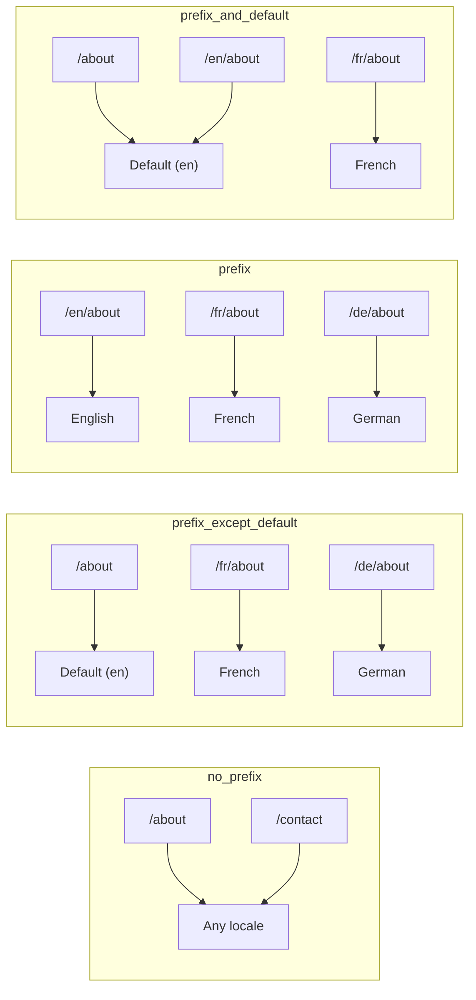
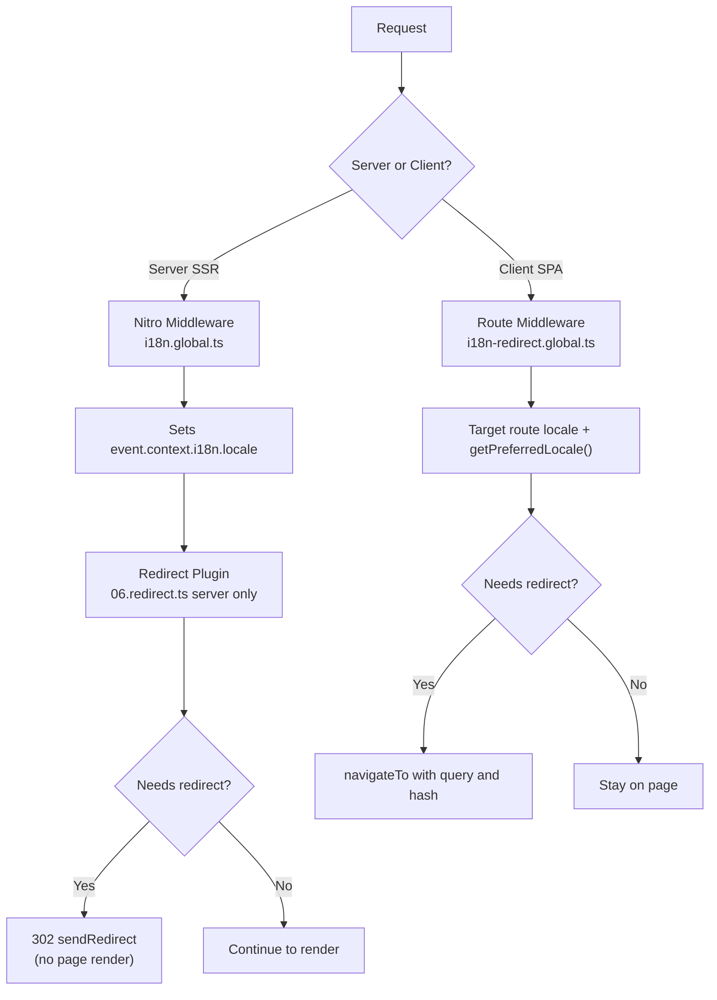

# 🗂️ Chiến lược định tuyến trong Nuxt I18n Micro

## 📖 Tổng quan

Nuxt I18n Micro kiểm soát cách các tiền tố ngôn ngữ xuất hiện trong URL thông qua tùy chọn `strategy`. Bên dưới, hai gói triển khai điều này:

- **`@i18n-micro/route-strategy`** — tạo route tại thời điểm build (mở rộng các trang Nuxt với các route đã bản địa hóa)
- **`@i18n-micro/path-strategy`** — phân giải đường dẫn tại runtime, chuyển hướng, thuộc tính SEO và tạo liên kết

Mô-đun Nuxt chọn lớp chiến lược đúng tại thời điểm build và alias nó qua `#i18n-strategy`, nên chỉ triển khai đã chọn được đóng gói.

## 🚦 Các chiến lược khả dụng

{/* generated:option:strategy — do not edit; run `pnpm run docs:generate` */}

**Kiểu** `Strategies` · **Mặc định** `'prefix_except_default'`

Chiến lược định tuyến URL cho tiền tố ngôn ngữ.

- `'no_prefix'` — không có ngôn ngữ trong URL; ngôn ngữ lưu trong cookie.
- `'prefix_except_default'` — thêm tiền tố cho mọi ngôn ngữ trừ ngôn ngữ mặc định.
- `'prefix'` — luôn thêm tiền tố, kể cả ngôn ngữ mặc định.
- `'prefix_and_default'` — giống `prefix`, nhưng ngôn ngữ mặc định cũng có thể truy cập không cần tiền tố.

{/* /generated:option:strategy */}

### So sánh chiến lược



### 🛑 `no_prefix`

Các URL không có segment ngôn ngữ. Ngôn ngữ được xác định bởi cookie, trạng thái `useI18nLocale()` hoặc phát hiện trình duyệt.

- **Route**: `/about`, `/contact` — cùng mẫu URL cho mọi ngôn ngữ (không có tiền tố `/en/`, `/fr/`)
- **Lưu ngôn ngữ**: Qua `localeCookie` (tự động đặt là `'user-locale'` nếu không chỉ định)
- **Đường dẫn tùy chỉnh**: Được hỗ trợ qua [`globalLocaleRoutes`](/guides/configuration#globallocaleroutes) và [`defineI18nRoute`](/guides/custom-locale-routes) — các slug đã bản địa hóa được sinh mà không thêm tiền tố ngôn ngữ vào URL (ví dụ `/about` so với `/ueber-uns`). Route lồng nhau, alias và hạn chế theo ngôn ngữ đơn giản hơn trong `prefix_except_default`.

<Tip>
Khi dùng `no_prefix`, `localeCookie` tự động được đặt là `'user-locale'` nếu không chỉ định. Điều này bắt buộc vì URL không chứa thông tin ngôn ngữ.
</Tip>

```typescript
i18n: {
  strategy: 'no_prefix'
  // localeCookie is automatically set to 'user-locale'
}
```

### 🚧 `prefix_except_default`

Tất cả các route có tiền tố ngôn ngữ **trừ** ngôn ngữ mặc định.

- **Ngôn ngữ mặc định**: `/about`, `/contact`
- **Ngôn ngữ khác**: `/fr/about`, `/de/contact`
- **Ngôn ngữ mặc định có tiền tố trả về 404**: `/en/about` → 404 (khi `en` là mặc định)

```typescript
i18n: {
  strategy: 'prefix_except_default' // This is the default
}
```

### 🌍 `prefix`

Mọi route đều có tiền tố ngôn ngữ, kể cả ngôn ngữ mặc định.

- **Mọi ngôn ngữ**: `/en/about`, `/fr/about`, `/de/about`
- **Root `/`**: Chuyển hướng đến `/\{locale\}/` dựa trên sở thích người dùng

```typescript
i18n: {
  strategy: 'prefix'
}
```

### 🔄 `prefix_and_default`

Ngôn ngữ mặc định khả dụng cả có và không có tiền tố. Các ngôn ngữ không mặc định luôn có tiền tố.

- **Ngôn ngữ mặc định**: cả `/about` và `/en/about` đều hợp lệ
- **Ngôn ngữ khác**: `/fr/about`, `/de/about`
- **Không chuyển hướng từ `/`**: Cả `/` và `/en/` đều phục vụ ngôn ngữ mặc định

```typescript
i18n: {
  strategy: 'prefix_and_default'
}
```

## 🔀 Kiến trúc chuyển hướng (v3)

Trong v3, logic chuyển hướng được chia thành hai lớp để có hiệu năng tối ưu:

### Cách hoạt động



### Phía máy chủ (không nháy)

1. **Nitro middleware** (`i18n.global.ts`) chạy trước — phát hiện ngôn ngữ từ URL, cookie hoặc header `Accept-Language` và đặt `event.context.i18n.locale`
2. **Plugin chuyển hướng** (`06.redirect.ts`, chỉ server) kiểm tra liệu đường dẫn hiện tại có cần chuyển hướng bằng `i18nStrategy.getClientRedirect()` và phát 302 **trước khi** render trang nào diễn ra
3. Điều này ngăn "chớp nháy lỗi" nơi người dùng thoáng thấy trang sai trước khi chuyển hướng

### Phía client (điều hướng SPA)

1. Middleware route toàn cục (`i18n-redirect.global.ts`) chạy trên mỗi lần điều hướng client khi `redirects` được bật
2. Suy ra ngôn ngữ ưa thích từ **route đích** trước, sau đó quay về `useI18nLocale().getPreferredLocale()`
3. Dùng `i18nStrategy.getClientRedirect()` để quyết định liệu có cần chuyển hướng không
4. Giữ `query` và `hash` khi chuyển hướng

### Thứ tự ưu tiên ngôn ngữ

Trên máy chủ, plugin chuyển hướng xác định ngôn ngữ ưa thích theo thứ tự này:

1. **`useState('i18n-locale')`** — ưu tiên cao nhất (được đặt theo cách lập trình qua `useI18nLocale().setLocale()`)
2. **Cookie** — nếu `localeCookie` được cấu hình
3. **Header `Accept-Language`** — nếu `autoDetectLanguage: true`
4. **`defaultLocale`** — dự phòng cuối cùng

Trên client, middleware route ưu tiên ngôn ngữ từ route đích, sau đó dùng cùng chuỗi dự phòng state/cookie.

### Hành vi chuyển hướng theo chiến lược

| Chiến lược | Hành vi `GET /` | Cookie có bắt buộc? |
| ----------------------- | --------------------------------------------- | ---------------- |
| `no_prefix` | Không chuyển hướng (ngôn ngữ từ cookie/state) | Tự động đặt |
| `prefix` | 302 → `/\{locale\}/` | Khuyến nghị |
| `prefix_except_default` | 302 → `/\{locale\}/` nếu ngôn ngữ ≠ mặc định | Khuyến nghị |
| `prefix_and_default` | Không chuyển hướng (cả `/` và `/\{locale\}/` hợp lệ) | Tùy chọn |

### Tắt chuyển hướng

```typescript
i18n: {
  redirects: false // Disables automatic locale redirects
}
```

Khi `redirects: false`, chuyển hướng ngôn ngữ tự động bị tắt:

- **Server**: plugin chuyển hướng (`06.redirect.ts`, chỉ server) vẫn được đăng ký nhưng bỏ qua logic chuyển hướng. Nó vẫn thực hiện **kiểm tra 404** cho các tiền tố ngôn ngữ không hợp lệ (ví dụ `/xx/about` với `xx` không phải ngôn ngữ hợp lệ) và **đồng bộ cookie** từ tiền tố URL (ví dụ truy cập `/fr/about` đồng bộ cookie thành `fr`)
- **Client**: middleware route toàn cục `i18n-redirect` **không được đăng ký**. Không có chuyển hướng tự động SPA

## 🍪 Lưu ngôn ngữ dựa trên cookie

<Warning>
Khi dùng `prefix` hoặc `prefix_except_default` với `redirects: true` (mặc định), bạn **phải** đặt `localeCookie` để chuyển hướng hoạt động đúng. Nếu không có cookie, plugin chuyển hướng không thể nhớ sở thích ngôn ngữ của người dùng qua các lần tải lại trang.

```typescript
i18n: {
  strategy: 'prefix_except_default',
  localeCookie: 'user-locale' // Required for redirects to work properly
}
```
</Warning>

**Cách `localeCookie` hoạt động trong v3:**

- Được quản lý nội bộ bởi `useI18nLocale()`. **Không đặt thủ công** qua `useCookie()`
- Khi người dùng truy cập URL có tiền tố (ví dụ `/fr/about`), cookie tự động được đồng bộ thành `fr`
- Trong lần truy cập tiếp theo tới `/`, giá trị cookie được dùng để chuyển hướng tới `/\{locale\}/`
- Nếu cookie chứa ngôn ngữ không hợp lệ (không trong danh sách `locales`), nó quay về `defaultLocale`

| Chiến lược | Mặc định `localeCookie` | Ghi chú |
| ----------------------- | ---------------------- | ------------------------------------ |
| `no_prefix` | Tự động: `'user-locale'` | Bắt buộc; được đặt tự động |
| `prefix` | `null` (tắt) | Đặt là `'user-locale'` để chuyển hướng |
| `prefix_except_default` | `null` (tắt) | Đặt là `'user-locale'` để chuyển hướng |
| `prefix_and_default` | `null` (tắt) | Tùy chọn |

## 🔍 `autoDetectLanguage` và `autoDetectPath`

### `autoDetectLanguage`

{/* generated:option:autoDetectLanguage — do not edit; run `pnpm run docs:generate` */}

**Kiểu** `boolean` · **Mặc định** `true`

Tự động phát hiện ngôn ngữ ưa thích của người dùng từ header HTTP `Accept-Language`.
Dùng kết hợp với `autoDetectPath` để quyết định khi nào phát hiện xảy ra.

{/* /generated:option:autoDetectLanguage */}

Việc kiểm tra chạy trong middleware máy chủ và là dự phòng: cookie hoặc state đã tồn tại sẽ thắng.

```typescript
i18n: {
  autoDetectLanguage: true
}
```

### `autoDetectPath`

{/* generated:option:autoDetectPath — do not edit; run `pnpm run docs:generate` */}

**Kiểu** `string` · **Mặc định** `'/'`

Nơi các chuyển hướng theo ưu tiên cookie / Accept-Language có thể chạy (khi `redirects` được bật).

- `'/'` — chỉ `/` (các liên kết sâu ở ngôn ngữ mặc định vẫn có thể truy cập; mặc định)
- `'no_prefix'` — chỉ các đường dẫn không có tiền tố ngôn ngữ
- `'*'` — mọi đường dẫn, bao gồm việc viết lại một tiền tố ngôn ngữ rõ ràng
  (ví dụ `/fr/about` → `/de/about` khi cookie ưu tiên `de`)

- bất kỳ chuỗi nào khác — khớp đường dẫn chính xác (ví dụ `'/welcome'`)

Việc dọn dẹp chiến lược có tiền tố (ví dụ `/en` → `/` với `prefix_except_default`) không bị chặn.

{/* /generated:option:autoDetectPath */}

```typescript
i18n: {
  autoDetectPath: '/' // Default: only root
  // autoDetectPath: '*' // All paths — redirects even /fr/about to /de/about
}
```

<Warning>
Với `autoDetectPath: '*'`, ngay cả URL có tiền tố ngôn ngữ rõ ràng (ví dụ `/fr/about`) sẽ được chuyển hướng nếu ngôn ngữ ưa thích của người dùng khác. Điều này có thể hữu ích cho các thiết lập dựa trên miền nhưng có thể gây nhầm lẫn với người dùng chia sẻ URL.
</Warning>

Với mặc định `autoDetectPath: '/'` và một cookie ngôn ngữ:

| yêu cầu | cookie | kết quả |
| --- | --- | --- |
| `/` | `de` | 302 → `/de` |
| `/about` | `de` | 200, ngôn ngữ mặc định (không viết lại) |

```typescript
i18n: {
  localeCookie: 'user-locale',
  strategy: 'prefix_except_default',
  // Default — remember language on entry, keep deep links stable
  autoDetectPath: '/',
  // Or redirect on every unprefixed path (but not /de/… → /fr/…):
  // autoDetectPath: 'no_prefix',
}
```

## ⚠️ Vấn đề đã biết và thực hành tốt nhất

### 1. Không khớp hydration trong chiến lược `no_prefix`

Khi dùng `no_prefix`, ngôn ngữ được xác định động. Nếu máy chủ và client không thống nhất về ngôn ngữ, bạn sẽ thấy sự không khớp hydration.

**Giải pháp**: Dùng `useI18nLocale().setLocale()` trong một plugin máy chủ (với `order: -10`) để đặt ngôn ngữ trước khi khởi tạo i18n:

```ts
// plugins/i18n-loader.server.ts
export default defineNuxtPlugin({
  name: 'i18n-custom-loader',
  enforce: 'pre',
  order: -10,
  setup() {
    const { setLocale } = useI18nLocale()
    setLocale('ja') // Your detection logic here
  },
})
```

Xem [Phát hiện ngôn ngữ tùy chỉnh](/guides/custom-language-detection) để biết các ví dụ chi tiết.

### 2. Dùng route có tên với `localeRoute`

Định tuyến dựa trên đường dẫn có thể gây vấn đề khi phân giải route:

```typescript
// May cause issues
$localeRoute('/page')

// Preferred approach
$localeRoute({ name: 'page' })
```

### 3. Dùng `pages: false` với i18n

Khi dùng Nuxt với `pages: false`:

```typescript
export default defineNuxtConfig({
  pages: false,
  i18n: {
    strategy: 'no_prefix', // Recommended
    disablePageLocales: true, // Required
    localeCookie: 'user-locale', // Required for persistence
  },
})
```

**Hạn chế với `pages: false`:**

- Không có chuyển hướng tự động
- Không có phát hiện ngôn ngữ dựa trên URL
- Chuyển ngôn ngữ phía client yêu cầu tải lại trang hoặc tải bản dịch thủ công

### 4. Xử lý cookie không hợp lệ

Nếu cookie chứa một ngôn ngữ không hợp lệ (không có trong danh sách `locales`), mô-đun quay về `defaultLocale` một cách nhẹ nhàng. Không có lỗi nào được ném.

## 📝 Tóm tắt thực hành tốt nhất

| Khuyến nghị | Chi tiết |
| ------------------------- | ----------------------------------------------------------------------------------- |
| **Đặt `localeCookie`** | Luôn đặt cho các chiến lược có tiền tố với `redirects: true` |
| **Dùng `useI18nLocale()`** | Cách tập trung để quản lý trạng thái ngôn ngữ (thay thế `useState`/`useCookie` thủ công) |
| **Dùng route có tên** | `$localeRoute(\{ name: 'page' \})` thay vì `$localeRoute('/page')` |
| **Ngôn ngữ theo lập trình** | Dùng `useI18nLocale().setLocale()` trong plugin máy chủ với `order: -10` |
| **Tránh cookie thủ công** | Không dùng `useCookie('user-locale')` trực tiếp. `useI18nLocale()` quản lý điều này |
