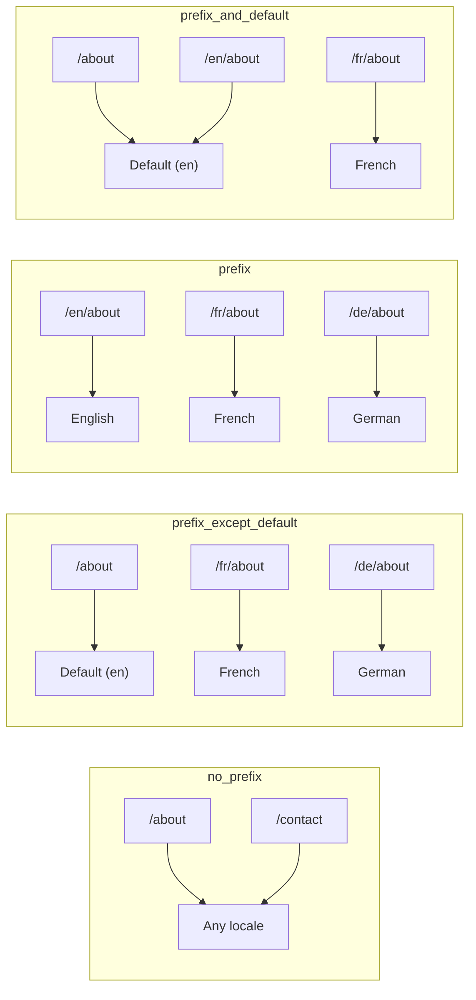
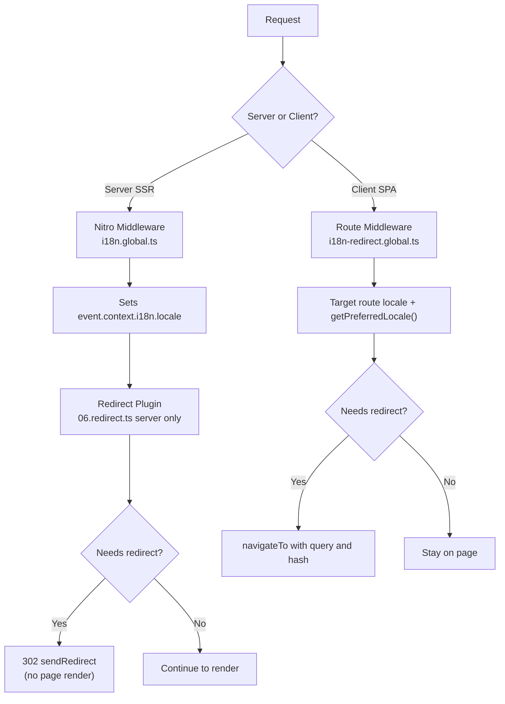

# 🗂️ Chiến lược định tuyến trong Nuxt I18n Micro

## 📖 Tổng quan

Nuxt I18n Micro kiểm soát cách tiền tố locale xuất hiện trong URL thông qua tùy chọn `strategy`. Bên dưới, hai gói triển khai điều này:

- **`@i18n-micro/route-strategy`** — tạo route tại thời điểm build (mở rộng các trang Nuxt với các route đã bản địa hóa)
- **`@i18n-micro/path-strategy`** — phân giải đường dẫn tại runtime, chuyển hướng, thuộc tính SEO và tạo liên kết

Module Nuxt chọn class chiến lược chính xác tại thời điểm build và tạo alias thông qua `#i18n-strategy`, để chỉ triển khai được chọn mới được bundle.

## 🚦 Các chiến lược khả dụng

{/* generated:option:strategy — do not edit; run `pnpm run docs:generate` */}

**Type** `Strategies` · **Default** `'prefix_except_default'`

Chiến lược định tuyến URL cho tiền tố locale.

- `'no_prefix'` — không có locale trong URL; locale được lưu trong cookie.
- `'prefix_except_default'` — thêm tiền tố cho tất cả locale ngoại trừ locale mặc định.
- `'prefix'` — luôn thêm tiền tố, bao gồm cả locale mặc định.
- `'prefix_and_default'` — như `prefix`, nhưng locale mặc định cũng có thể truy cập mà không cần tiền tố.

{/* /generated:option:strategy */}

### So sánh chiến lược



### 🛑 `no_prefix`

URL không có đoạn locale. Locale được xác định bởi cookie, state `useI18nLocale()`, hoặc phát hiện trình duyệt.

- **Route**: `/about`, `/contact` — cùng một mẫu URL cho tất cả các locale (không có tiền tố `/en/`, `/fr/`)
- **Lưu locale**: Thông qua `localeCookie` (tự động đặt là `'user-locale'` nếu không được chỉ định)
- **Đường dẫn tùy chỉnh**: Được hỗ trợ thông qua [`globalLocaleRoutes`](/guides/configuration#globallocaleroutes) và [`defineI18nRoute`](/guides/custom-locale-routes) — các slug đã bản địa hóa được tạo mà không thêm tiền tố locale vào URL (ví dụ `/about` so với `/ueber-uns`). Route lồng nhau, alias và hạn chế theo locale đơn giản hơn so với trong `prefix_except_default`.

<Tip>
Khi dùng `no_prefix`, `localeCookie` được tự động đặt là `'user-locale'` nếu không được chỉ định. Điều này là bắt buộc vì URL không chứa thông tin locale.
</Tip>

```typescript
i18n: {
  strategy: 'no_prefix'
  // localeCookie is automatically set to 'user-locale'
}
```

### 🚧 `prefix_except_default`

Tất cả các route đều có tiền tố locale **ngoại trừ** locale mặc định.

- **Locale mặc định**: `/about`, `/contact`
- **Các locale khác**: `/fr/about`, `/de/contact`
- **Locale mặc định với tiền tố trả về 404**: `/en/about` → 404 (khi `en` là mặc định)

```typescript
i18n: {
  strategy: 'prefix_except_default' // This is the default
}
```

### 🌍 `prefix`

Mọi route đều có tiền tố locale, bao gồm cả locale mặc định.

- **Tất cả các locale**: `/en/about`, `/fr/about`, `/de/about`
- **Root `/`**: Chuyển hướng đến `/\{locale\}/` dựa trên sở thích của người dùng

```typescript
i18n: {
  strategy: 'prefix'
}
```

### 🔄 `prefix_and_default`

Locale mặc định có sẵn cả với và không có tiền tố. Các locale không mặc định luôn có tiền tố.

- **Locale mặc định**: cả `/about` và `/en/about` đều hợp lệ
- **Các locale khác**: `/fr/about`, `/de/about`
- **Không chuyển hướng từ `/`**: Cả `/` và `/en/` đều phục vụ locale mặc định

```typescript
i18n: {
  strategy: 'prefix_and_default'
}
```

## 🔀 Kiến trúc chuyển hướng (v3)

Trong v3, logic chuyển hướng được chia thành hai lớp để có hiệu năng tối ưu:

### Cách hoạt động



### Phía server (không nhấp nháy)

1. **Nitro middleware** (`i18n.global.ts`) chạy trước — phát hiện locale từ URL, cookie, hoặc header `Accept-Language` và đặt `event.context.i18n.locale`
2. **Plugin chuyển hướng** (`06.redirect.ts`, chỉ server) kiểm tra xem đường dẫn hiện tại có cần chuyển hướng không bằng `i18nStrategy.getClientRedirect()` và phát ra 302 **trước** khi bất kỳ trang nào được render
3. Điều này ngăn "error flash" nơi người dùng thoáng thấy sai trang trước khi chuyển hướng

### Phía client (điều hướng SPA)

1. Global route middleware (`i18n-redirect.global.ts`) chạy trên mỗi lần điều hướng client khi `redirects` được bật
2. Lấy locale ưu tiên từ **route đích** trước, sau đó quay lại `useI18nLocale().getPreferredLocale()`
3. Sử dụng `i18nStrategy.getClientRedirect()` để quyết định xem có cần chuyển hướng không
4. Bảo toàn `query` và `hash` khi chuyển hướng

### Thứ tự ưu tiên locale

Trên server, plugin chuyển hướng xác định locale ưu tiên theo thứ tự này:

1. **`useState('i18n-locale')`** — ưu tiên cao nhất (được đặt bằng chương trình qua `useI18nLocale().setLocale()`)
2. **Cookie** — nếu `localeCookie` được cấu hình
3. **Header `Accept-Language`** — nếu `autoDetectLanguage: true`
4. **`defaultLocale`** — dự phòng cuối cùng

Trên client, route middleware ưu tiên locale từ route đích, sau đó dùng cùng chuỗi dự phòng state/cookie.

### Hành vi chuyển hướng theo chiến lược

| Chiến lược              | Hành vi `GET /`                              | Cần cookie? |
| ----------------------- | --------------------------------------------- | ---------------- |
| `no_prefix`             | Không chuyển hướng (locale từ cookie/state)        | Tự động đặt         |
| `prefix`                | 302 → `/\{locale\}/`                            | Khuyến nghị      |
| `prefix_except_default` | 302 → `/\{locale\}/` nếu locale ≠ mặc định        | Khuyến nghị      |
| `prefix_and_default`    | Không chuyển hướng (cả `/` và `/\{locale\}/` hợp lệ) | Tùy chọn         |

### Vô hiệu hóa chuyển hướng

```typescript
i18n: {
  redirects: false // Disables automatic locale redirects
}
```

Khi `redirects: false`, chuyển hướng locale tự động bị vô hiệu hóa:

- **Server**: plugin chuyển hướng (`06.redirect.ts`, chỉ server) vẫn được đăng ký nhưng bỏ qua logic chuyển hướng. Nó vẫn thực hiện **kiểm tra 404** cho các tiền tố locale không hợp lệ (ví dụ `/xx/about` nơi `xx` không phải là locale hợp lệ) và **đồng bộ cookie** từ tiền tố URL (ví dụ truy cập `/fr/about` đồng bộ cookie thành `fr`)
- **Client**: `i18n-redirect` global route middleware **không được đăng ký** — không có tự động chuyển hướng SPA

## 🍪 Lưu locale bằng cookie

<Warning>
Khi dùng `prefix` hoặc `prefix_except_default` với `redirects: true` (mặc định), bạn **phải** đặt `localeCookie` để chuyển hướng hoạt động chính xác. Không có cookie, plugin chuyển hướng không thể ghi nhớ sở thích locale của người dùng qua các lần tải lại trang.

```typescript
i18n: {
  strategy: 'prefix_except_default',
  localeCookie: 'user-locale' // Required for redirects to work properly
}
```
</Warning>

**Cách `localeCookie` hoạt động trong v3:**

- Được quản lý nội bộ bởi `useI18nLocale()` — **không đặt thủ công** thông qua `useCookie()`
- Khi người dùng truy cập URL có tiền tố (ví dụ, `/fr/about`), cookie được tự động đồng bộ thành `fr`
- Trong lần truy cập tiếp theo tới `/`, giá trị cookie được dùng để chuyển hướng tới `/\{locale\}/`
- Nếu cookie chứa một locale không hợp lệ (không có trong danh sách `locales`), nó sẽ quay lại `defaultLocale`

| Chiến lược              | Mặc định `localeCookie` | Ghi chú                                |
| ----------------------- | ---------------------- | ------------------------------------ |
| `no_prefix`             | Tự động: `'user-locale'`  | Bắt buộc; đặt tự động          |
| `prefix`                | `null` (vô hiệu hóa)      | Đặt thành `'user-locale'` cho chuyển hướng |
| `prefix_except_default` | `null` (vô hiệu hóa)      | Đặt thành `'user-locale'` cho chuyển hướng |
| `prefix_and_default`    | `null` (vô hiệu hóa)      | Tùy chọn                             |

## 🔍 `autoDetectLanguage` và `autoDetectPath`

### `autoDetectLanguage`

{/* generated:option:autoDetectLanguage — do not edit; run `pnpm run docs:generate` */}

**Type** `boolean` · **Default** `true`

Tự động phát hiện ngôn ngữ ưu tiên của người dùng từ header HTTP `Accept-Language`.
Được sử dụng kết hợp với `autoDetectPath` để quyết định khi nào phát hiện xảy ra.

{/* /generated:option:autoDetectLanguage */}

Kiểm tra chạy trong server middleware và là dự phòng: cookie hoặc state hiện có sẽ thắng.

```typescript
i18n: {
  autoDetectLanguage: true
}
```

### `autoDetectPath`

{/* generated:option:autoDetectPath — do not edit; run `pnpm run docs:generate` */}

**Type** `string` · **Default** `'/'`

Nơi cookie / chuyển hướng sở thích Accept-Language có thể chạy (khi `redirects` được bật).

- `'/'` — chỉ `/` (deep link ở locale mặc định vẫn có thể truy cập; mặc định)
- `'no_prefix'` — chỉ các đường dẫn không có tiền tố locale
- `'*'` — mọi đường dẫn, bao gồm việc ghi đè lên tiền tố locale rõ ràng
  (ví dụ `/fr/about` → `/de/about` khi cookie ưu tiên `de`)

- bất kỳ chuỗi nào khác — khớp đường dẫn chính xác (ví dụ `'/welcome'`)

Việc dọn dẹp chiến lược có tiền tố (ví dụ `/en` → `/` dưới `prefix_except_default`) không bị chặn.

{/* /generated:option:autoDetectPath */}

```typescript
i18n: {
  autoDetectPath: '/' // Default: only root
  // autoDetectPath: '*' // All paths — redirects even /fr/about to /de/about
}
```

<Warning>
Với `autoDetectPath: '*'`, ngay cả các URL có tiền tố locale rõ ràng (ví dụ, `/fr/about`) cũng sẽ được chuyển hướng nếu locale ưu tiên của người dùng khác. Điều này có thể hữu ích cho thiết lập dựa trên miền nhưng có thể gây nhầm lẫn cho người dùng chia sẻ URL.
</Warning>

Với mặc định `autoDetectPath: '/'` và một cookie locale:

| request | cookie | kết quả |
| --- | --- | --- |
| `/` | `de` | 302 → `/de` |
| `/about` | `de` | 200, locale mặc định (không ghi đè) |

```typescript
i18n: {
  localeCookie: 'user-locale',
  strategy: 'prefix_except_default',
  // Default — remember language on entry, keep deep links stable
  autoDetectPath: '/',
  // Or redirect on every unprefixed path (but not /de/… → /fr/…):
  // autoDetectPath: 'no_prefix',
}
```

## ⚠️ Các vấn đề đã biết và thực hành tốt nhất

### 1. Không khớp hydration trong chiến lược `no_prefix`

Khi dùng `no_prefix`, locale được xác định động. Nếu server và client không đồng ý về locale, bạn sẽ thấy không khớp hydration.

**Giải pháp**: Dùng `useI18nLocale().setLocale()` trong một plugin server (với `order: -10`) để đặt locale trước khi khởi tạo i18n:

```ts
// plugins/i18n-loader.server.ts
export default defineNuxtPlugin({
  name: 'i18n-custom-loader',
  enforce: 'pre',
  order: -10,
  setup() {
    const { setLocale } = useI18nLocale()
    setLocale('ja') // Your detection logic here
  },
})
```

Xem [Phát hiện ngôn ngữ tùy chỉnh](/guides/custom-language-detection) để có ví dụ chi tiết.

### 2. Dùng Named Route với `localeRoute`

Định tuyến dựa trên đường dẫn có thể gây ra vấn đề với phân giải route:

```typescript
// May cause issues
$localeRoute('/page')

// Preferred approach
$localeRoute({ name: 'page' })
```

### 3. Dùng `pages: false` với i18n

Khi dùng Nuxt với `pages: false`:

```typescript
export default defineNuxtConfig({
  pages: false,
  i18n: {
    strategy: 'no_prefix', // Recommended
    disablePageLocales: true, // Required
    localeCookie: 'user-locale', // Required for persistence
  },
})
```

**Giới hạn với `pages: false`:**

- Không có chuyển hướng tự động
- Không có phát hiện locale dựa trên URL
- Chuyển đổi locale phía client cần tải lại trang hoặc tải bản dịch thủ công

### 4. Xử lý cookie không hợp lệ

Nếu một cookie chứa locale không hợp lệ (không có trong danh sách `locales`), module sẽ quay lại `defaultLocale` một cách nhẹ nhàng. Không có lỗi nào được ném ra.

## 📝 Tóm tắt thực hành tốt nhất

| Khuyến nghị            | Chi tiết                                                                             |
| ------------------------- | ----------------------------------------------------------------------------------- |
| **Đặt `localeCookie`**    | Luôn đặt cho các chiến lược có tiền tố với `redirects: true`                             |
| **Dùng `useI18nLocale()`** | Cách tập trung để quản lý trạng thái locale (thay thế `useState`/`useCookie` thủ công) |
| **Dùng named route**      | `$localeRoute(\{ name: 'page' \})` thay vì `$localeRoute('/page')`                       |
| **Locale bằng chương trình**   | Dùng `useI18nLocale().setLocale()` trong một plugin server với `order: -10`              |
| **Tránh cookie thủ công**  | Không dùng `useCookie('user-locale')` trực tiếp — `useI18nLocale()` quản lý điều này      |
