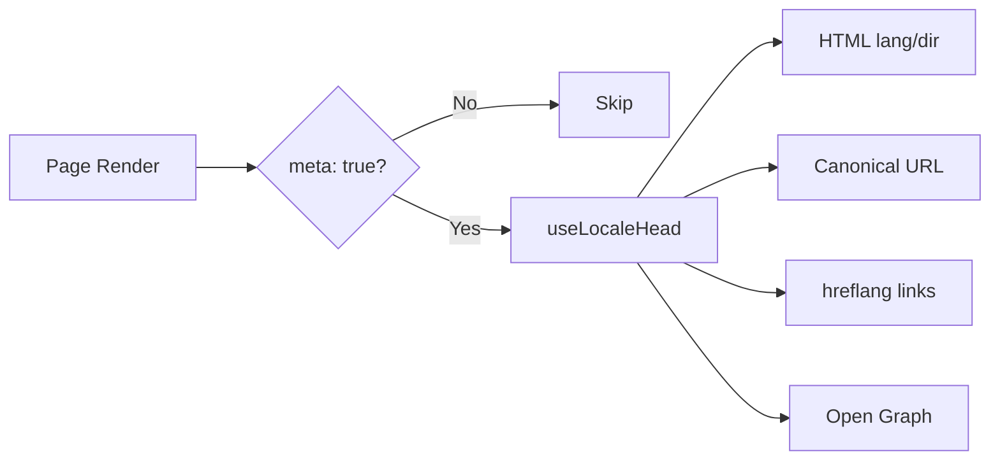

# 🌐 Hướng dẫn SEO cho Nuxt I18n Micro

## 📖 Giới thiệu

SEO (Search Engine Optimization) hiệu quả là thiết yếu để đảm bảo trang đa ngôn ngữ của bạn có thể truy cập và hiển thị cho người dùng trên toàn thế giới thông qua các công cụ tìm kiếm. `Nuxt I18n Micro` đơn giản hóa quá trình quản lý SEO cho các trang đa ngôn ngữ bằng cách tự động tạo các thẻ meta và thuộc tính thiết yếu thông báo cho các công cụ tìm kiếm về cấu trúc và nội dung của trang bạn.

Hướng dẫn này giải thích cách `Nuxt I18n Micro` xử lý SEO để tăng cường khả năng hiển thị và trải nghiệm người dùng của trang bạn mà không cần cấu hình bổ sung.

## ⚙️ Xử lý SEO tự động

### Luồng tạo meta SEO



**Các thẻ được tạo:**

| Thẻ             | Ví dụ                                                  |
| --------------- | -------------------------------------------------------- |
| Thuộc tính HTML | `<html lang="en" dir="ltr">`                             |
| Canonical       | `<link rel="canonical" href="...">`                      |
| hreflang        | `<link rel="alternate" hreflang="en" href="...">`        |
| x-default       | `<link rel="alternate" hreflang="x-default" href="...">` |
| Open Graph      | `<meta property="og:locale" content="en_US">`            |

#### `og` theo locale (`og:locale` so với BCP 47)

`<html lang>` và `hreflang` dùng **BCP 47** thông qua `locale.iso` (ví dụ `ar-AE`).  
Open Graph yêu cầu **`language_TERRITORY`** với **dấu gạch dưới** (`ar_AE`), theo [OG protocol](https://ogp.me/).

Theo mặc định, `og:locale` được suy ra từ `iso` khi mapping không mơ hồ (`en-US` → `en_US`).  
Đặt chuỗi **`og`** rõ ràng khi bạn cần giá trị tùy chỉnh (ví dụ `zh-Hans` → `zh_CN`).  
Nếu không có `og` cũng không có `iso` có thể chuyển đổi, các thẻ `og:locale` không được tạo — trong development, bạn nhận được cảnh báo console (tuân theo `missingWarn`).

```typescript
i18n: {
  meta: true,
  locales: [
    { code: 'ar', iso: 'ar-AE', og: 'ar_AE', dir: 'rtl' },
    { code: 'en', iso: 'en-US' }, // og:locale → en_US
    { code: 'zh', iso: 'zh-Hans', og: 'zh_CN' }, // script tags need explicit og
  ],
}
```

### 🔑 Các tính năng SEO chính

Khi tùy chọn `meta` được bật trong `Nuxt I18n Micro`, module tự động quản lý các khía cạnh SEO sau:

1. **🌍 Thuộc tính ngôn ngữ và hướng**:
   - Module đặt các thuộc tính `lang` và `dir` trên thẻ `<html>` theo locale hiện tại và hướng văn bản (ví dụ, `ltr` cho tiếng Anh hoặc `rtl` cho tiếng Ả Rập).

2. **🔗 URL Canonical**:
   - Module tạo một canonical link (`<link rel="canonical">`) cho mỗi trang, đảm bảo rằng các công cụ tìm kiếm nhận ra phiên bản chính của nội dung.

3. **🌐 Alternate Language Link (`hreflang`)**:
   - Module tự động tạo các thẻ `<link rel="alternate" hreflang="">` cho tất cả các locale khả dụng. Điều này giúp các công cụ tìm kiếm hiểu phiên bản ngôn ngữ nào của nội dung có sẵn, cải thiện trải nghiệm người dùng cho khán giả toàn cầu.
   - Mỗi locale phát ra **một** thẻ: `hreflang = iso || code`. Khi `iso` được đặt, `code` định tuyến không bao giờ được dùng làm `hreflang` (vì vậy các khóa thị trường như `mx` không trở thành thẻ ngôn ngữ không hợp lệ).
   - Tùy chọn `hreflangBaseLanguage: true` cũng phát ra một thẻ ngôn ngữ trần được suy ra từ `iso` (ví dụ `es-ES` → `es`), được xác nhận bởi locale khu vực đầu tiên trong `locales`.

4. **🌏 `x-default` Hreflang**:
   - Module tự động tạo một thẻ `<link rel="alternate" hreflang="x-default">` trỏ đến URL của locale mặc định. Điều này cho các công cụ tìm kiếm biết URL nào để hiển thị cho người dùng có ngôn ngữ không khớp với bất kỳ locale nào được định nghĩa. Không cần cấu hình bổ sung — nó hoạt động tự động khi `meta: true` được đặt.

5. **🔖 Open Graph Metadata**:
   - Module tạo các thẻ meta Open Graph (`og:locale`, `og:url`, v.v.) cho mỗi locale, điều này đặc biệt hữu ích cho việc chia sẻ trên mạng xã hội và lập chỉ mục công cụ tìm kiếm.

### 🛠️ Cấu hình

Để bật các tính năng SEO này, hãy đảm bảo tùy chọn `meta` được đặt là `true` trong tệp `nuxt.config.ts` của bạn:

```typescript
export default defineNuxtConfig({
  modules: ['nuxt-i18n-micro'],
  i18n: {
    locales: [
      { code: 'en', iso: 'en-US', dir: 'ltr' },
      { code: 'fr', iso: 'fr-FR', dir: 'ltr' },
      { code: 'ar', iso: 'ar-SA', dir: 'rtl' },
    ],
    defaultLocale: 'en',
    translationDir: 'locales',
    meta: true, // Enables automatic SEO management
  },
})
```

### 🌍 `metaBaseUrl` động cho triển khai đa miền

Khi `metaBaseUrl` không được đặt, các URL SEO tuyệt đối được phân giải theo thứ tự này (#240):

1. `site.url` từ [`nuxt-site-config`](https://nuxtseo.com/docs/site-config) (nếu module đó có mặt — ví dụ qua `@nuxtjs/seo`)
2. Ngược lại, hostname từ request hiện tại (`useRequestURL()` / `window.location.origin`)

Dự phòng theo request-origin tôn trọng các header reverse-proxy (`X-Forwarded-Host`, `X-Forwarded-Proto`), nên nó hoạt động chính xác đằng sau nginx, Cloudflare, AWS ALB, và các proxy tương tự.

Điều đó có nghĩa là các ứng dụng đã đặt `site.url` cho sitemap / robots / schema.org **không** cần khai báo `metaBaseUrl` thứ hai:

```typescript
export default defineNuxtConfig({
  site: {
    url: process.env.NUXT_SITE_URL, // also used by micro for canonical / og:url / hreflang
  },
  i18n: {
    meta: true,
    // metaBaseUrl omitted — picks up site.url, then request origin
  },
})
```

Không có `site.url`, một instance ứng dụng duy nhất vẫn có thể phục vụ **nhiều miền** với các thẻ SEO chính xác cho mỗi miền thông qua request origin:

```typescript
export default defineNuxtConfig({
  i18n: {
    meta: true,
    // metaBaseUrl is undefined by default — resolved dynamically from the request
  },
})
```

Ví dụ, một request đến `https://site-a.com/en/about` sẽ tạo ra:

```html
<link rel="canonical" href="https://site-a.com/en/about" /> <meta property="og:url" content="https://site-a.com/en/about" />
```

Trong khi cùng một ứng dụng phục vụ `https://site-b.com/en/about` sẽ tạo ra:

```html
<link rel="canonical" href="https://site-b.com/en/about" /> <meta property="og:url" content="https://site-b.com/en/about" />
```

Nếu bạn cần một base URL cố định luôn thắng `site.url`, hãy truyền một chuỗi tĩnh:

```typescript
metaBaseUrl: 'https://example.com'
```

### 🔍 Danh sách cho phép query canonical

Theo mặc định, các tham số query được loại bỏ khỏi canonical và `og:url` để tránh nội dung trùng lặp. Bạn có thể đưa vào danh sách trắng các tham số query cụ thể cần được bảo tồn:

```typescript
i18n: {
  canonicalQueryWhitelist: ['page', 'sort', 'filter', 'search', 'q', 'query', 'tag']
}
```

Chỉ các tham số được liệt kê trong `canonicalQueryWhitelist` sẽ xuất hiện trong URL canonical. Tất cả các tham số query khác (ví dụ tracking, session ID) đều bị loại bỏ.

### 🚫 Vô hiệu hóa thẻ meta theo trang

Bạn có thể vô hiệu hóa việc tạo thẻ meta SEO cho các trang cụ thể bằng `defineI18nRoute()`:

```vue
<script setup>
// Disable all SEO meta tags for this page
defineI18nRoute({
  disableMeta: true,
})
</script>
```

Bạn cũng có thể vô hiệu hóa meta chỉ cho các locale cụ thể:

```vue
<script setup>
// Disable meta tags only for English locale on this page
defineI18nRoute({
  disableMeta: ['en'],
})
</script>
```

Khi `disableMeta` được kích hoạt, không có thẻ `hreflang`, `canonical`, `og:locale`, `og:url`, hoặc `x-default` nào được tạo cho trang/locale bị ảnh hưởng.

### 🔇 Locale bị vô hiệu hóa

Các locale với `disabled: true` được tự động loại trừ khỏi mọi việc tạo thẻ SEO — không có `hreflang`, `og:locale:alternate`, hoặc các alternate link nào được tạo cho chúng:

```typescript
i18n: {
  locales: [
    { code: 'en', iso: 'en-US' },
    { code: 'fr', iso: 'fr-FR', disabled: true }, // excluded from SEO tags
  ]
}
```

### 🙈 Locale opt-out (`seo: false`)

Đối với các locale nên vẫn có thể định tuyến và được dịch nhưng không nên xuất hiện trong các thẻ khám phá liên locale, hãy đặt `seo: false`. Những locale đó bị bỏ qua khỏi các alternate `hreflang` và `og:locale:alternate`. Nếu locale **mặc định** được cấu hình của bạn có `seo: false`, link `x-default` cũng không được phát ra.

```typescript
i18n: {
  locales: [
    { code: 'en', iso: 'en-US' },
    { code: 'ru', iso: 'ru-RU', seo: false }, // internal / non-indexed locale
  ]
}
```

### 📌 Hành vi theo chiến lược

| Chiến lược              | hreflang links   | x-default             | canonical      | og:url |
| ----------------------- | ---------------- | --------------------- | -------------- | ------ |
| `prefix`                | ✅ Tất cả locale   | ✅ URL locale mặc định | ✅ URL hiện tại | ✅     |
| `prefix_except_default` | ✅ Tất cả locale   | ✅ URL không tiền tố     | ✅ URL hiện tại | ✅     |
| `prefix_and_default`    | ✅ Tất cả locale   | ✅ URL locale mặc định | ✅ URL hiện tại | ✅     |
| `no_prefix`             | ❌ Không tạo | ❌ Không tạo      | ✅ URL hiện tại | ✅     |

Đối với chiến lược `no_prefix`, chỉ `canonical`, `og:url`, `og:locale`, và các thuộc tính `html` (`lang`, `dir`) được tạo. Các alternate language link (`hreflang`) và `x-default` không được tạo vì không có các URL khác biệt cho mỗi locale.

## Ghi đè cấp trang (`useI18nHead`)

Đối với **bài viết, hướng dẫn, hoặc bất kỳ nội dung CMS nào** mà không phải mọi locale đều tồn tại hoặc URL đến từ API, hãy dùng [`useI18nHead`](/api/composables/use-i18n-head) trên trang thay vì một plugin i18n head tùy chỉnh.

### Bài viết với bản dịch một phần

```vue
<script setup lang="ts">
const article = await loadArticle()
// article.locales = { en: '...', de: '...' } — only translated locales

useI18nHead({
  meta: [{ property: 'og:title', content: article.title }],
  replace: {
    hreflang: Object.entries(article.locales).map(([locale, href]) => ({
      rel: 'alternate',
      hreflang: locale,
      href,
    })),
    ogAlternates: Object.keys(article.locales),
  },
})
</script>
```

### Slug theo locale với `$setI18nRouteParams`

Khi slug khác nhau theo ngôn ngữ, hãy đặt các tham số route trước, sau đó ghi đè các alternate với URL thực:

```vue
<script setup lang="ts">
const { $defineI18nRoute, $setI18nRouteParams } = useNuxtApp()
const { data: article } = await useFetch(`/api/articles/${slug}`)

$defineI18nRoute({
  localeRoutes: { en: '/blog/[slug]', de: '/de/blog/[slug]' },
})

$setI18nRouteParams({
  en: { slug: article.value.slugEn },
  de: { slug: article.value.slugDe },
})

useI18nHead({
  replace: {
    hreflang: ['en', 'de'].map((locale) => ({
      rel: 'alternate',
      hreflang: locale,
      href: article.value.urls[locale],
    })),
    ogAlternates: ['en', 'de'],
  },
})
</script>
```

### Origin HTTPS đằng sau proxy

Để có URL tuyệt đối chính xác trên SSR mà không cần một composable origin tùy chỉnh:

```ts
i18n: {
  meta: true,
  metaBaseUrl: undefined,
  metaTrustForwardedHost: true,
  metaTrustForwardedProto: true,
}
```

Thêm ví dụ (ghi đè canonical, `x-default`, fetch reactive, các trình trợ giúp dùng chung): [composable useI18nHead](/api/composables/use-i18n-head).

### ⚠️ Dấu gạch chéo cuối

Module tạo URL canonical và `hreflang` dựa trên đường dẫn thực tế từ `useRoute().fullPath`. Nếu ứng dụng của bạn dùng dấu gạch chéo cuối (ví dụ, qua `router.options` của Nuxt), các URL được tạo sẽ phản ánh điều này. Tuy nhiên, `$switchLocalePath` có thể chuẩn hóa các đường dẫn và loại bỏ dấu gạch chéo cuối. Nếu tính nhất quán của dấu gạch chéo cuối là quan trọng cho SEO của bạn, hãy xác minh các URL được tạo khớp với cấu trúc URL của ứng dụng.

### 🎯 Lợi ích

Bằng cách bật tùy chọn `meta`, bạn hưởng lợi từ:

- **📈 Cải thiện xếp hạng công cụ tìm kiếm**: Các công cụ tìm kiếm có thể lập chỉ mục trang của bạn tốt hơn, hiểu mối quan hệ giữa các phiên bản ngôn ngữ khác nhau.
- **👥 Trải nghiệm người dùng tốt hơn**: Người dùng được phục vụ phiên bản ngôn ngữ chính xác dựa trên sở thích của họ, dẫn đến trải nghiệm cá nhân hóa hơn.
- **🔧 Giảm cấu hình thủ công**: Module xử lý các tác vụ SEO tự động, giải phóng bạn khỏi việc thêm thủ công các thẻ meta và thuộc tính liên quan đến SEO.

## 🔗 Nuxt SEO (`@nuxtjs/seo`)

[`@nuxtjs/seo`](https://nuxtseo.com/) bundle sitemap, robots, schema.org, hình ảnh OG, và các module liên quan. Nó tích hợp với **nuxt-i18n-micro** thông qua [`nuxt-site-config`](https://nuxtseo.com/docs/site-config/guides/i18n) (v4+).

### Yêu cầu

- **`@nuxtjs/seo` 3+** (các bản release hiện tại dùng `nuxt-site-config` 4+, đăng ký plugin `nuxt-site-config:i18n` cho micro)
- **`i18n.meta: true`** (khuyến nghị — micro cung cấp các thẻ head nhận biết locale; Nuxt SEO thêm sitemap, schema.org, v.v.)

### Thứ tự module

Liệt kê **nuxt-i18n-micro trước `@nuxtjs/seo`** để site config có thể đọc thiết lập locale của bạn:

```typescript
export default defineNuxtConfig({
  modules: ['nuxt-i18n-micro', '@nuxtjs/seo'],
  site: {
    url: 'https://example.com',
    name: 'My Site',
  },
  i18n: {
    meta: true,
    defaultLocale: 'en',
    locales: [
      { code: 'en', iso: 'en-US' },
      { code: 'de', iso: 'de-DE' },
    ],
  },
})
```

### Tên trang & mô tả đã dịch

Nuxt Site Config đọc các khóa bản dịch tùy chọn từ các tệp locale của bạn:

```json
{
  "nuxtSiteConfig": {
    "name": "My Site",
    "description": "My site description"
  }
}
```

Các giá trị theo locale trong `locales/en.json`, `locales/de.json`, v.v. được lấy tự động.

### Xử lý sự cố

Nếu bạn thấy `Plugin nuxt-seo:defaults depends on nuxt-site-config:i18n but they are not registered`, hãy nâng cấp **`@nuxtjs/seo` lên 3+** (xem [issue #133](https://github.com/s00d/nuxt-i18n-micro/issues/133)). `nuxt-site-config` 3.x cũ chỉ kết nối i18n cho `@nuxtjs/i18n`, không phải micro.

Thêm: [Hướng dẫn Sitemap i18n](https://nuxtseo.com/docs/sitemap/guides/i18n), [Hướng dẫn Site Config i18n](https://nuxtseo.com/docs/site-config/guides/i18n).
