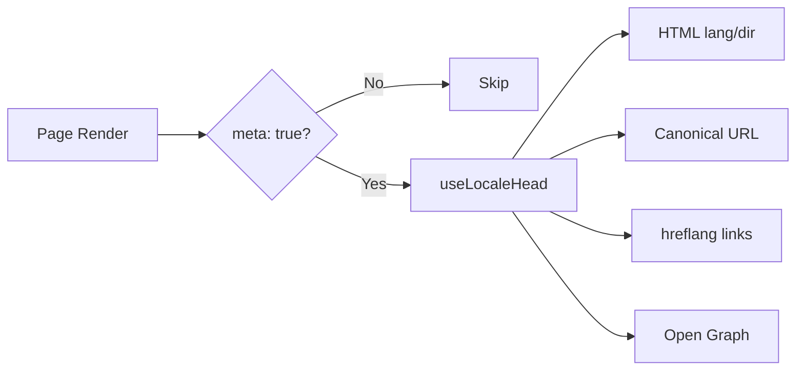

# 🌐 Hướng dẫn SEO cho Nuxt I18n Micro

## 📖 Giới thiệu

SEO (Tối ưu hóa công cụ tìm kiếm) hiệu quả là điều thiết yếu để đảm bảo trang web đa ngôn ngữ của bạn có thể truy cập được và hiển thị với người dùng toàn cầu qua các công cụ tìm kiếm. `Nuxt I18n Micro` đơn giản hóa quá trình quản lý SEO cho các trang đa ngôn ngữ bằng cách tự động sinh các thẻ meta và thuộc tính thiết yếu thông báo cho các công cụ tìm kiếm về cấu trúc và nội dung của trang web.

Hướng dẫn này giải thích cách `Nuxt I18n Micro` xử lý SEO để nâng cao khả năng hiển thị và trải nghiệm người dùng của trang web mà không cần cấu hình bổ sung.

## ⚙️ Xử lý SEO tự động

### Luồng sinh meta SEO



**Các thẻ được sinh:**

| Thẻ | Ví dụ |
| --------------- | -------------------------------------------------------- |
| Thuộc tính HTML | `<html lang="en" dir="ltr">` |
| Canonical | `<link rel="canonical" href="...">` |
| hreflang | `<link rel="alternate" hreflang="en" href="...">` |
| x-default | `<link rel="alternate" hreflang="x-default" href="...">` |
| Open Graph | `<meta property="og:locale" content="en_US">` |

#### `og` theo ngôn ngữ (`og:locale` so với BCP 47)

`<html lang>` và `hreflang` dùng **BCP 47** qua `locale.iso` (ví dụ `ar-AE`).  
Open Graph yêu cầu **`language_TERRITORY`** với **dấu gạch dưới** (`ar_AE`), theo [giao thức OG](https://ogp.me/).

Theo mặc định, `og:locale` được suy ra từ `iso` khi ánh xạ không mơ hồ (`en-US` → `en_US`).  
Đặt một chuỗi **`og`** rõ ràng khi bạn cần giá trị tùy chỉnh (ví dụ `zh-Hans` → `zh_CN`).  
Nếu không có `og` cũng không có `iso` có thể chuyển đổi, các thẻ `og:locale` không được sinh. Trong dev bạn sẽ nhận cảnh báo console (tôn trọng `missingWarn`).

```typescript
i18n: {
  meta: true,
  locales: [
    { code: 'ar', iso: 'ar-AE', og: 'ar_AE', dir: 'rtl' },
    { code: 'en', iso: 'en-US' }, // og:locale → en_US
    { code: 'zh', iso: 'zh-Hans', og: 'zh_CN' }, // script tags need explicit og
  ],
}
```

### 🔑 Các tính năng SEO chính

Khi tùy chọn `meta` được bật trong `Nuxt I18n Micro`, mô-đun tự động quản lý các khía cạnh SEO sau:

1. **🌍 Thuộc tính ngôn ngữ và hướng**:
   - Mô-đun đặt các thuộc tính `lang` và `dir` trên thẻ `<html>` theo ngôn ngữ hiện tại và hướng văn bản (ví dụ, `ltr` cho tiếng Anh hoặc `rtl` cho tiếng Ả Rập).

2. **🔗 URL canonical**:
   - Mô-đun sinh một liên kết canonical (`<link rel="canonical">`) cho mỗi trang, đảm bảo công cụ tìm kiếm nhận diện phiên bản chính của nội dung.

3. **🌐 Liên kết ngôn ngữ thay thế (`hreflang`)**:
   - Mô-đun tự động sinh các thẻ `<link rel="alternate" hreflang="">` cho tất cả các ngôn ngữ khả dụng. Điều này giúp công cụ tìm kiếm hiểu phiên bản ngôn ngữ nào của nội dung khả dụng, cải thiện trải nghiệm người dùng cho khán giả toàn cầu.
   - Mỗi ngôn ngữ phát ra **một** thẻ: `hreflang = iso || code`. Khi `iso` được đặt, `code` khi định tuyến không bao giờ được dùng làm `hreflang` (nên các khóa thị trường như `mx` không trở thành thẻ ngôn ngữ không hợp lệ).
   - Tùy chọn `hreflangBaseLanguage: true` cũng phát ra một thẻ chỉ ngôn ngữ được suy ra từ `iso` (ví dụ `es-ES` → `es`), được ngôn ngữ khu vực đầu tiên trong `locales` chiếm.

4. **🌏 Hreflang `x-default`**:
   - Mô-đun tự động sinh thẻ `<link rel="alternate" hreflang="x-default">` trỏ đến URL của ngôn ngữ mặc định. Điều này cho công cụ tìm kiếm biết URL nào cần hiển thị với người dùng có ngôn ngữ không khớp với bất kỳ ngôn ngữ nào được định nghĩa. Không cần cấu hình bổ sung. Nó hoạt động tự động khi đặt `meta: true`.

5. **🔖 Siêu dữ liệu Open Graph**:
   - Mô-đun sinh các thẻ meta Open Graph (`og:locale`, `og:url`, v.v.) cho mỗi ngôn ngữ, đặc biệt hữu ích cho chia sẻ mạng xã hội và lập chỉ mục công cụ tìm kiếm.

### 🛠️ Cấu hình

Để bật các tính năng SEO này, đảm bảo tùy chọn `meta` được đặt là `true` trong tệp `nuxt.config.ts`:

```typescript
export default defineNuxtConfig({
  modules: ['nuxt-i18n-micro'],
  i18n: {
    locales: [
      { code: 'en', iso: 'en-US', dir: 'ltr' },
      { code: 'fr', iso: 'fr-FR', dir: 'ltr' },
      { code: 'ar', iso: 'ar-SA', dir: 'rtl' },
    ],
    defaultLocale: 'en',
    translationDir: 'locales',
    meta: true, // Enables automatic SEO management
  },
})
```

### 🌍 `metaBaseUrl` động cho triển khai đa miền

Khi `metaBaseUrl` chưa được đặt, các URL SEO tuyệt đối phân giải theo thứ tự này (#240):

1. `site.url` từ [`nuxt-site-config`](https://nuxtseo.com/docs/site-config) (nếu mô-đun đó có mặt, ví dụ qua `@nuxtjs/seo`)
2. Nếu không, hostname từ yêu cầu hiện tại (`useRequestURL()` / `window.location.origin`)

Dự phòng request-origin tôn trọng các header reverse-proxy (`X-Forwarded-Host`, `X-Forwarded-Proto`), nên nó hoạt động đúng sau nginx, Cloudflare, AWS ALB và các proxy tương tự.

Điều đó có nghĩa các ứng dụng đã đặt `site.url` cho sitemap / robots / schema.org **không** cần khai báo `metaBaseUrl` thứ hai:

```typescript
export default defineNuxtConfig({
  site: {
    url: process.env.NUXT_SITE_URL, // also used by micro for canonical / og:url / hreflang
  },
  i18n: {
    meta: true,
    // metaBaseUrl omitted — picks up site.url, then request origin
  },
})
```

Không có `site.url`, một thể hiện ứng dụng duy nhất vẫn có thể phục vụ **nhiều miền** với các thẻ SEO đúng cho mỗi miền qua origin yêu cầu:

```typescript
export default defineNuxtConfig({
  i18n: {
    meta: true,
    // metaBaseUrl is undefined by default — resolved dynamically from the request
  },
})
```

Ví dụ, yêu cầu tới `https://site-a.com/en/about` sẽ tạo:

```html
<link rel="canonical" href="https://site-a.com/en/about" /> <meta property="og:url" content="https://site-a.com/en/about" />
```

Trong khi cùng ứng dụng phục vụ `https://site-b.com/en/about` sẽ tạo:

```html
<link rel="canonical" href="https://site-b.com/en/about" /> <meta property="og:url" content="https://site-b.com/en/about" />
```

Nếu bạn cần một URL cơ sở cố định luôn thắng `site.url`, hãy truyền một chuỗi tĩnh:

```typescript
metaBaseUrl: 'https://example.com'
```

### 🔍 Danh sách trắng truy vấn canonical

Theo mặc định, các tham số truy vấn bị loại khỏi canonical và `og:url` để tránh nội dung trùng lặp. Bạn có thể đưa vào danh sách trắng các tham số truy vấn cụ thể cần được giữ:

```typescript
i18n: {
  canonicalQueryWhitelist: ['page', 'sort', 'filter', 'search', 'q', 'query', 'tag']
}
```

Chỉ các tham số được liệt kê trong `canonicalQueryWhitelist` sẽ xuất hiện trong các URL canonical. Tất cả các tham số truy vấn khác (ví dụ theo dõi, ID phiên) bị loại.

### 🚫 Tắt thẻ meta theo trang

Bạn có thể tắt sinh thẻ meta SEO cho các trang cụ thể bằng `defineI18nRoute()`:

```vue
<script setup>
// Disable all SEO meta tags for this page
defineI18nRoute({
  disableMeta: true,
})
</script>
```

Bạn cũng có thể tắt meta chỉ cho các ngôn ngữ cụ thể:

```vue
<script setup>
// Disable meta tags only for English locale on this page
defineI18nRoute({
  disableMeta: ['en'],
})
</script>
```

Khi `disableMeta` hoạt động, không có thẻ `hreflang`, `canonical`, `og:locale`, `og:url` hoặc `x-default` nào được sinh cho trang/ngôn ngữ bị ảnh hưởng.

### 🔇 Ngôn ngữ bị tắt

Các ngôn ngữ có `disabled: true` tự động bị loại khỏi mọi sinh thẻ SEO. Không có `hreflang`, `og:locale:alternate` hoặc các liên kết alternate nào được tạo cho chúng:

```typescript
i18n: {
  locales: [
    { code: 'en', iso: 'en-US' },
    { code: 'fr', iso: 'fr-FR', disabled: true }, // excluded from SEO tags
  ]
}
```

### 🙈 Ngôn ngữ chọn không tham gia (`seo: false`)

Với các ngôn ngữ nên vẫn có thể định tuyến và dịch được nhưng không nên xuất hiện trong các thẻ khám phá liên ngôn ngữ, hãy đặt `seo: false`. Các ngôn ngữ đó bị loại khỏi các thẻ `hreflang` alternate và `og:locale:alternate`. Nếu ngôn ngữ **mặc định** được cấu hình có `seo: false`, liên kết `x-default` cũng không được phát ra.

```typescript
i18n: {
  locales: [
    { code: 'en', iso: 'en-US' },
    { code: 'ru', iso: 'ru-RU', seo: false }, // internal / non-indexed locale
  ]
}
```

### 📌 Hành vi theo chiến lược

| Chiến lược | Liên kết hreflang | x-default | canonical | og:url |
| ----------------------- | ---------------- | --------------------- | -------------- | ------ |
| `prefix` | ✅ Mọi ngôn ngữ | ✅ URL ngôn ngữ mặc định | ✅ URL hiện tại | ✅ |
| `prefix_except_default` | ✅ Mọi ngôn ngữ | ✅ URL không tiền tố | ✅ URL hiện tại | ✅ |
| `prefix_and_default` | ✅ Mọi ngôn ngữ | ✅ URL ngôn ngữ mặc định | ✅ URL hiện tại | ✅ |
| `no_prefix` | ❌ Không sinh | ❌ Không sinh | ✅ URL hiện tại | ✅ |

Với chiến lược `no_prefix`, chỉ các thuộc tính `canonical`, `og:url`, `og:locale` và `html` (`lang`, `dir`) được sinh. Các liên kết ngôn ngữ thay thế (`hreflang`) và `x-default` không được sinh vì không có URL riêng biệt cho từng ngôn ngữ.

## Ghi đè cấp trang (`useI18nHead`)

Với **các bài viết, hướng dẫn hoặc bất kỳ nội dung CMS nào** nơi không phải mọi ngôn ngữ đều tồn tại hoặc các URL đến từ API, hãy dùng [`useI18nHead`](/api/composables/use-i18n-head) trên trang thay vì plugin i18n head tùy chỉnh.

### Bài viết với bản dịch một phần

```vue
<script setup lang="ts">
const article = await loadArticle()
// article.locales = { en: '...', de: '...' } — only translated locales

useI18nHead({
  meta: [{ property: 'og:title', content: article.title }],
  replace: {
    hreflang: Object.entries(article.locales).map(([locale, href]) => ({
      rel: 'alternate',
      hreflang: locale,
      href,
    })),
    ogAlternates: Object.keys(article.locales),
  },
})
</script>
```

### Slug theo từng ngôn ngữ với `$setI18nRouteParams`

Khi các slug khác nhau theo ngôn ngữ, hãy đặt tham số route trước, sau đó ghi đè các thẻ alternate với URL thực:

```vue
<script setup lang="ts">
const { $defineI18nRoute, $setI18nRouteParams } = useNuxtApp()
const { data: article } = await useFetch(`/api/articles/${slug}`)

$defineI18nRoute({
  localeRoutes: { en: '/blog/[slug]', de: '/de/blog/[slug]' },
})

$setI18nRouteParams({
  en: { slug: article.value.slugEn },
  de: { slug: article.value.slugDe },
})

useI18nHead({
  replace: {
    hreflang: ['en', 'de'].map((locale) => ({
      rel: 'alternate',
      hreflang: locale,
      href: article.value.urls[locale],
    })),
    ogAlternates: ['en', 'de'],
  },
})
</script>
```

### Origin HTTPS sau proxy

Để URL tuyệt đối đúng trên SSR mà không cần composable origin tùy chỉnh:

```ts
i18n: {
  meta: true,
  metaBaseUrl: undefined,
  metaTrustForwardedHost: true,
  metaTrustForwardedProto: true,
}
```

Thêm ví dụ (ghi đè canonical, `x-default`, fetch phản ứng, các trợ giúp dùng chung): [composable useI18nHead](/api/composables/use-i18n-head).

### ⚠️ Dấu gạch chéo cuối

Mô-đun sinh các URL canonical và `hreflang` dựa trên đường dẫn thực tế từ `useRoute().fullPath`. Nếu ứng dụng dùng dấu gạch chéo cuối (ví dụ qua `router.options` của Nuxt), các URL được sinh sẽ phản ánh điều này. Tuy nhiên, `$switchLocalePath` có thể chuẩn hóa các đường dẫn và loại bỏ dấu gạch chéo cuối. Nếu tính nhất quán của dấu gạch chéo cuối là quan trọng cho SEO của bạn, hãy xác minh rằng các URL được sinh khớp với cấu trúc URL của ứng dụng.

### 🎯 Lợi ích

Bằng cách bật tùy chọn `meta`, bạn có lợi từ:

- **📈 Xếp hạng công cụ tìm kiếm cải thiện**: Các công cụ tìm kiếm có thể lập chỉ mục trang web tốt hơn, hiểu mối quan hệ giữa các phiên bản ngôn ngữ khác nhau.
- **👥 Trải nghiệm người dùng tốt hơn**: Người dùng được phục vụ phiên bản ngôn ngữ đúng dựa trên sở thích của họ, dẫn đến trải nghiệm cá nhân hóa hơn.
- **🔧 Giảm cấu hình thủ công**: Mô-đun tự xử lý các nhiệm vụ SEO, giải phóng bạn khỏi nhu cầu thêm thủ công các thẻ meta và thuộc tính liên quan đến SEO.

## 🔗 Nuxt SEO (`@nuxtjs/seo`)

[`@nuxtjs/seo`](https://nuxtseo.com/) gói sitemap, robots, schema.org, ảnh OG và các mô-đun liên quan. Nó tích hợp với **nuxt-i18n-micro** thông qua [`nuxt-site-config`](https://nuxtseo.com/docs/site-config/guides/i18n) (v4+).

### Yêu cầu

- **`@nuxtjs/seo` 3+** (các bản phát hành hiện tại dùng `nuxt-site-config` 4+, đăng ký plugin `nuxt-site-config:i18n` cho micro)
- **`i18n.meta: true`** (khuyến nghị. Micro cung cấp các thẻ head nhận biết ngôn ngữ; Nuxt SEO thêm sitemap, schema.org, v.v.)

### Thứ tự mô-đun

Liệt kê **nuxt-i18n-micro trước `@nuxtjs/seo`** để cấu hình trang có thể đọc thiết lập ngôn ngữ:

```typescript
export default defineNuxtConfig({
  modules: ['nuxt-i18n-micro', '@nuxtjs/seo'],
  site: {
    url: 'https://example.com',
    name: 'My Site',
  },
  i18n: {
    meta: true,
    defaultLocale: 'en',
    locales: [
      { code: 'en', iso: 'en-US' },
      { code: 'de', iso: 'de-DE' },
    ],
  },
})
```

### Tên và mô tả trang đã dịch

Nuxt Site Config đọc các khóa dịch tùy chọn từ các tệp ngôn ngữ:

```json
{
  "nuxtSiteConfig": {
    "name": "My Site",
    "description": "My site description"
  }
}
```

Các giá trị theo ngôn ngữ trong `locales/en.json`, `locales/de.json`, v.v. được lấy tự động.

### Khắc phục sự cố

Nếu bạn thấy `Plugin nuxt-seo:defaults depends on nuxt-site-config:i18n but they are not registered`, hãy nâng cấp **`@nuxtjs/seo` lên 3+** (xem [issue #133](https://github.com/s00d/nuxt-i18n-micro/issues/133)). `nuxt-site-config` 3.x cũ hơn chỉ nối dây i18n cho `@nuxtjs/i18n`, không cho micro.

Thêm: [Hướng dẫn sitemap i18n](https://nuxtseo.com/docs/sitemap/guides/i18n), [Hướng dẫn Site Config i18n](https://nuxtseo.com/docs/site-config/guides/i18n).
