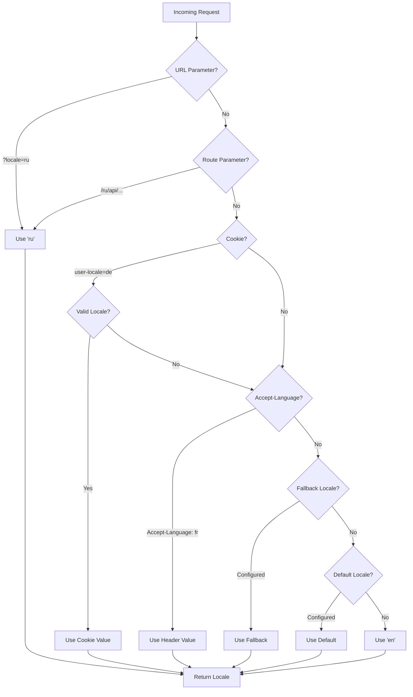

# 🌍 Bản dịch phía server và thông tin Locale trong Nuxt I18n Micro

## 📖 Tổng quan

Nuxt I18n Micro hỗ trợ bản dịch phía server và thông tin locale, cho phép bạn dịch nội dung và truy cập chi tiết locale trên server. Điều này đặc biệt hữu ích cho các API hoặc ứng dụng render phía server khi bản địa hóa được cần trước khi đến client.

Các bản dịch dùng thông điệp locale được định nghĩa trong cấu hình Nuxt I18n và được phân giải động dựa trên locale được phát hiện.

Theo mặc định (`translationPayloads.mode: 'premerged'`), các tệp cấp gốc được nung vào mỗi payload trang tại thời điểm build dưới dạng `\{page\}/\{locale\}/data.json`. Server tải cùng các tệp được build sẵn như client fetch dưới `/\{apiBaseUrl\}/...`, nên tất cả các khóa (cả dùng chung và theo trang) đều có sẵn trong các server handler.

Với `translationPayloads.mode: 'source'`, các tệp nguồn nhỏ gọn được gộp tại runtime khi `loadTranslationsFromServer()` (hoặc route `/_locales`) được gọi — trên **Edge** thông qua Nitro `serverAssets`, trên **Node** từ bản sao public tùy chọn. Xem [Hướng dẫn hiệu năng — Đầu ra Payload Serverless](/guides/performance#serverless-payload-output) và [Kiến trúc Cache & Storage](/api/cache) để biết chi tiết.

Để có danh sách hợp nhất các API runtime và server, xem [Tham chiếu API](/api/overview).

## 🛠️ Thiết lập Middleware phía server

Để bật bản dịch phía server và thông tin locale, hãy dùng các hàm middleware được cung cấp:

- `useTranslationServerMiddleware` - để dịch nội dung
- `useLocaleServerMiddleware` - để truy cập thông tin locale

Cả hai hàm middleware đều có sẵn tự động trong tất cả các route server.

Logic phát hiện locale được chia sẻ giữa cả hai hàm middleware thông qua hàm tiện ích `detectCurrentLocale` để đảm bảo tính nhất quán trong toàn module.

## ✨ Dùng bản dịch trong Server Handler

Bạn có thể dịch nội dung liền mạch trong bất kỳ `eventHandler` nào bằng cách dùng translation middleware.

### Ví dụ: Dùng bản dịch cơ bản

```typescript
import { defineEventHandler } from 'h3'

export default defineEventHandler(async (event) => {
  const t = await useTranslationServerMiddleware(event)
  return {
    message: t('greeting'), // Returns the translated value for the key "greeting"
  }
})
```

Trong ví dụ này:

- Locale của người dùng được phát hiện tự động từ các tham số query, cookie hoặc header.
- Hàm `t` lấy bản dịch phù hợp cho locale được phát hiện.

## 🌍 Dùng thông tin Locale trong Server Handler

### Cách dùng thông tin locale cơ bản

```typescript
import { defineEventHandler } from 'h3'

export default defineEventHandler((event) => {
  const localeInfo = useLocaleServerMiddleware(event)

  return {
    success: true,
    data: localeInfo,
    timestamp: new Date().toISOString(),
  }
})
```

### Cung cấp tham số Locale tùy chỉnh

```typescript
import { defineEventHandler } from 'h3'

export default defineEventHandler((event) => {
  // Force specific locale with custom default
  const localeInfo = useLocaleServerMiddleware(event, 'en', 'ru')

  return {
    success: true,
    data: localeInfo,
    timestamp: new Date().toISOString(),
  }
})
```

### Cấu trúc phản hồi

Locale middleware trả về một đối tượng `LocaleInfo` với các thuộc tính sau:

```typescript
interface LocaleInfo {
  current: string // Current detected locale code
  default: string // Default locale code
  fallback: string // Fallback locale code
  available: string[] // Array of all available locale codes
  locale: Locale | null // Full locale configuration object
  isDefault: boolean // Whether current locale is the default
  isFallback: boolean // Whether current locale is the fallback
}
```

### Ví dụ phản hồi

```json
{
  "success": true,
  "data": {
    "current": "ru",
    "default": "en",
    "fallback": "en",
    "available": ["en", "ru", "de"],
    "locale": {
      "code": "ru",
      "iso": "ru-RU",
      "dir": "ltr",
      "displayName": "Русский"
    },
    "isDefault": false,
    "isFallback": false
  },
  "timestamp": "2024-01-15T10:30:00.000Z"
}
```

## 🌐 Cung cấp Locale tùy chỉnh

Nếu bạn cần chỉ định locale thủ công (ví dụ, để kiểm thử hoặc các request cụ thể), bạn có thể truyền nó cho translation middleware:

### Ví dụ: Locale tùy chỉnh

```typescript
import { defineEventHandler } from 'h3'

function detectLocale(event): string | null {
  const urlSearchParams = new URLSearchParams(event.node.req.url?.split('?')[1])
  const localeFromQuery = urlSearchParams.get('locale')
  if (localeFromQuery) return localeFromQuery

  return 'en'
}

export default defineEventHandler(async (event) => {
  const t = await useTranslationServerMiddleware(event, 'en', detectLocale(event)) // Force French local, en - default locale
  return {
    message: t('welcome'), // Returns the French translation for "welcome"
  }
})
```

## 📋 Logic phát hiện Locale

Cả hai hàm middleware tự động xác định locale của người dùng bằng thứ tự ưu tiên sau:



1. **Tham số URL**: `?locale=ru`
2. **Tham số Route**: `/ru/api/endpoint`
3. **Cookie**: cookie `user-locale`
4. **HTTP Header**: header `Accept-Language`
5. **Locale dự phòng**: Như được cấu hình trong tùy chọn module
6. **Locale mặc định**: Như được cấu hình trong tùy chọn module
7. **Dự phòng cứng**: `'en'`

> **Lưu ý**: Logic phát hiện locale được chia sẻ giữa `useLocaleServerMiddleware` và `useTranslationServerMiddleware` để đảm bảo tính nhất quán trong toàn module.

## 📋 Ví dụ dùng nâng cao

### Phản hồi có điều kiện dựa trên Locale

```typescript
import { defineEventHandler } from 'h3'

export default defineEventHandler((event) => {
  const { current, isDefault, locale } = useLocaleServerMiddleware(event)

  // Return different content based on locale
  if (current === 'ru') {
    return {
      message: 'Привет, мир!',
      locale: current,
      isDefault,
    }
  }

  if (current === 'de') {
    return {
      message: 'Hallo, Welt!',
      locale: current,
      isDefault,
    }
  }

  // Default English response
  return {
    message: 'Hello, World!',
    locale: current,
    isDefault,
  }
})
```

### Phát hiện Locale tùy chỉnh

```typescript
import { defineEventHandler } from 'h3'

export default defineEventHandler((event) => {
  // Force German locale with English as fallback
  const { current, isDefault, locale } = useLocaleServerMiddleware(event, 'en', 'de')

  return {
    message: 'Hallo, Welt!',
    locale: current,
    isDefault: false, // Will be false since we forced German
  }
})
```

### API nhận biết Locale với xác thực

```typescript
import { defineEventHandler, createError } from 'h3'

export default defineEventHandler((event) => {
  const { current, available, locale } = useLocaleServerMiddleware(event)

  // Validate if the detected locale is supported
  if (!available.includes(current)) {
    throw createError({
      statusCode: 400,
      statusMessage: `Unsupported locale: ${current}. Available locales: ${available.join(', ')}`,
    })
  }

  // Return locale-specific configuration
  return {
    locale: current,
    direction: locale?.dir || 'ltr',
    displayName: locale?.displayName || current,
    availableLocales: available,
  }
})
```

### Tích hợp với Translation Middleware

Bạn có thể kết hợp thông tin locale với translation middleware cho quốc tế hóa toàn diện:

```typescript
import { defineEventHandler } from 'h3'

export default defineEventHandler(async (event) => {
  const localeInfo = useLocaleServerMiddleware(event)
  const t = await useTranslationServerMiddleware(event)

  return {
    locale: localeInfo.current,
    message: t('welcome_message'),
    availableLocales: localeInfo.available,
    isDefault: localeInfo.isDefault,
  }
})
```

## 📝 Thực hành tốt nhất

1. **Luôn xác thực locale**: Kiểm tra xem locale được phát hiện có nằm trong danh sách các locale khả dụng không
2. **Dùng logic dự phòng**: Cung cấp các giá trị mặc định hợp lý khi phát hiện locale thất bại
3. **Cache thông tin locale**: Đối với các ứng dụng quan trọng về hiệu năng, hãy xem xét cache kết quả phát hiện locale
4. **Xử lý các trường hợp biên**: Tính đến các locale không được hỗ trợ và cung cấp phản hồi lỗi phù hợp
5. **Kết hợp với bản dịch**: Dùng thông tin locale cùng với translation middleware để hỗ trợ i18n hoàn chỉnh

## 🚀 Cân nhắc về hiệu năng

- Cả hai hàm middleware đều nhẹ và được thiết kế để thực thi nhanh
- Phát hiện locale dùng các chuỗi dự phòng hiệu quả
- Không có cuộc gọi API bên ngoài nào được thực hiện trong quá trình phát hiện locale
- Kết quả được tính đồng bộ để có hiệu năng tối ưu
