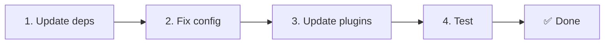

# 📦 Nâng cấp từ v2.x lên v3.x

<Tip>
Xem [Chuyển từ nuxt-i18n](/migration/from-nuxtjs-i18n). Hướng dẫn đó bao gồm việc chuyển từ hệ sinh thái vue-i18n, không phải từ nuxt-i18n-micro v2.
</Tip>

v3.0.0 giới thiệu các thay đổi kiến trúc cơ bản: các gói chiến lược, hệ thống bộ nhớ đệm mới, quản lý ngôn ngữ tập trung qua `useI18nLocale()` và một quy trình chuyển hướng được thiết kế lại. Phần này bao gồm tất cả các thay đổi phá vỡ và cách cập nhật mã của bạn.

## Các bước di chuyển



## Tóm tắt thay đổi phá vỡ

- **Trạng thái ngôn ngữ** — `useState` / `useCookie` thủ công → composable `useI18nLocale()`
- **Truy cập cấu hình** — `useRuntimeConfig().public.i18nConfig` → `getI18nConfig()` từ `#build/i18n.strategy.mjs`
- **Thành phần chuyển hướng** — Tùy chọn `fallbackRedirectComponentPath` → Plugin chuyển hướng máy chủ + middleware route phía client (tự động)
- **`includeDefaultLocaleRoute`** — Được hỗ trợ (không dùng nữa) → Đã bị xóa, dùng tùy chọn `strategy`
- **`experimental.hmr`** — Nằm dưới `experimental` → Tùy chọn ở cấp gốc
- **`previousPageFallback`** — Đã bị xóa hoàn toàn (chiến lược gộp tích lũy xử lý điều này tự động)
- **Bộ nhớ đệm** — `useStorage('cache')` → Singleton `TranslationStorage` (`Symbol.for` trên `globalThis`)
- **Truyền SSR** — Runtime config → Payload Nuxt (v3 dùng `useState`; các chunk giờ nằm trong `payload.data`, xem [Hiệu năng](/guides/performance#server-side-payload-transfer))
- **Các lớp chiến lược** — Nội bộ → Các gói riêng (`@i18n-micro/route-strategy`, `@i18n-micro/path-strategy`)

## Đã xóa: `fallbackRedirectComponentPath`

Tùy chọn `fallbackRedirectComponentPath` và thành phần dự phòng `locale-redirect.vue` đã bị xóa. Logic chuyển hướng giờ được xử lý bởi:

1. **Middleware máy chủ** (`i18n.global.ts`) — đặt `event.context.i18n.locale`
2. **Plugin chuyển hướng máy chủ** (`06.redirect.ts`, chỉ server) — chuyển hướng 302 trước khi render
3. **Middleware route phía client** (`i18n-redirect.global.ts`) — chuyển hướng SPA sau hydration

```diff
 i18n: {
   strategy: 'prefix_except_default',
-  fallbackRedirectComponentPath: '~/components/MyRedirect.vue',
 }
```

Nếu bạn có logic chuyển hướng tùy chỉnh trong thành phần dự phòng, hãy triển khai nó trong một plugin máy chủ thay thế:

```ts
// plugins/i18n-loader.server.ts
export default defineNuxtPlugin({
  name: 'i18n-custom-redirect',
  enforce: 'pre',
  order: -10,
  setup() {
    const { setLocale } = useI18nLocale()
    // Your custom detection logic
    setLocale(detectedLocale)
  },
})
```

## Đã xóa: `includeDefaultLocaleRoute`

Hãy dùng tùy chọn `strategy` thay thế:

- `includeDefaultLocaleRoute: true` → `strategy: 'prefix'`
- `includeDefaultLocaleRoute: false` → `strategy: 'prefix_except_default'` (mặc định)

```diff
 i18n: {
-  includeDefaultLocaleRoute: true,
+  strategy: 'prefix',
 }
```

## Truy cập cấu hình: `getI18nConfig()` thay thế `useRuntimeConfig`

```diff
- const config = useRuntimeConfig()
- const cookieName = config.public.i18nConfig?.localeCookie || 'user-locale'
+ import { getI18nConfig } from '#build/i18n.strategy.mjs'
+ const { localeCookie: configCookie } = getI18nConfig()
+ const cookieName = configCookie ?? 'user-locale'
```

## Quản lý ngôn ngữ: `useI18nLocale()` thay thế trạng thái thủ công

Trong v2, có thể bạn đã dùng `useState('i18n-locale')` hoặc `useCookie('user-locale')` trực tiếp. Trong v3, hãy dùng composable tập trung `useI18nLocale()`:

```diff
- const locale = useState('i18n-locale')
- const cookie = useCookie('user-locale')
- locale.value = 'fr'
- cookie.value = 'fr'
+ const { setLocale } = useI18nLocale()
+ setLocale('fr') // Updates both state and cookie atomically
```

Xem [Phát hiện ngôn ngữ tùy chỉnh](/guides/custom-language-detection) để biết các ví dụ chi tiết.

## Tùy chọn thử nghiệm được chuyển / xóa

`hmr` đã chuyển từ `experimental` lên cấp gốc. `previousPageFallback` đã bị xóa hoàn toàn. Mô-đun giờ dùng chiến lược deep merge tích lũy (độ sâu 2 cấp) tự động giữ các bản dịch từ trang trước đó trong các hoạt hình chuyển tiếp, ngay cả khi các trang chia sẻ các khóa lồng nhau chồng chéo. Sau khi hoạt hình chuyển tiếp hoàn tất, hook `page:transition:finish` dọn dẹp các khóa của trang cũ khỏi bộ nhớ.

```diff
 i18n: {
-  experimental: {
-    hmr: true,
-    previousPageFallback: true
-  }
+  hmr: true,
+  // previousPageFallback removed — handled automatically
 }
```

## Kiến trúc chuyển hướng (v3)

Chuyển hướng giờ được xử lý tự động bởi hai thành phần:

1. **Phía máy chủ** (`06.redirect.ts`, chỉ server): Chạy trong SSR, phát chuyển hướng 302 trước khi render trang nào. Không có "chớp nháy lỗi".
2. **Phía client** (`i18n-redirect.global.ts`): Middleware route toàn cục khi điều hướng SPA; giữ nguyên chuỗi truy vấn và hash.

Thứ tự ưu tiên ngôn ngữ cho chuyển hướng:

1. `useState('i18n-locale')` — được đặt qua `useI18nLocale().setLocale()`
2. Cookie — nếu `localeCookie` được cấu hình
3. Header `Accept-Language` — nếu `autoDetectLanguage: true`
4. `defaultLocale` — dự phòng

Không cần thay đổi mã cho các thiết lập thông thường.

<Warning>
Với các chiến lược `prefix` và `prefix_except_default` khi `redirects: true`, hãy đặt `localeCookie: 'user-locale'` để bật lưu trữ ngôn ngữ qua các lần tải lại trang. Nếu không, chuyển hướng chỉ dùng `Accept-Language` hoặc `defaultLocale`.
</Warning>

## TypeScript: Kiểu mô-đun nội bộ (tùy chọn)

Nếu bạn gặp lỗi kiểu liên quan đến các import nội bộ như `#i18n-internal/plural`, `#i18n-internal/strategy`, hoặc `#i18n-internal/config`, hãy thêm phần `imports` vào `package.json` của dự án:

```json
{
  "imports": {
    "#i18n-internal/plural": "nuxt-i18n-micro/internals",
    "#i18n-internal/strategy": "nuxt-i18n-micro/internals",
    "#i18n-internal/config": "nuxt-i18n-micro/internals"
  }
}
```
