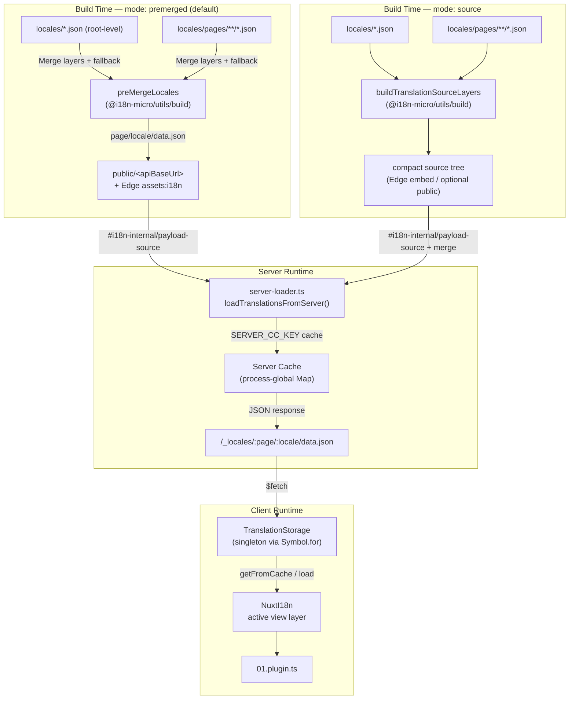

# 🗄️ 翻译缓存与存储架构

## 📖 概述

Nuxt I18n Micro v3 采用多层缓存架构管理翻译。Payload 加载方式取决于 `translationPayloads.mode`:

- **`premerged`**(默认)—— 根、页面、回退与 layer 文件在构建期通过 `@i18n-micro/utils/build` 被合并到 `\{page\}/\{locale\}/data.json` 中
- **`source`** —— 保留紧凑的源文件,通过 `@i18n-micro/utils/source-loader` 与 `@i18n-micro/utils/merge-source` 在运行时合并(Edge 将其嵌入 Nitro `serverAssets`;当复制到 `public/` 时,Node 从中读取)

本页介绍内置缓存的工作原理,以及如何为自定义场景(管理工具、外部 API、缓存失效)进行扩展。

## 📊 架构总览

### 数据流



## 🧱 核心组件

### 1. `TranslationStorage`(客户端 + 服务端)

**文件**:`src/runtime/utils/storage.ts`

一个单例类,为客户端与服务端提供统一的翻译存储。通过在 `globalThis` 上使用 `Symbol.for('__NUXT_I18N_STORAGE_CACHE__')` 来确保即使加载了多份 bundle,也只有一个实例。

**关键方法:**

| 方法                              | 说明                                                            |
| ----------------------------------- | ---------------------------------------------------------------------- |
| `getFromCache(locale, routeName?)`  | 同步检查:返回内存中缓存的数据,若无则返回 `null`            |
| `load(locale, routeName?, options)` | 异步加载并缓存:先查缓存,未命中时通过 `$fetch` 拉取 |
| `clear()`                           | 清空整个缓存                                                |

**缓存键格式**:`\{locale\}:\{routeName\}`(例如 `en:index`、`fr:about`)

```typescript
import { translationStorage } from '../utils/storage'

// Synchronous cache check
const cached = translationStorage.getFromCache('en', 'index')

// Async load (with automatic caching)
const result = await translationStorage.load('en', 'index', {
  apiBaseUrl: '_locales',
  baseURL: '/',
  dateBuild: '2024-01-01',
})
// result.data — merged translations
// result.cacheKey — cache key used
```

### ⚙️ 确定性的缓存 Busting(`i18n.dateBuild`)

默认情况下,本模块在构建期使用 `Date.now()` 生成 `dateBuild`,并嵌入到生成的 `#build/i18n.strategy.mjs` 中,作为查询参数(`?v=...`),用于在重新构建后使翻译请求缓存失效。

如果你需要可复现构建(例如在滚动部署时提升分块缓存命中率),请在 `nuxt.config` 中设置稳定值:

```ts
export default defineNuxtConfig({
  i18n: {
    // Any stable string/number (git SHA, CI build number, release tag, etc.)
    dateBuild: process.env.GIT_SHA ?? 'local-dev',
  },
})
```

### 2. `loadTranslationsFromServer()`(仅服务端)

**文件**:`src/runtime/server/utils/server-loader.ts`

为某个语言/页面加载翻译,并将合并后的结果缓存到以 `@i18n-micro/hmr/cache-keys`(`SERVER_CC_KEY`)为键的进程级 `CacheControl` Map 中。

行为:SSR 从 `#i18n-internal/payload-source` 加载 —— 在 **Node** 上通过 `readFile` 从 `public/<apiBaseUrl>` 读取(premerged 模式下为 `\{page\}/\{locale\}/data.json`);在 **Edge** 上从 `assets:i18n` 读取。`premerged` 只读取一个文件;`source` 通过 `@i18n-micro/utils/source-loader` 合并根/页面/回退。

```typescript
import { loadTranslationsFromServer } from '../server/utils/server-loader'

// Returns { data: Translations, json: string }
const { data, json } = await loadTranslationsFromServer('en', 'index')
```

### 3. 客户端加载(不嵌入 HTML)

字典**不会**被写入 `nuxtApp.payload`。服务端会在内存中保留它们用于 SSR 渲染;
客户端插件会 `await` `switchContext`,由其加载 `/\{apiBaseUrl\}/:page/:locale/data.json`
(与 `@nuxtjs/i18n` 在 `experimental.preload: false` 下的默认姿态相同)。

`NuxtI18n` 保有一份供 `$t()` 与 `$has()` 使用的活动视图层字典。`NuxtTranslationLoader` 负责切换语言/路由上下文,并将分块合并到该视图层中。

### 4. 服务端 API 路由

**路由**:`/_locales/\{page\}/\{locale\}/data.json`

**文件**:`src/runtime/server/routes/i18n.ts`

此 Nitro 路由会为当前的 payload 模式提供合并后的翻译。它会调用 `loadTranslationsFromServer()`,并以 JSON 形式返回结果。

在生产环境下,它还会设置:

```http
Cache-Control: public, max-age={httpCacheDuration}, immutable
```

`httpCacheDuration` 默认为 `31536000`(1 年)。这是安全的,因为客户端请求 payload 时会带上 `?v=\{dateBuild\}` 作为缓存 buster。设为 `httpCacheDuration: 0` 可省略该响应头。开发环境下不会应用该响应头。

## 📥 扩展:自定义翻译加载

### 从缓存读取(服务端路由)

```ts
// server/api/i18n/load-cache.[post].ts
import { defineEventHandler, readBody } from 'h3'
import { loadTranslationsFromServer } from '#imports'

export default defineEventHandler(async (event) => {
  const { page, locale } = await readBody<{ page: string; locale: string }>(event)
  const { data } = await loadTranslationsFromServer(locale, page)
  return { locale, page, data }
})
```

### 更新翻译(写文件 + 使缓存失效)

```ts
// server/api/i18n/update.[post].ts
import { defineEventHandler, readBody, createError } from 'h3'
import { join } from 'node:path'
import { readFile, writeFile } from 'node:fs/promises'
import { deepMergeTranslations } from '@i18n-micro/utils/deep-merge'

export default defineEventHandler(async (event) => {
  const { path, updates } = await readBody<{ path: string; updates: Record<string, unknown> }>(event)

  if (!path || !updates) {
    throw createError({ statusCode: 400, statusMessage: 'Missing path or updates' })
  }

  const fullPath = join('locales', path)
  let existing: Record<string, unknown> = {}

  try {
    const content = await readFile(fullPath, 'utf-8')
    existing = JSON.parse(content) as Record<string, unknown>
  } catch {
    // File does not exist — create new
  }

  const merged = deepMergeTranslations(existing, updates)
  await writeFile(fullPath, JSON.stringify(merged, null, 2), 'utf-8')

  return { success: true, path, updated: merged }
})
```

<Tip>

</Tip>

## 🧹 清空缓存

### 通过代码清空缓存(客户端)

使用内置的 `$clearCache` 方法:

```vue
<script setup>
const { $clearCache } = useNuxtApp()

// Clears both TranslationStorage and plugin-level cache
$clearCache()
</script>
```

### 服务端缓存行为

服务端缓存(`loadTranslationsFromServer`)是进程级的,会一直保留直到:

- 服务器进程重启
- 检测到新部署(`dateBuild` 变化)

对于 serverless 环境,每次冷启动都会拥有全新的缓存。

## ⚙️ Serverless 配置

对于 serverless 环境(Cloudflare Workers、AWS Lambda),内置缓存使用内存中的 `Map`。翻译缓存本身不需要额外的外部存储配置。

不过,用于源翻译文件的 Nitro 存储可能需要配置:

```ts
export default defineNuxtConfig({
  nitro: {
    storage: {
      // Only needed if default file-system storage is unavailable
      'assets:server': {
        driver: 'cloudflare-kv-binding',
        binding: 'MY_KV_NAMESPACE',
      },
    },
  },
})
```

## 💡 与 v2 的主要差异

| 方面           | v2                            | v3                                                                       |
| ---------------- | ----------------------------- | ------------------------------------------------------------------------ |
| 客户端缓存     | `useStorage('cache')`         | `TranslationStorage` 单例(globalThis 上的 Symbol.for)                |
| SSR 传输     | Runtime config                | 通过 `payload.data` 传输完整分块(v3.0 使用 `useState`)                    |
| 服务端缓存     | Nitro 缓存存储           | 通过 `Symbol.for` 的进程级 `Map`                                    |
| 合并逻辑      | 客户端                   | 构建期(`premerged`)或运行时(`source`),通过 `@i18n-micro/utils/*` |
| 缓存键格式 | `i18n:merged:\{page\}:\{locale\}` | `\{locale\}:\{routeName\}`                                                   |

## 📚 相关

- [性能指南](/guides/performance) —— 缓存对性能的影响
- [服务端翻译](/guides/server-side-translations) —— 在服务端路由中使用翻译
- [Firebase 部署](/guides/firebase) —— 部署相关的缓存注意事项
