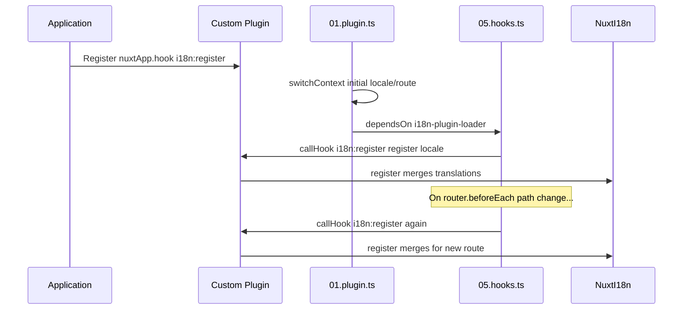

# 📢 事件

## 🔄 `i18n:register`

`Nuxt I18n Micro` 中的 `i18n:register` 事件让你能够动态地向应用的 i18n 上下文中添加翻译,使国际化流程更加流畅、灵活。你可以按需接入新的翻译,增强应用的本地化能力。

### 📝 事件详情

- **用途**:
  - 允许将额外的翻译动态并入某种语言现有的翻译集中。

- **载荷**:
  - **`register`**:
    - 事件提供的一个函数,接受两个参数:
      - **`translations`**(`Translations`):
        - 一个键值对对象,按 `Translations` 接口组织翻译内容。
      - **`locale`**(`string`,可选):
        - 要注册翻译的语言代码(例如 `'en'`、`'ru'`)。若未指定,则默认为事件提供的语言。

- **行为**:
  - 触发时,`register` 函数会将新翻译合并进当前语言的上下文,更新整个应用中可用的翻译。

### ⏱️ 何时触发

模块的 hooks 插件(`05.hooks.ts`,`dependsOn: ['i18n-plugin-loader']`)会调用 `nuxtApp.callHook('i18n:register', …)`:

1. **启动时触发一次** —— 在主 i18n 插件(`01.plugin.ts`)为初始路由加载完翻译之后
2. **导航时触发** —— 当路径变化时在 `router.beforeEach` 中触发;若 `strategy: 'no_prefix'`,则每次导航都会触发

请在普通的 Nuxt 插件中通过 `nuxtApp.hook('i18n:register', …)` 注册监听器。由于 hooks 插件在 loader 就绪后运行,你的回调会在需要扩展翻译时被调用。

在 `nuxt.config` 中设置 `hooks: false` 可以禁用自动的 `i18n:register` 调用(参见[配置 —— `hooks`](/guides/configuration#hooks))。

### 💡 用法示例

以下示例演示了如何使用 `i18n:register` 事件动态添加翻译:

```typescript
nuxt.hook('i18n:register', async (register: (translations: unknown, locale?: string) => void, locale: string) => {
  register(
    {
      greeting: 'Hello',
      farewell: 'Goodbye',
    },
    locale,
  )
})
```

### 🛠️ 说明



- **触发事件**:
  - hooks 插件(`05.hooks.ts`)会在主 loader 就绪后以及相关导航时触发 `i18n:register`。

- **添加翻译**:
  - 示例中为 `"greeting"` 与 `"farewell"` 注册了英文翻译。
  - `register` 函数会将这些翻译合并进给定语言现有的翻译集中。

### 🔗 主要优势

- **动态更新**:
  - 无需重新部署整个应用即可轻松更新或添加翻译。

- **本地化灵活性**:
  - 根据用户或应用需求支持实时的本地化调整。

通过使用 `i18n:register` 事件,你可以让应用的本地化策略保持灵活可变,从而提升整体的用户体验。

---

## 🛠️ 通过插件修改翻译

要在 Nuxt 应用中动态修改翻译,推荐使用插件。插件为处理本地化更新提供了结构化方式,尤其适合与模块或外部翻译文件配合使用。

### **注册插件**

若你使用的是模块,请通过将其加入模块配置来注册用于修改翻译的插件:

```javascript
addPlugin({
  src: resolve('./plugins/extend_locales'),
})
```

上面这行会注册位于 `./plugins/extend_locales` 的插件,该插件将负责翻译的动态加载与注册。

### **实现插件**

在插件中,你可以管理语言的修改逻辑。以下是一个 Nuxt 插件的示例实现:

```typescript
import { defineNuxtPlugin } from '#app'

export default defineNuxtPlugin(async (nuxtApp) => {
  // Function to load translations from JSON files and register them
  const loadTranslations = async (lang: string) => {
    try {
      const translations = await import(`../locales/${lang}.json`)
      return translations.default
    } catch (error) {
      console.error(`Error loading translations for language: ${lang}`, error)
      return null
    }
  }

  // Hook into the 'i18n:register' event to dynamically add translations
  // eslint-disable-next-line @typescript-eslint/ban-ts-comment
  // @ts-expect-error
  nuxtApp.hook('i18n:register', async (register: (translations: unknown, locale?: string) => void, locale: string) => {
    const translations = await loadTranslations(locale)
    if (translations) {
      register(translations, locale)
    }
  })
})
```

### 📝 详细说明

1. **加载翻译**:

- `loadTranslations` 函数根据语言动态导入翻译文件。文件应位于 `locales` 目录下,并以语言代码命名(例如 `en.json`、`de.json`)。
- 加载成功时返回翻译;否则会记录错误。

2. **注册翻译**:

- 插件通过 `nuxtApp.hook` 挂接到 `i18n:register` 事件。
- 事件触发时,`register` 函数会被调用,并传入加载好的翻译与对应语言。
- 这样便会将新翻译合并到指定语言的 i18n 上下文中,更新整个应用可用的翻译。

### 🔗 使用插件修改翻译的好处

- **关注点分离**:
  - 将本地化逻辑与主应用代码分离,便于管理与维护。

- **动态与可扩展**:
  - 通过动态加载与注册翻译,你无需重新完整部署应用即可更新内容,尤其适合频繁更新或多语言内容的应用。

- **本地化更灵活**:
  - 插件让你可以按需修改或扩展翻译,提供更贴合用户偏好或业务需求的适应性本地化策略。

采用这种方式,你可以借助插件以结构化且可维护的方式高效地扩展与修改应用的本地化,让国际化能够随需变化,并提升整体用户体验。
