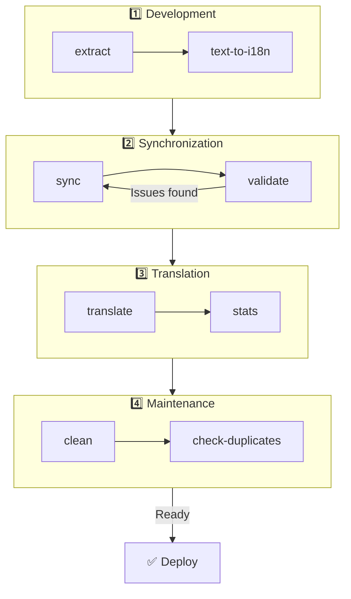

# 🌐 nuxt-i18n-micro-cli 指南

## 📖 简介

`nuxt-i18n-micro-cli` 是一款命令行工具,用于简化使用 `nuxt-i18n-micro` 模块(Nuxt I18n Micro)的 Nuxt.js 项目的本地化与国际化流程。它提供了从代码中抽取翻译键、管理翻译文件、跨语言同步翻译,以及借助外部翻译服务自动化翻译的能力。

本指南将引导你完成 `nuxt-i18n-micro-cli` 的安装、配置与使用,以有效管理项目翻译。请在 [npmjs.com](https://www.npmjs.com/package/nuxt-i18n-micro-cli) 查看该包。

## 🔧 安装与设置

### 📦 安装 nuxt-i18n-micro-cli

全局安装,或作为 Nuxt 项目的开发依赖安装(推荐在 CI 中使用):

```bash
# global
npm install -g nuxt-i18n-micro-cli

# or per project
pnpm add -D nuxt-i18n-micro-cli
pnpm exec i18n-micro text-to-i18n --dryRun
```

若你的项目使用 Nuxt 4 的 `app/` 目录(`app/pages`、`app/components` 等),请使用 **`nuxt-i18n-micro-cli` ≥ 2.1.1**。较早的 CLI 版本只扫描项目根目录下的 `pages/`。

### 🛠 在项目中初始化

安装完成后,你可以在 Nuxt.js 项目目录中运行 `i18n-micro` 命令。

请确保项目已配置 `nuxt-i18n-micro`,并在 `nuxt.config.ts`(或 `nuxt.config.js`)中提供了必要的配置。

### 📄 通用参数

- `--cwd`:指定当前工作目录(默认为 `.`)。
- `--logLevel`:设置日志级别(`silent`、`info`、`verbose`)。
- `--translationDir`:包含 JSON 翻译文件的目录(默认:`locales`)。

## 📊 CLI 工作流总览



### 工作流步骤

| 阶段           | 命令                    | 用途                           |
| --------------- | --------------------------- | --------------------------------- |
| **开发** | `extract`、`text-to-i18n`   | 找出并抽取翻译键 |
| **同步**        | `sync`、`validate`          | 确保所有语言拥有相同的键 |
| **翻译**   | `translate`、`stats`        | 自动翻译缺失的键       |
| **维护** | `clean`、`check-duplicates` | 保持翻译整洁            |

## 📋 命令

### 🔄 `text-to-i18n` 命令

CLI 包:[`nuxt-i18n-micro-cli`](https://www.npmjs.com/package/nuxt-i18n-micro-cli)

**说明**:扫描 Vue/TS/JS 文件中面向用户的硬编码字符串,将其替换为 `$t('...')`,并把新键合并进 JSON 翻译文件。请在 **Nuxt 项目根目录**(`nuxt.config` 所在目录)中运行。

**用法**:

```bash
i18n-micro text-to-i18n [options]
```

**选项**:

| 选项                  | 默认值           | 说明                                                           |
| ----------------------- | ----------------- | --------------------------------------------------------------------- |
| `--translationFile`     | `locales/en.json` | 新键写入的 JSON 文件(相对于项目根)。                    |
| `--path`                | —                 | 仅处理指定文件或目录(例如 `app/pages/about.vue`)。      |
| `--context`             | —                 | 键前缀(例如 `auth` → `auth.*`)。                                  |
| `--dryRun`              | `false`           | 预览但不写入文件。                                        |
| `--verbose`             | `false`           | 输出更多日志。                                                        |
| `--interactive`         | `false`           | 应用每个键前进行确认或编辑。                             |
| `--extractOnlyDirs`     | `plugins`         | 抽取键但**不**重写源文件的目录。 |
| `--extractOnlyPatterns` | —                 | 仅抽取的 glob 模式(例如 `**/*.plugin.ts`)。              |

**示例**:

```bash
i18n-micro text-to-i18n --translationFile locales/en.json --context auth --dryRun
```

#### 会扫描哪些目录?

<Info>
自 CLI **v2.1.1** 起,`text-to-i18n` 同时扫描传统根目录和 `app/*` 对应目录。请在**项目根目录**下运行该命令 —— 不要 `cd app`。
</Info>

会收集以下位置的 `*.vue`、`*.js` 与 `*.ts`:

| Nuxt 3(项目根) | Nuxt 4(`app/` 目录) |
| --------------------- | ------------------------- |
| `pages/`              | `app/pages/`              |
| `components/`         | `app/components/`         |
| `plugins/`            | `app/plugins/`            |
| `layouts/`            | `app/layouts/`            |

除非通过 `--path` 指定,其他目录(如 `server/`、`composables/`、`middleware/` 等)会被跳过。在 Nuxt 4 中,请从项目根目录运行(无需 `cd app`)。如果 `i18n.translationDir` 不是 `locales/`,请在 `--translationFile` 中保持一致。

```bash
i18n-micro text-to-i18n --path app/pages
```

#### 工作原理

1. 从上述目录(或 `--path`)收集文件。
2. 将字面量 / 模板文本替换为 `$t('generated.key')`(`plugins/` 默认为仅抽取)。
3. 将新键合并到 `--translationFile` 中,不移除已有条目。

**示例改写**:

改写前:

```vue
<template>
  <div>
    <h1>Welcome to our site</h1>
    <p>Please sign in to continue</p>
  </div>
</template>
```

改写后:

```vue
<template>
  <div>
    <h1>{{ $t('pages.home.welcome_to_our_site') }}</h1>
    <p>{{ $t('pages.home.please_sign_in') }}</p>
  </div>
</template>
```

**最佳实践**:先做 dry run;完整运行前先 commit;让 `--translationFile` 与 `nuxt.config` 中的 `i18n.translationDir` 保持一致;对启动代码保留 `--extractOnlyDirs plugins`。

**限制**:它是独立的 npm 包(不与模块一起打包);不会自动读取 `nuxt.config`;输出的是 `$t(...)`;复杂的动态字符串可能需要改用 `extract` / `search`。

### 📊 `stats` 命令

**说明**:`stats` 命令用于展示 Nuxt.js 项目中每种语言的翻译统计信息。它可以显示已翻译的键数与总键数,帮助你了解翻译进度。

**用法**:

```bash
i18n-micro stats [options]
```

**选项**:

- `--full`:仅显示合并后的翻译统计(默认:`false`)。

**示例**:

```bash
i18n-micro stats --full
```

### 🌍 `translate` 命令

**说明**:`translate` 命令通过外部翻译服务自动翻译缺失的键。该命令利用 Google Translate、DeepL 等服务的 API 来补齐缺失的翻译,从而简化翻译流程。

**用法**:

```bash
i18n-micro translate [options]
```

**选项**:

- `--service`:所使用的翻译服务(例如 `google`、`deepl`、`yandex`)。若未指定,命令会提示你选择。
- `--token`:所选翻译服务对应的 API key。若未提供,会提示你输入。
- `--options`:翻译服务的额外选项,格式为以逗号分隔的 key:value 对(例如 `model:gpt-3.5-turbo,max_tokens:1000`)。
- `--replace`:翻译所有键并覆盖现有翻译(默认:`false`)。

**示例**:

```bash
i18n-micro translate --service deepl --token YOUR_DEEPL_API_KEY
```

#### 🌐 支持的翻译服务

`translate` 命令支持多种翻译服务。其中部分包括:

- **Google Translate**(`google`)
- **DeepL**(`deepl`)
- **Yandex Translate**(`yandex`)
- **OpenAI**(`openai`)
- **Azure Translator**(`azure`)
- **IBM Watson**(`ibm`)
- **Baidu Translate**(`baidu`)
- **LibreTranslate**(`libretranslate`)
- **MyMemory**(`mymemory`)
- **Lingva Translate**(`lingvatranslate`)
- **Papago**(`papago`)
- **Tencent Translate**(`tencent`)
- **Systran Translate**(`systran`)
- **Yandex Cloud Translate**(`yandexcloud`)
- **ModernMT**(`modernmt`)
- **Lilt**(`lilt`)
- **Unbabel**(`unbabel`)
- **Reverso Translate**(`reverso`)

#### ⚙️ 服务配置

部分服务需要特定的配置或 API key。使用 `translate` 命令时,可以指定服务并提供所需的 `--token`(API key)以及可选的 `--options`。

例如:

```bash
i18n-micro translate --service openai --token YOUR_OPENAI_API_KEY --options openaiModel:gpt-3.5-turbo,max_tokens:1000
```

### 🛠️ `extract` 命令

**说明**:从代码库中抽取翻译键,并按范围组织它们。

**用法**:

```bash
i18n-micro extract [options]
```

**选项**:

- `--prod, -p`:以生产模式运行。

**示例**:

```bash
i18n-micro extract
```

### 🔄 `sync` 命令

**说明**:跨语言同步翻译文件,确保所有语言具有相同的键。

**用法**:

```bash
i18n-micro sync [options]
```

**示例**:

```bash
i18n-micro sync
```

### ✅ `validate` 命令

**说明**:相对参考语言,校验翻译文件是否有缺失或多余的键。

**用法**:

```bash
i18n-micro validate [options]
```

**示例**:

```bash
i18n-micro validate
```

### 🧹 `clean` 命令

**说明**:从翻译文件中移除未使用的翻译键。

**用法**:

```bash
i18n-micro clean [options]
```

**示例**:

```bash
i18n-micro clean
```

### 📤 `import` 命令

**说明**:将 PO 文件转换回 JSON 格式,并保存在翻译目录中。

**用法**:

```bash
i18n-micro import [options]
```

**选项**:

- `--potsDir`:包含 PO 文件的目录(默认:`pots`)。

**示例**:

```bash
i18n-micro import --potsDir pots
```

### 📥 `export` 命令

**说明**:将翻译导出为 PO 文件,便于外部翻译管理。

**用法**:

```bash
i18n-micro export [options]
```

**选项**:

- `--potsDir`:保存 PO 文件的目录(默认:`pots`)。

**示例**:

```bash
i18n-micro export --potsDir pots
```

### 🗂️ `export-csv` 命令

**说明**:`export-csv` 命令会将 JSON 文件中的翻译键与值(包括其文件路径)导出为 CSV 格式。这对喜欢在电子表格软件中处理翻译数据的团队很有用。

**用法**:

```bash
i18n-micro export-csv [options]
```

**选项**:

- `--csvDir`:导出的 CSV 文件保存目录。
- `--delimiter`:CSV 文件的分隔符(默认:`,`)。

**示例**:

```bash
i18n-micro export-csv --csvDir csv_files
```

### 📑 `import-csv` 命令

**说明**:`import-csv` 命令从 CSV 文件导入翻译数据,并更新相应的 JSON 文件。这适用于从电子表格批量应用翻译更新的场景。

**用法**:

```bash
i18n-micro import-csv [options]
```

**选项**:

- `--csvDir`:要导入的 CSV 文件所在目录。
- `--delimiter`:CSV 文件使用的分隔符(默认:`,`)。

**示例**:

```bash
i18n-micro import-csv --csvDir csv_files
```

### 🧾 `diff` 命令

**说明**:在同一目录(包括其子目录)内,将默认语言与其他语言的翻译文件进行比较。该命令会找出默认语言中相对其他语言缺失的键及其值,方便追踪翻译进度或差异。

**用法**:

```bash
i18n-micro diff [options]
```

**示例**:

```bash
i18n-micro diff
```

### 🔍 `check-duplicates` 命令

**说明**:`check-duplicates` 命令会检查每种语言下所有翻译文件(包括根级与页面级)中是否存在重复的翻译值。它确保同一语言中不同键不会共享相同的翻译值,有助于保持翻译的清晰与一致。

**用法**:

```bash
i18n-micro check-duplicates [options]
```

**示例**:

```bash
i18n-micro check-duplicates
```

**工作原理**:

- 该命令会检查每种语言下根级与页面级的翻译文件。
- 如果某个翻译值在多个位置出现(在根级翻译内,或跨不同页面),会报告这些重复值以及它们所在的文件和键。
- 如果没有发现重复,该命令会确认该语言不存在重复的翻译值。

该命令有助于确保翻译键在同一语言内保持唯一的值,避免意外的重复。

### 🔄 `replace-values` 命令

**说明**:`replace-values` 命令可用于跨所有语言批量替换翻译值。它同时支持简单文本替换和基于正则表达式(regex)的高级替换。你还可以在正则中使用捕获组,并在替换字符串中引用它们,适用于更复杂的替换场景。

**用法**:

```bash
i18n-micro replace-values [options]
```

**选项**:

- `--search`:要在翻译中搜索的文本或正则模式(必填)。
- `--replace`:用于替换所找到内容的文本(必填)。
- `--useRegex`:启用正则搜索(默认:`false`)。

**示例 1**:简单替换

将所有语言中的 "Hello" 替换为 "Hi":

```bash
i18n-micro replace-values --search "Hello" --replace "Hi"
```

**示例 2**:正则替换

启用正则,将所有语言中以 "Hello" 开头并跟随数字的字符串(例如 "Hello123")替换为 "Hi":

```bash
i18n-micro replace-values --search "Hello\\d+" --replace "Hi" --useRegex
```

**示例 3**:使用捕获组

使用捕获组将匹配的部分动态插入替换字符串。例如,将 "Hello [name]" 替换为 "Hi [name]",同时保留原有名字:

```bash
i18n-micro replace-values --search "Hello (\\w+)" --replace "Hi $1" --useRegex
```

此时 `$1` 引用的是第一个捕获组,即 "Hello" 后的 `[name]` 部分。替换后会保留原字符串中的名字。

**工作原理**:

- 该命令会扫描所有翻译文件(包括全局与页面级)。
- 当基于搜索字符串或正则模式匹配成功时,会用所提供的替换文本替换匹配文本。
- 使用正则时,可通过 `$1`、`$2` 等在替换字符串中引用捕获组。
- 所有更改都会被记录,展示文件路径、翻译键以及翻译值替换前后的状态。

**日志**:
每次替换,该命令会记录以下细节:

- 语言与文件路径
- 被修改的翻译键
- 替换前的原值与替换后的新值
- 若使用带捕获组的正则,日志会显示分组匹配情况以及替换方式。

这让你可以清楚地追踪替换操作在哪些位置发生、发生了什么变化,提供跨翻译文件的完整修改历史。

## 🛠 示例

- **抽取翻译**:

  ```bash
  i18n-micro extract
  ```

- **使用 Google Translate 翻译缺失键**:

  ```bash
  i18n-micro translate --service google --token YOUR_GOOGLE_API_KEY
  ```

- **翻译所有键并覆盖现有翻译**:

  ```bash
  i18n-micro translate --service deepl --token YOUR_DEEPL_API_KEY --replace
  ```

- **校验翻译文件**:

  ```bash
  i18n-micro validate
  ```

- **清理未使用的翻译键**:

  ```bash
  i18n-micro clean
  ```

- **同步翻译文件**:

  ```bash
  i18n-micro sync
  ```

## ⚙️ 配置指南

`nuxt-i18n-micro-cli` 依赖你在 `nuxt.config.ts`(或 `nuxt.config.js`)中对 Nuxt.js i18n 的配置。请确保已安装并配置好 `nuxt-i18n-micro` 模块。

### 🔑 nuxt.config.js 示例

```ts
export default defineNuxtConfig({
  modules: ['nuxt-i18n-micro'],
  i18n: {
    locales: [
      { code: 'en', iso: 'en-US' },
      { code: 'fr', iso: 'fr-FR' },
    ],
    defaultLocale: 'en',
    fallbackLocale: 'en',
    translationDir: 'locales', // or 'app/locales' for Nuxt 4 colocation
  },
})
```

请确保 `translationDir` 与 `nuxt-i18n-micro-cli` 使用的目录一致(默认为 `locales`)。

## 📝 最佳实践

### 🔑 一致的键命名

请确保翻译键一致且描述清晰,以避免混淆与重复。

### 🧹 定期维护

定期使用 `clean` 命令清理未使用的翻译键,让翻译文件保持整洁。

### 🛠 自动化翻译工作流

将 `nuxt-i18n-micro-cli` 命令集成到开发工作流或 CI/CD 流水线中,以自动化翻译文件的抽取、翻译、校验与同步。

### 🛡️ 妥善保护 API Key

使用需要 API key 的翻译服务时,请妥善保存 key,避免将其提交到版本管理系统。可考虑使用环境变量或安全的密钥管理方案。

## 📞 支持与贡献

如有问题或改进建议,欢迎为该项目做贡献,或在项目仓库中提交 issue。

---

按照本指南操作,你即可使用 `nuxt-i18n-micro-cli` 在 Nuxt.js 项目中高效管理翻译,精简国际化流程,为不同语言的用户提供一致的体验。
