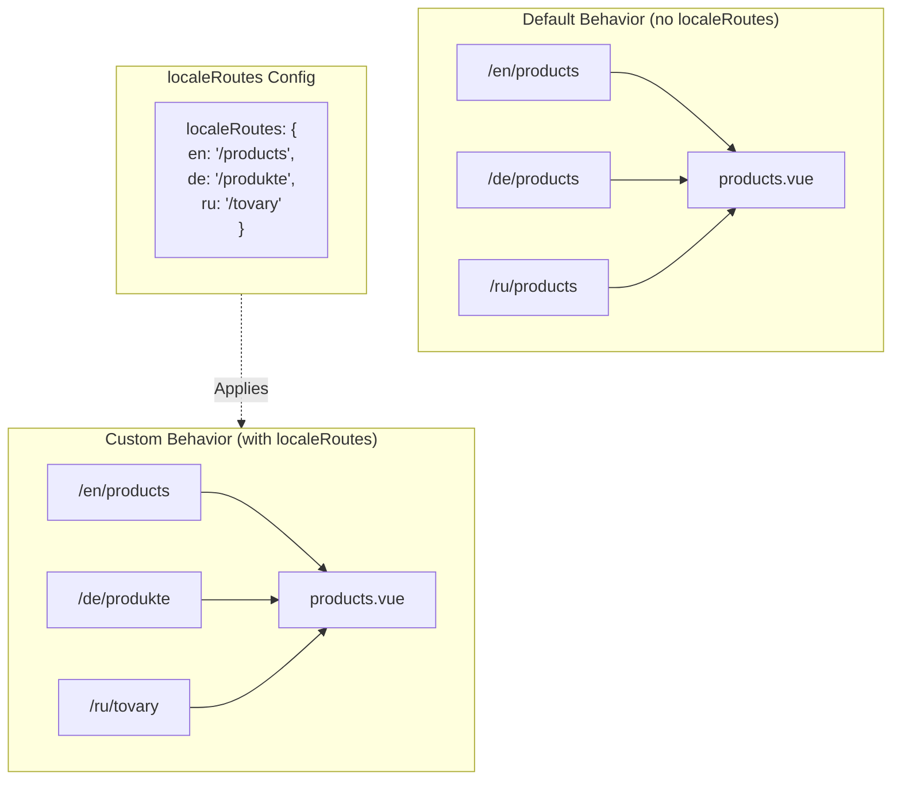

# 🔗 在 `Nuxt I18n Micro` 中使用 `localeRoutes` 自定义本地化路由

## 📖 `localeRoutes` 简介

`Nuxt I18n Micro` 中的 `localeRoutes` 特性允许你为特定语言定义自定义路由,为应用的路由结构提供灵活性与控制力。当某些语言需要不同的 URL 结构、定制路径,或需要遵循特定的区域或语言习惯时,该特性尤为有用。

## 🚀 `localeRoutes` 的主要用例

`localeRoutes` 的主要用途是为不同语言提供各不相同的路由,通过让 URL 对目标受众更直观、更贴合语言习惯来提升用户体验。例如,你可能希望英文与俄文版本的同一页面使用不同的路径,其中俄文语言下遵循本地化的 URL 格式。

### 📄 示例:在 `$defineI18nRoute` 中定义 `localeRoutes`

以下示例展示了如何在 `$defineI18nRoute` 中通过 `localeRoutes` 为特定语言定义自定义路由:

```typescript
import { useNuxtApp } from '#imports'

const { $defineI18nRoute } = useNuxtApp()

$defineI18nRoute({
  localeRoutes: {
    ru: '/localesubpage', // Custom route path for the Russian locale
    de: '/lokaleseite', // Custom route path for the German locale
  },
})
```

> [!IMPORTANT]
> `$defineI18nRoute` 不是全局函数。在 `script setup` 中,请先通过 `useNuxtApp()` 获取,再调用它。

### 🔄 `localeRoutes` 的工作方式



- **默认行为**:未配置 `localeRoutes` 时,所有语言使用由主路径定义的相同路由结构。
- **自定义行为**:配置 `localeRoutes` 后,特定语言可以拥有各自的路由,以配置中定义的按语言路径覆盖默认路径。

## 🌱 `localeRoutes` 的使用场景

### 📄 示例:在页面中使用 `localeRoutes`

以下是一个简单的 Vue 组件示例,演示如何将 `$defineI18nRoute` 与 `localeRoutes` 一起使用:

```vue
<template>
  <div>
    <!-- Display greeting message based on the current locale -->
    <p>{{ $t('greeting') }}</p>

    <!-- Navigation links -->
    <div>
      <NuxtLink :to="$localeRoute({ name: 'index' })"> Go to Index </NuxtLink>
      |
      <NuxtLink :to="$localeRoute({ name: 'about' })"> Go to About Page </NuxtLink>
    </div>
  </div>
</template>

<script setup>
import { useNuxtApp } from '#imports'

const { $getLocale, $switchLocale, $getLocales, $localeRoute, $t, $defineI18nRoute } = useNuxtApp()

// Define translations and custom routes for specific locales
$defineI18nRoute({
  localeRoutes: {
    ru: '/localesubpage', // Custom route path for Russian locale
  },
})
</script>
```

### 🛠️ 在不同场景中使用 `localeRoutes`

- **落地页**:使用自定义路由本地化落地页的 URL,使其与营销活动相匹配。
- **文档站点**:为每种语言提供独立的路由,以更好地匹配本地化的内容结构。
- **电商站点**:按语言定制产品或分类 URL,以改善 SEO 与用户体验。

## 结合 `localeRoutes` 使用导航

由于本地化路由并不直接对应 pages 目录下的文件名,你需要通过对象而非名称来引用导航。

```vue
<template>
  /**
   * Exemple page: /pages/about-us.vue
   * EN /about-us
   * ES /sobre-nosotros
   * FR /a-propos
   */

  // Using NuxtLink
  <NuxtLink :to="$localeRoute({ name: 'about-us' })">
    Go to About Page
  </NuxtLink>

  // Using I18nLink
  <I18nLink :to="{ name: 'about-us' }">
    Go to About Page
  </NuxtLink>

  // The string literal navigation wouldn't work for any locale but english
  <I18nLink to="/about-us">
    Go to About Page
  </NuxtLink>
</template>
```

### 嵌套页面的命名

默认情况下,页面名基于文件与路径名生成。例如:

- `/pages/about-us.vue` 可用 `$localeRoute(\{ name: 'about-us' \})` 访问
- `/pages/about-us/physical-stores.vue` 可用 `$localeRoute(\{ name: 'about-us-physical-stores' \})` 访问

如需覆盖此行为,请使用 `definePageMeta` 显式命名页面。

```vue
// /pages/about-us/physical-stores.vue
<script setup>
definePageMeta({
  name: 'our-stores'
})
```

此后可以通过 `$localeRoute` 或 `I18nLink`,以 `:to='\{ name: "our-stores" \}'` 的方式引用该页面。

## 🎯 带 slug 的动态路由与 `$setI18nRouteParams`

在处理包含 slug 或参数的动态路由时,你可以将 `localeRoutes` 与带动态片段的路径结合使用,并用 `$setI18nRouteParams` 为每种语言提供各自的 slug。

### `localeRoutes` 中的动态路由参数

你可以使用 Nuxt 的路由参数语法(`[...slug]` 表示 catch-all 路由,`[param]` 表示单参数,或 `:param()` 表示命名参数)定义动态路由:

```vue
<script setup lang="ts">
import { useNuxtApp, useRoute, useFetch, createError } from '#imports'

const { $defineI18nRoute, $setI18nRouteParams } = useNuxtApp()

// Define custom routes with dynamic segments
$defineI18nRoute({
  localeRoutes: {
    en: '/our-products/[...slug]',
    es: '/nuestros-productos/[...slug]',
  },
})
</script>
```

### 设置按语言的路由参数

`$setI18nRouteParams` 函数允许你为每种语言设置不同的参数值(如 slug)。当内容的 URL 因语言而异时,这尤为有用。

**重要**:`$setI18nRouteParams` 应在获取到包含按语言 slug 的数据之后调用,通常放在 `useFetch` 或 `useAsyncData` 内部。

```vue
<script setup lang="ts">
import { useNuxtApp, useRoute, useFetch, createError } from '#imports'

interface Product {
  title: string
  price: string
  urlEn: string // English slug
  urlEs: string // Spanish slug
}

const { $defineI18nRoute, $setI18nRouteParams } = useNuxtApp()

const route = useRoute()
const slug = Array.isArray(route.params.slug) ? route.params.slug[0] : route.params.slug

// Fetch product data that includes locale-specific slugs
const { data: product, error } = await useFetch<Product>(`/api/product/${slug}`)
if (error.value)
  throw createError({
    statusCode: error.value?.statusCode,
    statusMessage: error.value?.statusMessage,
    fatal: true,
  })

// Define custom routes with dynamic segments
$defineI18nRoute({
  localeRoutes: {
    en: '/our-products/[...slug]',
    es: '/nuestros-productos/[...slug]',
  },
})

// Set different slugs for different locales
if (product.value) {
  $setI18nRouteParams({
    en: { slug: product.value.urlEn },
    es: { slug: product.value.urlEs },
  })
}
</script>
```

### 完整示例:按语言使用不同 slug 的产品页

以下完整示例展示了如何在产品详情页中同时使用 `localeRoutes` 与 `$setI18nRouteParams`:

```vue
<template>
  <div v-if="product">
    <h1>{{ product.title }}</h1>
    <p>{{ $t('price') }}: {{ product.price }}</p>
    <div class="locale-switcher">
      <a :href="$switchLocalePath('en')">English</a>
      <a :href="$switchLocalePath('es')">Español</a>
    </div>
  </div>
</template>

<script setup lang="ts">
import { useNuxtApp, useRoute, useFetch, createError } from '#imports'

interface Product {
  title: string
  price: string
  urlEn: string
  urlEs: string
}

const { $t, $defineI18nRoute, $setI18nRouteParams, $switchLocalePath } = useNuxtApp()

// Set page name for easier navigation
definePageMeta({ name: 'product-slug' })

const route = useRoute()
const slug = Array.isArray(route.params.slug) ? route.params.slug[0] : route.params.slug

// Fetch product data
const { data: product, error } = await useFetch<Product>(`/api/product/${slug}`)
if (error.value)
  throw createError({
    statusCode: error.value?.statusCode,
    statusMessage: error.value?.statusMessage,
    fatal: true,
  })

// Define locale-specific routes with dynamic segments
$defineI18nRoute({
  localeRoutes: {
    en: '/our-products/[...slug]',
    es: '/nuestros-productos/[...slug]',
  },
})

// Set locale-specific slugs so $switchLocalePath works correctly
if (product.value) {
  $setI18nRouteParams({
    en: { slug: product.value.urlEn },
    es: { slug: product.value.urlEs },
  })
}
</script>
```

### 示例:产品列表页

从列表页链接到动态路由时,请通过路由名 + 参数进行导航:

```vue
<template>
  <div>
    <h1>{{ $t('title') }}</h1>
    <ul>
      <li v-for="product in products?.[$getLocale()] || []" :key="product.id">
        <I18nLink :to="{ name: 'product-slug', params: { slug: product.url } }"> {{ product.title }} – {{ product.price }} </I18nLink>
      </li>
    </ul>
  </div>
</template>

<script setup lang="ts">
import { useNuxtApp, useFetch, createError } from '#imports'

interface Product {
  id: string
  title: string
  price: string
  url: string
}

type ProductsByLocale = Record<string, Product[]>

const { $t, $defineI18nRoute, $getLocale } = useNuxtApp()

const { data: products, error } = await useFetch<ProductsByLocale>('/api/product')
if (error.value)
  throw createError({
    statusCode: error.value?.statusCode,
    statusMessage: error.value?.statusMessage,
    fatal: true,
  })

$defineI18nRoute({
  locales: {
    en: {
      title: 'Our Product Range',
      description: 'Discover our collection of high-quality products.',
    },
    es: {
      title: 'Nuestra Gama de Productos',
      description: 'Descubra nuestra colección de productos de alta calidad.',
    },
  },
  localeRoutes: {
    en: '/our-products',
    es: '/nuestros-productos',
  },
})
</script>
```

### 工作原理

1. **路由定义**:`localeRoutes` 为每种语言定义基础路径结构,包括 `[...slug]` 或 `[id]` 等动态片段。

2. **参数设置**:`$setI18nRouteParams` 为每种语言设置实际的参数值。当用户通过 `$switchLocalePath` 切换语言时,模块会用这些参数构造正确的 URL。

3. **参数格式**:参数对象应匹配以下结构:

   ```typescript
   {
     [localeCode]: {
       [paramName]: paramValue
     }
   }
   ```

4. **导航**:使用 `I18nLink` 或 `$localeRoute`,以路由名与参数在本地化的动态路由之间进行导航。

### 重要提示

- **时机**:`$setI18nRouteParams` 应在获取到包含按语言 slug 的数据之后调用,通常放在 `useFetch` 或 `useAsyncData` 内部。

- **参数名**:`$setI18nRouteParams` 中的参数名必须与路由参数名一致(例如 `[...slug]` 对应 `slug`,`[id]` 对应 `id`)。

- **路由名**:当使用 `definePageMeta(\{ name: 'route-name' \})` 时,请在通过 `I18nLink` 或 `$localeRoute` 链接到该路由时使用该名称。

- **Catch-all 路由**:对于 catch-all 路由(`[...slug]`),slug 参数应为数组或将被转换为数组的字符串。

## 🧩 编程式路由(`pages:extend`)—— #244

在 `pages:extend` 中创建的路由没有地方放置 `defineI18nRoute()`,而且多条路由常常共享同一个 wrapper SFC。基于文件键扫描时,它们会被合并到一个条目下。

**不要**把本地化路径放在 `route.meta` 中(它们会被打进客户端路由表)。请保留一份注册表,并把它同时投影两处:

1. 到 `pages:extend`(创建 Nuxt 路由)
2. 到以路由**名**(而非文件路径)为键的 `i18n.globalLocaleRoutes`

请使用 `@i18n-micro/utils/split-locale-routes` 提供的 `splitLocaleRoutes`:

```typescript
import { splitLocaleRoutes } from '@i18n-micro/utils/split-locale-routes'

const dynamic = splitLocaleRoutes([
  {
    name: 'products_tag',
    path: '/products/:tag',
    file: '~/pages/_dynamic.vue',
    paths: { fr: '/produits/:tag', de: '/produkte/:tag' },
  },
  {
    name: 'products_category',
    path: '/products/category/:category',
    file: '~/pages/_dynamic.vue',
    paths: { fr: '/produits/categorie/:category' },
  },
  // Disable localization for a programmatic route:
  // { name: 'internal', path: '/internal', file: '~/pages/_dynamic.vue', paths: false },
])

export default defineNuxtConfig({
  hooks: {
    'pages:extend'(pages) {
      pages.push(...dynamic.pages)
    },
  },
  i18n: {
    globalLocaleRoutes: dynamic.globalLocaleRoutes,
  },
})
```

两部分始终保持同步;共享 wrapper 也不会互相覆盖。仅有 `globalLocaleRoutes` 是不够的 —— 它只能为已存在于 Nuxt 页面表中的路由自定义路径。

## 📝 使用 `localeRoutes` 的最佳实践

- **🚀 只在相关语言下使用**:主要在 URL 结构显著影响用户体验或 SEO 的场景中使用 `localeRoutes`。对于细微差异不要过度使用。
- **🔧 保持一致性**:除非有充分理由,应在所有语言中保持一致的路由模式。这样有助于保持清晰,减少复杂度。
- **📚 记录自定义路由**:请清晰记录使用 `localeRoutes` 定义的自定义路由,尤其在模块化应用中,以便团队成员理解路由逻辑。
