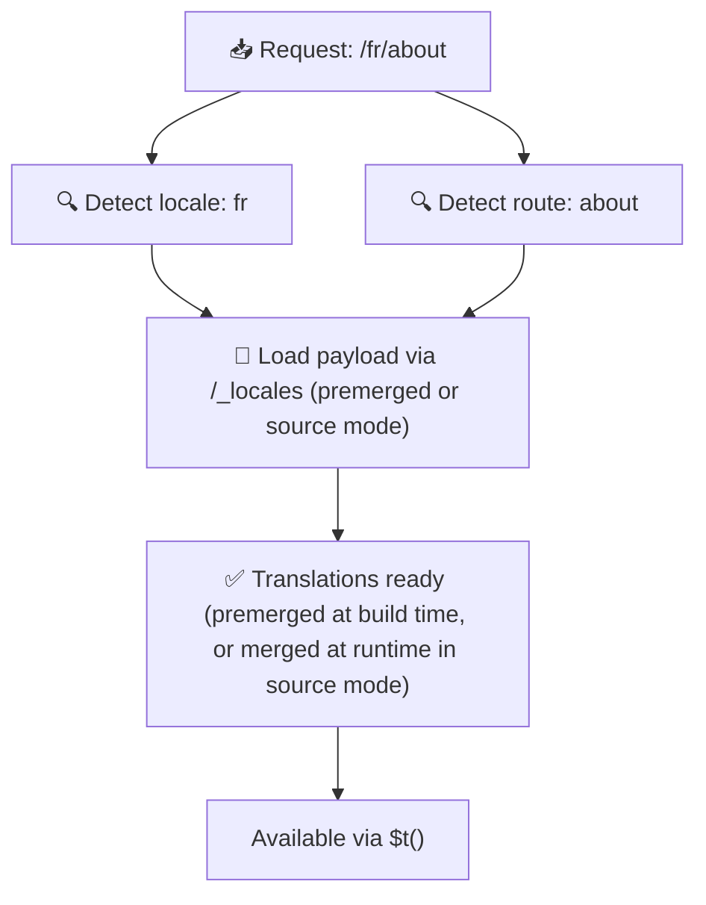

# 📂 目录结构指南

## 📖 简介

有效组织翻译文件对于维护可扩展、高效的国际化(i18n)系统至关重要。`Nuxt I18n Micro` 通过清晰的方式来管理根级和页面级翻译,简化了这一流程。本指南将介绍推荐的目录结构,并解释 `Nuxt I18n Micro` 如何处理这些翻译。

## 🗂️ 推荐的目录结构

`Nuxt I18n Micro` 将翻译组织为根级文件与 `pages` 目录下的页面级文件。在 `translationPayloads.mode: 'premerged'`(默认)时,根级翻译会在构建时自动合并进每个页面文件,因此每个页面都有一套完整的翻译,无需运行时合并开销。

在 `mode: 'source'` 下,源文件会以独立的形式保留在 Nitro 资源中,并通过 `/_locales` 路由在运行时合并。参见[Serverless Payload 输出](/guides/performance#serverless-payload-output)。

### 🔧 基本结构

以下是推荐的基本目录结构示例:

```text
locales/
├── pages/
│   ├── index/
│   │   ├── en.json
│   │   ├── fr.json
│   │   └── ar.json
│   ├── about/
│   │   ├── en.json
│   │   ├── fr.json
│   │   └── ar.json
├── en.json
├── fr.json
└── ar.json

```

### 📄 结构说明

#### 1. 🌍 根级翻译文件

- **路径:** `/locales/\{locale\}.json`(例如 `/locales/en.json`)
- **用途:** 这些文件包含在整个应用中共享的翻译(导航菜单、页眉、页脚等)。当 `mode: 'premerged'`(默认)时,它们会在构建时自动合并到每个页面级文件,因此服务器只需为每个页面返回一份预构建好的文件。

  **示例内容(`/locales/en.json`):**

  ```json
  {
    "menu": {
      "home": "Home",
      "about": "About Us",
      "contact": "Contact"
    },
    "footer": {
      "copyright": "© 2024 Your Company"
    }
  }
  ```

#### 2. 📄 页面级翻译文件

- **路径:** `/locales/pages/\{routeName\}/\{locale\}.json`(例如 `/locales/pages/index/en.json`)
- **用途:** 这些文件包含各个页面专属的翻译。在 `mode: 'premerged'`(默认)时,根级翻译会在构建时作为基础被合并进来,因此每个页面文件都是自包含的。

  **示例内容(`/locales/pages/index/en.json`):**

  ```json
  {
    "title": "Welcome to Our Website",
    "description": "We offer a wide range of products and services to meet your needs."
  }
  ```

  **示例内容(`/locales/pages/about/en.json`):**

  ```json
  {
    "title": "About Us",
    "description": "Learn more about our mission, vision, and values."
  }
  ```

### 📂 处理动态路由与嵌套路径

`Nuxt I18n Micro` 会按照特定的重命名约定,自动将路由中的动态片段与嵌套路径转换为扁平化的目录结构。这样可以确保所有翻译都以一致、易访问的方式存储。

#### 动态路由的翻译目录结构

在处理动态路由(如 `/products/[id]`)时,本模块会将动态片段 `[id]` 转换为文件结构中的静态形式。

**动态路由的示例目录结构:**

对于像 `/products/[id]` 这样的路由,其翻译文件会存放在名为 `products-id` 的文件夹中:

```text
locales/pages/
├── products-id/
│   ├── en.json
│   ├── fr.json
│   └── ar.json

```

**嵌套动态路由的示例目录结构:**

对于像 `/products/key/[id]` 这样的嵌套路由,其翻译文件会存放在名为 `products-key-id` 的文件夹中:

```text
locales/pages/
├── products-key-id/
│   ├── en.json
│   ├── fr.json
│   └── ar.json

```

**多级嵌套路由的示例目录结构:**

对于像 `/products/category/[id]/details` 这样更复杂的嵌套路由,其翻译文件会存放在名为 `products-category-id-details` 的文件夹中:

```text
locales/pages/
├── products-category-id-details/
│   ├── en.json
│   ├── fr.json
│   └── ar.json

```

### 🛠 自定义目录结构

如果你希望将翻译文件存放在其他目录,`Nuxt I18n Micro` 允许你自定义存储目录。可在 `nuxt.config.ts` 中进行配置。

**示例:自定义翻译目录**

```typescript
export default defineNuxtConfig({
  i18n: {
    translationDir: 'i18n', // Custom directory path
  },
})
```

这样 `Nuxt I18n Micro` 会在 `/i18n` 目录下(而非默认的 `/locales` 目录)查找翻译文件。

## ⚙️ 翻译的加载方式

### 🌍 动态语言路由

`Nuxt I18n Micro` 使用动态语言路由高效加载翻译。当用户访问某个页面时,模块会根据当前路由和语言确定合适的语言,并加载对应的翻译文件。



例如:

- 访问 `/en/index` 会从 `/locales/pages/index/en.json` 加载翻译。
- 访问 `/fr/about` 会从 `/locales/pages/about/fr.json` 加载翻译。

这种方式可确保只加载必要的翻译,同时优化服务端负载与客户端性能。

### 💾 缓存与预渲染

为了进一步提升性能,`Nuxt I18n Micro` 支持翻译文件的缓存与预渲染:

- **缓存**:翻译文件一旦被加载,后续请求会直接从缓存中获取,减少重复获取相同数据的开销。
- **预渲染**:在构建过程中,你可以为所有已配置的语言和路由预渲染翻译文件,使其在无需运行时延迟的情况下由服务器直接提供。

## 📝 最佳实践

### 📂 合理使用页面级文件

利用页面级文件将翻译井井有条地组织起来,可让每个页面的翻译体积小、加载快,尤其对于内容复杂或篇幅较大的页面尤为重要。

### 🔑 保持翻译键一致

在各文件之间使用一致的翻译键命名约定。这有助于保持清晰,并在应用扩展时避免管理翻译时出现问题。

### 🗂️ 按上下文组织翻译

将相关翻译分组存放。例如,把所有按钮标签放在 `buttons` 键下,把所有表单相关文本放在 `forms` 键下。这样既提升可读性,也便于跨语言管理翻译。

### ⚠️ 嵌套深度限制(建议 2 层)

在客户端导航期间,`Nuxt I18n Micro` 会使用优化过的 2 层深度合并来组合离开页面和进入页面的翻译。这可确保重叠的嵌套键(例如两个页面在 `common.*` 下都有键)在过渡动画期间得以保留。

**这种机制对于标准的 `Section → Key → Value` 结构(2 层)可正常工作:**

```json
// Page A translations
{ "common": { "fromA": "Text A" } }

// Page B translations
{ "common": { "fromB": "Text B" } }

// During transition, both are available:
// { "common": { "fromA": "Text A", "fromB": "Text B" } }
```

**但是,如果你使用了 3 层及以上的嵌套,更深层的键在过渡期间可能会被覆盖:**

```json
// Page A translations
{ "auth": { "form": { "login": "Login" } } }

// Page B translations
{ "auth": { "form": { "register": "Register" } } }

// During transition: "login" key is lost
// { "auth": { "form": { "register": "Register" } } }
```

<Tip>

</Tip>

### 🧹 定期清理未使用的翻译

随着时间推移,你的应用中可能会积累未使用的翻译键,尤其是在功能被移除或重构时。请定期审查并清理翻译文件,以保持精简与可维护性。
