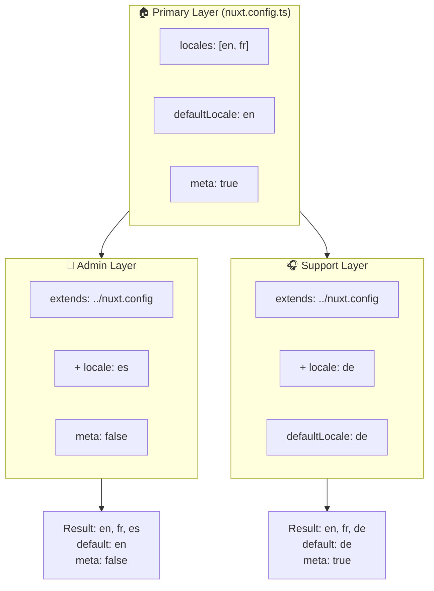

# 🗂️ `Nuxt I18n Micro` 中的 Layers

## 📖 Layers 简介

`Nuxt I18n Micro` 中的 layers 让你可以在应用的不同部分灵活地管理和定制本地化设置。通过定义不同的 layer,你可以为各种场景调整配置,例如为站点的某些部分覆盖设置,或创建可被应用其他部分继承的可复用基础配置。

### Layer 继承流程



## 🛠️ 主配置 Layer

**主配置 Layer** 是你为整个应用设置默认本地化配置的地方。这个 layer 至关重要,因为它定义了全局配置,包括支持的语言、默认语言及其他关键 i18n 设置。

### 📄 示例:定义主配置 Layer

以下示例展示了如何在 `nuxt.config.ts` 中定义主配置 layer:

```typescript
export default defineNuxtConfig({
  i18n: {
    locales: [
      { code: 'en', iso: 'en-EN', dir: 'ltr' },
      { code: 'fr', iso: 'fr-FR', dir: 'ltr' },
      { code: 'ar', iso: 'ar-SA', dir: 'rtl' },
    ],
    defaultLocale: 'en', // The default locale for the entire app
    translationDir: 'locales', // Directory where translations are stored
    meta: true, // Automatically generate SEO-related meta tags like `alternate`
    autoDetectLanguage: true, // Automatically detect and use the user's preferred language
  },
})
```

## 🌱 子 Layer

子 layer 用于扩展或覆盖主配置,以适用于应用的特定部分。例如,你可能希望为站点的某个部分添加更多语言,或修改其默认语言。子 layer 在模块化应用中尤为有用,因为应用的不同部分可能有不同的本地化需求。

### 📄 示例:在子 Layer 中扩展主 Layer

假设你的站点某个部分需要支持额外的语言,或者你希望在某个场景下禁用某个语言。以下示例展示了如何通过扩展主配置 layer 来实现:

```typescript
// basic/nuxt.config.ts (Primary Layer)
export default defineNuxtConfig({
  i18n: {
    locales: [
      { code: 'en', iso: 'en-EN', dir: 'ltr' },
      { code: 'fr', iso: 'fr-FR', dir: 'ltr' },
    ],
    defaultLocale: 'en',
    meta: true,
    translationDir: 'locales',
  },
})
```

```typescript
// extended/nuxt.config.ts (Child Layer)
export default defineNuxtConfig({
  extends: '../basic', // Inherit the base configuration from the 'basic' layer
  i18n: {
    locales: [
      { code: 'en', iso: 'en-EN', dir: 'ltr' }, // Inherited from the base layer
      { code: 'fr', iso: 'fr-FR', dir: 'ltr' }, // Inherited from the base layer
      { code: 'de', iso: 'de-DE', dir: 'ltr' }, // Added in the child layer
    ],
    defaultLocale: 'fr', // Override the default locale to French for this section
    autoDetectLanguage: false, // Disable automatic language detection in this section
  },
})
```

### 🌐 在模块化应用中使用 Layers

在较大的模块化 Nuxt 应用中,你可能有多个板块,每个板块都需要自己的 i18n 设置。通过使用 layers,你可以保持配置结构清晰且易于扩展。

### 📄 示例:模块化应用中的分层配置

假设你有一个电商站点,包含主站、管理后台和客服门户等不同板块。每个板块可能需要不同的语言集合或其他 i18n 设置。

#### **主 Layer(全局配置):**

```typescript
// nuxt.config.ts
export default defineNuxtConfig({
  i18n: {
    locales: [
      { code: 'en', iso: 'en-EN', dir: 'ltr' },
      { code: 'fr', iso: 'fr-FR', dir: 'ltr' },
    ],
    defaultLocale: 'en',
    meta: true,
    translationDir: 'locales',
    autoDetectLanguage: true,
  },
})
```

#### **管理后台的子 Layer:**

```typescript
// admin/nuxt.config.ts
export default defineNuxtConfig({
  extends: '../nuxt.config', // Inherit the global settings
  i18n: {
    locales: [
      { code: 'en', iso: 'en-EN', dir: 'ltr' }, // Inherited
      { code: 'fr', iso: 'fr-FR', dir: 'ltr' }, // Inherited
      { code: 'es', iso: 'es-ES', dir: 'ltr' }, // Specific to the admin panel
    ],
    defaultLocale: 'en',
    meta: false, // Disable automatic meta generation in the admin panel
  },
})
```

#### **客服门户的子 Layer:**

```typescript
// support/nuxt.config.ts
export default defineNuxtConfig({
  extends: '../nuxt.config', // Inherit the global settings
  i18n: {
    locales: [
      { code: 'en', iso: 'en-EN', dir: 'ltr' }, // Inherited
      { code: 'fr', iso: 'fr-FR', dir: 'ltr' }, // Inherited
      { code: 'de', iso: 'de-DE', dir: 'ltr' }, // Specific to the support portal
    ],
    defaultLocale: 'de', // Default to German in the support portal
    autoDetectLanguage: false, // Disable automatic language detection
  },
})
```

在这个模块化示例中:

- 每个板块(admin、support)都有各自的 i18n 设置,但它们都继承自基础配置。
- 管理后台新增了西班牙语(`es`)并禁用了 meta 标签自动生成。
- 客服门户新增了德语(`de`),并将界面默认语言设置为德语。

## 📝 使用 Layers 的最佳实践

- **🔧 保持主 Layer 简洁:** 主 layer 应包含全局最常用的设置。请保持简单以确保一致性。
- **⚙️ 仅在子 Layer 中进行特定定制:** 只有在必要时才在子 layer 中覆盖或扩展设置,这样可以避免配置变得复杂。
- **📚 为你的 Layers 编写文档:** 清晰地记录每个 layer 的目的与细节,有助于保持思路清晰,也方便他人(或将来的你自己)理解配置。
