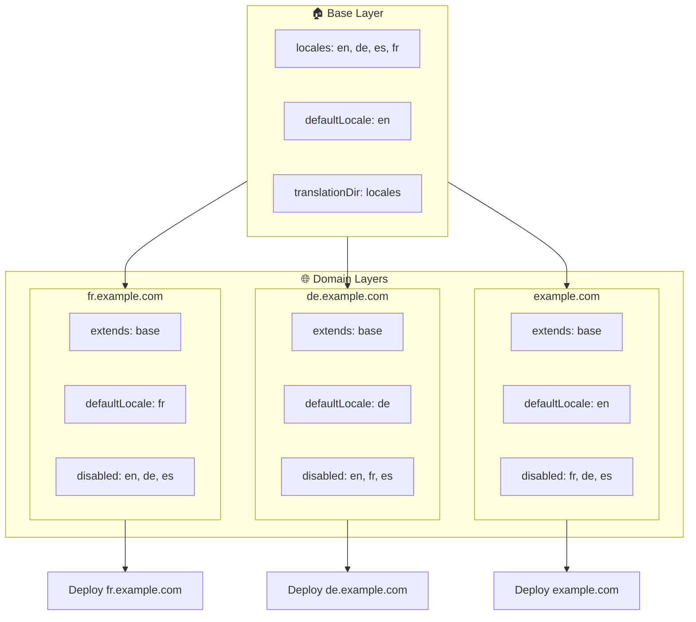

# 🌍 使用 Layers 通过 `Nuxt I18n Micro` 配置多域名多语言

## 📝 简介

借助 `Nuxt I18n Micro` 中的 layers,你可以构建灵活且易于维护的多域名本地化方案。这种方式不仅无需引入复杂的功能就能简化域名管理,还能实现高效的负载分配并降低项目复杂度。通过为不同语言运行独立的项目,你的应用可以轻松扩展,并适配多个域名下的不同语言需求,为全球化应用提供健壮且可扩展的解决方案。

## 🎯 目标

打造这样一套方案:在子 layer 中自定义配置,让不同域名提供特定的语言服务。此方法利用 Nuxt 的 layer 机制,让你可以在保留基础配置的同时,为每个域名进行扩展或修改。

### 多域名架构



## 🛠 实现多域名多语言的步骤

### 1. **创建基础 Layer**

首先创建一个基础配置 layer,包含应用中所有通用的语言设置。此配置将作为其他域名专属配置的基础。

#### **基础 Layer 配置**

创建基础配置文件 `base/nuxt.config.ts`:

```typescript
// base/nuxt.config.ts

export default defineNuxtConfig({
  i18n: {
    locales: [
      { code: 'en', iso: 'en-US', dir: 'ltr' },
      { code: 'de', iso: 'de-DE', dir: 'ltr' },
      { code: 'es', iso: 'es-ES', dir: 'ltr' },
    ],
    defaultLocale: 'en',
    translationDir: 'locales',
    meta: true,
    autoDetectLanguage: true,
  },
})
```

### 2. **创建各域名专属的子 Layer**

为每个域名创建一个子 layer,修改基础配置以满足该域名的具体需求。你可以禁用某个域名不需要的语言。

#### **示例:法语域名的配置**

在 `fr/nuxt.config.ts` 中为法语域名创建子 layer 配置:

```typescript
// fr/nuxt.config.ts

export default defineNuxtConfig({
  extends: '../base', // Inherit from the base configuration

  i18n: {
    locales: [
      { code: 'en', iso: 'en-US', dir: 'ltr', disabled: true }, // Disable English
      { code: 'fr', iso: 'fr-FR', dir: 'ltr' }, // Add and enable the French locale
      { code: 'de', iso: 'de-DE', dir: 'ltr', disabled: true }, // Disable German
      { code: 'es', iso: 'es-ES', dir: 'ltr', disabled: true }, // Disable Spanish
    ],
    defaultLocale: 'fr', // Set French as the default locale
    autoDetectLanguage: false, // Disable automatic language detection
  },
})
```

#### **示例:德语域名的配置**

类似地,在 `de/nuxt.config.ts` 中为德语域名创建子 layer 配置:

```typescript
// de/nuxt.config.ts

export default defineNuxtConfig({
  extends: '../base', // Inherit from the base configuration

  i18n: {
    locales: [
      { code: 'en', iso: 'en-US', dir: 'ltr', disabled: true }, // Disable English
      { code: 'fr', iso: 'fr-FR', dir: 'ltr', disabled: true }, // Disable French
      { code: 'de', iso: 'de-DE', dir: 'ltr' }, // Use the German locale
      { code: 'es', iso: 'es-ES', dir: 'ltr', disabled: true }, // Disable Spanish
    ],
    defaultLocale: 'de', // Set German as the default locale
    autoDetectLanguage: false, // Disable automatic language detection
  },
})
```

### 3. **为每个域名部署应用**

为每个域名使用对应的配置部署应用。例如:

- 将 `fr` layer 配置部署到 `fr.example.com`。
- 将 `de` layer 配置部署到 `de.example.com`。

### 4. **为不同语言运行多个项目**

对于每个语言与域名,你需要运行独立的应用实例。这样每个域名都能提供正确的语言配置,优化负载分配并简化项目结构。通过为每个语言运行专属项目,你可以清晰地隔离配置,降低整体方案的复杂度。

### 5. **基于域名配置路由**

请确保你的路由配置能根据用户访问的域名将其引导到正确的项目。这样每个域名都能提供合适的语言,提升用户体验,并在不同区域间保持一致性。

### 6. **部署并验证**

配置好各个 layer 并将其部署到相应域名后,请确保每个域名都提供了正确的语言。仔细测试应用,确认根据不同域名会加载正确的语言。

## 📝 最佳实践

- **保持基础配置通用**:基础配置应涵盖适用于所有域名的通用设置。
- **隔离域名专属逻辑**:将域名专属配置放在各自的 layer 中,以保持清晰的分层与职责分离。

## 🎉 结语

借助 `Nuxt I18n Micro` 中的 layers,你可以构建灵活且易维护的多域名本地化方案。这种方式无需复杂的域名管理功能,还能高效地分配负载并降低项目复杂度。为不同语言运行独立的项目,能够确保应用轻松扩展,适配多个域名下不同的语言需求,为全球化应用提供健壮且可扩展的解决方案。
