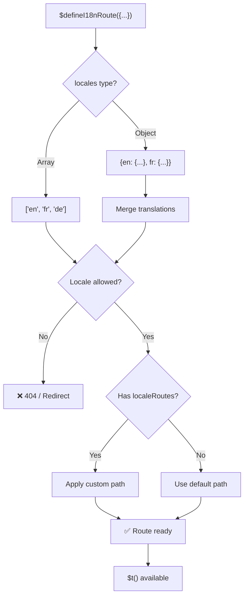
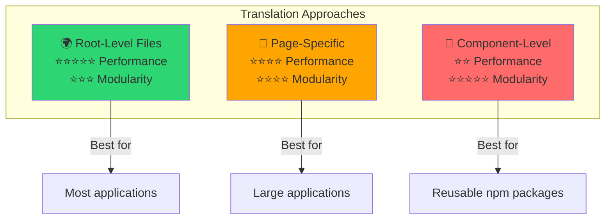

# 📖 按组件的翻译

学习如何使用 `$defineI18nRoute` 直接在 Vue 组件内定义翻译,以实现模块化、易维护的本地化。

## 📖 概述

`Nuxt I18n Micro` 中的“按组件的翻译”允许你使用 `$defineI18nRoute` 函数直接在特定组件或页面内定义翻译。该方式非常适合管理各组件独有的本地化内容,提供了一种更模块化、更易维护的翻译处理方式。

## 🚀 快速开始

### 基础用法

```vue
<template>
  <div>
    <h1>{{ $t('greeting') }}</h1>
    <p>{{ $t('farewell') }}</p>
  </div>
</template>

<script setup lang="ts">
import { useNuxtApp } from '#imports'

const { $defineI18nRoute, $t } = useNuxtApp()

$defineI18nRoute({
  locales: {
    en: { greeting: 'Hello', farewell: 'Goodbye' },
    fr: { greeting: 'Bonjour', farewell: 'Au revoir' },
    de: { greeting: 'Hallo', farewell: 'Auf Wiedersehen' },
  },
})
</script>
```

### 必要设置(`script setup`)

`$defineI18nRoute` 是 Nuxt 的应用注入,而非全局宏。  
调用之前请始终通过 `useNuxtApp()` 获取。

```ts
import { useNuxtApp } from '#imports'

const { $defineI18nRoute } = useNuxtApp()
```

## 🏗️ 构建时的路由 meta

在构建时,一个 Vite unplugin 会扫描 `.vue` 页面文件中的 `defineI18nRoute(...)` / `$defineI18nRoute(...)` 调用,并将语言限制、`localeRoutes` 与 `disableMeta` 提取到 `@i18n-micro/route-strategy` 使用的路由元数据中。

- **构建期**:unplugin(`src/unplugin-define-i18n-route.ts`)在 Vite 的 transform 期间运行,并将 `i18n-route-meta.json` 写入 Nuxt 构建目录
- **运行期**:define 插件(`03.define.ts`)在 `script setup` 中依然暴露 `$defineI18nRoute`,便于开发与内联配置

通常你只需在页面中调用 `$defineI18nRoute` —— 模块会自动完成构建时的抽取。

## 🔧 `$defineI18nRoute` 函数

`$defineI18nRoute` 函数根据当前语言配置路由行为,提供了一种多功能的解决方案,可用于:

- 基于可用语言控制对特定路由的访问
- 为特定语言提供翻译
- 为不同语言设置自定义路由
- 控制元标签生成

### 工作原理



### 方法签名

```typescript
const { $defineI18nRoute } = useNuxtApp();
$defineI18nRoute(routeDefinition: DefineI18nRouteConfig);
```

### 参数

| 参数      | 类型                                       | 说明                        |
| -------------- | ------------------------------------------ | ---------------------------------- |
| `locales`      | `string[] \| Record<string, Translations>` | 该路由可用的语言    |
| `localeRoutes` | `Record<string, string>`                   | 为特定语言指定的自定义路由 |
| `disableMeta`  | `boolean \| string[]`                      | 控制 i18n 元标签生成   |

### 参数详解

#### `locales`

定义该路由可用的语言:

<CodeGroup>
```typescript Array Format
$defineI18nRoute({
  locales: ['en', 'fr', 'de'], // Simple array of locale codes
})
```

```typescript Object Format
$defineI18nRoute({
  locales: {
    en: { greeting: 'Hello', farewell: 'Goodbye' },
    fr: { greeting: 'Bonjour', farewell: 'Au revoir' },
    de: { greeting: 'Hallo', farewell: 'Auf Wiedersehen' },
    ru: {}, // Russian locale allowed but no translations provided
  },
})
```
</CodeGroup>

#### `localeRoutes`

允许为特定语言设置自定义路由:

```typescript
$defineI18nRoute({
  localeRoutes: {
    en: '/welcome',
    fr: '/bienvenue',
    de: '/willkommen',
    ru: '/privet', // Custom route path for Russian locale
  },
})
```

#### `disableMeta`

控制 i18n 元标签生成:

<CodeGroup>
```typescript Disable All Meta
$defineI18nRoute({
  locales: ['en', 'fr', 'de'],
  disableMeta: true, // Disables all i18n meta tags
})
```

```typescript Disable Specific Locales
$defineI18nRoute({
  locales: ['en', 'fr', 'de'],
  disableMeta: ['en', 'fr'], // Only English and French won't have meta tags
})
```
</CodeGroup>

## 💡 使用场景

### 1. 基于语言控制访问

定义特定路由允许的语言:

```typescript
$defineI18nRoute({
  locales: ['en', 'fr', 'de'], // Only these locales are allowed for this route
})
```

### 2. 提供组件级翻译

使用 `locales` 对象为每个路由提供具体翻译:

```typescript
$defineI18nRoute({
  locales: {
    en: {
      greeting: 'Hello',
      farewell: 'Goodbye',
      description: 'Welcome to our application',
    },
    fr: {
      greeting: 'Bonjour',
      farewell: 'Au revoir',
      description: 'Bienvenue dans notre application',
    },
    de: {
      greeting: 'Hallo',
      farewell: 'Auf Wiedersehen',
      description: 'Willkommen in unserer Anwendung',
    },
  },
})
```

### 3. 按语言的自定义路由

为特定语言定义自定义路径:

```typescript
$defineI18nRoute({
  locales: ['en', 'fr', 'de'],
  localeRoutes: {
    en: '/welcome',
    fr: '/bienvenue',
    de: '/willkommen',
  },
})
```

### 4. 禁用元标签

为特定路由或语言禁用 SEO 元标签生成:

```typescript
// Disable meta tags for all locales
$defineI18nRoute({
  locales: ['en', 'fr', 'de'],
  disableMeta: true,
})

// Disable meta tags only for specific locales
$defineI18nRoute({
  locales: ['en', 'fr', 'de'],
  disableMeta: ['en', 'fr'],
})
```

## ✅ 支持的配置形式

`$defineI18nRoute` 解析器支持多种 JavaScript 配置:

### 静态配置

<CodeGroup>
```typescript Static Arrays
$defineI18nRoute({
  locales: ['en', 'de', 'fr'],
})
```

```typescript Static Objects
$defineI18nRoute({
  locales: {
    en: { greeting: 'Hello' },
    de: { greeting: 'Hallo' },
  },
  localeRoutes: {
    en: '/welcome',
    de: '/willkommen',
  },
})
```
</CodeGroup>

### 动态配置

<CodeGroup>
```typescript Variables and Functions
const locales = ['en', 'de', 'fr']
const routes = { en: '/welcome', de: '/willkommen' }

$defineI18nRoute({
  locales: locales,
  localeRoutes: routes,
})
```

```typescript Template Literals
const prefix = 'api'

$defineI18nRoute({
  locales: [`${prefix}-en`, `${prefix}-de`],
  localeRoutes: {
    [`${prefix}-en`]: `/api/welcome`,
    [`${prefix}-de`]: `/api/willkommen`,
  },
})
```
</CodeGroup>

### 进阶配置

<CodeGroup>
```typescript Spread Operator
const baseLocales = ['en', 'de']
const additionalLocales = ['fr', 'es']

$defineI18nRoute({
  locales: [...baseLocales, ...additionalLocales],
})
```

```typescript Array of Objects
$defineI18nRoute({
  locales: [
    { code: 'en', name: 'English' },
    { code: 'de', name: 'German' },
  ],
})
```
</CodeGroup>

### 条件逻辑

```typescript
$defineI18nRoute({
  locales: process.env.NODE_ENV === 'production' ? ['en', 'de'] : ['en', 'de', 'fr', 'es'],
})
```

### 复杂嵌套对象

```typescript
$defineI18nRoute({
  locales: {
    'en-us': {
      region: 'US',
      currency: 'USD',
      format: {
        date: 'MM/DD/YYYY',
        time: '12h',
      },
    },
    'de-de': {
      region: 'DE',
      currency: 'EUR',
      format: {
        date: 'DD.MM.YYYY',
        time: '24h',
      },
    },
  },
})
```

### 注释与格式化

```typescript
$defineI18nRoute({
  // Supported locales for this component
  locales: [
    'en', // English
    'de', // German
    'fr', // French
  ],
  // Custom routes for each locale
  localeRoutes: {
    en: '/welcome',
    de: '/willkommen',
    fr: '/bienvenue',
  },
})
```

## ❌ 不支持的形式

该解析器存在一些限制,无法处理:

- **外部导入**(`import` 语句)
- **async/await 函数**
- **类方法**
- **复杂的控制流**(循环、try-catch、switch)
- 配置中的**箭头函数**
- **生成器函数**

## 📝 完整示例

以下是展示所有特性的综合示例:

```vue
<template>
  <div class="welcome-page">
    <header>
      <h1>{{ $t('title') }}</h1>
      <p>{{ $t('subtitle') }}</p>
    </header>

    <main>
      <section>
        <h2>{{ $t('features.title') }}</h2>
        <ul>
          <li v-for="feature in $t('features.list')" :key="feature">
            {{ feature }}
          </li>
        </ul>
      </section>

      <section>
        <h2>{{ $t('contact.title') }}</h2>
        <p>{{ $t('contact.description') }}</p>
        <a :href="$t('contact.email')">{{ $t('contact.email') }}</a>
      </section>
    </main>

    <footer>
      <p>{{ $t('footer.copyright') }}</p>
    </footer>
  </div>
</template>

<script setup lang="ts">
import { useNuxtApp } from '#imports'

const { $defineI18nRoute, $t } = useNuxtApp()

// Define comprehensive i18n route configuration
$defineI18nRoute({
  locales: {
    en: {
      title: 'Welcome to Our Platform',
      subtitle: 'The best solution for your needs',
      features: {
        title: 'Key Features',
        list: ['High Performance', 'Easy to Use', 'Scalable Architecture'],
      },
      contact: {
        title: 'Get in Touch',
        description: "We'd love to hear from you",
        email: 'mailto:contact@example.com',
      },
      footer: {
        copyright: '© 2024 Example Company. All rights reserved.',
      },
    },
    fr: {
      title: 'Bienvenue sur Notre Plateforme',
      subtitle: 'La meilleure solution pour vos besoins',
      features: {
        title: 'Fonctionnalités Clés',
        list: ['Haute Performance', 'Facile à Utiliser', 'Architecture Évolutive'],
      },
      contact: {
        title: 'Contactez-Nous',
        description: 'Nous aimerions avoir de vos nouvelles',
        email: 'mailto:contact@example.com',
      },
      footer: {
        copyright: '© 2024 Example Company. Tous droits réservés.',
      },
    },
    de: {
      title: 'Willkommen auf Unserer Plattform',
      subtitle: 'Die beste Lösung für Ihre Bedürfnisse',
      features: {
        title: 'Hauptfunktionen',
        list: ['Hohe Leistung', 'Einfach zu Verwenden', 'Skalierbare Architektur'],
      },
      contact: {
        title: 'Kontaktieren Sie Uns',
        description: 'Wir würden gerne von Ihnen hören',
        email: 'mailto:contact@example.com',
      },
      footer: {
        copyright: '© 2024 Example Company. Alle Rechte vorbehalten.',
      },
    },
  },
  localeRoutes: {
    en: '/welcome',
    fr: '/bienvenue',
    de: '/willkommen',
  },
  disableMeta: false, // Enable SEO meta tags
})
</script>

<style scoped>
.welcome-page {
  max-width: 800px;
  margin: 0 auto;
  padding: 2rem;
}

header {
  text-align: center;
  margin-bottom: 3rem;
}

section {
  margin-bottom: 2rem;
}

footer {
  text-align: center;
  margin-top: 3rem;
  padding-top: 2rem;
  border-top: 1px solid #eee;
}
</style>
```

## ⚡ 性能考量

将翻译嵌入到单文件组件(SFC)中可能会影响性能:

### 潜在问题

- **文件体积增大**:所有语言都存在于 SFC 中,不像独立翻译文件那样支持按语言加载
- **渲染变慢**:文件内的翻译需要在运行时处理
- **内存占用**:无论当前语言是哪个,所有翻译都会被加载

### 最佳实践

- **优先使用按页面的翻译**以获得最佳性能
- **仅在特定场景中使用组件级翻译**,例如:
  - 发布到 npm 的可复用组件
  - 不适合放在根级文件中的翻译
  - 需要自包含的组件

### 性能与模块化的取舍

在选择方案时,请根据项目需求进行权衡:



| 方案             | 性能 | 模块化 | 适用场景            |
| -------------------- | ----------- | ---------- | ------------------- |
| **根级文件** | ⭐⭐⭐⭐⭐  | ⭐⭐⭐     | 大多数应用   |
| **页面级**    | ⭐⭐⭐⭐    | ⭐⭐⭐⭐   | 大型应用  |
| **组件级**  | ⭐⭐        | ⭐⭐⭐⭐⭐ | 可复用组件 |

## 🎯 最佳实践

### 1. 让翻译与组件保持接近

将翻译直接定义在相关组件中,以保持本地化内容的组织性与可维护性。

### 2. 使用 locale 对象获得灵活性

在需要特定翻译或基于语言进行访问控制时,使用 `locales` 属性的对象形式。

### 3. 记录自定义路由

请清晰记录为不同语言设置的自定义路由,以便理解并简化开发与维护。

### 4. 考虑性能影响

评估组件级翻译是否为你的场景所必需,并权衡其性能影响。

### 5. 使用 TypeScript

利用 TypeScript 获得更好的类型安全与 IntelliSense 支持:

```typescript
interface ComponentTranslations {
  title: string
  subtitle: string
  features: {
    title: string
    list: string[]
  }
}

$defineI18nRoute({
  locales: {
    en: {
      title: 'Welcome',
      subtitle: 'Subtitle',
      features: {
        title: 'Features',
        list: ['Feature 1', 'Feature 2'],
      },
    } as ComponentTranslations,
  },
})
```

## 📚 相关主题

- **[快速开始](/quickstart)** —— 基础设置与配置
- **[API 参考](/api/methods)** —— 完整的方法文档
- **[示例](/examples)** —— 真实场景的使用示例

## 小结

由 `$defineI18nRoute` 驱动的“按组件的翻译”特性,为 Nuxt 应用中的本地化管理提供了强大而灵活的方式。通过允许在组件级定义本地化内容与路由,它有助于打造针对受众语言与地区偏好高度定制、易于使用的体验。

请结合项目对性能与可维护性的需求,选择最合适的方案。
