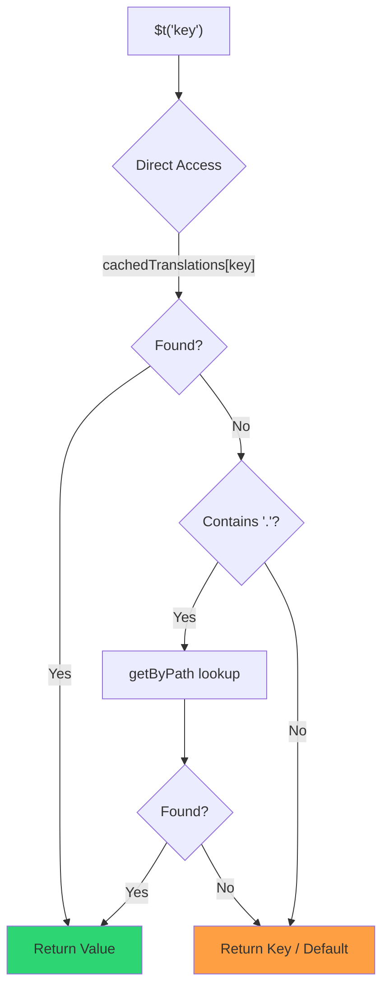

# 🚀 性能指南

## 📖 简介

`Nuxt I18n Micro` 从设计上就注重性能,相较于 `nuxt-i18n` 等传统国际化(i18n)模块有显著提升。本指南深入介绍使用 `Nuxt I18n Micro` 的性能优势,以及与其他方案的对比。

## 🤔 为什么关注性能?

在大型项目和高流量环境中,性能瓶颈会导致构建变慢、内存占用增加以及服务器响应变差。在包含大量翻译文件的复杂 i18n 场景下,这些问题尤为突出。`Nuxt I18n Micro` 就是为直面这些挑战而生:优化速度、内存效率,并尽量减小对应用打包体积的影响。

## 📊 性能对比

我们通过 `pnpm test:performance`(`pnpm -C scripts cli performance`)在相同 fixture 上对 **`@nuxtjs/i18n@10.6.0`** 进行了一系列测试。完整方法与图表:[性能测试结果](/guides/performance-results)。

默认 CLI 配置:**4 种语言** × **2 个页面**(`index`、`page`)× 约 10k 个 index 叶子键。如需更重的回归雷达负载,可提高 `--locales` / `--keys`。报告会将**代码**、**翻译**(包括 `@nuxtjs/i18n` 的 `chunks/raw/*`)与**总**可部署产物分开展示。

```bash
pnpm test:performance
pnpm -C scripts cli performance --only micro --skip-stress
pnpm -C scripts cli performance --locales 12 --keys 100000 --runs 3
```

### ⏱️ 构建时间与资源消耗

<Accordion title="**@nuxtjs/i18n v10.6**">
- **代码包**:2.16 MB
- **翻译**:7.21 MB(消息分块 + 语言 payload)
- **总可部署**:9.37 MB
- **最大内存占用**:1,821 MB
- **耗时**:8.34s(3 次平均)
</Accordion>

<Tip>
- **代码包**:1.74 MB —— **代码体积比 `@nuxtjs/i18n` v10.6 小约 19%**
- **翻译**:6.8 MB(按需加载的 JSON)
- **总可部署**:8.54 MB
- **最大内存占用**:1,065 MB —— **内存占用比 `@nuxtjs/i18n` v10.6 少约 41%**
- **耗时**:5.34s —— **比 `@nuxtjs/i18n` v10.6 快约 36%**(≈ 与 plain-nuxt 基线相当)
</Tip>

> 早期文档中显示的 `@nuxtjs/i18n` “code ≈ 15 MB / translations 0 B”,是把 `chunks/raw` 消息文件当作了应用代码。现在的分类器已经将它们分开;**代码**层面的差距变小,但 micro 依然在构建时间、峰值 RSS 和压测中领先。

图表、Autocannon 结果以及 fixture 细节请参见[完整基准报告](/guides/performance-results)。

### 🌐 高负载下的服务器性能

Artillery(6s@6 + 60s@60)与 Autocannon(10c / 10s),每个 fixture 连续 3 次运行的平均值。

<Accordion title="**@nuxtjs/i18n v10.6**">
- **每秒请求数(Artillery)**:143 [#/sec]
- **平均响应时间**:956 ms
- **Autocannon RPS / 平均延迟**:72 / 139 ms
</Accordion>

<Tip>
- **每秒请求数(Artillery)**:275 [#/sec] —— **比 `@nuxtjs/i18n` v10.6 高约 93%**
- **平均响应时间**:483 ms —— **比 `@nuxtjs/i18n` v10.6 快约 49%**
- **Autocannon RPS / 平均延迟**:162 / 62 ms
</Tip>

### 📈 可视化对比

<Note>
Mintlify 文档中省略了交互式图表。请查看本页的基准表格或访问 [VitePress 文档](https://s00d.github.io/nuxt-i18n-micro/guide/performance-results) 查看图表:`chart`。
</Note>

<Note>
Mintlify 文档中省略了交互式图表。请查看本页的基准表格或访问 [VitePress 文档](https://s00d.github.io/nuxt-i18n-micro/guide/performance-results) 查看图表:`chart`。
</Note>

| 指标          | @nuxtjs/i18n v10.6 | i18n-micro | 改进        |
| --------------- | ------------------ | ---------- | ------------------ |
| 构建时间      | 8.34s              | 5.34s      | **快约 36%**    |
| 内存(构建)  | 1,821 MB           | 1,065 MB   | **少约 41%**      |
| 代码包     | 2.16 MB            | 1.74 MB    | **小约 19%**   |
| 响应时间   | 956 ms             | 483 ms     | **快约 49%**    |
| RPS(Artillery) | 143                | 275        | **多约 93%**      |

### 🔍 结果解读

对比当前 `@nuxtjs/i18n` **v10.6**(默认 CLI 配置,3 次平均):

- 🗜️ **代码图更小**:在正确区分消息分块的前提下为 ~1.74 MB vs ~2.16 MB。
- 🧠 **构建 RSS 更低**:峰值 ~1.1 GB vs ~1.8 GB。
- 🕒 **构建更快**:~5.3s vs ~8.3s(在该配置下 micro 与 plain-Nuxt 基线持平)。
- ⚡ **高负载下表现更好**:Artillery RPS 约 275 vs 143,Autocannon RPS 约 162 vs 72,平均延迟更低。

绝对数值与早期公布的表格有所差异(词典更小、Nuxt 版本更旧,并且当年对 `@nuxtjs/i18n` 的“translations: 0 B”划分并不公允)。趋势不变:micro 在构建成本与请求吞吐上依然领先。

## ⚙️ 关键优化

### 🛠️ 极简设计

`Nuxt I18n Micro` 采用极简架构,核心精简,并将策略拆分为独立包。这可降低开销、简化内部逻辑,从而提升性能。

### 🚦 高效路由

在 v3 中,路由生成与运行时路径逻辑被拆分到独立包中,以获得最佳的 tree-shaking:

- **`@i18n-micro/route-strategy`** —— 构建期路由生成:扩展 Nuxt 页面以生成本地化路由。只包含所选策略(`no_prefix`、`prefix`、`prefix_except_default`、`prefix_and_default`)。
- **`@i18n-micro/path-strategy`** —— 运行时路径解析、重定向与链接生成。使用纯函数与预计算的上下文标志,尽量减少热路径上的内存分配。通过子路径导出(`/prefix`、`/no-prefix` 等)确保只有所选实现被打包。

这种方式让路由配置保持轻量,并确保无论语言数量多少,路由解析都保持快速。

### 📂 精简的翻译加载

模块仅支持 JSON 格式的翻译,并明确区分全局与页面级文件。这样在任意时刻只加载必要的翻译数据,进一步提升性能。

### 🔒 GlobalThis 单例缓存

自 v3.0.0 起,模块使用 `globalThis` 单例模式,结合 `Symbol.for`,以确保整个 Node.js 进程内只存在一个缓存实例。这可避免:

- 同一模块被多次打包时的缓存重复
- 每次请求都重新创建对象,给 GC 带来压力
- 由孤立缓存实例导致的内存泄漏

```mermaid
flowchart LR
    subgraph Process["Node.js Process"]
        G["globalThis[Symbol.for('CACHE')]"]

        subgraph R1["SSR Request 1"]
            P1[Plugin Instance] --> G
        end

        subgraph R2["SSR Request 2"]
            P2[Plugin Instance] --> G
        end

        subgraph R3["SSR Request 3"]
            P3[Plugin Instance] --> G
        end
    end

    G --> Cache["Single Map Instance"]
    Cache --> D1["en:index → translations"]
    Cache --> D2["en:about → translations"
```

```typescript
// Internal implementation pattern
const CACHE_KEY = Symbol.for('__NUXT_I18N_STORAGE_CACHE__')
if (!globalThis[CACHE_KEY]) {
  globalThis[CACHE_KEY] = new Map()
}
```

### ⚡ 优化的翻译函数(tFast)

`$t()` 函数使用面向速度优化的直接查找策略:

1. **预计算上下文**:语言与路由名在导航时一次性计算,不在每次调用 `$t()` 时重复计算
2. **单源查找**:所有翻译(根 + 页面级 + 回退)都在构建时预合并进每个页面的单个文件中,无需分层搜索
3. **导航时的累积深度合并**:在同一语言内导航时,新页面翻译会被深度合并(2 层深度)进当前词典中,因此过渡动画期间上一页面的键仍然可见 —— 即使两个页面存在重叠的嵌套前缀(例如都有 `common.*` 下的键)
4. **通过 `page:transition:finish` 进行垃圾回收**:过渡动画完全结束后,合并后的词典会被替换为新页面独有的干净翻译,释放来自旧页面键的内存
5. **直接属性访问**:热路径上使用 `obj[key]` 而非 Map 查找



```typescript
// Simplified lookup logic — single active dictionary
let val = cachedTranslations[key]
if (val === undefined && key.includes('.')) {
  val = getByPath(cachedTranslations, key)
}
```

### 💉 服务端加载(不嵌入 HTML)

SSR 期间加载的翻译会保存在**服务器内存**中,供渲染时 `$t` 使用。它们**不会**被复制到 `nuxtApp.payload` / HTML 文档(与 `@nuxtjs/i18n` 在 `experimental.preload: false` 时的思路相同)。

在客户端,`01.plugin.ts` 会 `await` `switchContext`,在应用继续运行之前加载 `/\{apiBaseUrl\}/:page/:locale/data.json` —— 一次请求,而不是一个 8 MB 的内联 blob。

`NuxtI18n` 仍然会保留合并后的活动词典(`cachedTranslations`)供 `$t()` / `$has()` 使用。相同语言的导航会在页面分块之间进行深度合并,直到 `page:transition:finish` 清理掉过期键。

#### 目前的状态

下方数字来自 `pnpm run budget:payload` 测量并强制执行的预算文件。

{/* generated:payload-budget — do not edit; run `pnpm run docs:generate` */}

在 `playground` 的 `/`、`/de` 上测得:

| 测量项 | 大小 |
| --- | --- |
| 磁盘上的翻译源文件 | 15.2 MB |
| 以独立 payload 文件形式提供 | 76.3 MB |
| 最大的内联 `__NUXT_DATA__` | 6.9 MB |
| 客户端资源 | 449.5 KB |

playground 使用了刻意夸大的词典,因此这些不是真实应用应期望的数字 —— 它们是一个用于对照的固定基准。当数字异常增长时预算会失败,这样对 payload 内容的意外改动就会被及时发现。

{/* /generated:payload-budget */}

### 💾 缓存与预渲染

翻译要经过多层缓存,弄清是哪一层响应了请求,往往意味着排查时间是五分钟还是五小时。请求会依次遇到以下四层缓存:

| 层级 | 位置 | 生命周期 | 由谁清除 |
| --- | --- | --- | --- |
| 浏览器 / CDN | `/\{apiBaseUrl\}/**` 上的 `Cache-Control` | `httpCacheDuration`、`immutable` | 新的 `?v=` —— 即更改了翻译的部署 |
| Nitro 路由缓存 | `routeRules['/\{apiBaseUrl\}/**'].cache` | 60s,stale-while-revalidate | 服务器重启 |
| 服务端加载器 | 进程内 `CacheControl`,键为 `locale:routeName` | 进程生命周期,或 `cacheTtl` | 服务器重启;开发环境下 HMR |
| 客户端存储 | `translationStorage` 与 `NuxtI18n` 中的当前分块 | 页面生命周期 | 刷新页面 |

两条规则可保证它们不相互矛盾:

- **只有存在 `?v=` 时才启用 Nitro 路由缓存。** 有了 cache-buster,每个 URL 都与其内容一一对应,因此服务端缓存不会带来数据陈旧问题。设置 `dateBuild: 0` 会关闭这一层,因为此时 URL 稳定,响应头为 `must-revalidate` —— 服务端缓存最长可能用最多一分钟的陈旧条目回复,反而抵消了它。
- **`immutable` 同样需要 `?v=`。** 没有 buster 时,无论 `httpCacheDuration` 如何,响应头都是 `public, max-age=0, must-revalidate`:在从不变化的 URL 上使用较长 `max-age` 会把浏览器最初看到的响应永久钉住。

<Warning>
在 `translationPayloads.publicAssets`(premerged 模式默认启用)下,payload 会被复制到 `public/<apiBaseUrl>/\{page\}/\{locale\}/data.json`。如果平台本身负责提供该目录(Cloudflare Pages、Firebase Hosting、`npx serve`),它会应用自己的响应头 —— Nitro `routeRules` 的响应头只对经过服务器的响应生效。请在平台自身的配置中为这些静态文件设置缓存策略。
</Warning>

🏁 **预渲染**:在 premerged 模式下,`publicAssets` 已经把客户端 URL 树写入 `public/`。只有在你需要 Nitro 在关闭该复制的情况下物化处理器路由时,才启用 `prerenderRoutes`。

### 🗜️ 压缩公共 Payload

当启用 `nitro.compressPublicAssets` 时,复制到 public 目录的翻译 payload 也会带上 `.gz` 和 `.br` 副本:

```ts
export default defineNuxtConfig({
  nitro: { compressPublicAssets: true },
})
```

Nitro 会在复制 payload 的 hook 之前压缩公共资源,因此如果不启用该选项,payload 将成为静态构建中唯一未压缩的部分。模块本身不会主动开启压缩 —— 它只会遵循你所选择的设置。按编码的选择(`\{ gzip: true, brotli: false \}`)也会被尊重。

playground 的 index payload:原始 6,651,984 B,gzip 1,012,831 B,brotli 821,617 B。

### ☁️ Serverless Payload 输出

在 **Node** 上,SSR 会从 `public/<apiBaseUrl>`(`readFile`,不使用 Nitro `serverAssets` / Rollup `raw:`)读取翻译 JSON。在 **Edge** 上,Nitro `serverAssets` 会嵌入相同的目录树(对于大型词典,建议使用 `mode: 'source'`)。

```typescript
export default defineNuxtConfig({
  i18n: {
    translationPayloads: {
      serverAssets: true, // default — Node → public copy; Edge → serverAssets embed
      publicAssets: true, // default in premerged mode
    },
  },
})
```

使用 `translationPayloads.mode: 'source'` 可让 Edge 嵌入更紧凑(可选地也可让 public 副本更紧凑):

```typescript
export default defineNuxtConfig({
  i18n: {
    translationPayloads: {
      mode: 'source',
    },
  },
})
```

`mode: 'source'` 会保持按 layer 合并后的源文件紧凑,并通过内置的 `/_locales` 路由(或 Edge 的 `assets:i18n`)在运行时合并根/页面/回退。默认情况下它会禁用 public 资源复制以及预渲染的 payload 路由。

<Warning>
`prerenderRoutes` 默认为 `false`。在 `mode: 'source'` 下,`publicAssets` 也默认为 `false`。因此,若没有 Nitro/边缘运行时的纯静态托管,客户端将无法加载翻译 —— 除非你启用其中一项输出,让 `serverHandler` 在运行时可用,或将 payload 托管在外部。

默认的 premerged + `publicAssets` 已经把 `/\{apiBaseUrl\}/\{page\}/\{locale\}/data.json` 放在 `public/` 下,因此静态托管可以在没有 Nitro 的情况下响应客户端 fetch。
</Warning>

<Warning>
设置 `apiBaseServerHost` 或 `apiBaseClientHost` 会将 payload 的分发迁到相应源,而这也带来了自己的要求 —— 参见[配置 → 外部 CDN 主机](/guides/configuration#external-cdn-hosts)。
</Warning>

或者关闭各个 HTTP/公共输出,并将 payload 托管在外部:

```typescript
export default defineNuxtConfig({
  i18n: {
    apiBaseClientHost: 'https://cdn.example.com',
    apiBaseServerHost: 'https://cdn.example.com',
    translationPayloads: {
      serverHandler: false,
      publicAssets: false,
      prerenderRoutes: false,
    },
  },
})
```

当你依赖内置的本地 `/\{apiBaseUrl\}/:page/:locale/data.json` 路由时,请保持 `serverHandler` 启用。当 payload 已托管在外部并且 `apiBaseServerHost` 指向该外部来源时,可以关闭它。只有在你需要 Nitro 物化静态 payload 路由,而 `publicAssets` 没有写出这些文件时,才启用 `prerenderRoutes`。

在构建过程中,当生成的 payload 输出超过 `translationPayloads.warnFileCount`(默认 500)或 `translationPayloads.warnSizeBytes`(默认 10 MB)时,模块会发出警告。当在没有配置外部 payload 主机的情况下禁用了所有本地输出时,也会发出警告。

## 📝 性能最大化的建议

以下几条建议可帮助你从 `Nuxt I18n Micro` 获得最佳性能:

- 📉 **精简语言数据**:仅纳入项目实际需要的语言,以保持较小的打包体积。
- 🗂️ **使用页面级翻译**:按页面组织翻译文件,避免加载不必要的数据。
- 💾 **启用缓存**:利用缓存功能降低服务器负载并改善响应时间。
- 🏁 **利用预渲染**:预渲染翻译以加快页面加载并减少运行时开销。

如需查看性能测试的详细结果,请参见[性能测试结果](/guides/performance-results)。
