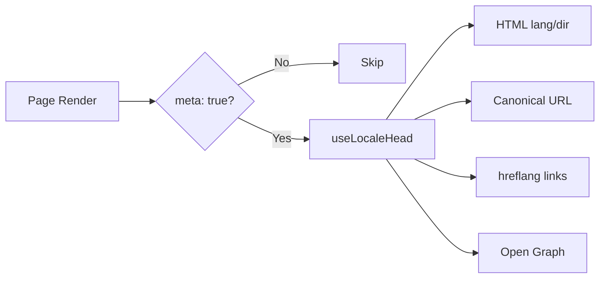

# 🌐 Nuxt I18n Micro SEO 指南

## 📖 简介

有效的 SEO(搜索引擎优化)对于确保多语言站点能被全球用户通过搜索引擎发现至关重要。`Nuxt I18n Micro` 会自动生成必要的元标签和属性,向搜索引擎说明站点的结构和内容,从而简化多语言站点的 SEO 管理。

本指南介绍 `Nuxt I18n Micro` 如何处理 SEO,以在无需额外配置的情况下提升站点的可见性与用户体验。

## ⚙️ 自动化 SEO 处理

### SEO Meta 生成流程



**生成的标签:**

| 标签             | 示例                                                  |
| --------------- | -------------------------------------------------------- |
| HTML 属性 | `<html lang="en" dir="ltr">`                             |
| Canonical       | `<link rel="canonical" href="...">`                      |
| hreflang        | `<link rel="alternate" hreflang="en" href="...">`        |
| x-default       | `<link rel="alternate" hreflang="x-default" href="...">` |
| Open Graph      | `<meta property="og:locale" content="en_US">`            |

#### 按语言的 `og`(`og:locale` 与 BCP 47)

`<html lang>` 与 `hreflang` 使用**BCP 47**,通过 `locale.iso`(例如 `ar-AE`)提供。  
Open Graph 需要使用带**下划线**的 **`language_TERRITORY`**(例如 `ar_AE`),参见 [OG protocol](https://ogp.me/)。

默认情况下,若 `iso` 到 og 的映射明确,则 `og:locale` 会由 `iso` 派生(`en-US` → `en_US`)。  
在需要自定义值时(例如 `zh-Hans` → `zh_CN`),请显式设置 **`og`** 字符串。  
若既没有 `og`,也没有可转换的 `iso`,则不会生成 `og:locale` 标签 —— 在开发环境下你会看到控制台警告(遵循 `missingWarn`)。

```typescript
i18n: {
  meta: true,
  locales: [
    { code: 'ar', iso: 'ar-AE', og: 'ar_AE', dir: 'rtl' },
    { code: 'en', iso: 'en-US' }, // og:locale → en_US
    { code: 'zh', iso: 'zh-Hans', og: 'zh_CN' }, // script tags need explicit og
  ],
}
```

### 🔑 主要 SEO 特性

当在 `Nuxt I18n Micro` 中启用 `meta` 选项后,模块会自动处理以下 SEO 相关内容:

1. **🌍 语言与方向属性**:
   - 模块会根据当前语言与文字方向(例如英文的 `ltr` 或阿拉伯文的 `rtl`),为 `<html>` 标签设置 `lang` 与 `dir` 属性。

2. **🔗 Canonical URL**:
   - 模块会为每个页面生成 canonical 链接(`<link rel="canonical">`),让搜索引擎识别内容的主版本。

3. **🌐 备用语言链接(`hreflang`)**:
   - 模块会自动为所有可用语言生成 `<link rel="alternate" hreflang="">` 标签。这有助于搜索引擎了解你的内容有哪些语言版本,从而改善全球用户的体验。
   - 每个语言会输出**一个**标签:`hreflang = iso || code`。当 `iso` 被设置时,不会将路由 `code` 用作 `hreflang`(这样 `mx` 等市场码不会变成无效的语言标签)。
   - 可选的 `hreflangBaseLanguage: true` 还会从 `iso` 派生出纯语言标签(例如 `es-ES` → `es`),由 `locales` 中第一个区域语言认领。

4. **🌏 `x-default` Hreflang**:
   - 模块会自动生成指向默认语言 URL 的 `<link rel="alternate" hreflang="x-default">` 标签。它告诉搜索引擎当用户语言与已定义语言都不匹配时应显示哪个 URL。启用 `meta: true` 后即自动生效,无需额外配置。

5. **🔖 Open Graph 元数据**:
   - 模块会为每个语言生成 Open Graph 元标签(`og:locale`、`og:url` 等),这对社交媒体分享与搜索引擎索引尤为有用。

### 🛠️ 配置

要启用这些 SEO 特性,请确保 `nuxt.config.ts` 中的 `meta` 选项设置为 `true`:

```typescript
export default defineNuxtConfig({
  modules: ['nuxt-i18n-micro'],
  i18n: {
    locales: [
      { code: 'en', iso: 'en-US', dir: 'ltr' },
      { code: 'fr', iso: 'fr-FR', dir: 'ltr' },
      { code: 'ar', iso: 'ar-SA', dir: 'rtl' },
    ],
    defaultLocale: 'en',
    translationDir: 'locales',
    meta: true, // Enables automatic SEO management
  },
})
```

### 🌍 多域名部署下的动态 `metaBaseUrl`

当 `metaBaseUrl` 未设置时,SEO 的绝对 URL 会按以下顺序解析(#240):

1. 来自 [`nuxt-site-config`](https://nuxtseo.com/docs/site-config) 的 `site.url`(若已存在该模块,例如通过 `@nuxtjs/seo`)
2. 否则使用当前请求的 hostname(`useRequestURL()` / `window.location.origin`)

请求来源的回退方案会尊重反向代理请求头(`X-Forwarded-Host`、`X-Forwarded-Proto`),因此在 nginx、Cloudflare、AWS ALB 等代理之后也能正常工作。

这意味着已经为 sitemap / robots / schema.org 设置了 `site.url` 的应用**无需**再声明 `metaBaseUrl`:

```typescript
export default defineNuxtConfig({
  site: {
    url: process.env.NUXT_SITE_URL, // also used by micro for canonical / og:url / hreflang
  },
  i18n: {
    meta: true,
    // metaBaseUrl omitted — picks up site.url, then request origin
  },
})
```

若未设置 `site.url`,单个应用实例仍可以通过请求来源为**多个域名**分别输出正确的 SEO 标签:

```typescript
export default defineNuxtConfig({
  i18n: {
    meta: true,
    // metaBaseUrl is undefined by default — resolved dynamically from the request
  },
})
```

例如,对 `https://site-a.com/en/about` 的请求会生成:

```html
<link rel="canonical" href="https://site-a.com/en/about" /> <meta property="og:url" content="https://site-a.com/en/about" />
```

同一应用在 `https://site-b.com/en/about` 上则会生成:

```html
<link rel="canonical" href="https://site-b.com/en/about" /> <meta property="og:url" content="https://site-b.com/en/about" />
```

如果你需要一个始终优先于 `site.url` 的固定基础 URL,可以传入一个静态字符串:

```typescript
metaBaseUrl: 'https://example.com'
```

### 🔍 Canonical 查询参数白名单

默认情况下,查询参数会从 canonical 和 `og:url` 中被移除,以避免重复内容。你可以将需要保留的查询参数加入白名单:

```typescript
i18n: {
  canonicalQueryWhitelist: ['page', 'sort', 'filter', 'search', 'q', 'query', 'tag']
}
```

只有列在 `canonicalQueryWhitelist` 中的参数才会出现在 canonical URL 中。其他查询参数(如追踪参数、会话 ID)都会被移除。

### 🚫 按页面禁用 Meta 标签

你可以使用 `defineI18nRoute()` 为特定页面禁用 SEO 元标签的生成:

```vue
<script setup>
// Disable all SEO meta tags for this page
defineI18nRoute({
  disableMeta: true,
})
</script>
```

也可以只禁用特定语言的 meta:

```vue
<script setup>
// Disable meta tags only for English locale on this page
defineI18nRoute({
  disableMeta: ['en'],
})
</script>
```

当 `disableMeta` 生效时,受影响的页面/语言不会生成 `hreflang`、`canonical`、`og:locale`、`og:url` 或 `x-default` 标签。

### 🔇 已禁用的语言

`disabled: true` 的语言会被自动从所有 SEO 标签生成中排除 —— 不会为它们生成 `hreflang`、`og:locale:alternate` 或备用链接:

```typescript
i18n: {
  locales: [
    { code: 'en', iso: 'en-US' },
    { code: 'fr', iso: 'fr-FR', disabled: true }, // excluded from SEO tags
  ]
}
```

### 🙈 选择退出的语言(`seo: false`)

对于希望保留可路由和可翻译,但不应出现在跨语言发现标签中的语言,可以设置 `seo: false`。这些语言会从 `hreflang` 备用与 `og:locale:alternate` 中被剔除。如果你配置的**默认**语言设置了 `seo: false`,`x-default` 链接也不会生成。

```typescript
i18n: {
  locales: [
    { code: 'en', iso: 'en-US' },
    { code: 'ru', iso: 'ru-RU', seo: false }, // internal / non-indexed locale
  ]
}
```

### 📌 各策略下的行为

| 策略                | hreflang 链接   | x-default             | canonical      | og:url |
| ----------------------- | ---------------- | --------------------- | -------------- | ------ |
| `prefix`                | ✅ 所有语言   | ✅ 默认语言 URL | ✅ 当前 URL | ✅     |
| `prefix_except_default` | ✅ 所有语言   | ✅ 无前缀的 URL     | ✅ 当前 URL | ✅     |
| `prefix_and_default`    | ✅ 所有语言   | ✅ 默认语言 URL | ✅ 当前 URL | ✅     |
| `no_prefix`             | ❌ 不生成 | ❌ 不生成      | ✅ 当前 URL | ✅     |

对于 `no_prefix` 策略,只会生成 `canonical`、`og:url`、`og:locale` 以及 `html` 属性(`lang`、`dir`)。由于每种语言并没有独立的 URL,所以不会生成备用语言链接(`hreflang`)和 `x-default`。

## 页面级覆盖(`useI18nHead`)

对于**文章、指南或任意 CMS 内容**——并非每种语言都存在,且 URL 可能来自 API——请在页面内使用 [`useI18nHead`](/api/composables/use-i18n-head),而不是自定义 i18n head 插件。

### 部分翻译的文章

```vue
<script setup lang="ts">
const article = await loadArticle()
// article.locales = { en: '...', de: '...' } — only translated locales

useI18nHead({
  meta: [{ property: 'og:title', content: article.title }],
  replace: {
    hreflang: Object.entries(article.locales).map(([locale, href]) => ({
      rel: 'alternate',
      hreflang: locale,
      href,
    })),
    ogAlternates: Object.keys(article.locales),
  },
})
</script>
```

### 使用 `$setI18nRouteParams` 处理按语言不同的 slug

当各语言的 slug 不同时,先设置路由参数,再用真实 URL 覆盖备用链接:

```vue
<script setup lang="ts">
const { $defineI18nRoute, $setI18nRouteParams } = useNuxtApp()
const { data: article } = await useFetch(`/api/articles/${slug}`)

$defineI18nRoute({
  localeRoutes: { en: '/blog/[slug]', de: '/de/blog/[slug]' },
})

$setI18nRouteParams({
  en: { slug: article.value.slugEn },
  de: { slug: article.value.slugDe },
})

useI18nHead({
  replace: {
    hreflang: ['en', 'de'].map((locale) => ({
      rel: 'alternate',
      hreflang: locale,
      href: article.value.urls[locale],
    })),
    ogAlternates: ['en', 'de'],
  },
})
</script>
```

### 代理之后的 HTTPS 来源

若要在 SSR 时正确生成绝对 URL,又不想自定义 origin 组合式函数:

```ts
i18n: {
  meta: true,
  metaBaseUrl: undefined,
  metaTrustForwardedHost: true,
  metaTrustForwardedProto: true,
}
```

更多示例(canonical 覆盖、`x-default`、响应式 fetch、共享辅助函数):[useI18nHead 组合式函数](/api/composables/use-i18n-head)。

### ⚠️ 结尾斜杠

模块会根据 `useRoute().fullPath` 中的实际路径生成 canonical 与 `hreflang` URL。如果你的应用使用了结尾斜杠(例如通过 Nuxt 的 `router.options`),生成的 URL 会体现这一点。但 `$switchLocalePath` 可能会对路径进行归一化,移除结尾斜杠。如果结尾斜杠一致性对你的 SEO 至关重要,请验证生成的 URL 与应用的 URL 结构相符。

### 🎯 好处

启用 `meta` 选项后,你将获得:

- **📈 更好的搜索引擎排名**:搜索引擎能更好地索引你的站点,理解不同语言版本之间的关系。
- **👥 更佳的用户体验**:用户根据偏好被引导至相应语言版本,获得更个性化的体验。
- **🔧 更少的手动配置**:模块会自动处理 SEO 任务,让你无需手动添加 SEO 相关的元标签与属性。

## 🔗 Nuxt SEO(`@nuxtjs/seo`)

[`@nuxtjs/seo`](https://nuxtseo.com/) 集合了 sitemap、robots、schema.org、OG images 等模块。它通过 [`nuxt-site-config`](https://nuxtseo.com/docs/site-config/guides/i18n)(v4+)与 **nuxt-i18n-micro** 集成。

### 前置要求

- **`@nuxtjs/seo` 3+**(现行版本使用 `nuxt-site-config` 4+,后者会为 micro 注册 `nuxt-site-config:i18n` 插件)
- **`i18n.meta: true`**(推荐 —— micro 负责随语言变化的 head 标签;Nuxt SEO 负责 sitemap、schema.org 等)

### 模块顺序

在 `modules` 中把 **nuxt-i18n-micro 放到 `@nuxtjs/seo` 之前**,让 site config 能读取你的语言设置:

```typescript
export default defineNuxtConfig({
  modules: ['nuxt-i18n-micro', '@nuxtjs/seo'],
  site: {
    url: 'https://example.com',
    name: 'My Site',
  },
  i18n: {
    meta: true,
    defaultLocale: 'en',
    locales: [
      { code: 'en', iso: 'en-US' },
      { code: 'de', iso: 'de-DE' },
    ],
  },
})
```

### 翻译后的站点名称与描述

Nuxt Site Config 会从你的语言文件中读取可选的翻译键:

```json
{
  "nuxtSiteConfig": {
    "name": "My Site",
    "description": "My site description"
  }
}
```

`locales/en.json`、`locales/de.json` 等文件中的按语言取值会被自动识别。

### 疑难排查

如果你看到 `Plugin nuxt-seo:defaults depends on nuxt-site-config:i18n but they are not registered`,请升级到 **`@nuxtjs/seo` 3+**(参见 [issue #133](https://github.com/s00d/nuxt-i18n-micro/issues/133))。旧版的 `nuxt-site-config` 3.x 只为 `@nuxtjs/i18n` 接入了 i18n,而不支持 micro。

更多资料:[Sitemap i18n 指南](https://nuxtseo.com/docs/sitemap/guides/i18n)、[Site Config i18n 指南](https://nuxtseo.com/docs/site-config/guides/i18n)。
